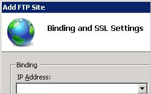

Default FTP Basic Authentication Settings &lt;basicAuthentication&gt;
====================

## Overview

The `<basicAuthentication>` element specifies the settings for Basic authentication. This form of authentication requires that users valid user accounts on your server or domain before they can log in.

> [!NOTE]
> Due to the underlying design of the File Transfer Protocol (FTP), user names and passwords are transmitted over FTP in plain text, making them vulnerable to network discovery. It is therefore recommended that you use Basic authentication with SSL.

## Compatibility

| Version | Notes |
| --- | --- |
| IIS 10.0 | The `<basicAuthentication>` element was not modified in IIS 10.0. |
| IIS 8.5 | The `<basicAuthentication>` element was not modified in IIS 8.5. |
| IIS 8.0 | The `<basicAuthentication>` element was not modified in IIS 8.0. |
| IIS 7.5 | The `<basicAuthentication>` element of the `<authentication>` element ships as a feature of IIS 7.5. |
| IIS 7.0 | The `<basicAuthentication>` element of the `<authentication>` element was introduced in FTP 7.0, which was a separate download for IIS 7.0. |
| IIS 6.0 | The `<ftpServer>` element and its child elements replace the IIS 6.0 FTP settings that were located in the **LM/MSFTPSVC** metabase path. |

> [!NOTE]
> The FTP 7.0 and FTP 7.5 services shipped out-of-band for IIS 7.0, which required downloading and installing the modules from the following URL:

> [https://www.iis.net/expand/FTP](https://www.iis.net/downloads/microsoft/ftp)

With Windows 7 and Windows Server 2008 R2, the FTP 7.5 service ships as a feature for IIS 7.5, so downloading the FTP service is no longer necessary.

## Setup

To support FTP publishing for your Web server, you must install the FTP service. To do so, use the following steps.

### Windows Server 2012 or Windows Server 2012 R2

1. On the taskbar, click **Server Manager**.
2. In **Server Manager**, click the **Manage** menu, and then click **Add Roles and Features**.
3. In the **Add Roles and Features** wizard, click **Next**. Select the installation type and click **Next**. Select the destination server and click **Next**.
4. On the **Server Roles** page, expand **Web Server (IIS)**, and then select **FTP Server**.  
  
    > [!NOTE]
    > To support ASP.Membership authentication or IIS Manager authentication for the FTP service, you will need to select     **FTP Extensibility** , in addition to     **FTP Service** .  
     .
5. Click **Next**, and then on the **Select features** page, click **Next** again.
6. On the **Confirm installation selections** page, click **Install**.
7. On the **Results** page, click **Close**.

### Windows 8 or Windows 8.1

1. On the **Start** screen, move the pointer all the way to the lower left corner, right-click the **Start** button, and then click **Control Panel**.
2. In **Control Panel**, click **Programs and Features**, and then click **Turn Windows features on or off**.
3. Expand **Internet Information Services**, and then select **FTP Server**.   
  
    > [!NOTE]
    > To support ASP.Membership authentication or IIS Manager authentication for the FTP service, you will also need to select     **FTP Extensibility** .   
    
4. Click **OK**.
5. Click **Close**.

### Windows Server 2008 R2

1. On the taskbar, click **Start**, point to **Administrative Tools**, and then click **Server Manager**.
2. In the **Server Manager** hierarchy pane, expand **Roles**, and then click **Web Server (IIS)**.
3. In the **Web Server (IIS)** pane, scroll to the **Role Services** section, and then click **Add Role Services**.
4. On the **Select Role Services** page of the **Add Role Services Wizard**, expand **FTP Server**.
5. Select **FTP Service**.  
  
    > [!NOTE]
    > To support ASP.Membership authentication or IIS Manager authentication for the FTP service, you will also need to select     **FTP Extensibility** .  
    
6. Click **Next**.
7. On the **Confirm Installation Selections** page, click **Install**.
8. On the **Results** page, click **Close**.

### Windows 7

1. On the taskbar, click **Start**, and then click **Control Panel**.
2. In **Control Panel**, click **Programs and Features**, and then click **Turn Windows Features on or off**.
3. Expand **Internet Information Services**, and then **FTP Server**.
4. Select **FTP Service**.  
  
    > [!NOTE]
    > To support ASP.Membership authentication or IIS Manager authentication for the FTP service, you will also need to select     **FTP Extensibility** .   
    
5. Click **OK**.

### Windows Server 2008 or Windows Vista

1. Download the installation package from the following URL: 

    - [https://www.iis.net/expand/FTP](https://www.iis.net/downloads/microsoft/ftp)
- Follow the instructions in the following walkthrough to install the FTP service: 

    - [Installing and Troubleshooting FTP 7](https://go.microsoft.com/fwlink/?LinkId=88547)

## How To

### How to enable or disable Basic authentication for an FTP site

1. Open **Internet Information Services (IIS) Manager**: 

    - If you are using Windows Server 2012 or Windows Server 2012 R2: 

        - On the taskbar, click **Server Manager**, click **Tools**, and then click **Internet Information Services (IIS) Manager**.
    - If you are using Windows 8 or Windows 8.1: 

        - Hold down the **Windows** key, press the letter **X**, and then click **Control Panel**.
        - Click **Administrative Tools**, and then double-click **Internet Information Services (IIS) Manager**.
    - If you are using Windows Server 2008 or Windows Server 2008 R2: 

        - On the taskbar, click **Start**, point to **Administrative Tools**, and then click **Internet Information Services (IIS) Manager**.
    - If you are using Windows Vista or Windows 7: 

        - On the taskbar, click **Start**, and then click **Control Panel**.
        - Double-click **Administrative Tools**, and then double-click **Internet Information Services (IIS) Manager**.
2. In the **Connections** pane, expand the server name, expand the **Sites** node, and then click the name of the site.
3. In the site's **Home** pane, double-click the **FTP Authentication** feature.
4. On the **FTP Authentication** page, select **Basic Authentication**.  
    
5. In the **Actions** pane, click **Enable** to enable Basic authentication or click **Disable** to disable Basic authentication.

* * *

### How to use the FTP Site Wizard to Create an FTP Site with Basic authentication and Read/Write Access

1. Open **Internet Information Services (IIS) Manager**: 

    - If you are using Windows Server 2012 or Windows Server 2012 R2: 

        - On the taskbar, click **Server Manager**, click **Tools**, and then click **Internet Information Services (IIS) Manager**.
    - If you are using Windows 8 or Windows 8.1: 

        - Hold down the **Windows** key, press the letter **X**, and then click **Control Panel**.
        - Click **Administrative Tools**, and then double-click **Internet Information Services (IIS) Manager**.
    - If you are using Windows Server 2008 or Windows Server 2008 R2: 

        - On the taskbar, click **Start**, point to **Administrative Tools**, and then click **Internet Information Services (IIS) Manager**.
    - If you are using Windows Vista or Windows 7: 

        - On the taskbar, click **Start**, and then click **Control Panel**.
        - Double-click **Administrative Tools**, and then double-click **Internet Information Services (IIS) Manager**.
2. In the **Connections** pane, click the **Sites** node in the tree.
3. Right-click the **Sites** node in the tree and click **Add FTP Site**, or click **Add FTP Site** in the **Actions** pane.
4. When the **Add FTP Site** wizard appears:

    - Enter &quot;My New FTP Site&quot; in the **FTP site name** box.
    - For the **Physical path** box, you can use one of the following options to specify your content directory: 

        - Click the ellipsis (**...**) button, and then navigate to the folder that contains the content for your FTP site.
        - Type in the path to your content folder in the box. Note that if you choose to type the path, you can use environment variables in your paths. For example, you can use &quot;%*SystemDrive*%\inetpub\ftproot&quot; for your content directory.
    - When you have completed these items, click **Next**.  
        
5. On the second page of the **Add FTP Site** wizard:

    - Choose an IP address for your FTP site from the **IP Address** drop-down, or choose to accept the default selection of &quot;All Unassigned.&quot;
    - Enter the TCP/IP port for the FTP site in the **Port** box. By default, FTP sites and clients use port 21. (Note: To specify Implicit FTPS, you need to use port 990.)
    - To use an FTP virtual host name, select the box for **Enable Virtual Host Names**, then enter the virtual host name in the **Virtual Host** box.
    - For the SSL options, choose one of the following options: 

        - Select **No SSL** to disable the SSL options.
        - Select **Allow SSL** to allow FTP clients to optionally use FTP over SSL when they connect with the FTP server.
        - Select **Require SSL** to allow FTP clients to always use FTP over SSL when they connect with the FTP server.
        - If you choose **Allow SSL** or **Require SSL**, choose a certificate from the **SSL Certificate** drop-down menu.
    - When you have completed these items, click **Next**.   
        
6. On the next page of the wizard:

    - Select **Basic** for the **Authentication** settings.
    - For the **Authorization** settings, choose &quot;Specified users&quot; from the **Allow access to** drop-down, and enter an account name in the box below the drop-down menu.
    - Select **Read** and **Write** for the **Permissions** option.
    - When you have completed these items, click **Finish**.  
        

## Configuration

### Attributes

| Attribute | Description |
| --- | --- |
| `defaultLogonDomain` | Optional string attribute. Specifies the default domain for Basic authentication user account lookups. The default value is `NT AUTHORITY`. |
| `enabled` | Optional **Boolean** attribute. Specifies whether Basic authentication is enabled. The default value is `false`. |
| `logonMethod` | Optional enum attribute. Specifies the logon type for the user account that is logging in as interpreted by LogonUser Win32 API. | Value | Description | | --- | --- | | `Interactive` | Specifies the interactive logon type. The numeric value is `0`. | | `Batch` | Specifies the batch logon type. The numeric value is `1`. | | `Network` | Specifies the network logon type. The numeric value is `2`. | | `ClearText` | Specifies the clear text logon type. The numeric value is `3`. | The default value is `ClearText`. |

### Child Elements

None.

### Configuration Sample

The following configuration sample disables Anonymous authentication and enables Basic authentication by default.

[!code-xml[Main](basicAuthentication/samples/sample1.xml)]

## Sample Code

The following code samples disable Anonymous authentication and enable Basic authentication by default.

### AppCmd.exe

[!code-console[Main](basicAuthentication/samples/sample2.cmd)]

> [!NOTE]
> You must be sure to set the **commit** parameter to `apphost` when you use AppCmd.exe to configure these settings. This commits the configuration settings to the appropriate location section in the ApplicationHost.config file.

### C#

[!code-csharp[Main](basicAuthentication/samples/sample3.cs)]

### VB.NET

[!code-vb[Main](basicAuthentication/samples/sample4.vb)]

### JavaScript

[!code-javascript[Main](basicAuthentication/samples/sample5.js)]

### VBScript

[!code-vb[Main](basicAuthentication/samples/sample6.vb)]