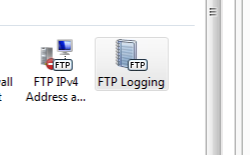

&lt;system.ftpServer&gt;
====================

## Overview

The `<system.ftpServer>` element specifies the global-level and URL-level configuration settings for FTP 7 in the ApplicationHost.config file, and contains configuration elements that define the settings that are used by the FTP service.

> [!NOTE]
> Unlike settings that are found in the `<system.webServer>` element, settings in the `<system.ftpServer>` element cannot be delegated.

## Compatibility

| Version | Notes |
| --- | --- |
| IIS 10.0 | The `<system.ftpServer>` element was not modified in IIS 10.0. |
| IIS 8.5 | The `<system.ftpServer>` element was not modified in IIS 8.5. |
| IIS 8.0 | The `<system.ftpServer>` element was not modified in IIS 8.0. |
| IIS 7.5 | The `<system.ftpServer>` element ships as a feature of IIS 7.5. |
| IIS 7.0 | The `<system.ftpServer>` element was introduced in FTP 7.0, which was a separate download for IIS 7.0. |
| IIS 6.0 | The `<system.ftpServer>` element and its child elements replace the IIS 6.0 FTP settings that were located in the **LM/MSFTPSVC** metabase path. |

> [!NOTE]
> The FTP 7.0 and FTP 7.5 services shipped out-of-band for IIS 7.0, which required downloading and installing the modules from the following URL:
> 
> [https://www.iis.net/expand/FTP](https://www.iis.net/downloads/microsoft/ftp)

With Windows 7 and Windows Server 2008 R2, the FTP 7.5 service ships as a feature for IIS 7.5, so downloading the FTP service is no longer necessary.

## Setup

To support FTP publishing for your Web server, you must install the FTP service. To do so, use the following steps.

### Windows Server 2012 or Windows Server 2012 R2

1. On the taskbar, click **Server Manager**.
2. In **Server Manager**, click the **Manage** menu, and then click **Add Roles and Features**.
3. In the **Add Roles and Features** wizard, click **Next**. Select the installation type and click **Next**. Select the destination server and click **Next**.
4. On the **Server Roles** page, expand **Web Server (IIS)**, and then select **FTP Server**.  
  
    > [!NOTE]
    > To support ASP.Membership authentication or IIS Manager authentication for the FTP service, you will need to select **FTP Extensibility**, in addition to **FTP Service**.  
     .
5. Click **Next**, and then on the **Select features** page, click **Next** again.
6. On the **Confirm installation selections** page, click **Install**.
7. On the **Results** page, click **Close**.

### Windows 8 or Windows 8.1

1. On the **Start** screen, move the pointer all the way to the lower left corner, right-click the **Start** button, and then click **Control Panel**.
2. In **Control Panel**, click **Programs and Features**, and then click **Turn Windows features on or off**.
3. Expand **Internet Information Services**, and then select **FTP Server**.   
  
    > [!NOTE]
    > To support ASP.Membership authentication or IIS Manager authentication for the FTP service, you will also need to select **FTP Extensibility**.   
    
4. Click **OK**.
5. Click **Close**.

### Windows Server 2008 R2

1. On the taskbar, click **Start**, point to **Administrative Tools**, and then click **Server Manager**.
2. In the **Server Manager** hierarchy pane, expand **Roles**, and then click **Web Server (IIS)**.
3. In the **Web Server (IIS)** pane, scroll to the **Role Services** section, and then click **Add Role Services**.
4. On the **Select Role Services** page of the **Add Role Services Wizard**, expand **FTP Server**.
5. Select **FTP Service**.  
  
    > [!NOTE]
    > To support ASP.Membership authentication or IIS Manager authentication for the FTP service, you will also need to select **FTP Extensibility**.  
    
6. Click **Next**.
7. On the **Confirm Installation Selections** page, click **Install**.
8. On the **Results** page, click **Close**.

### Windows 7

1. On the taskbar, click **Start**, and then click **Control Panel**.
2. In **Control Panel**, click **Programs and Features**, and then click **Turn Windows Features on or off**.
3. Expand **Internet Information Services**, and then **FTP Server**.
4. Select **FTP Service**.  
  
    > [!NOTE]
    > To support ASP.Membership authentication or IIS Manager authentication for the FTP service, you will also need to select **FTP Extensibility**.   
    
5. Click **OK**.

### Windows Server 2008 or Windows Vista

1. Download the installation package from the following URL: 

    - [https://www.iis.net/expand/FTP](https://www.iis.net/downloads/microsoft/ftp)
2. Follow the instructions in the following walkthrough to install the FTP service: 

     - [Installing and Troubleshooting FTP 7](https://go.microsoft.com/fwlink/?LinkId=88547)
 

## How To

### How to configure site-level or server-level logging for the FTP service

1. Open **Internet Information Services (IIS) Manager**: 

    - If you are using Windows Server 2012 or Windows Server 2012 R2: 

        - On the taskbar, click **Server Manager**, click **Tools**, and then click **Internet Information Services (IIS) Manager**.
    - If you are using Windows 8 or Windows 8.1: 

        - Hold down the **Windows** key, press the letter **X**, and then click **Control Panel**.
        - Click **Administrative Tools**, and then double-click **Internet Information Services (IIS) Manager**.
    - If you are using Windows Server 2008 or Windows Server 2008 R2: 

        - On the taskbar, click **Start**, point to **Administrative Tools**, and then click **Internet Information Services (IIS) Manager**.
    - If you are using Windows Vista or Windows 7: 

        - On the taskbar, click **Start**, and then click **Control Panel**.
        - Double-click **Administrative Tools**, and then double-click **Internet Information Services (IIS) Manager**.
2. In the **Connections** pane, click the server name.
3. In the **Home** pane, double-click the **FTP Logging** feature.  
    
4. In the **One log file per** drop-down list, choose one of the following options: 

    - Choose **Site** to specify that each FTP site will write to individual log files.
    - Choose **Server** to specify a single log file for all of your FTP sites.  
        
5. In the **Actions** pane, click **Apply**.
 

## Configuration

Settings in the `<system.ftpServer>` element can be configured at the global level, site level, and per URL.

### Attributes

None.

### Child Elements

| Element | Description |
| --- | --- |
| [`log`](log/index.md) | Optional element.  Specifies the global log settings for the FTP service. |
| [`firewallSupport`](firewallsupport.md) | Optional element.  Specifies the port range that the FTP service will use for data channel communication. |
| [`providerDefinitions`](providerdefinitions/index.md) | Optional element.  Specifies the collection of custom FTP providers. |
| [`security`](security/index.md) | Optional element.  Specifies the security-related settings for FTP. |
| [`caching`](caching/index.md) | Optional element.  Specifies the credential cache settings for the FTP service. |
| [`serverRuntime`](serverruntime/index.md) | Optional element.  Specifies settings that configure how the FTP service operates. |

### Configuration Sample

The following sample illustrates several configuration settings in the global `<system.ftpServer>` element for a server. More specifically, the settings in this example demonstrate how to:

- Enable FTP credential caching and specify a time-out of 10 minutes (600 seconds.)
- Configure the low port as 5000 and the high port as 6000 for data channel communications.
- Enable logging and specify that log files will be kept per-site, and that log files will be rotated daily by UTC time.
- Specify a custom FTP provider and specify a custom parameter for that provider.
- Specify global IP restrictions that allow FTP access from local host and deny access to the 169.254.0.0 to 169.254.255.255 block of IP addresses.
- Configure request filtering with the following options: 

    - Block FTP access to the \_vti\_bin virtual directory, which is used with the FrontPage Server Extensions.
    - Block several file types that are associated with executables.
    - Specify 100MB as the maximum file size.
- Add a global authorization rule that allows access for the administrators group.
- Specify that domain name syntax can be used for FTP virtual host names.

[!code-xml[Main](index/samples/sample1.xml)]

## Sample Code

The following examples add two FTP authorization rules for the Default Web Site. The first rule allows read and write access for the administrators group, and the second rule denies read and write access for the guest account.

### AppCmd.exe

[!code-console[Main](index/samples/sample2.cmd)]

> [!NOTE]
> You must be sure to set the **commit** parameter to `apphost` when you use AppCmd.exe to configure these settings. This commits the configuration settings to the appropriate location section in the ApplicationHost.config file.

### C#

[!code-csharp[Main](index/samples/sample3.cs)]

### VB.NET

[!code-vb[Main](index/samples/sample4.vb)]

### JavaScript

[!code-javascript[Main](index/samples/sample5.js)]

### VBScript

[!code-vb[Main](index/samples/sample6.vb)]

* * *

The following examples configure the `<serverRuntime>` element for an FTP server to allow domain name syntax for FTP virtual host names.

### AppCmd.exe

[!code-console[Main](index/samples/sample7.cmd)]

> [!NOTE]
> You must be sure to set the **commit** parameter to `apphost` when you use AppCmd.exe to configure these settings. This commits the configuration settings to the appropriate location section in the ApplicationHost.config file.

### C#

[!code-csharp[Main](index/samples/sample8.cs)]

### VB.NET

[!code-vb[Main](index/samples/sample9.vb)]

### JavaScript

[!code-javascript[Main](index/samples/sample10.js)]

### VBScript

[!code-vb[Main](index/samples/sample11.vb)]