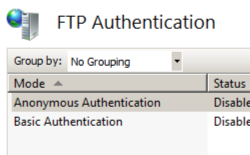

Adding FTP Provider Activation Data &lt;add&gt;
====================

## Overview

The `<add>` element of the `<providerData>` element specifies a unique key/value pair, which defines a custom parameter that an FTP custom provider requires. Each element specifies a unique name in the `key` attribute, and either a `value` or `encryptedValue` attribute will specify the value for the pair. (You can use either the `value` or an `encryptedValue` attribute depending on your application's security needs; either value will be passed to your custom provider's initialization method as part of the key/pair.)

Beginning with FTP 7.5, the FTP service supports extensibility for custom authentication and roles, logging, and home directory lookups. When you create an extensibility provider, you must first register it in the .NET Global Assembly Cache (GAC) for managed-code providers, or in your system's registry for native-code (COM) providers. For additional information about how to create FTP custom providers, see the following section on Microsoft's IIS.net Web site:

> [Developing for FTP 7.5](https://www.iis.net/learn/develop/developing-for-ftp)

 

## Compatibility

| Version | Notes |
| --- | --- |
| IIS 10.0 | The `<add>` element was not modified in IIS 10.0. |
| IIS 8.5 | The `<add>` element was not modified in IIS 8.5. |
| IIS 8.0 | The `<add>` element was not modified in IIS 8.0. |
| IIS 7.5 | The `<add>` element of the `<providerData>` element ships as a feature of FTP 7.5. |
| IIS 7.0 | The `<add>` element of the `<providerData>` element was not part of FTP 7.0. |
| IIS 6.0 | The `<system.ftpServer>` element and its child elements replace the IIS 6.0 FTP settings that were located in the **LM/MSFTPSVC** metabase path. |

> [!NOTE]
> The FTP 7.0 and FTP 7.5 services shipped out-of-band for IIS 7.0, which required downloading and installing the modules from the following URL:

> [https://www.iis.net/expand/FTP](https://www.iis.net/downloads/microsoft/ftp)

With Windows 7 and Windows Server 2008 R2, the FTP 7.5 service ships as a feature for IIS 7.5, so downloading the FTP service is no longer necessary.
 

## Setup

To support FTP publishing for your Web server, you must install the FTP service. To do so, use the following steps.

### Windows Server 2012 or Windows Server 2012 R2

1. On the taskbar, click **Server Manager**.
2. In **Server Manager**, click the **Manage** menu, and then click **Add Roles and Features**.
3. In the **Add Roles and Features** wizard, click **Next**. Select the installation type and click **Next**. Select the destination server and click **Next**.
4. On the **Server Roles** page, expand **Web Server (IIS)**, and then select **FTP Server**.  
  
    > [!NOTE]
    > To support ASP.Membership authentication or IIS Manager authentication for the FTP service, you will need to select     **FTP Extensibility** , in addition to     **FTP Service** .  
     .
5. Click **Next**, and then on the **Select features** page, click **Next** again.
6. On the **Confirm installation selections** page, click **Install**.
7. On the **Results** page, click **Close**.

### Windows 8 or Windows 8.1

1. On the **Start** screen, move the pointer all the way to the lower left corner, right-click the **Start** button, and then click **Control Panel**.
2. In **Control Panel**, click **Programs and Features**, and then click **Turn Windows features on or off**.
3. Expand **Internet Information Services**, and then select **FTP Server**.   
  
    > [!NOTE]
    > To support ASP.Membership authentication or IIS Manager authentication for the FTP service, you will also need to select     **FTP Extensibility** .   
    
4. Click **OK**.
5. Click **Close**.

### Windows Server 2008 R2

1. On the taskbar, click **Start**, point to **Administrative Tools**, and then click **Server Manager**.
2. In the **Server Manager** hierarchy pane, expand **Roles**, and then click **Web Server (IIS)**.
3. In the **Web Server (IIS)** pane, scroll to the **Role Services** section, and then click **Add Role Services**.
4. On the **Select Role Services** page of the **Add Role Services Wizard**, expand **FTP Server**.
5. Select **FTP Service**.  
  
    > [!NOTE]
    > To support ASP.Membership authentication or IIS Manager authentication for the FTP service, you will also need to select     **FTP Extensibility** .  
    
6. Click **Next**.
7. On the **Confirm Installation Selections** page, click **Install**.
8. On the **Results** page, click **Close**.

### Windows 7

1. On the taskbar, click **Start**, and then click **Control Panel**.
2. In **Control Panel**, click **Programs and Features**, and then click **Turn Windows Features on or off**.
3. Expand **Internet Information Services**, and then **FTP Server**.
4. Select **FTP Service**.  
  
    > [!NOTE]
    > To support ASP.Membership authentication or IIS Manager authentication for the FTP service, you will also need to select     **FTP Extensibility** .   
    
5. Click **OK**.

### Windows Server 2008 or Windows Vista

1. Download the installation package from the following URL: 

    - [https://www.iis.net/expand/FTP](https://www.iis.net/downloads/microsoft/ftp)
- Follow the instructions in the following walkthrough to install the FTP service: 

    - [Installing and Troubleshooting FTP 7](https://go.microsoft.com/fwlink/?LinkId=88547)
 

## How To

### How to add a managed-code custom authentication provider for an FTP site

> [!NOTE]
> These steps assume that a custom FTP authentication provider has already been installed and registered on your server's Global Assembly Cache (GAC.) For more information about how to register managed assemblies, see the [Global Assembly Cache Tool (Gacutil.exe)](https://msdn.microsoft.com/en-us/library/ex0ss12c(VS.80).aspx) topic on Microsoft the MSDN Web site.

1. Determine the assembly information for the extensibility provider: 

    - In Windows Explorer, open your "C:\Windows\assembly" path, where C: is your operating system drive.
    - Locate the assembly. For example, **FtpAuthenticationDemo**.
    - Right-click the assembly, and then click **Properties**.
    - Copy the **Culture** value. For example, **Neutral**.
    - Copy the **Version** number. For example, **1.0.0.0**.
    - Copy the **Public Key Token** value. For example, **426f62526f636b73**.
    - Click **Cancel**.
2. Add the extensibility provider to the global list of FTP authentication providers: 

    - Open **Internet Information Services (IIS) Manager**.
    - Click your computer name in the **Connections** pane.
    - Double-click **FTP Authentication** in the main window.  
        
    - Click **Custom Providers...** in the **Actions** pane.
    - Click **Register**.  
        
    - Enter a friendly name for the custom authentication provider in the **Name** box. For example, **FtpAuthenticationDemo**.
    - Click **Managed Provider (.NET)**.  
        
    - Enter the assembly information for the extensibility provider using the information that you copied earlier. For example:  
        **FtpAuthentication.FtpAuthDemo, FtpAuthenticationDemo, version=1.0.0.0, Culture=neutral, PublicKeyToken=426f62526f636b73**
    - Click **OK**.
    - Clear the check box for the custom authentication provider in the providers list.
    - Click **OK**.
3. Add the custom authentication provider for an FTP site: 

    - Open an FTP site in **Internet Information Services (IIS) Manager**.
    - Double-click **FTP Authentication** in the main window.
    - Click **Custom Providers...** in the **Actions** pane.
    - Check to select and enable the custom authentication provider in the providers list.
    - Click **OK**.

## Configuration

The `<add>` element of the `<providerData>` element is configured at the global level in ApplicationHost.config.

### Attributes

| Attribute | Description |
| --- | --- |
| `key` | Required string attribute.  Specifies the unique name of the key for the key/value pair.  There is no default value. |
| `value` | Optional string attribute.  Specifies the unencrypted value for the key/value pair.  **Note:** If the `value` attribute is used, do not use the `encryptedValue` attribute.  There is no default value. |
| `encryptedValue` | Optional string attribute.  Specifies the unencrypted value for the key/value pair.  **Note:** If the `encryptedValue` attribute is used, do not use the `value` attribute.  There is no default value. |

### Child Elements

None.

### Configuration Sample

The following sample illustrates several configuration settings in the global `<system.ftpServer>` element for a server. More specifically, the settings in this example demonstrate how to:

- Enable FTP credential caching and specify a time-out of 10 minutes (600 seconds.)
- Configure the low port as 5000 and the high port as 6000 for data channel communications.
- Enable logging and specify that log files will be kept per-site, and that log files will be rotated daily by UTC time.
- Specify a custom FTP provider and specify a custom parameter for that provider.
- Specify global IP restrictions that allow FTP access from local host and deny access to the 169.254.0.0 to 169.254.255.255 block of IP addresses.
- Configure request filtering with the following options: 

    - Block FTP access to the \_vti\_bin virtual directory, which is used with the FrontPage Server Extensions.
    - Block several file types that are associated with executables.
    - Specify 100MB as the maximum file size.
- Add a global authorization rule that allows access for the administrators group.
- Specify that domain name syntax can be used for FTP virtual host names.

[!code-xml[Main](add/samples/sample1.xml)]

## Sample Code

The following examples add a custom FTP provider definition to a server, and then add a data parameter for that provider.

### AppCmd.exe

[!code-console[Main](add/samples/sample2.cmd)]

> [!NOTE]
> You must be sure to set the **commit** parameter to `apphost` when you use AppCmd.exe to configure these settings. This commits the configuration settings to the appropriate location section in the ApplicationHost.config file.

### C#

[!code-csharp[Main](add/samples/sample3.cs)]

### VB.NET

[!code-vb[Main](add/samples/sample4.vb)]

### JavaScript

[!code-javascript[Main](add/samples/sample5.js)]

### VBScript

[!code-vb[Main](add/samples/sample6.vb)]