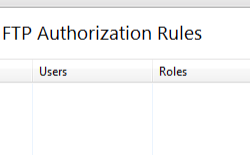

FTP Authorization &lt;authorization&gt;
====================

## Overview

The `<authorization>` element allows you to configure the user accounts that can access your site or application. Use authorization in combination with authentication to secure access to content on your server. Authentication confirms the identity of a user, while authorization determines what resources users can or cannot access.

IIS defines two types of authorization rules, Allow rules and Deny rules:

- Allow rules let you define the user accounts or user groups that can access a site, an application, or all the sites on a server.
- Deny rules let you define the user accounts or user groups that cannot access a site, an application, or all the sites on a server.

## Compatibility

| Version | Notes |
| --- | --- |
| IIS 10.0 | The `<authorization>` element was not modified in IIS 10.0. |
| IIS 8.5 | The `<authorization>` element was not modified in IIS 8.5. |
| IIS 8.0 | The `<authorization>` element was not modified in IIS 8.0. |
| IIS 7.5 | The `<authorization>` element of the `<system.ftpServer/security>` element ships as a feature of IIS 7.5. |
| IIS 7.0 | The `<authorization>` element of the `<system.ftpServer/security>` element was introduced in FTP 7.0, which was a separate download for IIS 7.0. |
| IIS 6.0 | N/A |

> [!NOTE]
> The FTP 7.0 and FTP 7.5 services shipped out-of-band for IIS 7.0, which required downloading and installing the modules from the following URL:

> [https://www.iis.net/expand/FTP](https://www.iis.net/downloads/microsoft/ftp)

With Windows 7 and Windows Server 2008 R2, the FTP 7.5 service ships as a feature for IIS 7.5, so downloading the FTP service is no longer necessary.

## Setup

To support FTP publishing for your Web server, you must install the FTP service. To do so, use the following steps.

### Windows Server 2012 or Windows Server 2012 R2

1. On the taskbar, click **Server Manager**.
2. In **Server Manager**, click the **Manage** menu, and then click **Add Roles and Features**.
3. In the **Add Roles and Features** wizard, click **Next**. Select the installation type and click **Next**. Select the destination server and click **Next**.
4. On the **Server Roles** page, expand **Web Server (IIS)**, and then select **FTP Server**.  
  
    > [!NOTE]
    > To support ASP.Membership authentication or IIS Manager authentication for the FTP service, you will need to select **FTP Extensibility**, in addition to **FTP Service**.  
     .
5. Click **Next**, and then on the **Select features** page, click **Next** again.
6. On the **Confirm installation selections** page, click **Install**.
7. On the **Results** page, click **Close**.

### Windows 8 or Windows 8.1

1. On the **Start** screen, move the pointer all the way to the lower left corner, right-click the **Start** button, and then click **Control Panel**.
2. In **Control Panel**, click **Programs and Features**, and then click **Turn Windows features on or off**.
3. Expand **Internet Information Services**, and then select **FTP Server**.   
  
    > [!NOTE]
    > To support ASP.Membership authentication or IIS Manager authentication for the FTP service, you will also need to select **FTP Extensibility**.   
    
4. Click **OK**.
5. Click **Close**.

### Windows Server 2008 R2

1. On the taskbar, click **Start**, point to **Administrative Tools**, and then click **Server Manager**.
2. In the **Server Manager** hierarchy pane, expand **Roles**, and then click **Web Server (IIS)**.
3. In the **Web Server (IIS)** pane, scroll to the **Role Services** section, and then click **Add Role Services**.
4. On the **Select Role Services** page of the **Add Role Services Wizard**, expand **FTP Server**.
5. Select **FTP Service**.  
  
    > [!NOTE]
    > To support ASP.Membership authentication or IIS Manager authentication for the FTP service, you will also need to select **FTP Extensibility**.  
    
6. Click **Next**.
7. On the **Confirm Installation Selections** page, click **Install**.
8. On the **Results** page, click **Close**.

### Windows 7

1. On the taskbar, click **Start**, and then click **Control Panel**.
2. In **Control Panel**, click **Programs and Features**, and then click **Turn Windows Features on or off**.
3. Expand **Internet Information Services**, and then **FTP Server**.
4. Select **FTP Service**.  
  
    > [!NOTE]
    > To support ASP.Membership authentication or IIS Manager authentication for the FTP service, you will also need to select **FTP Extensibility**.   
    
5. Click **OK**.

### Windows Server 2008 or Windows Vista

1. Download the installation package from the following URL: 

    - [https://www.iis.net/expand/FTP](https://www.iis.net/downloads/microsoft/ftp)
- Follow the instructions in the following walkthrough to install the FTP service: 

    - [Installing and Troubleshooting FTP 7](https://go.microsoft.com/fwlink/?LinkId=88547)
 

## How To

### How to add an FTP authorization rule

1. Open **Internet Information Services (IIS) Manager**: 

    - If you are using Windows Server 2012 or Windows Server 2012 R2: 

        - On the taskbar, click **Server Manager**, click **Tools**, and then click **Internet Information Services (IIS) Manager**.
    - If you are using Windows 8 or Windows 8.1: 

        - Hold down the **Windows** key, press the letter **X**, and then click **Control Panel**.
        - Click **Administrative Tools**, and then double-click **Internet Information Services (IIS) Manager**.
    - If you are using Windows Server 2008 or Windows Server 2008 R2: 

        - On the taskbar, click **Start**, point to **Administrative Tools**, and then click **Internet Information Services (IIS) Manager**.
    - If you are using Windows Vista or Windows 7: 

        - On the taskbar, click **Start**, and then click **Control Panel**.
        - Double-click **Administrative Tools**, and then double-click **Internet Information Services (IIS) Manager**.
2. In the **Connections** pane, expand the server name, expand **Sites**, and then navigate to the site or URL on which you want to configure authorization.
3. In the **Home** pane, double-click **Authorization Rules**.  
    
4. To add a new authorization rule, click **Add Allow Rule...** or **Add Deny Rule...** in the **Actions** pane.
5. Apply the authorization settings needed for your site or application. There are two sections that need to be considered: 

    - **Allow access to this content to**: Use the radio buttons to specify that the access rule will apply to: 

        - **All Users**
        - **All Anonymous Users**
        - **Specified roles or user groups** (multiple groups/roles can be separated by a comma)
        - **Specified users** (multiple users can be separated by a comma)
    - Permissions: Use the check box to specify **Read** or **Write** access for the rule.  
        
6. Click **OK**.

## Configuration

You can configure the `<authorization>` element at the site or URL level in the ApplicationHost.config file. You can set default authorization rules for the entire server by configuring authorization rules at the server level. You can remove, clear, or override these rules by configuring more specific rules for your sites or URLs.

### Attributes

None.

### Child Elements

| Element | Description |
| --- | --- |
| [`add`](add.md) | Optional element.  Adds an authorization rule to the collection of authorization rules. |
| `remove` | Optional element.   Removes a reference to an authorization rule to the collection of authorization rules. |
| `clear` | Optional element.  Removes all references to authorization rules from the collection of authorization rules. |

### Configuration Sample

The following sample illustrates several security-related configuration settings in the `<system.ftpServer>` element for an FTP site. More specifically, the `<location>` settings in this example demonstrate how to:

- Specify an FTP authorization rule for read and write access for the administrators group.
- Specify FTP request filtering options that deny \*.exe, \*.bat, and \*.cmd files.
- Specify FTP request limits for a maximum content length of 1000000 bytes and a maximum URL length of 1024 bytes.
- Block FTP access to the \_vti\_bin virtual directory, which is used with the FrontPage Server Extensions.
- Specify FTP IP filtering options that allow access from 127.0.0.1 and deny access from the 169.254.0.0/255.255.0.0 range of IP addresses.

[!code-xml[Main](index/samples/sample1.xml)]

## Sample Code

The following examples add two FTP authorization rules for the Default Web Site. The first rule allows read and write access for the administrators group, and the second rule denies read and write access for the guest account.

### AppCmd.exe

[!code-console[Main](index/samples/sample2.cmd)]

> [!NOTE]
> You must be sure to set the **commit** parameter to `apphost` when you use AppCmd.exe to configure these settings. This commits the configuration settings to the appropriate location section in the ApplicationHost.config file.

### C#

[!code-csharp[Main](index/samples/sample3.cs)]

### VB.NET

[!code-vb[Main](index/samples/sample4.vb)]

### JavaScript

[!code-javascript[Main](index/samples/sample5.js)]

### VBScript

[!code-vb[Main](index/samples/sample6.vb)]