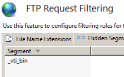

FTP Request Filtering &lt;requestFiltering&gt;
====================

## Overview

FTP Request Filtering is a built-in security feature that was introduced in FTP 7, and is roughly analogous to the functionality that was available through request filtering features that are available for HTTP sites. All of the settings for the request filtering feature are located within the `<requestFiltering>` element, which contains several child elements for each of the following feature areas:

- [`<denyUrlSequences>`](denyurlsequences/index.md) - This element can contain a collection of URL sequence patterns that IIS 7 will deny; for example: you can deny parts of URL sequences that an attacker might try to exploit.
- [`<fileExtensions>`](fileextensions/index.md) - This element can contain a collection of file name extensions that IIS 7 will either deny or allow; for example: you can block all requests for \*.EXE or \*.COM files.
- [`<hiddenSegments>`](hiddensegments/index.md) - This element can contain a collection of URLs that cannot be browsed; for example: you can deny requests for the ASP.NET App\_Code folder.
- [`<requestLimits>`](requestlimits.md) - This element contains the settings for URL, content, and command lengths.

On significant difference between FTP request filtering and HTTP request filtering is that HTTP request filtering includes an additional `<verbs>` element, which may contain a collection of HTTP verbs that IIS will either deny or allow. FTP provides this same type of filtering through the [`<commandFiltering>`](../../../system.applicationhost/sites/site/ftpserver/security/commandfiltering/index.md) element that is configured at the site level.

> [!NOTE]
> When request filtering blocks an FTP request because an FTP request violates the request filtering rules, FTP 7 will return an FTP error to the client and log one of the following FTP substatuses that identifies the reason that the request was denied:

| FTP Substatus | Description |
| --- | --- |
| `8` | Hidden segment was detected in the path based on request filtering rules. |
| `9` | Denied URL sequence detected in the path based on request filtering rules. |
| `10` | High bit characters detected in the path based on request filtering rules. |
| `11` | File name extension was denied based on request filtering rules |
| `12` | Path is too long based on request filtering rules. |
| `51` | Command filtering rules denied the access. |

Notification of the conditions that are indicated by these substatuses allows Web administrators to analyze their IIS logs and identify potential threats.

## Compatibility

| Version | Notes |
| --- | --- |
| IIS 10.0 | The `<requestFiltering>` element was not modified in IIS 10.0. |
| IIS 8.5 | The `<requestFiltering>` element was not modified in IIS 8.5. |
| IIS 8.0 | The `<requestFiltering>` element was not modified in IIS 8.0. |
| IIS 7.5 | The `<requestFiltering>` element of the `<system.ftpServer/security>` element ships as a feature of IIS 7.5. |
| IIS 7.0 | The `<requestFiltering>` element of the `<system.ftpServer/security>` element was introduced in FTP 7.0, which was a separate download for IIS 7.0. |
| IIS 6.0 | The FTP service in IIS 6.0 did not support request filtering. |

> [!NOTE]
> The FTP 7.0 and FTP 7.5 services shipped out-of-band for IIS 7.0, which required downloading and installing the modules from the following URL:

> [https://www.iis.net/expand/FTP](https://www.iis.net/downloads/microsoft/ftp)

With Windows 7 and Windows Server 2008 R2, the FTP 7.5 service ships as a feature for IIS 7.5, so downloading the FTP service is no longer necessary.

## Setup

To support FTP publishing for your Web server, you must install the FTP service. To do so, use the following steps.

### Windows Server 2012 or Windows Server 2012 R2

1. On the taskbar, click **Server Manager**.
2. In **Server Manager**, click the **Manage** menu, and then click **Add Roles and Features**.
3. In the **Add Roles and Features** wizard, click **Next**. Select the installation type and click **Next**. Select the destination server and click **Next**.
4. On the **Server Roles** page, expand **Web Server (IIS)**, and then select **FTP Server**.  
  
    > [!NOTE]
    > To support ASP.Membership authentication or IIS Manager authentication for the FTP service, you will need to select     **FTP Extensibility** , in addition to     **FTP Service** .  
     .
5. Click **Next**, and then on the **Select features** page, click **Next** again.
6. On the **Confirm installation selections** page, click **Install**.
7. On the **Results** page, click **Close**.

### Windows 8 or Windows 8.1

1. On the **Start** screen, move the pointer all the way to the lower left corner, right-click the **Start** button, and then click **Control Panel**.
2. In **Control Panel**, click **Programs and Features**, and then click **Turn Windows features on or off**.
3. Expand **Internet Information Services**, and then select **FTP Server**.   
  
    > [!NOTE]
    > To support ASP.Membership authentication or IIS Manager authentication for the FTP service, you will also need to select     **FTP Extensibility** .   
    
4. Click **OK**.
5. Click **Close**.

### Windows Server 2008 R2

1. On the taskbar, click **Start**, point to **Administrative Tools**, and then click **Server Manager**.
2. In the **Server Manager** hierarchy pane, expand **Roles**, and then click **Web Server (IIS)**.
3. In the **Web Server (IIS)** pane, scroll to the **Role Services** section, and then click **Add Role Services**.
4. On the **Select Role Services** page of the **Add Role Services Wizard**, expand **FTP Server**.
5. Select **FTP Service**.  
  
    > [!NOTE]
    > To support ASP.Membership authentication or IIS Manager authentication for the FTP service, you will also need to select     **FTP Extensibility** .  
    
6. Click **Next**.
7. On the **Confirm Installation Selections** page, click **Install**.
8. On the **Results** page, click **Close**.

### Windows 7

1. On the taskbar, click **Start**, and then click **Control Panel**.
2. In **Control Panel**, click **Programs and Features**, and then click **Turn Windows Features on or off**.
3. Expand **Internet Information Services**, and then **FTP Server**.
4. Select **FTP Service**.  
  
    > [!NOTE]
    > To support ASP.Membership authentication or IIS Manager authentication for the FTP service, you will also need to select     **FTP Extensibility** .   
    
5. Click **OK**.

### Windows Server 2008 or Windows Vista

1. Download the installation package from the following URL: 

    - [https://www.iis.net/expand/FTP](https://www.iis.net/downloads/microsoft/ftp)
- Follow the instructions in the following walkthrough to install the FTP service: 

    - [Installing and Troubleshooting FTP 7](https://go.microsoft.com/fwlink/?LinkId=88547)
 

## How To

> [!NOTE]
> FTP Request Filtering did not have a user interface in the FTP 7.0 release; the FTP Request Filtering UI was added in the FTP 7.5 release.

### How to deny FTP access to a specific file name extension

1. Open **Internet Information Services (IIS) Manager**: 

    - If you are using Windows Server 2012 or Windows Server 2012 R2: 

        - On the taskbar, click **Server Manager**, click **Tools**, and then click **Internet Information Services (IIS) Manager**.
    - If you are using Windows 8 or Windows 8.1: 

        - Hold down the **Windows** key, press the letter **X**, and then click **Control Panel**.
        - Click **Administrative Tools**, and then double-click **Internet Information Services (IIS) Manager**.
    - If you are using Windows Server 2008 or Windows Server 2008 R2: 

        - On the taskbar, click **Start**, point to **Administrative Tools**, and then click **Internet Information Services (IIS) Manager**.
    - If you are using Windows Vista or Windows 7: 

        - On the taskbar, click **Start**, and then click **Control Panel**.
        - Double-click **Administrative Tools**, and then double-click **Internet Information Services (IIS) Manager**.
2. In the **Connections** pane, go to the site or directory for which you want to modify your request filtering settings.
3. In the **Home** pane, double-click **FTP Request Filtering**.
4. In the **FTP Request Filtering** pane, click the **File Name Extensions** tab.  
    
5. Click **Deny File Name Extension...** in the **Actions** pane.
6. In the **Deny File Name Extension** dialog box, enter the file name extension that you wish to block. For example, to prevent access to files with a file name extension of .inc, you would enter "inc" in the dialog box.  
    
7. Click **OK**.

* * *

### How to edit the request filtering feature settings and request limits

1. Open **Internet Information Services (IIS) Manager**: 

    - If you are using Windows Server 2012 or Windows Server 2012 R2: 

        - On the taskbar, click **Server Manager**, click **Tools**, and then click **Internet Information Services (IIS) Manager**.
    - If you are using Windows 8 or Windows 8.1: 

        - Hold down the **Windows** key, press the letter **X**, and then click **Control Panel**.
        - Click **Administrative Tools**, and then double-click **Internet Information Services (IIS) Manager**.
    - If you are using Windows Server 2008 or Windows Server 2008 R2: 

        - On the taskbar, click **Start**, point to **Administrative Tools**, and then click **Internet Information Services (IIS) Manager**.
    - If you are using Windows Vista or Windows 7: 

        - On the taskbar, click **Start**, and then click **Control Panel**.
        - Double-click **Administrative Tools**, and then double-click **Internet Information Services (IIS) Manager**.
2. In the **Connections** pane, go to the site or directory for which you want to modify your request filtering settings.
3. In the **Home** pane, double-click **FTP Request Filtering**.
4. Click **Edit Feature Settings...** in the **Actions** pane.  
    
5. Specify your options. For example, you could make the following changes: 

    - Change the maximum URL length to 2KB by specifying 2048.
    - Change the maximum command length to 1KB by specifying 1024.
    - > [!NOTE]
 > It is recommended that you do not clear the **Allow unlisted commands** check box.  
        
6. Click **OK**.

* * *

### How to add an FTP hidden segment

1. Open **Internet Information Services (IIS) Manager**: 

    - If you are using Windows Server 2012 or Windows Server 2012 R2: 

        - On the taskbar, click **Server Manager**, click **Tools**, and then click **Internet Information Services (IIS) Manager**.
    - If you are using Windows 8 or Windows 8.1: 

        - Hold down the **Windows** key, press the letter **X**, and then click **Control Panel**.
        - Click **Administrative Tools**, and then double-click **Internet Information Services (IIS) Manager**.
    - If you are using Windows Server 2008 or Windows Server 2008 R2: 

        - On the taskbar, click **Start**, point to **Administrative Tools**, and then click **Internet Information Services (IIS) Manager**.
    - If you are using Windows Vista or Windows 7: 

        - On the taskbar, click **Start**, and then click **Control Panel**.
        - Double-click **Administrative Tools**, and then double-click **Internet Information Services (IIS) Manager**.
2. In the **Connections** pane, go to the site or directory for which you want to modify your request filtering settings.
3. In the **Home** pane, double-click **FTP Request Filtering**.
4. In the **FTP Request Filtering** pane, click the **Hidden Segments** tab.  
    
5. Click **Add Hidden Segment...** in the **Actions** pane.  
    
6. In the **Add Hidden Segment** dialog box, enter the path that you want to hide.
7. Click **OK**.

* * *

### How to deny an FTP URL sequence

1. Open **Internet Information Services (IIS) Manager**: 

    - If you are using Windows Server 2012 or Windows Server 2012 R2: 

        - On the taskbar, click **Server Manager**, click **Tools**, and then click **Internet Information Services (IIS) Manager**.
    - If you are using Windows 8 or Windows 8.1: 

        - Hold down the **Windows** key, press the letter **X**, and then click **Control Panel**.
        - Click **Administrative Tools**, and then double-click **Internet Information Services (IIS) Manager**.
    - If you are using Windows Server 2008 or Windows Server 2008 R2: 

        - On the taskbar, click **Start**, point to **Administrative Tools**, and then click **Internet Information Services (IIS) Manager**.
    - If you are using Windows Vista or Windows 7: 

        - On the taskbar, click **Start**, and then click **Control Panel**.
        - Double-click **Administrative Tools**, and then double-click **Internet Information Services (IIS) Manager**.
2. In the **Connections** pane, go to the site or directory for which you want to modify your request filtering settings.
3. In the **Home** pane, double-click **FTP Request Filtering**.  
    
4. In the **FTP Request Filtering** pane, click the **Denied URL Sequences** tab.  
    
5. Click **Add URL Sequence...** in the **Actions** pane.
6. In the **Add Deny Sequence** dialog box, enter the URL sequence that you wish to block.  
    
7. Click **OK**.

## Configuration

The `<requestFiltering>` element is configured at the global, site or URL level.

### Attributes

| Attribute | Description |
| --- | --- |
| `allowHighBitCharacters` | Optional **Boolean** attribute.  Specifies whether to allow non-ASCII characters in URLs.  The default value is `true`. |

### Child Elements

| Element | Description |
| --- | --- |
| [`fileExtensions`](fileextensions/index.md) | Optional element.  Specifies which file name extensions are allowed or denied to limit types of requests sent to the FTP server. |
| [`requestLimits`](requestlimits.md) | Optional element.  Specifies limits on requests processed by the FTP server. |
| [`hiddenSegments`](hiddensegments/index.md) | Optional element.  Specifies that certain segments of URLs can be made inaccessible to clients. |
| [`denyUrlSequences`](denyurlsequences/index.md) | Optional element.  Specifies sequences that should be denied to help prevent URL-based attacks on the FTP server. |

### Configuration Sample

The following sample illustrates several security-related configuration settings in the `<system.ftpServer>` element for an FTP site. More specifically, the `<location>` settings in this example demonstrate how to:

- Specify an FTP authorization rule for read and write access for the administrators group.
- Specify FTP request filtering options that deny \*.exe, \*.bat, and \*.cmd files.
- Specify FTP request limits for a maximum content length of 1000000 bytes and a maximum URL length of 1024 bytes.
- Block FTP access to the \_vti\_bin virtual directory, which is used with the FrontPage Server Extensions.
- Specify FTP IP filtering options that allow access from 127.0.0.1 and deny access from the 169.254.0.0/255.255.0.0 range of IP addresses.

[!code-xml[Main](index/samples/sample1.xml)]

## Sample Code

The following examples specify FTP request filtering options that deny \*.exe, \*.com, \*.bat, and \*.cmd files.

### AppCmd.exe

[!code-console[Main](index/samples/sample2.cmd)]

> [!NOTE]
> You must be sure to set the **commit** parameter to `apphost` when you use AppCmd.exe to configure these settings. This commits the configuration settings to the appropriate location section in the ApplicationHost.config file.

### C#

[!code-csharp[Main](index/samples/sample3.cs)]

### VB.NET

[!code-vb[Main](index/samples/sample4.vb)]

### JavaScript

[!code-javascript[Main](index/samples/sample5.js)]

### VBScript

[!code-vb[Main](index/samples/sample6.vb)]

* * *

The following examples specify FTP request limits for a maximum content length of 1000000 bytes and maximum URL length of 1024 bytes.

### AppCmd.exe

[!code-console[Main](index/samples/sample7.cmd)]

> [!NOTE]
> You must be sure to set the **commit** parameter to `apphost` when you use AppCmd.exe to configure these settings. This commits the configuration settings to the appropriate location section in the ApplicationHost.config file.

### C#

[!code-csharp[Main](index/samples/sample8.cs)]

### VB.NET

[!code-vb[Main](index/samples/sample9.vb)]

### JavaScript

[!code-javascript[Main](index/samples/sample10.js)]

### VBScript

[!code-vb[Main](index/samples/sample11.vb)]