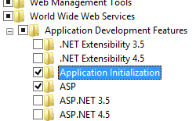

Application Initialization <applicationInitialization> &lt;applicationInitialization&gt;
====================

## Overview

The `<applicationInitialization>` element specifies that web application initialization is performed proactively before a request is received. An application can start up more quickly if initialization sequences such as initializing connections, priming in-memory caches, running queries, and compiling page code are performed before the HTTP request is received. Application Initialization can start the initialization process automatically whenever an application is started. The application initialization does not necessarily make the initialization process run any faster; it starts the process sooner.

Application initialization also enables you to enhance the user experience during initialization by redirecting a request to static pages, such as a placeholder or splash screen. Once the site is loaded, it will stop mapping the managed request to the static page, and will start serving the dynamic content. When using the **remapManagedRequestsTo** attribute in the `<applicationInitialization>` element, you can only map the managed request to a single page. However, application initialization can be used in conjunction with the out-of-band IIS Url Rewrite module to support more complex handling of placeholder content, including complex mappings to pre-generated static content.

In addition to application initialization, you can enable the initialization process to start whenever the application pool is started. You do so by setting the **preLoadEnabled** attribute in the `<application>` element to "true". For this to occur, the start mode in the `<applicationPool>` element must be set to AlwaysRunning.

## Compatibility

| Version | Notes |
| --- | --- |
| IIS 10.0 | The `<applicationInitialization>` element was not modified in IIS 10.0. |
| IIS 8.5 | The `<applicationInitialization>` element was not modified in IIS 8.5. |
| IIS 8.0 | The `<applicationInitialization>` element was introduced in IIS 8.0. |
| IIS 7.5 | N/A |
| IIS 7.0 | N/A |
| IIS 6.0 | N/A |

## Setup

To support application initialization on your Web server, you must install the Application Initialization role or feature.

### Windows Server 2012 or Windows Server 2012 R2

1. On the taskbar, click **Server Manager**.
2. In **Server Manager**, click the **Manage** menu, and then click **Add Roles and Features**.
3. In the **Add Roles and Features** wizard, click **Next**. Select the installation type and click **Next**. Select the destination server and click **Next**.
4. On the **Server Roles** page, expand **Web Server (IIS)**, expand **Web Server**, expand **Application Development**, and then select **Application Initialization**. Click **Next**.  
     .
5. On the **Select Features** page, click **Next**.
6. On the **Confirm installation selections** page, click **Install**.
7. On the **Results** page, click **Close**.

### Windows 8 or Windows 8.1

1. On the **Start** screen, move the pointer all the way to the lower left corner, right-click the **Start** button, and then click **Control Panel**.
2. In **Control Panel**, click **Programs and Features**, and then click **Turn Windows features on or off**.
3. Expand **Internet Information Services**, expand **World Wide Web Services**, expand **Application Development Features**, and then select **Application Initialization**.  
    
4. Click **OK**.
5. Click **Close**.

## How To

### How to configure application initialization

1. Open **Internet Information Services (IIS) Manager**: 

    - If you are using Windows Server 2012 or later: 

        - On the taskbar, click **Server Manager**, click **Tools**, and then click **Internet Information Services (IIS) Manager**.
    - If you are using Windows 8 or later: 

        - Hold down the **Windows** key, press the letter **X**, and then click **Control Panel**.
        - Click **Administrative Tools**, and then double-click **Internet Information Services (IIS) Manager**.
2. In the **Connections** pane, select the server, or expand the server, expand **Sites**, and then select a site.
3. In the **Home** pane, double-click the **Configuration Editor** feature.
4. If you selected a site, select **&lt;site name&gt; Web.config** in the **From** text box, and then select **system.webServer/applicationInitialization** in the **Section** text box.
5. If you selected the server, select **system.webServer/applicationInitialization** in the **Section** text box.  
  
    
6. To specify the name of a static file to be returned during initialization, set **remapManagedRequestsTo** to the name of the file.
7. If you do not want to load managed modules, set **skipManagedModules** to **true**.
8. To specify that the initialization process is initiated automatically whenever an application restart occurs, set **doAppInitAfterRestart** to **true**.
9. To specify the application or applications to be initialized upon application restart, click the **(Collection)** line and then click the ellipsis.
10. In the Collection Editor, to add an application to be initialized, click **Add**, click **hostName**, and then set hostName to the name of the host. Click **initializationPage** and set it to a URL for the application. Close the dialog box.  
  
    
11. Click **Apply** in the **Actions** pane.

## Configuration

The `<applicationInitialization>` element is configured at the server, site, or application level.

### Attributes

| Attribute | Description |
| --- | --- |
| `doAppInitAfterRestart` | Optional Boolean attribute. Specifies that the initialization process is initiated automatically whenever an application restart occurs. Note that this is different than the preLoadEnabled attribute in the application element, which specifies that the initialization process is started after a restart of the application pool. The default value is `false`. |
| `remapManagedRequestsTo` | Optional string attribute. Specifies a page to remap a request to during application initialization. The default value is `""`. |
| `skipManagedModules` | Optional Boolean attribute. Specifies whether the managed modules are loaded (`true`) or not loaded (`false`) during initialization. The default value is `false`. |

### Child Elements

| Element | Description |
| --- | --- |
| [`add`](https://www.iis.net/configreference/system.webserver/applicationinitialization/add) | Optional element. Specifies the application to be initialized upon application restart. |

### Configuration Sample

The following sample shows configuration of application initialization.

[!code-xml[Main](index/samples/sample1.xml)]
 

## Sample Code

The following examples configure **&lt;applicationInitialization&gt;** for a site.

### AppCmd.exe

[!code-console[Main](index/samples/sample2.cmd)]

> [!NOTE]
> You must be sure to set the **commit** parameter to `apphost` when using AppCmd.exe to configure these settings. This commits the configuration settings to the appropriate location section in the ApplicationHost.config file.

### C#

[!code-csharp[Main](index/samples/sample3.cs)]

### VB.NET

[!code-vb[Main](index/samples/sample4.vb)]

### JavaScript

[!code-javascript[Main](index/samples/sample5.js)]
  

### VBScript

[!code-vb[Main](index/samples/sample6.vb)]

### PowerShell

[!code-ps[Main](index/samples/sample-0-7.unknown)]