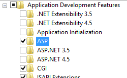
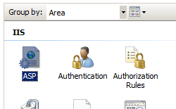

# ASP COM Plus &lt;comPlus&gt;

The `<comPlus>` element of the `<asp>` element configures the following COM+ settings for Active Server Pages (ASP) in Internet Information Services (IIS) 7:

- The **appServiceFlags** property contains the flags that must be set to enable COM+ services on your IIS 7 applications. Once you enable the flags, you may also need to set other properties. For more information, see the [Configuration](#configuration) section later in this article.
- The **executeInMta** attribute specifies whether ASP can run scripts in a multithreaded apartment. ASP is capable of running all of its threads in a multi-threaded apartment (MTA). If your COM components are primarily free-threaded or both-threaded, running the ASP threads as MTA can improve performance significantly. By default, the **executeInMta** property is set to **false**, which means that ASP does not execute in MTA. Set this property to **true** at the application level to enable ASP to run in MTA.
- The **partitionId** attribute specifies the Globally Unique Identifier (GUID) of a COM+ partition, which is used to isolate Web applications into their own COM+ partitions. COM+ partitions hold different versions of your own custom COM components.  
  
    > [!NOTE]
    > If you specify a value for the **partitionId** attribute, you will also need to set the **UsePartition** flag of the **appServiceFlags** attribute.
- The **sxsName** attribute specifies the name of a COM+ application, and enables side-by-side (SxS) assemblies. Side-by-side (SxS) assemblies allow ASP applications to specify which version of an SxS-supported system DLL to use, such as MSVCRT, MSXML, COMCTL, GDIPLUS, and so on.  
  
    > [!NOTE]
    > If you specify a value for the **sxsName** attribute, you will also need to set the **EnableSxS** flag of the **appServiceFlags** attribute.
- The **trackThreadingModel** attribute specifies whether IIS 7 checks the threading model of any components (COM objects) that your application creates. The preferred setting of this metabase attribute is false. If **trackThreadingModel** is set to true the following conditions apply:

  - ASP uses system resources to track the threading model, reducing the performance of your ASP application.
  - Objects that are created in your ASP application outside of the **OnStartPage** or **OnEndPage** method are released earlier than expected, which causes degradation in the scalability of your application and can prevent your component from writing to the response in the object destructor method.

    If the **trackThreadingModel** attribute is set to **false**, and you give application scope to components that you create, those components must aggregate the free-threaded marshaler. If you do not aggregate the free-threaded marshaler, ASP generates an error when you try to create an instance of the component. For more information, see [Selecting a Threading Model for Components in IIS](https://docs.microsoft.com/previous-versions/iis/6.0-sdk/ms525101(v=vs.90)).

## Compatibility

| Version | Notes |
| --- | --- |
| IIS 10.0 | The `<comPlus>` element was not modified in IIS 10.0. |
| IIS 8.5 | The `<comPlus>` element was not modified in IIS 8.5. |
| IIS 8.0 | The `<comPlus>` element was not modified in IIS 8.0. |
| IIS 7.5 | The `<comPlus>` element was not modified in IIS 7.5. |
| IIS 7.0 | The `<comPlus>` element of the `<asp>` element was introduced in IIS 7.0. |
| IIS 6.0 | The `<comPlus>` element replaces the following IIS 6.0 metabase properties: <ul> <li><strong>AspAppServiceFlags</strong></li> <li><strong>AspExecuteInMTA</strong></li> <li><strong>AspPartitionID</strong></li> <li><strong>AspSxsName</strong></li> <li><strong>AspTrackThreadingModel</strong> </li></ul> |

## Setup

To support and configure ASP applications on your Web server, you must install the ASP module. To install the ASP module, use the following steps.

### Windows Server 2012 or Windows Server 2012 R2

1. On the taskbar, click **Server Manager**. - In **Server Manager**, click the **Manage** menu, and then click **Add Roles and Features**. - In the **Add Roles and Features** wizard, click **Next**. Select the installation type and click **Next**. Select the destination server and click **Next**. - On the **Server Roles** page, expand **Web Server (IIS)**, expand **Web Server**, expand **Application Development**, and then select **ASP**.

    

    If the **Add features that are required by ASP?** dialog box appears, click **Add Features**. (This page appears only if you have not already installed the ISAPI Extensions role service on your server.) - On the **Server Roles** page, click **Next**. - On the **Select features** page, click **Next**. - On the **Confirm installation selections** page, click **Install**. - On the **Results** page, click **Close**.

### Windows 8 or Windows 8.1

1. On the **Start** screen, move the pointer all the way to the lower left corner, right-click the **Start** button, and then click **Control Panel**.
2. In **Control Panel**, click **Programs and Features**, and then click **Turn Windows features on or off**.
3. Expand **Internet Information Services**, expand **World Wide Web Services**, expand **Application Development Features**, and then select **ASP**.

    

    > [!NOTE]
    > The ISAPI Extensions role will be selected if it has not already been installed.

4. Click **OK**.
5. Click **Close**.

### Windows Server 2008 or Windows Server 2008 R2

1. On the taskbar, click **Start**, point to **Administrative Tools**, and then click **Server Manager**.
2. In the **Server Manager** hierarchy pane, expand **Roles**, and then click **Web Server (IIS)**.
3. In the **Web Server (IIS)** pane, scroll to the **Role Services** section, and then click **Add Role Services**.
4. On the **Select Role Services** page of the **Add Role Services Wizard**, select **ASP**.  
    
5. If the **Add role services required by ASP** dialog box appears, click **Add Required Role Services**. (This page appears only if you have not already installed the ISAPI Extensions role service on your server.)  
    
6. On the **Select Role Services** page, click **Next**.
7. On the **Confirm Installation Selections** page, click **Install**.
8. On the **Results** page, click **Close**.

### Windows Vista or Windows 7

1. On the taskbar, click **Start**, and then click **Control Panel**.
2. In **Control Panel**, click **Programs and Features**, and then click **Turn Windows Features on or off**.
3. Expand **Internet Information Services**, then **World Wide Web Services**, then **Application Development Features**.
4. Select **ASP**, and then click **OK**.

    

## How To

### How to configure ASP session state settings for a site or application

1. Open **Internet Information Services (IIS) Manager**:

    - If you are using Windows Server 2012 or Windows Server 2012 R2:

        - On the taskbar, click **Server Manager**, click **Tools**, and then click **Internet Information Services (IIS) Manager**.
    - If you are using Windows 8 or Windows 8.1:

        - Hold down the **Windows** key, press the letter **X**, and then click **Control Panel**.
        - Click **Administrative Tools**, and then double-click **Internet Information Services (IIS) Manager**.
    - If you are using Windows Server 2008 or Windows Server 2008 R2:

        - On the taskbar, click **Start**, point to **Administrative Tools**, and then click **Internet Information Services (IIS) Manager**.
    - If you are using Windows Vista or Windows 7:

        - On the taskbar, click **Start**, and then click **Control Panel**.
        - Double-click **Administrative Tools**, and then double-click **Internet Information Services (IIS) Manager**.
2. In the **Connections** pane, expand the server name, expand **Sites**, and then navigate to the Web site or Web application that you want to configure.
3. In the site or application **Home** pane, double-click **ASP**.  
    
4. In the **ASP** pane, expand the **Com Plus Properties** section and configure your desired settings.  
    
5. Click **Apply** in the **Actions** pane.

## Configuration

### Attributes

| Attribute | Description |
| --- | --- |
| `appServiceFlags` | Optional flags attribute.  Contains the flags that must be set to enable COM+ services on your IIS applications.  The **appServiceFlags** attribute can be one of the following possible values. The default value is `None`. <table> <tbody> <tr> <th>Value</th> <th>Description</th></tr> <tr> <th><code>None</code></th> <td>Specifies that no flags are set.  The numeric value is <code>0</code>.</td></tr> <tr> <th><code>EnableTracker</code></th> <td>Setting this flag enables COM+ tracker, which allows administrators or developers to debug ASP applications.  The numeric value is <code>1</code>.</td></tr> <tr> <th><code>EnableSxS</code></th> <td>Setting this flag enables COM+ side-by-side assemblies, which allow ASP applications to specify which version of a system DLL or classic COM component to use, such as WinHTTP 5.1, Shell Common Controls version 6.0 (Comctl32.dll), GDI Plus version 1.0 (GDIplus.dll), and Visual C++ Run-time Libraries version 6.0. If this flag is set, you must also specify a value for the <strong>sxsName</strong> attribute.  The numeric value is <code>2</code>.</td></tr> <tr> <th><code>UsePartition</code></th> <td>Setting this flag enables COM+ partitioning, which can be used to isolate Web applications into their own COM+ partitions. COM+ partitions can hold different versions of your own custom COM components. If this flag is set, you must also specify a value for the <strong>partitionId</strong> attribute.  The numeric value is <code>4</code>.</td></tr></tbody></table> |
| `executeInMta` | Optional Boolean attribute.  Specifies whether ASP runs in a multithreaded environment.  The default value is `false`. |
| `partitionId` | Optional string attribute.  Specifies the Globally Unique Identifier (GUID) of the COM+ partition.  **Note:** This attribute is required when the **appServiceFlags** attribute is set to **UsePartition**   The default value is `00000000-0000-0000-0000-000000000000`. |
| `sxsName` | Optional string attribute.  **Note:** This attribute is required when the **appServiceFlags** attribute is set to **EnableSxS**.   Specifies the name of the COM+ application. |
| `trackThreadingModel` | Optional Boolean attribute.  Specifies whether thread model checking is enabled. A value of **true** means that IIS honors the threading model of the components that an application creates.  The default value is `false`. |

### Child Elements

None.

### Configuration Sample

The following configuration sample shows how to configure IIS to enable thread model checking and configure ASP to run in a multithreaded compartment.

[!code-xml[Main](comPlus/samples/sample1.xml)]

## Sample Code

The following code samples show how to configure IIS to enable thread model checking and configure ASP to run in a multithreaded compartment.

### AppCmd.exe

[!code-console[Main](comPlus/samples/sample2.cmd)]

> [!NOTE]
> You must be sure to set the **commit** parameter to `apphost` when you use AppCmd.exe to configure these settings. This commits the configuration settings to the appropriate location section in the ApplicationHost.config file.

### C\#

[!code-csharp[Main](comPlus/samples/sample3.cs)]

### VB.NET

[!code-vb[Main](comPlus/samples/sample4.vb)]

### JavaScript

[!code-javascript[Main](comPlus/samples/sample5.js)]

### VBScript

[!code-vb[Main](comPlus/samples/sample6.vb)]
