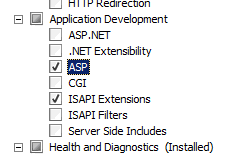
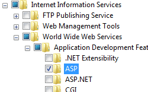
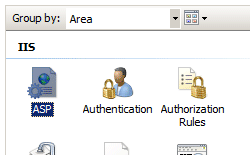
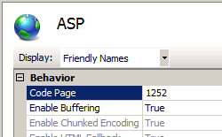

ASP &lt;asp&gt;
====================

## Overview

The `<asp>` element specifies configuration settings for an ASP application. These include developer-focused configuration settings, such as attributes that control debugging and error return settings. The `<asp>` element also includes attributes that control the character set used by the application, the script language for the application, and whether error logging is enabled for the application.

The `<asp>` element can also contain elements that configure COM+, ASP caching, buffering limits, and session state for a site or application.

## Compatibility

| Version | Notes |
| --- | --- |
| IIS 10.0 | The `<asp>` element was not modified in IIS 10.0. |
| IIS 8.5 | The `<asp>` element was not modified in IIS 8.5. |
| IIS 8.0 | The `<asp>` element was not modified in IIS 8.0. |
| IIS 7.5 | The `<asp>` element was not modified in IIS 7.5. |
| IIS 7.0 | The `<asp>` element was introduced in IIS 7.0. |
| IIS 6.0 | The `<asp>` element and its children replace the ASP related properties in the IIS 6.0 **IIsWebService** object. |

## Setup

To support and configure ASP applications on your Web server, you must install the ASP module. To install the ASP module, use the following steps.

### Windows Server 2012 or Windows Server 2012 R2

1. On the taskbar, click **Server Manager**. - In **Server Manager**, click the **Manage** menu, and then click **Add Roles and Features**. - In the **Add Roles and Features** wizard, click **Next**. Select the installation type and click **Next**. Select the destination server and click **Next**. - On the **Server Roles** page, expand **Web Server (IIS)**, expand **Web Server**, expand **Application Development**, and then select **ASP**.  
     . - If the **Add features that are required by ASP?** dialog box appears, click **Add Features**. (This page appears only if you have not already installed the ISAPI Extensions role service on your server.) - On the **Server Roles** page, click **Next**. - On the **Select features** page, click **Next**. - On the **Confirm installation selections** page, click **Install**. - On the **Results** page, click **Close**.

### Windows 8 or Windows 8.1

1. On the **Start** screen, move the pointer all the way to the lower left corner, right-click the **Start** button, and then click **Control Panel**.
2. In **Control Panel**, click **Programs and Features**, and then click **Turn Windows features on or off**.
3. Expand **Internet Information Services**, expand **World Wide Web Services**, expand **Application Development Features**, and then select **ASP**.  
       
    > [!NOTE]
    > The ISAPI Extensions role will be selected if it has not already been installed.
4. Click **OK**.
5. Click **Close**.

### Windows Server 2008 or Windows Server 2008 R2

1. On the taskbar, click **Start**, point to **Administrative Tools**, and then click **Server Manager**.
2. In the **Server Manager** hierarchy pane, expand **Roles**, and then click **Web Server (IIS)**.
3. In the **Web Server (IIS)** pane, scroll to the **Role Services** section, and then click **Add Role Services**.
4. On the **Select Role Services** page of the **Add Role Services Wizard**, select **ASP**.  
    
5. If the **Add role services required by ASP** dialog box appears, click **Add Required Role Services**. (This page appears only if you have not already installed the ISAPI Extensions role service on your server.)  
    
6. On the **Select Role Services** page, click **Next**.
7. On the **Confirm Installation Selections** page, click **Install**.
8. On the **Results** page, click **Close**.

### Windows Vista or Windows 7

1. On the taskbar, click **Start**, and then click **Control Panel**.
2. In **Control Panel**, click **Programs and Features**, and then click **Turn Windows Features on or off**.
3. Expand **Internet Information Services**, then **World Wide Web Services**, then **Application Development Features**.
4. Select **ASP**, and then click **OK**.   
    
 

## How To

### How to configure ASP settings for a site or application

1. Open **Internet Information Services (IIS) Manager**: 

    - If you are using Windows Server 2012 or Windows Server 2012 R2: 

        - On the taskbar, click **Server Manager**, click **Tools**, and then click **Internet Information Services (IIS) Manager**.
    - If you are using Windows 8 or Windows 8.1: 

        - Hold down the **Windows** key, press the letter **X**, and then click **Control Panel**.
        - Click **Administrative Tools**, and then double-click **Internet Information Services (IIS) Manager**.
    - If you are using Windows Server 2008 or Windows Server 2008 R2: 

        - On the taskbar, click **Start**, point to **Administrative Tools**, and then click **Internet Information Services (IIS) Manager**.
    - If you are using Windows Vista or Windows 7: 

        - On the taskbar, click **Start**, and then click **Control Panel**.
        - Double-click **Administrative Tools**, and then double-click **Internet Information Services (IIS) Manager**.
2. In the **Connections** pane, expand the server name, expand **Sites**, and then navigate to the Web site or Web application that you want to configure.
3. In the site or application **Home** pane, double-click **ASP**.   
    
4. In the **ASP** pane, configure the required settings, and then click **Apply** in the **Actions** pane.   
    

## Configuration

You can configure the `<asp>` element at the server level in the ApplicationHost.config file. However, by default, you cannot configure the `<asp>` element at the site level or application level.

### Attributes

| Attribute | Description |
| --- | --- |
| `appAllowClientDebug` | Optional Boolean attribute. Specifies whether client-side debugging is enabled. The default value is `false`. |
| `appAllowDebugging` | Optional Boolean attribute. Specifies whether server-side debugging is enabled. The default value is `false`. |
| `bufferingOn` | Optional Boolean attribute. Specifies whether buffering of ASP application output is enabled. The default value is `true`. |
| `calcLineNumber` | Optional Boolean attribute. Specifies whether ASP calculates and stores the line number of each executed line of code in order to provide the number in an error report. The default value is `true`. |
| `codePage` | Optional uint attribute. Specifies the default character set for an ASP application. This value is an integer in the range from 0 to 2147483647. For example, the value 1252 sets the default character set to a Latin character set used in American English and many European alphabets. The default value is `0`. |
| `enableApplicationRestart` | Optional Boolean attribute. Specifies whether ASP applications are automatically restarted whenever a configuration setting is changed. The default value is `true`. |
| `enableAspHtmlFallback` | Optional Boolean attribute. Specifies whether a .htm file with the same name as the requested .asp file, if it exists, will be sent to the client instead of the .asp file. This will occur in the event that the request is rejected due to a full request queue. The default value is `true`. |
| `enableChunkedEncoding` | Optional Boolean attribute. Specifies whether HTTP 1.1 chunked transfer encoding is enabled. The default value is `true`. |
| `enableParentPaths` | Optional Boolean attribute. Specifies whether ASP pages allow paths relative to the current directory or above the current directory. The default value is `false`. |
| `errorsToNTLog` | Optional Boolean attribute. Specifies whether logging of ASP errors to the Windows Event Log is enabled. The default value is `false`. |
| `exceptionCatchEnable` | Optional Boolean attribute. Specifies whether COM component exception trapping is enabled. If set to **false**, the Microsoft Script Debugger tool does not catch exceptions sent by the component that you are debugging. The default value is `true`. |
| `lcid` | Optional uint attribute. Specifies the default locale identifier for an ASP application. This value is an integer in the range from 0 to 2147483647. The default value is `0`. |
| `logErrorRequests` | Optional Boolean attribute. Specifies whether ASP errors are written to the client browser and the IIS logs by default. The default value is `true`. |
| `runOnEndAnonymously` | Optional Boolean attribute. Specifies whether SessionOnEnd and ApplicationOnEnd global ASP functions are run as the anonymous user. The default value is `true`. |
| `scriptErrorMessage` | Optional string attribute. Specifies the error message that will be sent to the browser when specific debugging errors are not sent to the client. The default value is `An error occurred on the server when processing the URL. Please contact the system administrator`. |
| `scriptErrorSentToBrowser` | Optional Boolean attribute. Specifies whether the writing of debugging specifics to the client browser is enabled. The default value is `false`. |
| `scriptLanguage` | Optional string attribute. Specifies the default script language for all ASP applications running on the Web server. The default value is `VBScript`. |

### Child Elements

| Element | Description |
| --- | --- |
| [`cache`](cache.md) | Optional element. Specifies ASP cache settings. |
| [`comPlus`](complus.md) | Optional element. Specifies COM+ settings. |
| [`limits`](limits.md) | Optional element. Specifies limits for various ASP properties. |
| [`session`](session.md) | Optional element. Specifies ASP session state settings. |

### Configuration Sample

The following configuration example enables buffering and session state for ASP applications on a site named Contoso, and disables parent paths for that same site.

[!code-xml[Main](index/samples/sample1.xml)]

## Sample Code

The following code examples enable buffering and session state for ASP applications on a site named Contoso, and disable parent paths for that same site.

### AppCmd.exe

[!code-console[Main](index/samples/sample2.cmd)]

> [!NOTE]
> You must be sure to set the **commit** parameter to `apphost` when you use AppCmd.exe to configure these settings. This commits the configuration settings to the appropriate location section in the ApplicationHost.config file.

### C#

[!code-csharp[Main](index/samples/sample3.cs)]

### VB.NET

[!code-vb[Main](index/samples/sample4.vb)]

### JavaScript

[!code-javascript[Main](index/samples/sample5.js)]

### VBScript

[!code-vb[Main](index/samples/sample6.vb)]