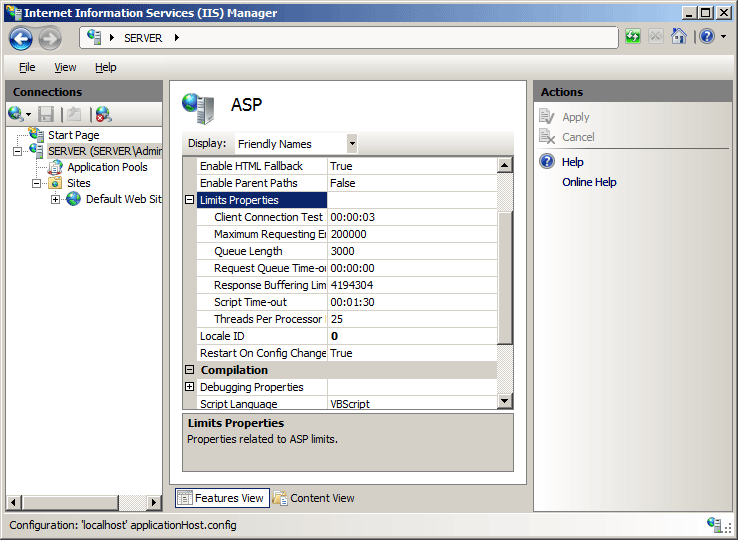

# ASP Limits &lt;limits&gt;

## Overview

The `<limits>` element of the `<asp>` element specifies the following Active Server Pages (ASP) connection and queue limits for Internet Information Services (IIS) 7:

- The **bufferingLimit** attribute sets the maximum size of the ASP buffer. If response buffering is turned on, this attribute controls the maximum number of bytes that an ASP page can write to the response buffer before a flush occurs.
- The **maxRequestEntityAllowed** attribute specifies the maximum number of bytes allowed in the entity body of an ASP request. If a Content-Length header is present and specifies an amount of data greater than the value of **maxRequestEntityAllowed**, IIS returns an *HTTP 403* error response.
- The **processorThreadMax** attribute specifies the maximum number of worker threads per processor that IIS may create.  
  
    > [!NOTE]
    > This setting can dramatically influence the scalability of your Web applications and the performance of your server in general. Because this attribute defines the maximum number of ASP requests that can execute simultaneously, this setting should remain at the default value unless your ASP applications are making extended calls to external components.
- The **queueConnectionTestTime** attribute specifies the number of seconds that a request can be queued before ASP determines whether the client is still connected. If the request is queued longer than the number of seconds specified by the **queueConnectionTestTime** attribute, ASP checks to determine whether the client is still connected before executing the request. If the client is no longer connected, the request is not processed and is deleted from the queue.  
  
    > [!NOTE]
    > Most often, users do not wait more than a few seconds for ASP pages to process. Although the maximum waiting time varies from user to user, the generally accepted maximum is approximately 10 seconds. You can use the **queueConnectionTestTime** attribute to ensure that IIS does not waste time processing a request that has been abandoned by the user. This attribute is useful for making ASP processing efficient only up to the point at which ASP begins to process the script. Once the script is running, however, your application should continue to check for client connection at appropriate times by using the **IsClientConnected** method of the ASP built-in **Response** object.
- The **queueTimeout** attribute specifies the amount of time (in seconds) that an ASP script request is allowed to wait in the queue. When requests are pulled from the queue, they are checked to see if they have expired (have waited longer than the value of this parameter). Expired requests are rejected with a message indicating the server is too busy.
- The **requestQueueMax** attribute specifies the maximum number of concurrent ASP requests that are permitted into the queue. Any client browser that attempts to request ASP files when the queue is full is sent an *HTTP 500 Server Too Busy* error.
- The **scriptTimeout** attribute specifies (in seconds) the default length of time that ASP pages allow a script to run before terminating the script and writing an event to the Windows Event Log. ASP scripts can override this value by using the **ScriptTimeout** property of the ASP built-in **Session** object. The **ScriptTimeout** property allows your ASP applications to set a higher script time-out value. For example, you can use this setting to adjust the time-out once a particular user establishes a valid session by logging in or ordering a product.

## Compatibility

| Version | Notes |
| --- | --- |
| IIS 10.0 | The `<limits>` element was not modified in IIS 10.0. |
| IIS 8.5 | The `<limits>` element was not modified in IIS 8.5. |
| IIS 8.0 | The `<limits>` element was not modified in IIS 8.0. |
| IIS 7.5 | The `<limits>` element was not modified in IIS 7.5. |
| IIS 7.0 | The `<limits>` element of the `<asp>` element was introduced in IIS 7.0. |
| IIS 6.0 | The `<limits>` element replaces the following IIS 6.0 metabase properties: <ul> <li><strong>AspBufferingLimit</strong></li> <li><strong>AspMaxRequestEntityAllowed</strong></li> <li><strong>AspProcessorThreadMax</strong></li> <li><strong>AspQueueConnectionTestTime</strong></li> <li><strong>AspQueueTimeout</strong></li> <li><strong>AspRequestQueueMax</strong></li> <li><strong>AspScriptTimeout</strong> </li></ul> |

## Setup

To support and configure ASP applications on your Web server, you must install the ASP module. To install the ASP module, use the following steps.

### Windows Server 2012 or Windows Server 2012 R2

1. On the taskbar, click **Server Manager**.
2. In **Server Manager**, click the **Manage** menu, and then click **Add Roles and Features**. - In the **Add Roles and Features** wizard, click **Next**. Select the installation type and click **Next**. Select the destination server and click **Next**.
3. On the **Server Roles** page, expand **Web Server (IIS)**, expand **Web Server**, expand **Application Development**, and then select **ASP**.  
    
4. If the **Add features that are required by ASP?** dialog box appears, click **Add Features**. (This page appears only if you have not already installed the ISAPI Extensions role service on your server.)
5. On the **Server Roles** page, click **Next**.
6. On the **Select features** page, click **Next**.
7. On the **Confirm installation selections** page, click **Install**.
8. On the **Results** page, click **Close**.

### Windows 8 or Windows 8.1

1. On the **Start** screen, move the pointer all the way to the lower left corner, right-click the **Start** button, and then click **Control Panel**.
2. In **Control Panel**, click **Programs and Features**, and then click **Turn Windows features on or off**.
3. Expand **Internet Information Services**, expand **World Wide Web Services**, expand **Application Development Features**, and then select **ASP**.  
    

    > [!NOTE]
    > The ISAPI Extensions role will be selected if it has not already been installed.
4. Click **OK**.
5. Click **Close**.

### Windows Server 2008 or Windows Server 2008 R2

1. On the taskbar, click **Start**, point to **Administrative Tools**, and then click **Server Manager**.
2. In the **Server Manager** hierarchy pane, expand **Roles**, and then click **Web Server (IIS)**.
3. In the **Web Server (IIS)** pane, scroll to the **Role Services** section, and then click **Add Role Services**.
4. On the **Select Role Services** page of the **Add Role Services Wizard**, select **ASP**.  
    
5. If the **Add role services required by ASP** dialog box appears, click **Add Required Role Services**. (This page appears only if you have not already installed the ISAPI Extensions role service on your server.)  
    
6. On the **Select Role Services** page, click **Next**.
7. On the **Confirm Installation Selections** page, click **Install**.
8. On the **Results** page, click **Close**.

### Windows Vista or Windows 7

1. On the taskbar, click **Start**, and then click **Control Panel**.
2. In **Control Panel**, click **Programs and Features**, and then click **Turn Windows Features on or off**.
3. Expand **Internet Information Services**, then **World Wide Web Services**, then **Application Development Features**.
4. Select **ASP**, and then click **OK**.  
    

## How To

### How to configure the ASP cache settings for a server

1. Open **Internet Information Services (IIS) Manager**:

    - If you are using Windows Server 2012 or Windows Server 2012 R2:

        - On the taskbar, click **Server Manager**, click **Tools**, and then click **Internet Information Services (IIS) Manager**.
    - If you are using Windows 8 or Windows 8.1:

        - Hold down the **Windows** key, press the letter **X**, and then click **Control Panel**.
        - Click **Administrative Tools**, and then double-click **Internet Information Services (IIS) Manager**.
    - If you are using Windows Server 2008 or Windows Server 2008 R2:

        - On the taskbar, click **Start**, point to **Administrative Tools**, and then click **Internet Information Services (IIS) Manager**.
    - If you are using Windows Vista or Windows 7:

        - On the taskbar, click **Start**, and then click **Control Panel**.
        - Double-click **Administrative Tools**, and then double-click **Internet Information Services (IIS) Manager**.
2. In the **Connections** pane, highlight the name of your server.
3. In the server's **Home** pane, double-click **ASP**.  
    
4. In the **ASP** pane, expand the **Limits Properties** section, configure your desired settings, then click **Apply** in the **Actions** pane.  
    

## Configuration

### Attributes

| Attribute | Description |
| --- | --- |
| `bufferingLimit` | Optional uint attribute.  Specifies the maximum size, in bytes, of the ASP buffer. If response buffering is turned on, this attribute controls the maximum number of bytes that an ASP page can write to the response buffer before a flush occurs. This value is an integer in the range from 0 to 2147483647.  The default value is `4194304`. |
| `maxRequestEntityAllowed` | Optional uint attribute.  Specifies the maximum number of bytes allowed in the entire body of an ASP request. This value is an integer in the range from 0 to 2147483647.  The default value is `200000`. |
| `processorThreadMax` | Optional uint attribute.  Specifies the maximum number of worker threads per processor that ASP can create.  The default value is `25`. |
| `queueConnectionTestTime` | Optional timeSpan attribute.  Specifies the time interval (hh:mm:ss) after which ASP will check to see whether the client is still connected before executing a request. If the client is no longer connected, the request is not processed and is deleted from the queue.  The default value is `00:00:03`. |
| `queueTimeout` | Optional timeSpan attribute.  Specifies the maximum period of time (hh:mm:ss) that an ASP request can wait in the request queue.  The default value is `00:00:00`. |
| `requestQueueMax` | Optional uint attribute.  Specifies the maximum number of concurrent ASP requests that are allowed into the request queue.  The default value is `3000`. |
| `scriptTimeout` | Optional timeSpan attribute.  Specifies the maximum period of time (hh:mm:ss) that ASP pages allow a script to run before terminating the script and writing an event to the Windows Event Log.  The default value is `00:01:30`. |

### Child Elements

None.

### Configuration Sample

The following configuration sample sets the ASP script time-out to 2 minutes, the amount of time that ASP will check to see whether the client is still connected before executing a request to 5 seconds, and the maximum number of concurrent ASP requests in request queue to 1,000.

[!code-xml[Main](limits/samples/sample1.xml)]

## Sample Code

The following code samples set the ASP script time-out to 2 minutes, the amount of time that ASP will check to see whether the client is still connected before executing a request to 5 seconds, and the maximum number of concurrent ASP requests in request queue to 1,000.

### AppCmd.exe

[!code-console[Main](limits/samples/sample2.cmd)]

> [!NOTE]
> You must be sure to set the **commit** parameter to `apphost` when you use AppCmd.exe to configure these settings. This commits the configuration settings to the appropriate location section in the ApplicationHost.config file.

### C\#

[!code-csharp[Main](limits/samples/sample3.cs)]

### VB.NET

[!code-vb[Main](limits/samples/sample4.vb)]

### JavaScript

[!code-javascript[Main](limits/samples/sample5.js)]

### VBScript

[!code-vb[Main](limits/samples/sample6.vb)]
