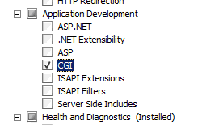
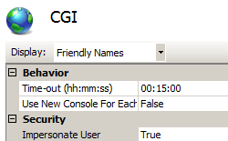

CGI &lt;cgi&gt;
====================

## Overview

The `<cgi>` element configures default settings for Common Gateway Interface (CGI) applications for Internet Information Services (IIS) 7. These settings define the environment that IIS 7 will use when launching CGI processes. For example, the **createCGIWithNewConsole** and **createProcessAsUser** attributes specify how IIS 7 will launch a CGI application, and the **timeout** attribute specifies how long IIS will let a CGI application run before terminating the process.

CGI is sometimes considered to be a legacy application environment. Because of the processing overhead that is associated with launching CGI applications as separate processes, technologies like HTTP Modules, ISAPI extensions, ASP/ASP.NET, and FastCGI are preferred over CGI for application development.

> [!NOTE]
> The CGI environment is not installed by default; however, installing the CGI environment also installs the necessary functionality for using FastCGI applications. For more information about using FastCGI on IIS 7, see the [&lt;fastCgi&gt;](fastcgi/index.md) element.

## Compatibility

| Version | Notes |
| --- | --- |
| IIS 10.0 | The `<cgi>` element was not modified in IIS 10.0. |
| IIS 8.5 | The `<cgi>` element was not modified in IIS 8.5. |
| IIS 8.0 | The `<cgi>` element was not modified in IIS 8.0. |
| IIS 7.5 | The `<cgi>` element was not modified in IIS 7.5. |
| IIS 7.0 | The `<cgi>` element was introduced in IIS 7.0. |
| IIS 6.0 | The attributes for the `<cgi>` element replaces the IIS 6.0 following metabase properties: **CreateProcessAsUser**, **CreateCGIWithNewConsole**, and **CGITimeout**. |

## Setup

The `<cgi>` element is not included in the default installation of IIS 7 and later.To use the CGI environment, you must first install the CGI role service. The installation process registers the Common Gateway Interface (CGI) role service in both the `<globalModules>` and `<modules>` element.

### Windows Server 2012 or Windows Server 2012 R2

1. On the taskbar, click **Server Manager**.
2. In **Server Manager**, click the **Manage** menu, and then click **Add Roles and Features**.
3. In the **Add Roles and Features** wizard, click **Next**. Select the installation type and click **Next**. Select the destination server and click **Next**.
4. On the **Server Roles** page, expand **Web Server (IIS)**, expand **Web Server**, expand **Application Development**, and then select **CGI**. Click **Next**.  
     .
5. On the **Select Features** page, click **Next**.
6. On the **Confirm installation selections** page, click **Install**.
7. On the **Results** page, click **Close**.

### Windows 8 or Windows 8.1

1. On the **Start** screen, move the pointer all the way to the lower left corner, right-click the **Start** button, and then click **Control Panel**.
2. In **Control Panel**, click **Programs and Features**, and then click **Turn Windows features on or off**.
3. Expand **Internet Information Services**, expand **World Wide Web Services**, expand **Application Development Features**, and then select **CGI**.  
    
4. Click **OK**.
5. Click **Close**.

### Windows Server 2008 or Windows Server 2008 R2

1. On the taskbar, click **Start**, point to **Administrative Tools**, and then click **Server Manager**.
2. In the **Server Manager** hierarchy pane, expand **Roles**, and then click **Web Server (IIS)**.
3. In the **Web Server (IIS)** pane, scroll to the **Role Services** section, and then click **Add Role Services**.
4. On the **Select Role Services** page of the **Add Role Services Wizard**, select **CGI**, and then click **Next**.  
    
5. On the **Confirm Installation Selections** page, click **Install**.
6. On the **Results** page, click **Close**.

### Windows Vista or Windows 7

1. On the taskbar, click **Start**, and then click **Control Panel**.
2. In **Control Panel**, click **Programs and Features**, and then click **Turn Windows Features on or off**.
3. Expand **Internet Information Services**, then select **CGI**, and then click **OK**.  
    

## How To

### How to configure CGI settings for a site

1. Open **Internet Information Services (IIS) Manager**: 

    - If you are using Windows Server 2012 or Windows Server 2012 R2: 

        - On the taskbar, click **Server Manager**, click **Tools**, and then click **Internet Information Services (IIS) Manager**.
    - If you are using Windows 8 or Windows 8.1: 

        - Hold down the **Windows** key, press the letter **X**, and then click **Control Panel**.
        - Click **Administrative Tools**, and then double-click **Internet Information Services (IIS) Manager**.
    - If you are using Windows Server 2008 or Windows Server 2008 R2: 

        - On the taskbar, click **Start**, point to **Administrative Tools**, and then click **Internet Information Services (IIS) Manager**.
    - If you are using Windows Vista or Windows 7: 

        - On the taskbar, click **Start**, and then click **Control Panel**.
        - Double-click **Administrative Tools**, and then double-click **Internet Information Services (IIS) Manager**.
2. In the **Connections** pane, expand the server name, expand **Sites**, and then navigate to the Web site or Web application that you want to configure.
3. In the site or application **Home** pane, double-click **CGI**.  
    
4. In the **CGI** pane, configure the required settings, and then click **Apply** in the **Actions** pane.  
    

## Configuration

### Attributes

| Attribute | Description |
| --- | --- |
| `createCGIWithNewConsole` | Optional Boolean attribute. Specifies whether a CGI application runs in its own console.   **Note:** If the value is set to **true**, each CGI application creates a new console when the application is started. A value of **false** indicates that CGI applications should run without a console. The default value is `false`. |
| `createProcessAsUser` | Optional Boolean attribute. Specifies whether a CGI process is created in the system context or in the context of the requesting user. The default value is `true`. |
| `timeout` | Optional timeSpan attribute. Specifies the time-out for a CGI application. The default value is `00:15:00` (15 minutes) |

### Child Elements

None.

### Configuration Sample

The following configuration sample specifies that each CGI application creates a new console when the application starts, that CGI processes be created in the context of the requesting user, and that the time-out for CGI applications is 20 minutes.

[!code-xml[Main](cgi/samples/sample1.xml)]

## Sample Code

The following code samples specify that each CGI application creates a new console when the application starts, that CGI processes be created in the context of the requesting user, and that the time-out for CGI applications is 20 minutes

### AppCmd.exe

[!code-console[Main](cgi/samples/sample2.cmd)]

> [!NOTE]
> You must be sure to set the **commit** parameter to `apphost` when you use AppCmd.exe to configure these settings. This commits the configuration settings to the appropriate location section in the ApplicationHost.config file.

### C#

[!code-csharp[Main](cgi/samples/sample3.cs)]

### VB.NET

[!code-vb[Main](cgi/samples/sample4.vb)]

### JavaScript

[!code-javascript[Main](cgi/samples/sample5.js)]

### VBScript

[!code-vb[Main](cgi/samples/sample6.vb)]