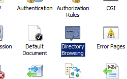

Directory Browse &lt;directoryBrowse&gt;
====================

## Overview

The `<directoryBrowse>` element controls the information that is displayed in a directory listing when you enable directory browsing for your Web site or application.

The `<directoryBrowse>` element can contain two attributes. The **enabled** attribute determines whether directory browsing is enabled for the site, application, or directory. The **showFlags** attribute defines the information about each file in the directory that Internet Information Services (IIS) will display. IIS can display the last modified date and time, the long date for the last modified date, the file size, and the file name extension. You can choose which of these, if any, IIS will display. 

## Compatibility

| Version | Notes |
| --- | --- |
| IIS 10.0 | The `<directoryBrowse>` element was not modified in IIS 10.0. |
| IIS 8.5 | The `<directoryBrowse>` element was not modified in IIS 8.5. |
| IIS 8.0 | The `<directoryBrowse>` element was not modified in IIS 8.0. |
| IIS 7.5 | The `<directoryBrowse>` element was not modified in IIS 7.5. |
| IIS 7.0 | The `<directoryBrowse>` element was introduced in IIS 7.0. |
| IIS 6.0 | The `<directoryBrowse>` element replaces the IIS 6.0 **DirBrowseFlags** metabase property. |

## Setup

The `<directoryBrowse>` element is included in the default installation of IIS 7 and later.

If directory browsing has been uninstalled, you can reinstall it using the following steps.

### Windows Server 2012 or Windows Server 2012 R2

1. On the taskbar, click **Server Manager**.
2. In **Server Manager**, click the **Manage** menu, and then click **Add Roles and Features**.
3. In the **Add Roles and Features** wizard, click **Next**. Select the installation type and click **Next**. Select the destination server and click **Next**.
4. On the **Server Roles** page, expand **Web Server (IIS)**, expand **Web Server**, expand **Common HTTP Features**, and then select **Directory Browsing**. Click **Next**.  
     .
5. On the **Select features** page, click **Next**.
6. On the **Confirm installation selections** page, click **Install**.
7. On the **Results** page, click **Close**.

### Windows 8 or Windows 8.1

1. On the **Start** screen, move the pointer all the way to the lower left corner, right-click the **Start** button, and then click **Control Panel**.
2. In **Control Panel**, click **Programs and Features**, and then click **Turn Windows features on or off**.
3. Expand **Internet Information Services**, expand **World Wide Web Services**, expand **Common HTTP Features**, and then select **Directory Browsing**.  
    
4. Click **OK**.
5. Click **Close**.

### Windows Server 2008 or Windows Server 2008 R2

1. On the taskbar, click **Start**, point to **Administrative Tools**, and then click **Server Manager**.
2. In the **Server Manager** hierarchy pane, expand **Roles**, and then click **Web Server (IIS)**.
3. In the **Web Server (IIS)** pane, scroll to the **Role Services** section, and then click **Add Role Services**.
4. On the **Select Role Services** page of the **Add Role Services Wizard**, select **Directory Browsing**, and then click **Next**.  
    
5. On the **Confirm Installation Selections** page, click **Install**.
6. On the **Results** page, click **Close**.

### Windows Vista or Windows 7

1. On the taskbar, click **Start**, and then click **Control Panel**.
2. In **Control Panel**, click **Programs and Features**, and then click **Turn Windows Features on or off**.
3. Expand **Internet Information Services**, expand **World Wide Web Services**, then expand **Common Http Features**.
4. Select **Directory Browsing**, and then click **OK**.  
    

## How To

### How to enable directory browsing

1. Open **Internet Information Services (IIS) Manager**: 

    - If you are using Windows Server 2012 or Windows Server 2012 R2: 

        - On the taskbar, click **Server Manager**, click **Tools**, and then click **Internet Information Services (IIS) Manager**.
    - If you are using Windows 8 or Windows 8.1: 

        - Hold down the **Windows** key, press the letter **X**, and then click **Control Panel**.
        - Click **Administrative Tools**, and then double-click **Internet Information Services (IIS) Manager**.
    - If you are using Windows Server 2008 or Windows Server 2008 R2: 

        - On the taskbar, click **Start**, point to **Administrative Tools**, and then click **Internet Information Services (IIS) Manager**.
    - If you are using Windows Vista or Windows 7: 

        - On the taskbar, click **Start**, and then click **Control Panel**.
        - Double-click **Administrative Tools**, and then double-click **Internet Information Services (IIS) Manager**.
2. In the **Connections** pane, expand the server name, and then go to the site, application, or directory where you want to enable directory browsing.
3. In the **Home** pane, double-click **Directory Browsing**.  
    
4. In the **Actions** pane, click **Enable**.   
    
5. In the **Directory Browsing** pane, select the options that correspond to the information you want to display for each item in the directory, and then click **Apply**.

## Configuration

The `<directoryBrowse>` element is configurable at the site level, application level, or directory level in the appropriate Web.config file.

### Attributes

| Attribute | Description |
| --- | --- |
| `enabled` | Optional Boolean attribute.  Specifies whether directory browsing is enabled (**true**) or disabled (**false**) on the Web server.  The default value is `false`. |
| `showFlags` | Optional flags attribute.  The **showFlags** attribute can have one or more of the following possible values. If you specify more than one value, separate the values with a comma (,). The default values are `Date`, `Time`, `Size`, `Extension`. <table> <tbody> <tr> <th>Value</th> <th>Description</th></tr> <tr> <th><code>Date</code></th> <td>Includes the last modified date for a file or directory in a directory listing.</td></tr> <tr> <th><code>Extension</code></th> <td>Includes a file name extension for a file in a directory listing.</td></tr> <tr> <th><code>LongDate</code></th> <td>Includes the last modified date in extended format for a file in a directory listing.</td></tr> <tr> <th><code>None</code></th> <td>Specifies that only the file or directory names are returned in a directory listing.</td></tr> <tr> <th><code>Size</code></th> <td>Includes the file size for a file in a directory listing.</td></tr> <tr> <th><code>Time</code></th> <td>Includes the last modified time for a file or directory in a directory listing.</td></tr></tbody></table> |

### Child Elements

None.

### Configuration Sample

The following example enables directory browsing and uses the **showFlags** property to configure IIS to display the date and time modified for each item in the directory, along with each item's file size and file name extension.

[!code-xml[Main](directoryBrowse/samples/sample1.xml)]

## Sample Code

The following examples enable directory browsing for a site named Contoso and use the **showFlags** property to configure IIS to display the date and time modified for each item in the directory, along with each item's file size and file name extension.

### AppCmd.exe

[!code-console[Main](directoryBrowse/samples/sample2.cmd)]

### C\#

[!code-csharp[Main](directoryBrowse/samples/sample3.cs)]

### VB.NET

[!code-vb[Main](directoryBrowse/samples/sample4.vb)]

### JavaScript

[!code-javascript[Main](directoryBrowse/samples/sample5.js)]

### VBScript

[!code-vb[Main](directoryBrowse/samples/sample6.vb)]