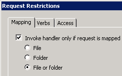
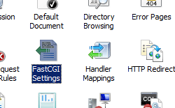
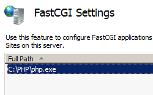

Environment Variable &lt;environmentVariable&gt;
====================

## Overview

The `<environmentVariable>` element of the `<environmentVariables>` element adds a unique name/value pair of an environment variable that Internet Information Services (IIS) 7 will pass to a FastCGI process when it is launched.

Each FastCGI application that is installed on IIS 7 may allow or require environment variables to configure how the FastCGI application works. For example, one FastCGI application may require an environment variable that specifies where the application's configuration file is located, whereas another FastCGI application may require an environment variable that specifies the number of requests after which it will need to be recycled.

## Compatibility

| Version | Notes |
| --- | --- |
| IIS 10.0 | The `<environmentVariable>` element was not modified in IIS 10.0. |
| IIS 8.5 | The `<environmentVariable>` element was not modified in IIS 8.5. |
| IIS 8.0 | The `<environmentVariable>` element was not modified in IIS 8.0. |
| IIS 7.5 | The `<environmentVariable>` element was not modified in IIS 7.5. |
| IIS 7.0 | The `<environmentVariable>` element of the `<environmentVariables>` element was introduced in IIS 7.0. |
| IIS 6.0 | N/A |

## Setup

To use the FastCGI environment, you must first install the CGI role service. The installation process registers the Common Gateway Interface (CGI) role service in both the `<globalModules>` and `<modules>` elements. You do not need to perform any other steps to install the FastCGI environment.

### Windows Server 2012 or Windows Server 2012 R2

1. On the taskbar, click **Server Manager**.
2. In **Server Manager**, click the **Manage** menu, and then click **Add Roles and Features**.
3. In the **Add Roles and Features** wizard, click **Next**. Select the installation type and click **Next**. Select the destination server and click **Next**.
4. On the **Server Roles** page, expand **Web Server (IIS)**, expand **Web Server**, expand **Application Development**, and then select **CGI**. Click **Next**.  
     .
5. On the **Select Features** page, click **Next**.
6. On the **Confirm installation selections** page, click **Install**.
7. On the **Results** page, click **Close**.

### Windows 8 or Windows 8.1

1. On the **Start** screen, move the pointer all the way to the lower left corner, right-click the **Start** button, and then click **Control Panel**.
2. In **Control Panel**, click **Programs and Features**, and then click **Turn Windows features on or off**.
3. Expand **Internet Information Services**, expand **World Wide Web Services**, expand **Application Development Features**, and then select **CGI**.  
    
4. Click **OK**.
5. Click **Close**.

### Windows Server 2008 or Windows Server 2008 R2

1. On the taskbar, click **Start**, point to **Administrative Tools**, and then click **Server Manager**.
2. In the **Server Manager** hierarchy pane, expand **Roles**, and then click **Web Server (IIS)**.
3. In the **Web Server (IIS)** pane, scroll to the **Role Services** section, and then click **Add Role Services**.
4. On the **Select Role Services** page of the **Add Role Services Wizard**, select **CGI**, and then click **Next**.   
    
5. On the **Confirm Installation Selections** page, click **Install**.
6. On the **Results** page, click **Close**.

### Windows Vista or Windows 7

1. On the taskbar, click **Start**, and then click **Control Panel**.
2. In **Control Panel**, click **Programs and Features**, and then click **Turn Windows Features on or off**.
3. Expand **Internet Information Services**, then select **CGI**, and then click **OK**.   
    
 

## How To

**Note for IIS 7.0 users**: Some of the steps in this section may require that you install the Microsoft Administration Pack for IIS 7.0, which includes a user interface for FastCGI settings. To install the Microsoft Administration Pack for IIS 7.0, see the following URL:

- [https://www.iis.net/expand/AdministrationPack](https://www.iis.net/downloads/microsoft/administration-pack)
 

### How to create a global FastCGI handler mapping for PHP

> [!NOTE]
> Before the following procedure will work, you must have already installed binaries that will execute the file path or file name extension that you specify. This example uses a PHP implementation available from [www.php.net](https://www.php.net/).

1. Open **Internet Information Services (IIS) Manager**: 

    - If you are using Windows Server 2012 or Windows Server 2012 R2: 

        - On the taskbar, click **Server Manager**, click **Tools**, and then click **Internet Information Services (IIS) Manager**.
    - If you are using Windows 8 or Windows 8.1: 

        - Hold down the **Windows** key, press the letter **X**, and then click **Control Panel**.
        - Click **Administrative Tools**, and then double-click **Internet Information Services (IIS) Manager**.
    - If you are using Windows Server 2008 or Windows Server 2008 R2: 

        - On the taskbar, click **Start**, point to **Administrative Tools**, and then click **Internet Information Services (IIS) Manager**.
    - If you are using Windows Vista or Windows 7: 

        - On the taskbar, click **Start**, and then click **Control Panel**.
        - Double-click **Administrative Tools**, and then double-click **Internet Information Services (IIS) Manager**.
2. In the **Connections** pane, click the server name for which you want to configure FastCGI handler mappings.
3. In the **Home** pane, double-click **Handler Mappings**.   
    
4. In the **Actions** pane, click **Add Module Mapping...**  
    
5. Enter the following information: 

    - Enter the file name extension in the **Request path** text box. For example, "\*.php".
    - Click **FastCgiModule** in the **Module** drop-down list.
    - Enter the path to the scripting engine in the **Executable** box. For example, "C:\PHP\php-cgi.exe".
    - Enter a unique name for the handler mapping in the **Name** box. For example, "PHP-FastCGI".
  
    - Click **Request Restrictions...**

    - Select **Invoke handler only if request is mapped to**.
    - Click to select the **File or Folder** option.
    - Click **OK**.   
        
- Click **OK**.
- If you are prompted to create a FastCGI application in the **Add Module Mapping** dialog box, click **Yes**.   
      
    > [!NOTE]
    > This will automatically create a FastCGI application for the handler mapping that you just created. If you choose     **No** , you can manually create a FastCGI application later.

* * *

### How to create a FastCGI application for PHP

> [!NOTE]
> Before the following procedure will work, you must have already installed binaries that will execute the file path or file name extension that you specify. This example uses a PHP implementation available from [www.php.net](https://www.php.net/).

> [!NOTE]
> Adding a FastCGI application does not automatically add a handler mapping. To do so, you would need to follow the steps in the [How to create a FastCGI handler mapping for PHP](#003a) section of this topic.

1. Open **Internet Information Services (IIS) Manager**: 

    - If you are using Windows Server 2012 or Windows Server 2012 R2: 

        - On the taskbar, click **Server Manager**, click **Tools**, and then click **Internet Information Services (IIS) Manager**.
    - If you are using Windows 8 or Windows 8.1: 

        - Hold down the **Windows** key, press the letter **X**, and then click **Control Panel**.
        - Click **Administrative Tools**, and then double-click **Internet Information Services (IIS) Manager**.
    - If you are using Windows Server 2008 or Windows Server 2008 R2: 

        - On the taskbar, click **Start**, point to **Administrative Tools**, and then click **Internet Information Services (IIS) Manager**.
    - If you are using Windows Vista or Windows 7: 

        - On the taskbar, click **Start**, and then click **Control Panel**.
        - Double-click **Administrative Tools**, and then double-click **Internet Information Services (IIS) Manager**.
2. In the **Connections** pane, click the server name for which you want to configure FastCGI settings.
3. In the **Home** pane, double-click **FastCGI Settings**.   
    
4. In the **Actions** pane, click **Add Application...**  
    
5. In the **Add FastCGI Application** dialog box, enter the following information: 

    - Enter the path to the scripting engine in the **Full Path** box. For example, "C:\PHP\php-cgi.exe".
    - Enter the maximum number of requests for the FastCGI application.  
        > [!NOTE]
        > For PHP, this number must be lesser or equal to the maximum number of requests for PHP environment, which is configured by using the PHP\_FCGI\_MAX\_REQUESTS environment variable.
  
    
6. Click the ellipsis (**...**) next to **EnvironmentVariables** to open the environment variables collection editor.
7. In the **EnvironmentVariables Collection Editor** dialog box, click **Add**.   
    
8. Enter the following information, and then click **OK**. 

    - Enter "PHP\_FCGI\_MAX\_REQUESTS" for the **Name**.
    - Enter "10000" for the **Value**.
  
    
9. Click **OK** to close the **Add FastCGI Application** dialog box.

* * *

### How add a FastCGI environment variable for PHP

> [!NOTE]
> Before the following procedure will work, you must have already installed binaries that will execute the file path or file name extension that you specify. This example uses a PHP implementation available from [www.php.net](https://www.php.net/).

1. Open **Internet Information Services (IIS) Manager**: 

    - If you are using Windows Server 2012 or Windows Server 2012 R2: 

        - On the taskbar, click **Server Manager**, click **Tools**, and then click **Internet Information Services (IIS) Manager**.
    - If you are using Windows 8 or Windows 8.1: 

        - Hold down the **Windows** key, press the letter **X**, and then click **Control Panel**.
        - Click **Administrative Tools**, and then double-click **Internet Information Services (IIS) Manager**.
    - If you are using Windows Server 2008 or Windows Server 2008 R2: 

        - On the taskbar, click **Start**, point to **Administrative Tools**, and then click **Internet Information Services (IIS) Manager**.
    - If you are using Windows Vista or Windows 7: 

        - On the taskbar, click **Start**, and then click **Control Panel**.
        - Double-click **Administrative Tools**, and then double-click **Internet Information Services (IIS) Manager**.
2. In the **Connections** pane, click the server name for which you want to configure FastCGI settings.
3. In the **Home** pane, double-click **FastCGI Settings**.   
    
4. Highlight the PHP application in the **FastCGI Settings** pane, then click **Edit...** in the **Actions** pane   
    
5. In the **Edit FastCGI Application** dialog box, click the ellipsis (**...**) next to **EnvironmentVariables** to open the environment variables collection editor.   
    
6. In the **EnvironmentVariables Collection Editor** dialog box, click **Add**.   
    
7. Enter the following information, and then click **OK**. 

    - Enter "PHP\_FCGI\_MAX\_REQUESTS" for the **Name**.
    - Enter "10000" for the **Value**.
  
    
8. Click **OK** to close the **Add FastCGI Application** dialog box.
 

## Configuration

### Attributes

| Attribute | Description |
| --- | --- |
| `name` | Optional string attribute.  Specifies the name of the environment variable to pass to the FastCGI process. |
| `Value` | Optional string attribute.  Specifies the value of the environment variable to pass to the FastCGI process. |

### Child Elements

None.

### Configuration Sample

The following configuration sample adds a FastCGI application for PHP, sets the **instanceMaxRequests** attribute to "10000," and sets the **PHP\_FCGI\_MAX\_REQUESTS** environment variable to "10000."

[!code-xml[Main](environmentVariable/samples/sample1.xml)]

> [!NOTE]
> For PHP, the value of the **PHP\_FCGI\_MAX\_REQUESTS** environment variable must be a number that is lesser or equal to the value specified by the **instanceMaxRequests** attribute of the FastCGI `<application>` element.

The following configuration sample adds a global FastCGI handler mapping for PHP files to IIS and specifies the full path to a FastCGI executable file.

[!code-xml[Main](environmentVariable/samples/sample2.xml)]

> [!NOTE]
> FastCGI settings can be configured per-site through the use of specially formatted FastCGI application and by handler mappings, which are distinguished by matching the **fullPath** and **arguments** attributes for an `<application>` element with the corresponding **scriptProcessor** attribute in the `<handlers>` mapping for the FastCGI process. To create these mappings, the settings in the **fullPath** and **arguments** attributes for an `<application>` element must be added to the **scriptProcessor** attribute in the `<handlers>` mapping for the FastCGI process and separated by the pipe "|" character. This combination serves as a unique key for each FastCGI application. For example, the following configuration excerpt shows two example &lt;fastCgi&gt;/&lt;application&gt; elements and their corresponding &lt;handlers&gt; mappings for two site-specific PHP handlers:

> [!code-xml[Main](environmentVariable/samples/sample3.xml)]

Additional information and examples about how to configure FastCGI settings for PHP are discussed in the following walkthrough:

> [Using FastCGI to Host PHP Applications on IIS 7](https://docs.microsoft.com/en-us/iis/application-frameworks/install-and-configure-php-applications-on-iis/using-fastcgi-to-host-php-applications-on-iis)

 

## Sample Code

The following code samples add a FastCGI application for PHP, set the **instanceMaxRequests** attribute to "10000," and set the **PHP\_FCGI\_MAX\_REQUESTS** environment variable to "10000." Each sample also adds a global FastCGI handler mapping for PHP files to IIS and specifies the full path to a FastCGI executable file.

### AppCmd.exe

[!code-console[Main](environmentVariable/samples/sample4.cmd)]

> [!NOTE]
> You must be sure to set the **commit** parameter to `apphost` when you use AppCmd.exe to configure these settings. This commits the configuration settings to the appropriate location section in the ApplicationHost.config file.

### C#

[!code-csharp[Main](environmentVariable/samples/sample5.cs)]

### VB.NET

[!code-vb[Main](environmentVariable/samples/sample6.vb)]

### JavaScript

[!code-javascript[Main](environmentVariable/samples/sample7.js)]

### VBScript

[!code-vb[Main](environmentVariable/samples/sample8.vb)]