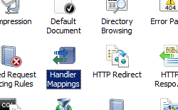
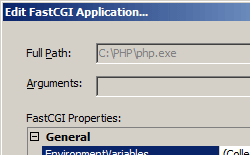

FastCGI Application &lt;application&gt;
====================

## Overview

The FastCGI `<application>` element contains the configurations settings for a specific FastCGI process pool definition. When FastCGI is used, IIS will use the value in the **maxInstances** attribute of the `<application>` element to determine the number of FastCGI processes that can run in the process pool.

The simplest FastCGI application pool definition requires that you include the **fullPath** attribute in an `<application>` element to define the binaries to use for the specific application framework. For the PHP framework, set the **fullPath** attribute to the directory and file name of the PHP binaries.

Other attributes are optional and let you configure a number of other parameters. These include the maximum number of requests that a FastCGI worker process can process before it is recycled, the maximum number of worker processes for an application pool, and the maximum amount of time a FastCGI request can take.

> [!NOTE]
> In order to process requests by using FastCGI, you must first map the path and the specific file name extensions to the FastCGI module and specify the target FastCGI process as the script processor.

### New in IIS 7.5

IIS 7.5 added the following attributes to the `<fastCgi>`/`<application>` element:

- The **monitorChangesTo** attribute lets you specify a file to monitor for changes that might affect the behavior of a FastCGI application. For example, if you use the PHP framework, you can configure IIS to monitor the PHP.INI file for changes by specifying the full path to the file in the **monitorChangesTo** attribute.
- The **stderrMode** attribute specifies how IIS 7 will handle errors that are returned from a FastCGI application through the STDERR stream.
- The **signalBeforeTerminateSeconds** attribute lets you configure IIS to wait for a specified period of time after IIS signals a FastCGI application that it needs to shut down. This lets a FastCGI application clean up any settings before IIS terminates the process.
 

## Compatibility

| Version | Notes |
| --- | --- |
| IIS 10.0 | The `<application>` element was not modified in IIS 10.0. |
| IIS 8.5 | The `<application>` element was not modified in IIS 8.5. |
| IIS 8.0 | The default value of the `maxInstances` attribute was changed from `4` to `0` in IIS 8.0. |
| IIS 7.5 | The `<application>` element of the `<fastCgi>` collection was updated in IIS 7.5 with the **monitorChangesTo**, **stderrMode**, and **signalBeforeTerminateSeconds** attributes. |
| IIS 7.0 | The `<application>` element of the `<fastCgi>` collection was introduced in IIS 7.0. |
| IIS 6.0 | N/A |

## Setup

To use the FastCGI environment, you must first install the CGI role service. The installation process registers the Common Gateway Interface (CGI) role service in both the `<globalModules>` and `<modules>` elements. You do not need to perform any other steps to install the FastCGI environment.

### Windows Server 2012 or Windows Server 2012 R2

1. On the taskbar, click **Server Manager**.
2. In **Server Manager**, click the **Manage** menu, and then click **Add Roles and Features**.
3. In the **Add Roles and Features** wizard, click **Next**. Select the installation type and click **Next**. Select the destination server and click **Next**.
4. On the **Server Roles** page, expand **Web Server (IIS)**, expand **Web Server**, expand **Application Development**, and then select **CGI**. Click **Next**.  
     .
5. On the **Select Features** page, click **Next**.
6. On the **Confirm installation selections** page, click **Install**.
7. On the **Results** page, click **Close**.

### Windows 8 or Windows 8.1

1. On the **Start** screen, move the pointer all the way to the lower left corner, right-click the **Start** button, and then click **Control Panel**.
2. In **Control Panel**, click **Programs and Features**, and then click **Turn Windows features on or off**.
3. Expand **Internet Information Services**, expand **World Wide Web Services**, expand **Application Development Features**, and then select **CGI**.  
    
4. Click **OK**.
5. Click **Close**.

### Windows Server 2008 or Windows Server 2008 R2

1. On the taskbar, click **Start**, point to **Administrative Tools**, and then click **Server Manager**.
2. In the **Server Manager** hierarchy pane, expand **Roles**, and then click **Web Server (IIS)**.
3. In the **Web Server (IIS)** pane, scroll to the **Role Services** section, and then click **Add Role Services**.
4. On the **Select Role Services** page of the **Add Role Services Wizard**, select **CGI**, and then click **Next**.   
    
5. On the **Confirm Installation Selections** page, click **Install**.
6. On the **Results** page, click **Close**.

### Windows Vista or Windows 7

1. On the taskbar, click **Start**, and then click **Control Panel**.
2. In **Control Panel**, click **Programs and Features**, and then click **Turn Windows Features on or off**.
3. Expand **Internet Information Services**, then select **CGI**, and then click **OK**.   
    
 

## How To

**Note for IIS 7.0 users**: Some of the steps in this section may require that you install the Microsoft Administration Pack for IIS 7.0, which includes a user interface for FastCGI settings. To install the Microsoft Administration Pack for IIS 7.0, see the following URL:

- [https://www.iis.net/expand/AdministrationPack](https://www.iis.net/downloads/microsoft/administration-pack)
 

### How to create a global FastCGI handler mapping for PHP

> [!NOTE]
> Before the following procedure will work, you must have already installed binaries that will execute the file path or file name extension that you specify. This example uses a PHP implementation available from [www.php.net](https://www.php.net/).

1. Open **Internet Information Services (IIS) Manager**: 

    - If you are using Windows Server 2012 or Windows Server 2012 R2: 

        - On the taskbar, click **Server Manager**, click **Tools**, and then click **Internet Information Services (IIS) Manager**.
    - If you are using Windows 8 or Windows 8.1: 

        - Hold down the **Windows** key, press the letter **X**, and then click **Control Panel**.
        - Click **Administrative Tools**, and then double-click **Internet Information Services (IIS) Manager**.
    - If you are using Windows Server 2008 or Windows Server 2008 R2: 

        - On the taskbar, click **Start**, point to **Administrative Tools**, and then click **Internet Information Services (IIS) Manager**.
    - If you are using Windows Vista or Windows 7: 

        - On the taskbar, click **Start**, and then click **Control Panel**.
        - Double-click **Administrative Tools**, and then double-click **Internet Information Services (IIS) Manager**.
2. In the **Connections** pane, click the server name for which you want to configure FastCGI handler mappings.
3. In the **Home** pane, double-click **Handler Mappings**.   
    
4. In the **Actions** pane, click **Add Module Mapping...**  
    
5. Enter the following information: 

    - Enter the file name extension in the **Request path** text box. For example, "\*.php".
    - Click **FastCgiModule** in the **Module** drop-down list.
    - Enter the path to the scripting engine in the **Executable** box. For example, "C:\PHP\php-cgi.exe".
    - Enter a unique name for the handler mapping in the **Name** box. For example, "PHP-FastCGI".
  
    - Click **Request Restrictions...**

    - Select **Invoke handler only if request is mapped to**.
    - Click to select the **File or Folder** option.
    - Click **OK**.   
        
- Click **OK**.
- If you are prompted to create a FastCGI application in the **Add Module Mapping** dialog box, click **Yes**.   
        > [!NOTE]
    > This will automatically create a FastCGI application for the handler mapping that you just created. If you choose     **No** , you can manually create a FastCGI application later.

* * *

### How to create a FastCGI application for PHP

> [!NOTE]
> Before the following procedure will work, you must have already installed binaries that will execute the file path or file name extension that you specify. This example uses a PHP implementation available from [www.php.net](https://www.php.net/).

> [!NOTE]
> Adding a FastCGI application does not automatically add a handler mapping. To do so, you would need to follow the steps in the [How to create a FastCGI handler mapping for PHP](#003a) section of this topic.

1. Open **Internet Information Services (IIS) Manager**: 

    - If you are using Windows Server 2012 or Windows Server 2012 R2: 

        - On the taskbar, click **Server Manager**, click **Tools**, and then click **Internet Information Services (IIS) Manager**.
    - If you are using Windows 8 or Windows 8.1: 

        - Hold down the **Windows** key, press the letter **X**, and then click **Control Panel**.
        - Click **Administrative Tools**, and then double-click **Internet Information Services (IIS) Manager**.
    - If you are using Windows Server 2008 or Windows Server 2008 R2: 

        - On the taskbar, click **Start**, point to **Administrative Tools**, and then click **Internet Information Services (IIS) Manager**.
    - If you are using Windows Vista or Windows 7: 

        - On the taskbar, click **Start**, and then click **Control Panel**.
        - Double-click **Administrative Tools**, and then double-click **Internet Information Services (IIS) Manager**.
2. In the **Connections** pane, click the server name for which you want to configure FastCGI settings.
3. In the **Home** pane, double-click **FastCGI Settings**.   
    
4. In the **Actions** pane, click **Add Application...**  
    
5. In the **Add FastCGI Application** dialog box, enter the following information: 

    - Enter the path to the scripting engine in the **Full Path** box. For example, "C:\PHP\php-cgi.exe".
    - Enter the maximum number of requests for the FastCGI application.  
        > [!NOTE]
        > For PHP, this number must be lesser or equal to the maximum number of requests for PHP environment, which is configured by using the PHP\_FCGI\_MAX\_REQUESTS environment variable.
  
    
6. Click the ellipsis (**...**) next to **EnvironmentVariables** to open the environment variables collection editor.
7. In the **EnvironmentVariables Collection Editor** dialog box, click **Add**.   
    
8. Enter the following information, and then click **OK**. 

    - Enter "PHP\_FCGI\_MAX\_REQUESTS" for the **Name**.
    - Enter "10000" for the **Value**.
  
    
9. Click **OK** to close the **Add FastCGI Application** dialog box.

* * *

### How add a FastCGI environment variable for PHP

> [!NOTE]
> Before the following procedure will work, you must have already installed binaries that will execute the file path or file name extension that you specify. This example uses a PHP implementation available from [www.php.net](https://www.php.net/).

1. Open **Internet Information Services (IIS) Manager**: 

    - If you are using Windows Server 2012 or Windows Server 2012 R2: 

        - On the taskbar, click **Server Manager**, click **Tools**, and then click **Internet Information Services (IIS) Manager**.
    - If you are using Windows 8 or Windows 8.1: 

        - Hold down the **Windows** key, press the letter **X**, and then click **Control Panel**.
        - Click **Administrative Tools**, and then double-click **Internet Information Services (IIS) Manager**.
    - If you are using Windows Server 2008 or Windows Server 2008 R2: 

        - On the taskbar, click **Start**, point to **Administrative Tools**, and then click **Internet Information Services (IIS) Manager**.
    - If you are using Windows Vista or Windows 7: 

        - On the taskbar, click **Start**, and then click **Control Panel**.
        - Double-click **Administrative Tools**, and then double-click **Internet Information Services (IIS) Manager**.
2. In the **Connections** pane, click the server name for which you want to configure FastCGI settings.
3. In the **Home** pane, double-click **FastCGI Settings**.   
    
4. Highlight the PHP application in the **FastCGI Settings** pane, then click **Edit...** in the **Actions** pane   
    
5. In the **Edit FastCGI Application** dialog box, click the ellipsis (**...**) next to **EnvironmentVariables** to open the environment variables collection editor.   
    
6. In the **EnvironmentVariables Collection Editor** dialog box, click **Add**.   
    
7. Enter the following information, and then click **OK**. 

    - Enter "PHP\_FCGI\_MAX\_REQUESTS" for the **Name**.
    - Enter "10000" for the **Value**.
  
    
8. Click **OK** to close the **Add FastCGI Application** dialog box.
 

## Configuration

You can configure the `<application>` element at the server level in the ApplicationHost.config file or at the site level, application level, or directory level in a Web.config file.

### Attributes

| Attribute | Description |
| --- | --- |
| `activityTimeout` | Optional uint attribute. Specifies the maximum time, in seconds, that a FastCGI process can take to process. Acceptable values are in the range from 10 through 3600. The default value in IIS 7.0 is `30`; the default for IIS 7.5 is `70`. |
| `arguments` | Optional string attribute. Specifies the command-line arguments for the FastCGI process. |
| `flushNamedPipe` | Optional **Boolean** attribute. Specifies whether named pipes are flushed at the end of each request. This property applies only when the named-pipe protocol is used. The default value is `false`. |
| `fullPath` | Required string attribute. Specifies the full path of the FastCGI process. |
| `idleTimeout` | Optional uint attribute. Specifies the maximum amount of time, in seconds, that a FastCGI process can be idle before the process is shut down. Acceptable values are in the range from 10 through 604800. The default value is `300`. |
| `instanceMaxRequests` | Optional uint attribute. Specifies the maximum number of requests that can be processed by each FastCGI worker process before it is recycled. Acceptable values are in the range from 1 through 10000000. The default value is `200`. |
| `maxInstances` | Optional uint attribute. Specifies the maximum number of FastCGI worker processes that can be started in an application pool. Acceptable values are in the range from 0 through 10000. The default value is `0`. |
| `monitorChangesTo` | Option string attribute. Specifies the full path to a file to monitor for changes. When changes to the file are detected, IIS will terminate and restart the FastCGI application that is specified in the `fullPath` attribute. > [!NOTE]
 > This attribute was added in IIS 7.5. There is no default value. |
| `protocol` | Optional enum attribute. Specifies the transport mechanism that is used to communicate with the FastCGI process. The **protocol** attribute can be one of the following possible values: | Value | Description | | --- | --- | | `NamedPipe` | The named-pipe protocol will be used to communicate with the FastCGI worker process. | | `Tcp` | The TCP protocol will be used to communicate with the FastCGI worker process. | The default value is `NamedPipe`. |
| `queueLength` | Optional uint attribute. Specifies the maximum number of requests that can be queued for a FastCGI process pool. Acceptable values are in the range from 1 through 10000000. The default value is `1000`. |
| `requestTimeout` | Optional uint attribute. Specifies the maximum time, in seconds, that a FastCGI process request can take. Acceptable values are in the range from 10 through 604800. The default value is `90`. |
| `signalBeforeTerminateSeconds` | Optional uint attribute. Specifies the amount of time that IIS will wait after IIS signals a FastCGI application that it needs to shut down. When this attribute is set to a value greater than zero, IIS will create an inheritable event and pass the handle value for the event to a FastCGI process as value of `_FCGI_SHUTDOWN_EVENT_` environment variable. > [!NOTE]
 > This attribute was added in IIS 7.5. The default value is `0`. |
| `stderrMode` | Optional enum attribute. Specifies the behavior that IIS will use for errors that FastCGI applications return in the STDERR stream. > [!NOTE]
 > This attribute was added in IIS 7.5. The **stderrMode** attribute can be one of the following possible values: | Value | Description | | --- | --- | | `ReturnStdErrIn500` | Specifies that IIS will return an HTTP 500 error and display the content in the STDERR stream to the client. (> [!NOTE]
> This matches the IIS 7.0 behavior.) The numeric value is `0`. | | `ReturnGeneric500` | Specifies that IIS will return a generic HTTP 500 error to the client. This prevents the content in the STDERR stream from being returned to the client. The numeric value is `1`. | | `IgnoreAndReturn200` | Specifies that IIS will ignore the text in the STDERR stream and return an HTTP 200 error, and return the content of the STDOUT stream to the client. The numeric value is `2`. | | `TerminateProcess` | Specifies that IIS will terminate the FastCGI process and return a generic HTTP 500 error to the client. The numeric value is `3`. | The default value is `ReturnStdErrIn500`. |

### Child Elements

| Element | Description |
| --- | --- |
| [`environmentVariables`](https://www.iis.net/configreference/system.webserver/fastcgi/application/environmentvariables) | Optional element. Specifies a collection of environment variables that IIS will pass to the FastCGI application. |

### Configuration Sample

The following configuration sample adds a FastCGI application for PHP, sets the **instanceMaxRequests** attribute to "10000," and sets the **PHP\_FCGI\_MAX\_REQUESTS** environment variable to "10000."

[!code-xml[Main](index/samples/sample1.xml)]

> [!NOTE]
> For PHP, the value of the **PHP\_FCGI\_MAX\_REQUESTS** environment variable must be a number that is lesser or equal to the value specified by the **instanceMaxRequests** attribute of the FastCGI `<application>` element.

The following configuration sample adds a global FastCGI handler mapping for PHP files to IIS and specifies the full path to a FastCGI executable file.

[!code-xml[Main](index/samples/sample2.xml)]

> [!NOTE]
> FastCGI settings can be configured per-site through the use of specially formatted FastCGI application and by handler mappings, which are distinguished by matching the **fullPath** and **arguments** attributes for an `<application>` element with the corresponding **scriptProcessor** attribute in the `<handlers>` mapping for the FastCGI process. To create these mappings, the settings in the **fullPath** and **arguments** attributes for an `<application>` element must be added to the **scriptProcessor** attribute in the `<handlers>` mapping for the FastCGI process and separated by the pipe "|" character. This combination serves as a unique key for each FastCGI application. For example, the following configuration excerpt shows two example &lt;fastCgi&gt;/&lt;application&gt; elements and their corresponding &lt;handlers&gt; mappings for two site-specific PHP handlers:

> [!code-xml[Main](index/samples/sample3.xml)]

Additional information and examples about how to configure FastCGI settings for PHP are discussed in the following walkthrough:

> [Using FastCGI to Host PHP Applications on IIS 7](https://docs.microsoft.com/en-us/iis/application-frameworks/install-and-configure-php-applications-on-iis/using-fastcgi-to-host-php-applications-on-iis)

 

## Sample Code

The following code samples add a FastCGI application for PHP, set the **instanceMaxRequests** attribute to "10000," and set the **PHP\_FCGI\_MAX\_REQUESTS** environment variable to "10000." Each sample also adds a global FastCGI handler mapping for PHP files to IIS and specifies the full path to a FastCGI executable file.

### AppCmd.exe

[!code-console[Main](index/samples/sample4.cmd)]

> [!NOTE]
> You must be sure to set the **commit** parameter to `apphost` when you use AppCmd.exe to configure these settings. This commits the configuration settings to the appropriate location section in the ApplicationHost.config file.

### C#

[!code-csharp[Main](index/samples/sample5.cs)]

### VB.NET

[!code-vb[Main](index/samples/sample6.vb)]

### JavaScript

[!code-javascript[Main](index/samples/sample7.js)]

### VBScript

[!code-vb[Main](index/samples/sample8.vb)]