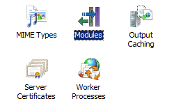

Global Modules &lt;globalModules&gt;
====================

## Overview

The `<globalModules>` element defines the global-level modules installed on an IIS 7 server. The `<globalModules>` element is only available at the server level, so when you install modules, IIS only updates the ApplicationHost.config file. You must be an administrator on the server to install native modules.

IIS 7 implements most of its request processing through native modules. When you install an IIS 7 role service or feature using the Service Manager, the IIS installer adds an entry to the `<globalModules>` element for that module. For example, when you install the Basic authentication role service on your IIS 7 server, the installer adds a **BasicAuthenticationModule** entry to the `<globalModules>` element.

When you install a third-party module, you must add an entry to the `<globalModules>` element for that module. You can do this by using the IIS Manager, by manually editing the ApplicationHost.config file, or by using the AppCmd.exe command-line tool.

To enable a module in an application, you must edit the application's `<module>` element.

## Compatibility

| Version | Notes |
| --- | --- |
| IIS 10.0 | The `<globalModules>` element was not modified in IIS 10.0. |
| IIS 8.5 | The `<globalModules>` element was not modified in IIS 8.5. |
| IIS 8.0 | The `<globalModules>` element was not modified in IIS 8.0. |
| IIS 7.5 | The `<globalModules>` element was not modified in IIS 7.5. |
| IIS 7.0 | The `<globalModules>` element was introduced in IIS 7.0. |
| IIS 6.0 | N/A |

## Setup

The `<globalModules>` element is included in the default installation of IIS 7.

## How To

### How to install a native module

1. Open **Internet Information Services (IIS) Manager**: 

    - If you are using Windows Server 2012 or Windows Server 2012 R2: 

        - On the taskbar, click **Server Manager**, click **Tools**, and then click **Internet Information Services (IIS) Manager**.
    - If you are using Windows 8 or Windows 8.1: 

        - Hold down the **Windows** key, press the letter **X**, and then click **Control Panel**.
        - Click **Administrative Tools**, and then double-click **Internet Information Services (IIS) Manager**.
    - If you are using Windows Server 2008 or Windows Server 2008 R2: 

        - On the taskbar, click **Start**, point to **Administrative Tools**, and then click **Internet Information Services (IIS) Manager**.
    - If you are using Windows Vista or Windows 7: 

        - On the taskbar, click **Start**, and then click **Control Panel**.
        - Double-click **Administrative Tools**, and then double-click **Internet Information Services (IIS) Manager**.
2. In the **Connections** pane, click the server connection to which you want to add the native module.
3. On the server Home page, double-click **Modules**.  
    
4. In the **Actions** pane, click **Configure Native Modules...**
5. In the **Configure Native Modules** dialog box, click **Register...**  
    
6. In the **Register Native Module** dialog box, in the **Name** box, type a name for the native module.
7. In the **Path** box, type the file system path of the location of the .dll file or click the **Browse** button  
    
8. In the **Configure Native Modules** dialog box, select the option for the native module that you just registered, click **OK**, and then click **OK** again. This enables the native module to run and makes it available to sites and applications on your Web server.  
  
    > [!NOTE]
    > If you do not want to enable the native module to run, clear the option for the native module, and then click     **OK** .
9. Optionally, you can lock the native module if you do not want it to be overridden at lower levels in the configuration system. On the **Modules** page, select the module, and then click **Lock** in the **Actions** pane.

### How to enable a native module

1. Open **Internet Information Services (IIS) Manager**: 

    - If you are using Windows Server 2012 or Windows Server 2012 R2: 

        - On the taskbar, click **Server Manager**, click **Tools**, and then click **Internet Information Services (IIS) Manager**.
    - If you are using Windows 8 or Windows 8.1: 

        - Hold down the **Windows** key, press the letter **X**, and then click **Control Panel**.
        - Click **Administrative Tools**, and then double-click **Internet Information Services (IIS) Manager**.
    - If you are using Windows Server 2008 or Windows Server 2008 R2: 

        - On the taskbar, click **Start**, point to **Administrative Tools**, and then click **Internet Information Services (IIS) Manager**.
    - If you are using Windows Vista or Windows 7: 

        - On the taskbar, click **Start**, and then click **Control Panel**.
        - Double-click **Administrative Tools**, and then double-click **Internet Information Services (IIS) Manager**.
2. Navigate to the server, site, or application level that you want to manage.
3. On the server, site, or application Home page, double-click **Modules**.
4. In the **Actions** pane, click **Configure Native Modules...**
5. In the **Configure Native Modules** dialog box, select the option for the native module that you want to enable, and then click **OK**.  
    

## Configuration

The `<globalModules>` element contains a collection of `<add>` elements. Each element in the collection configures a global module for the server.

### Attributes

None.

### Child Elements

| Element | Description |
| --- | --- |
| [`add`](../system.webserver/globalmodules/add.md) | Optional element. Adds a native module to the collection of global modules. |
| `clear` | Optional element. Removes all references to native modules from the global modules collection. |
| `remove` | Optional element. Removes a reference to a specific native module from the global modules collection. |

### Configuration Sample

The following example shows an IIS 7 `<globalModules>` section that contains entries for all modules included in the minimal installation of the Web server. It also includes an entry for the **BasicAuthenticationModule** and another for the **ImageCopyrightModule** third-party module.

[!code-xml[Main](index/samples/sample1.xml)]

## Sample Code

The following examples install a native module named ImageCopyrightModule on IIS 7 and automatically enable it on the entire server.

### AppCmd.exe

[!code-console[Main](index/samples/sample2.cmd)]

You can also use the following syntax:

[!code-console[Main](index/samples/sample3.cmd)]

> [!NOTE]
> You must be sure to set the **commit** parameter to `apphost` when you use AppCmd.exe to configure these settings. This commits the configuration settings to the appropriate location section in the ApplicationHost.config file.

### C#

[!code-csharp[Main](index/samples/sample4.cs)]

### VB.NET

[!code-vb[Main](index/samples/sample5.vb)]

### JavaScript

[!code-javascript[Main](index/samples/sample6.js)]

### VBScript

[!code-vb[Main](index/samples/sample7.vb)]