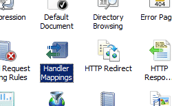

Handlers &lt;handlers&gt;
====================

## Overview

The `<handlers>` element defines the handlers registered for a specific file name extension or URL.

Handlers are Internet Information Services (IIS) components that are configured to process requests to specific content, typically to generate a response for the request resource. For example, an ASP.NET Web page is one type of handler. You can use handlers to process requests to any resource that needs to return information to users that is not a static file. IIS provides several different handler types to support static files, Common Gateway Interface (CGI) applications, FastCGI applications, and Internet Server API (ISAPI) extensions. ASP.NET also provides support for additional handler types through the HTTP handler interface.

Developers can create custom handlers to perform special handling that you can identify using file name extensions in your application. For example, if a developer created a handler that created RSS-formatted XML, you could bind the .rss file name extension in your application to the custom handler. Developers can also create handlers that map to a specific file and can implement these handlers as native modules or as implementations of the ASP.NET **IHttpHandler** interface. 

## Compatibility

| Version | Notes |
| --- | --- |
| IIS 10.0 | The `<handlers>` element was not modified in IIS 10.0. |
| IIS 8.5 | The `<handlers>` element was not modified in IIS 8.5. |
| IIS 8.0 | The `<handlers>` element was not modified in IIS 8.0. |
| IIS 7.5 | The `<handlers>` element was not modified in IIS 7.5. |
| IIS 7.0 | The `<handlers>` element was introduced in IIS 7.0. |
| IIS 6.0 | N/A |

## Setup

The `<handlers>` element is included in the default installation of IIS 7.

## How To

### How create a handler mapping for an ASP.NET handler in an IIS 7 application running in Integrated mode

1. Open **Internet Information Services (IIS) Manager**: 

    - If you are using Windows Server 2012 or Windows Server 2012 R2: 

        - On the taskbar, click **Server Manager**, click **Tools**, and then click **Internet Information Services (IIS) Manager**.
    - If you are using Windows 8 or Windows 8.1: 

        - Hold down the **Windows** key, press the letter **X**, and then click **Control Panel**.
        - Click **Administrative Tools**, and then double-click **Internet Information Services (IIS) Manager**.
    - If you are using Windows Server 2008 or Windows Server 2008 R2: 

        - On the taskbar, click **Start**, point to **Administrative Tools**, and then click **Internet Information Services (IIS) Manager**.
    - If you are using Windows Vista or Windows 7: 

        - On the taskbar, click **Start**, and then click **Control Panel**.
        - Double-click **Administrative Tools**, and then double-click **Internet Information Services (IIS) Manager**.
2. In the **Connections** pane, click the server connection that you want to add the native module to.
3. In the **Home** pane, double-click **Handler Mappings**.  
    
4. On the **Actions** pane, click **Add Managed Handler...**
5. In the **Add Managed Handler** dialog box, specify the following:

    - **Request Path**. The file name or file name extension to map.
    - **Type**. The type (class) name of the managed handler. If the handler is defined in the app\_code or bin folders of the application, its type name will appear in the drop-down list.
    - **Name**. A descriptive name.
  
    
6. Click **OK** to close the **Add Managed Handler** dialog box.

### How to create a FastCGI handler mapping

1. Open **Internet Information Services (IIS) Manager**: 

    - If you are using Windows Server 2012 or Windows Server 2012 R2: 

        - On the taskbar, click **Server Manager**, click **Tools**, and then click **Internet Information Services (IIS) Manager**.
    - If you are using Windows 8 or Windows 8.1: 

        - Hold down the **Windows** key, press the letter **X**, and then click **Control Panel**.
        - Click **Administrative Tools**, and then double-click **Internet Information Services (IIS) Manager**.
    - If you are using Windows Server 2008 or Windows Server 2008 R2: 

        - On the taskbar, click **Start**, point to **Administrative Tools**, and then click **Internet Information Services (IIS) Manager**.
    - If you are using Windows Vista or Windows 7: 

        - On the taskbar, click **Start**, and then click **Control Panel**.
        - Double-click **Administrative Tools**, and then double-click **Internet Information Services (IIS) Manager**.
2. In the **Connections** pane, click the server name for which you want to configure FastCGI handler mappings.
3. In the **Home** pane, double-click **Handler Mappings**.  
    
4. In the **Actions** pane, click **Add Module Mapping...**  
  
    > [!NOTE]
    > For the next steps to work, you must have already installed binaries that will execute the file path or file name extension that you specify. This example uses a PHP implementation available from the Microsoft Web site.
5. Type the file name extension, such as.php in the **Request path** box, click **FastCGIModule** in the **Module** drop-down list, type the path to the scripting engine (in this example, PHP-CGI.exe) in the **Executable** box, and then click **OK**.  
    
6. On the **Add Module Mapping** dialog box, click **Yes**.  
    

## Configuration

The `<handlers>` element contains a collection of `<add>` elements, each of which defines a handler mapping for the application. The `<add>` element contains the name of the handler, the file name extension or URL path mask that the handler is mapped to, and the module name or ASP.NET HTTP handler type that specifies the handler implementation, among other settings.

You configure the `<handlers>` element at the application level in the Web.config file.

### Attributes

| Attribute | Description |
| --- | --- |
| `accessPolicy` | Optional flags attribute. Specifies the allowed access types for the entire handlers collection. The **accessPolicy** attribute can be one of the following possible values. The default is `Read`. | Value | Description | | --- | --- | | `Execute` | Enables handlers in the handlers collection that require execute rights in directories and files. | | `None` | Disables all handlers in the handlers collection that require access to directories or files. | | `NoRemoteExecute` | Prevents handlers in the handlers collection from running executables when a handler receives a remote request. | | `NoRemoteRead` | Prevents handlers in the handlers collection from reading files when a handler receives a remote request. | | `NoRemoteScript` | Prevents handlers in the handlers collection from running scripts when a handler receives a remote request. | | `NoRemoteWrite` | Prevents handlers in the handlers collection from creating or changing files when a handler receives a remote request. | | `Read` | Enables handlers in the handlers collection that require read access to directories and files. | | `Script` | Enables handlers in the handlers collection that require script rights to directories or files. | | `Source` | Enables handlers in the handlers collection that require read access to source code (together with the **Read** flag) or write access to source code (together with the **Write** flag). | | `Write` | Enables handlers in the handlers collection that require write access to directories and files. | |

### Child Elements

| Element | Description |
| --- | --- |
| [`add`](add.md) | Optional element. Adds a handler to the collection of handlers. |
| `clear` | Optional element. Removes all references to handlers from the handlers collection. |
| `remove` | Optional element. Removes a reference to a handler from the handlers collection. |

### Configuration Sample

The following example contains two `<add>` elements that define handler mappings. The first `<add>` element defines a SampleHandler handler for a Web application running in IIS 7 Integrated mode. If you add the handler assembly to the app\_code directory for the Web application, you do not need to include the assembly name in the value for the **type** attribute. The second `<add>` element defines a mapping for PHP requests that use the FastCGI module.

[!code-xml[Main](index/samples/sample1.xml)]

## Sample Code

The following examples add a FastCGI mapping for a PHP module, then add a handler on the Contoso Web site that will process PHP requests.

### AppCmd.exe

[!code-console[Main](index/samples/sample2.cmd)]

> [!NOTE]
> This second example shows how to add a new ASP.NET handler mapping named SampleHandler.new for a specific URL to a Web application.

[!code-console[Main](index/samples/sample3.cmd)]

### C#

[!code-csharp[Main](index/samples/sample4.cs)]

### VB.NET

[!code-vb[Main](index/samples/sample5.vb)]

### JavaScript

[!code-javascript[Main](index/samples/sample6.js)]

### VBScript

[!code-vb[Main](index/samples/sample7.vb)]