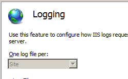

HTTP Logging <httpLogging>
====================

## Overview

The `<httpLogging>` element allows you to configure IIS to generate log entries for only successful requests, failed requests, or both. After you configure logging for each Web site at the server level, you can use this element to enable selective logging for individual URLs. By default, HTTP logging is enabled for all requests on Internet Information Services (IIS) 7.

You can view the log file for a site at any time to see which requests are failing and which requests are succeeding. When you no longer want IIS to log certain requests for a site, disable logging for that site.

## Compatibility

| Version | Notes |
| --- | --- |
| IIS 10.0 | The `<httpLogging>` element was not modified in IIS 10.0. |
| IIS 8.5 | The `<httpLogging>` element was not modified in IIS 8.5. |
| IIS 8.0 | The `<httpLogging>` element was not modified in IIS 8.0. |
| IIS 7.5 | The `<httpLogging>` element was not modified in IIS 7.5. |
| IIS 7.0 | The `<httpLogging>` element was introduced in IIS 7.0. |
| IIS 6.0 | The `<httpLogging>` element and the `<logFile>` element replace the logging properties on the IIS 6.0 **IIsWebService** metabase object. |

## Setup

The `<httpLogging>` element is included in the default installation of IIS 7.

## How To

### How to enable HTTP logging for a site or application

1. Open **Internet Information Services (IIS) Manager**: 

    - If you are using Windows Server 2012 or Windows Server 2012 R2: 

        - On the taskbar, click **Server Manager**, click **Tools**, and then click **Internet Information Services (IIS) Manager**.
    - If you are using Windows 8 or Windows 8.1: 

        - Hold down the **Windows** key, press the letter **X**, and then click **Control Panel**.
        - Click **Administrative Tools**, and then double-click **Internet Information Services (IIS) Manager**.
    - If you are using Windows Server 2008 or Windows Server 2008 R2: 

        - On the taskbar, click **Start**, point to **Administrative Tools**, and then click **Internet Information Services (IIS) Manager**.
    - If you are using Windows Vista or Windows 7: 

        - On the taskbar, click **Start**, and then click **Control Panel**.
        - Double-click **Administrative Tools**, and then double-click **Internet Information Services (IIS) Manager**.
2. In the **Connections** pane, expand the server name, expand **Sites**, and then navigate to the Web site or application for which you want to configure HTTP logging.
3. In the **Home** pane, double-click **Logging**.
4. In the **Actions** pane, click **Enable** to enable logging.  
    
5. Select the log file format you want to use for your site or application in the **Format** drop-down list, and, if you want to change the default location where IIS stores log files, type the path where you want to store the log files for the site or application in the **Directory** box.
6. (Optional) If you selected **W3C** in the **Format** drop-down list in step 5, click **Select Fields**.
7. (Optional) In the **W3C Logging Fields** dialog box, select the W3C fields you want to log, clear any W3C fields you do not want to log, and then click **OK**.  
    
8. In the **Actions** pane, click **Apply**.  
    

## Configuration

You can configure the `<httpLogging>` element at the server level in the ApplicationHost.config file and at the site, application, or URL level in the appropriate Web.config file.

### Attributes

| Attribute | Description |
| --- | --- |
| `dontLog` | Optional Boolean attribute. Specifies whether HTTP logging is enabled for successful requests. A request is considered successful if its status code is less than 400. The default value is `false`. |
| `selectiveLogging` | Optional enum attribute. Specifies which type of requests to log. The **selectiveLogging** attribute can be one of the following possible values. The default value is `LogAll`. | Value | Description | | --- | --- | | `LogAll` | Logs all requests. The numeric value is `0`. | | `LogSuccessful` | Logs only successful requests. The HTTP status code range for successful requests is 100-399. The numeric value is `1`. | | `LogError` | Logs only unsuccessful requests. The HTTP status code range for unsuccessful requests is 400-999. The numeric value is `2`. | |

### Child Elements

None.

### Configuration Sample

The following configuration example, when included in a Web.config file for a site or application, configures HTTP logging and specifies that IIS should only log requests that generate errors.

[!code-xml[Main](httpLogging/samples/sample1.xml)]

## Sample Code

The following examples enable HTTP logging for a Web site named Contoso, and specify that IIS should log all requests.

### AppCmd.exe

[!code-console[Main](httpLogging/samples/sample2.cmd)]

> [!NOTE]
> You must be sure to set the **commit** parameter to `apphost` when you use AppCmd.exe to configure these settings. This commits the configuration settings to the appropriate location section in the ApplicationHost.config file.

### C#

[!code-csharp[Main](httpLogging/samples/sample3.cs)]

### VB.NET

[!code-vb[Main](httpLogging/samples/sample4.vb)]

### JavaScript

[!code-javascript[Main](httpLogging/samples/sample5.js)]

### VBScript

[!code-vb[Main](httpLogging/samples/sample6.vb)]