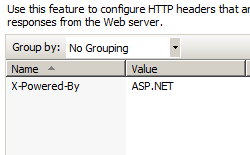

Custom Headers &lt;customHeaders&gt;
====================

## Overview

The `<customHeaders>` element of the `<httpProtocol>` element specifies custom HTTP headers that Internet Information Services (IIS) 7 will return in HTTP responses from the Web server.

> [!NOTE]
> HTTP headers are name and value pairs that are returned in responses from a Web server. Custom response headers are sent to the client together with the default HTTP header. Unlike redirect response headers, which are returned in responses only when redirection occurs, custom response headers are returned in every response.

## Compatibility

| Version | Notes |
| --- | --- |
| IIS 10.0 | The `<customHeaders>` element was not modified in IIS 10.0. |
| IIS 8.5 | The `<customHeaders>` element was not modified in IIS 8.5. |
| IIS 8.0 | The `<customHeaders>` element was not modified in IIS 8.0. |
| IIS 7.5 | The `<customHeaders>` element was not modified in IIS 7.5. |
| IIS 7.0 | The `<customHeaders>` element of the `<httpProtocol>` element was introduced in IIS 7.0. |
| IIS 6.0 | The `<customHeaders>` element replaces the IIS 6.0 **HttpCustomHeaders** metabase object. |

## Setup

The `<customHeaders>` element of the `<httpProtocol>` element is included in the default installation of IIS 7.

## How To

### How to set custom HTTP headers for a Web site or application

1. Open **Internet Information Services (IIS) Manager**: 

    - If you are using Windows Server 2012 or Windows Server 2012 R2: 

        - On the taskbar, click **Server Manager**, click **Tools**, and then click **Internet Information Services (IIS) Manager**.
    - If you are using Windows 8 or Windows 8.1: 

        - Hold down the **Windows** key, press the letter **X**, and then click **Control Panel**.
        - Click **Administrative Tools**, and then double-click **Internet Information Services (IIS) Manager**.
    - If you are using Windows Server 2008 or Windows Server 2008 R2: 

        - On the taskbar, click **Start**, point to **Administrative Tools**, and then click **Internet Information Services (IIS) Manager**.
    - If you are using Windows Vista or Windows 7: 

        - On the taskbar, click **Start**, and then click **Control Panel**.
        - Double-click **Administrative Tools**, and then double-click **Internet Information Services (IIS) Manager**.
2. In the **Connections** pane, go to the site, application, or directory for which you want to set a custom HTTP header.
3. In the **Home** pane, double-click **HTTP Response Headers**.  
    
4. In the **HTTP Response Headers** pane, click **Add...** in the **Actions** pane.  
    
5. In the **Add Custom HTTP Response Header** dialog box, set the name and value for your custom header, and then click **OK**.  
    

## Configuration

### Attributes

None.

### Child Elements

| Element | Description |
| --- | --- |
| [`add`](add.md) | Optional element.  Adds a custom response header to the `<customHeaders>` collection. |
| `clear` | Optional element.  Removes all references to custom response headers from the `<customHeaders>` collection. |
| `remove` | Optional element.  Removes a reference to a custom response header from the `<customHeaders>` collection. |

### Configuration Sample

The following configuration sample sets a custom HTTP header and value.

[!code-xml[Main](index/samples/sample1.xml)]

> [!NOTE]
> The following default `<httpProtocol>` element is configured in the ApplicationHost.config file in IIS 7.

[!code-xml[Main](index/samples/sample2.xml)]

## Sample Code

The following code samples set a custom HTTP header and value.

### AppCmd.exe

[!code-console[Main](index/samples/sample3.cmd)]

### C#

[!code-csharp[Main](index/samples/sample4.cs)]

### VB.NET

[!code-vb[Main](index/samples/sample5.vb)]

### JavaScript

[!code-javascript[Main](index/samples/sample6.js)]

### VBScript

[!code-vb[Main](index/samples/sample7.vb)]