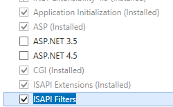
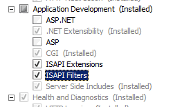

ISAPI Filters &lt;isapiFilters&gt;
====================

## Overview

The `<isapiFilters>` element allows you to manage ISAPI filters on your Internet Information Services (IIS) 7 server. You can add an ISAPI filter when you want to enhance Web server functionality. For example, you might have an ISAPI filter that captures information about HTTP requests and saves the information to a database.

> [!NOTE]
> Although IIS 7 supports ISAPI filters, Microsoft recommends that you extend Web server functionality by using modules instead of by using ISAPI filters.

The `<isapiFilters>` element can contain one or more `<filter>` elements, each of which defines an ISAPI filter enabled for your server or Web site. It can also contain a `<remove>` element, which you can use to remove a specific ISAPI filter inherited from higher in the configuration hierarchy. The `<isapiFilters>` element can also contain a `<clear>` element, which removes all ISAPI filters inherited from higher in the configuration hierarchy.

## Compatibility

| Version | Notes |
| --- | --- |
| IIS 10.0 | The `<isapiFilters>` element was not modified in IIS 10.0. |
| IIS 8.5 | The `<isapiFilters>` element was not modified in IIS 8.5. |
| IIS 8.0 | The `<isapiFilters>` element was not modified in IIS 8.0. |
| IIS 7.5 | The `<isapiFilters>` element was not modified in IIS 7.5. |
| IIS 7.0 | The `<isapiFilters>` element was introduced in IIS 7.0. |
| IIS 6.0 | The `<isapiFilters>` element replaces the IIS 6.0 **FilterEnableCache** and **FilterPath** metabase properties. |

## Setup

To use the `<isapiFilters>` element, you must install the ISAPI Filters module on your IIS 7 and later server. To do so, use the following steps.

### Windows Server 2012 or Windows Server 2012 R2

1. On the taskbar, click **Server Manager**.
2. In **Server Manager**, click the **Manage** menu, and then click **Add Roles and Features**.
3. In the **Add Roles and Features** wizard, click **Next**. Select the installation type and click **Next**. Select the destination server and click **Next**.
4. On the **Server Roles** page, expand **Web Server (IIS)**, expand **Web Server**, expand **Application Development**, and then select **ISAPI Filters**. Click **Next**.  
     .
5. On the **Select features** page, click **Next**.
6. On the **Confirm installation selections** page, click **Install**.
7. On the **Results** page, click **Close**.

### Windows 8 or Windows 8.1

1. On the **Start** screen, move the pointer all the way to the lower left corner, right-click the **Start** button, and then click **Control Panel**.
2. In **Control Panel**, click **Programs and Features**, and then click **Turn Windows features on or off**.
3. Expand **Internet Information Services**, expand **World Wide Web Services**, expand **Application Development Features**, and then select **ISAPI Filters**.  
    
4. Click **OK**.
5. Click **Close**.

### Windows Server 2008 or Windows Server 2008 R2

1. On the taskbar, click **Start**, point to **Administrative Tools**, and then click **Server Manager**.
2. In the **Server Manager** hierarchy pane, expand **Roles**, and then click **Web Server (IIS)**.
3. In the **Web Server (IIS)** pane, scroll to the **Role Services** section, and then click **Add Role Services**.
4. On the **Select Role Services** page of the **Add Role Services Wizard**, select **ISAPI Filters**, and then click **Next**.  
    
5. On the **Confirm Installation Selections** page, click **Install**.
6. On the **Results** page, click **Close**.

### Windows Vista or Windows 7

1. On the taskbar, click **Start**, and then click **Control Panel**.
2. In **Control Panel**, click **Programs and Features**, and then click **Turn Windows Features on or off**.
3. In the **Windows Features** dialog box, expand **Internet Information Services**, then **World Wide Web Services**, then **Application Development Features**.  
    
4. Select **ISAPI Filters**, and then click **OK**.
 

## How To

### How to add an ISAPI filter

1. Open **Internet Information Services (IIS) Manager**: 

    - If you are using Windows Server 2012 or Windows Server 2012 R2: 

        - On the taskbar, click **Server Manager**, click **Tools**, and then click **Internet Information Services (IIS) Manager**.
    - If you are using Windows 8 or Windows 8.1: 

        - Hold down the **Windows** key, press the letter **X**, and then click **Control Panel**.
        - Click **Administrative Tools**, and then double-click **Internet Information Services (IIS) Manager**.
    - If you are using Windows Server 2008 or Windows Server 2008 R2: 

        - On the taskbar, click **Start**, point to **Administrative Tools**, and then click **Internet Information Services (IIS) Manager**.
    - If you are using Windows Vista or Windows 7: 

        - On the taskbar, click **Start**, and then click **Control Panel**.
        - Double-click **Administrative Tools**, and then double-click **Internet Information Services (IIS) Manager**.
2. In the **Connections** pane, go to the connection or site for which you want to configure ISAPI filters.
3. In the **Home** pane, double-click **ISAPI Filters**.  
    
4. In the **Actions** pane, click **Add...**
5. In the **Filter name** text box of the **Add ISAPI Filter** dialog box, type a friendly name for the ISAPI filter.
6. In the **Executable** box, type the file system path of the location of ISAPI filter file or click the ellipsis (**...**) to navigate to the folder that contains the ISAPI filter file, and then click **OK**.  
    
 

## Configuration

You can add an ISAPI filter at the server level and the site level. If you add the ISAPI filter at the server level, the filter intercepts all requests made to the server. If you add the ISAPI filter to a specific site, the filter intercepts all requests made to that site.

You can configure the `<isapiFilters>` element at the server level in the ApplicationHost.config file or at the site level in the appropriate Web.config file.

### Attributes

None.

### Child Elements

| Element | Description |
| --- | --- |
| `clear` | Optional element. Removes all references to ISAPI filters from the ISAPI filters collection. |
| [`filter`](https://www.iis.net/configreference/system.webserver/isapifilters/filter) | Optional element. Adds an ISAPI filter to the ISAPI filters collection. |
| `remove` | Optional element. Removes a reference to an ISAPI filter from the ISAPI filters collection. |

### Configuration Sample

The following configuration example adds an ISAPI filter named SalesQueryIsapi to a Web site or application. The sample names and enables the ISAPI filter with the **name** and **enabled** attributes. It also uses the **enableCache** attribute to disable HTTP.sys caching and the **path** attribute to specify the location of the ISAPI DLL.

[!code-xml[Main](index/samples/sample1.xml)]
 

## Sample Code

The following examples configure an ISAPI filter named SalesQueryIsapi on the server. Each of the examples use the **name** property to specify a name for the ISAPI filter, the **enableCache** property to disable HTTP.sys caching, and the **path** property to specify the location of the ISAPI DLL.

### AppCmd.exe

[!code-console[Main](index/samples/sample2.cmd)]

> [!NOTE]
> You must be sure to set the **commit** parameter to `apphost` when you use AppCmd.exe to configure these settings. This commits the configuration settings to the appropriate location section in the ApplicationHost.config file.

### C#

[!code-csharp[Main](index/samples/sample3.cs)]

### VB.NET

[!code-vb[Main](index/samples/sample4.vb)]

### JavaScript

[!code-javascript[Main](index/samples/sample5.js)]

### VBScript

[!code-vb[Main](index/samples/sample6.vb)]