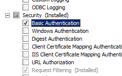
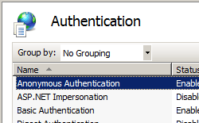

Basic Authentication <basicAuthentication>
====================

## Overview

The `<basicAuthentication>` element contains configuration settings for the Internet Information Services (IIS) 7 Basic authentication module. You configure this element to enable or disable Basic authentication, identify the realm and default logon domain, and determine the logon method the module uses.

The Basic authentication scheme is a widely used, industry-standard method for collecting user name and password information. Basic authentication transmits user names and passwords across the network in an unencrypted form. You can use SSL encryption in combination with Basic authentication to help secure user account information transmitted across the Internet or a corporate network.

## Compatibility

| Version | Notes |
| --- | --- |
| IIS 10.0 | The `<basicAuthentication>` element was not modified in IIS 10.0. |
| IIS 8.5 | The `<basicAuthentication>` element was not modified in IIS 8.5. |
| IIS 8.0 | The `<basicAuthentication>` element was not modified in IIS 8.0. |
| IIS 7.5 | The `<basicAuthentication>` element was not modified in IIS 7.5. |
| IIS 7.0 | The `<basicAuthentication>` element was introduced in IIS 7.0. |
| IIS 6.0 | The `<basicAuthentication>` element replaces portions of the IIS 6.0 **AuthType** and **AuthFlags** metabase properties. |

## Setup

The default installation of IIS 7 and later does not include the Basic authentication role service. To use Basic authentication on Internet Information Services (IIS), you must install the role service, disable Anonymous authentication for your Web site or application, and then enable Basic authentication for the site or application.

To install the Basic authentication role service, use the following steps.

### Windows Server 2012 or Windows Server 2012 R2

1. On the taskbar, click **Server Manager**.
2. In **Server Manager**, click the **Manage** menu, and then click **Add Roles and Features**.
3. In the **Add Roles and Features** wizard, click **Next**. Select the installation type and click **Next**. Select the destination server and click **Next**.
4. On the **Server Roles** page, expand **Web Server (IIS)**, expand **Web Server**, expand **Security**, and then select **Basic Authentication**. Click **Next**.  
     .
5. On the **Select features** page, click **Next**.
6. On the **Confirm installation selections** page, click **Install**.
7. On the **Results** page, click **Close**.

### Windows 8 or Windows 8.1

1. On the **Start** screen, move the pointer all the way to the lower left corner, right-click the **Start** button, and then click **Control Panel**.
2. In **Control Panel**, click **Programs and Features**, and then click **Turn Windows features on or off**.
3. Expand **Internet Information Services**, expand **World Wide Web Services**, expand **Security**, and then select **Basic Authentication**.  
    
4. Click **OK**.
5. Click **Close**.

### Windows Server 2008 or Windows Server 2008 R2

1. On the taskbar, click **Start**, point to **Administrative Tools**, and then click **Server Manager**.
2. In the **Server Manager** hierarchy pane, expand **Roles**, and then click **Web Server (IIS)**.
3. In the **Web Server (IIS)** pane, scroll to the **Role Services** section, and then click **Add Role Services**.
4. On the **Select Role Services** page of the **Add Role Services Wizard**, select **Basic Authentication**, and then click **Next**. 
5. On the **Confirm Installation Selections** page, click **Install**.
6. On the **Results** page, click **Close**.

### Windows Vista or Windows 7

1. On the taskbar, click **Start**, and then click **Control Panel**.
2. In **Control Panel**, click **Programs and Features**, and then click **Turn Windows Features on or off**.
3. Expand **Internet Information Services**, expand **World Wide Web Services**, expand **Security**, select **Basic Authentication**, and then click **OK**.   
    

## How To

### How to enable basic authentication and disable anonymous authentication

1. Open **Internet Information Services (IIS) Manager**: 

    - If you are using Windows Server 2012 or Windows Server 2012 R2: 

        - On the taskbar, click **Server Manager**, click **Tools**, and then click **Internet Information Services (IIS) Manager**.
    - If you are using Windows 8 or Windows 8.1: 

        - Hold down the **Windows** key, press the letter **X**, and then click **Control Panel**.
        - Click **Administrative Tools**, and then double-click **Internet Information Services (IIS) Manager**.
    - If you are using Windows Server 2008 or Windows Server 2008 R2: 

        - On the taskbar, click **Start**, point to **Administrative Tools**, and then click **Internet Information Services (IIS) Manager**.
    - If you are using Windows Vista or Windows 7: 

        - On the taskbar, click **Start**, and then click **Control Panel**.
        - Double-click **Administrative Tools**, and then double-click **Internet Information Services (IIS) Manager**.
2. In the **Connections** pane, expand the server name, expand **Sites**, and then click the site, application or Web service for which you want to enable basic authentication.
3. Scroll to the **Security** section in the **Home** pane, and then double-click **Authentication**.
4. In the **Authentication** pane, select **Basic Authentication**, and then, in the **Actions** pane, click **Enable**.
5. In the **Authentication** pane, select **Anonymous Authentication**, and then click **Disable** in the **Actions** pane.  
    

## Configuration

The `<basicAuthentication>` element is configurable at the site, application, virtual directory, and URL level. After you install the role service, IIS 7 commits the following configuration settings to the ApplicationHost.config file.

[!code-xml[Main](basicAuthentication/samples/sample1.xml)]

### Attributes

| Attribute | Description |
| --- | --- |
| `defaultLogonDomain` | Optional String attribute. Specifies the default logon domain for Basic authentication. |
| `enabled` | Optional Boolean attribute. Specifies whether Basic authentication is enabled. The default value is `false`. |
| `logonMethod` | Optional enum attribute. The **logonMethod** attribute can be one of the following possible values. The default is `ClearText`. | Value | Description | | --- | --- | | `Batch` | This logon type is intended for batch servers, where processes may be executing on behalf of a user without that user's direct intervention. The numeric value is `1`. | | `ClearText` | This logon type preserves the name and password in the authentication package, which allows the server to make connections to other network servers while impersonating the client. The numeric value is `3`. | | `Interactive` | This logon type is intended for users who will be using the computer interactively. The numeric value is `0`. | | `Network` | This logon type is intended for high performance servers to authenticate plaintext passwords. Credentials are not cached for this logon type. The numeric value is `2`. | |
| `realm` | Optional String attribute. Specifies the realm for Basic authentication. |

### Child Elements

None.

### Configuration Sample

The following configuration sample enables Basic authentication for a Web site, Web application, or Web service. By default these settings must be included in your ApplicationHost.config file, and you must include them in a `<location>` element and use the **path** attribute to define the Web site or application where you want to apply the authentication settings.

[!code-xml[Main](basicAuthentication/samples/sample2.xml)]

## Sample Code

The following examples enable Basic authentication for a site.

### AppCmd.exe

[!code-console[Main](basicAuthentication/samples/sample3.cmd)]

> [!NOTE]
> You must be sure to set the **commit** parameter to `apphost` when you use AppCmd.exe to configure these settings. This commits the configuration settings to the appropriate location section in the ApplicationHost.config file.

### C#

[!code-csharp[Main](basicAuthentication/samples/sample4.cs)]

### VB.NET

[!code-vb[Main](basicAuthentication/samples/sample5.vb)]

### JavaScript

[!code-javascript[Main](basicAuthentication/samples/sample6.js)]

### VBScript

[!code-vb[Main](basicAuthentication/samples/sample7.vb)]