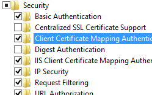
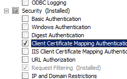
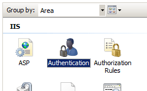

Client Certificate Mapping Authentication &lt;clientCertificateMappingAuthentication&gt;
====================

## Overview

`<clientCertificateMappingAuthentication>` element of the `<authentication>` element specifies whether client certificate mapping using Active Directory is enabled for Internet Information Services (IIS) 7.

> [!NOTE]
> Client Certificate Mapping authentication using Active Directory differs from [Client Certificate Mapping authentication using IIS](iisclientcertificatemappingauthentication/index.md) in the following ways:

- **Client Certificate Mapping authentication using Active Directory** - this method of authentication requires that the IIS 7 server is a member of an Active Directory domain, and user accounts are stored in Active Directory. This method of client certificate authentication has reduced performance due to the round-trip to the Active Directory server.
- **IIS Client Certificate Mapping authentication** - this method of authentication does not require Active Directory and therefore works with standalone servers. This method of client certificate authentication has increased performance, but required more configuration and requires access to client certificates in order to create mappings.

For more information, see [Configuring Authentication in IIS 7.0](https://go.microsoft.com/fwlink/?LinkId=64325) on the Microsoft TechNet Web site.

## Compatibility

| Version | Notes |
| --- | --- |
| IIS 10.0 | The `<clientCertificateMappingAuthentication>` element was not modified in IIS 10.0. |
| IIS 8.5 | The `<clientCertificateMappingAuthentication>` element was not modified in IIS 8.5. |
| IIS 8.0 | The `<clientCertificateMappingAuthentication>` element was not modified in IIS 8.0. |
| IIS 7.5 | The `<clientCertificateMappingAuthentication>` element was not modified in IIS 7.5. |
| IIS 7.0 | The `<clientCertificateMappingAuthentication>` element of the `<authentication>` element was introduced in IIS 7.0. |
| IIS 6.0 | N/A |

## Setup

The `<clientCertificateMappingAuthentication>` element is not available on the default installation of IIS 7 and later. To install it, use the following steps.

### Windows Server 2012 or Windows Server 2012 R2

1. On the taskbar, click **Server Manager**.
2. In **Server Manager**, click the **Manage** menu, and then click **Add Roles and Features**.
3. In the **Add Roles and Features** wizard, click **Next**. Select the installation type and click **Next**. Select the destination server and click **Next**.
4. On the **Server Roles** page, expand **Web Server (IIS)**, expand **Web Server**, expand **Security**, and then select **Client Certificate Mapping Authentication**. Click **Next**.  
     .
5. On the **Select features** page, click **Next**.
6. On the **Confirm installation selections** page, click **Install**.
7. On the **Results** page, click **Close**.

### Windows 8 or Windows 8.1

1. On the **Start** screen, move the pointer all the way to the lower left corner, right-click the **Start** button, and then click **Control Panel**.
2. In **Control Panel**, click **Programs and Features**, and then click **Turn Windows features on or off**.
3. Expand **Internet Information Services**, expand **World Wide Web Services**, expand **Security**, and then select **Client Certificate Mapping Authentication**.  
    
4. Click **OK**.
5. Click **Close**.

### Windows Server 2008 or Windows Server 2008 R2

1. On the taskbar, click **Start**, point to **Administrative Tools**, and then click **Server Manager**.
2. In the **Server Manager** hierarchy pane, expand **Roles**, and then click **Web Server (IIS)**.
3. In the **Web Server (IIS)** pane, scroll to the **Role Services** section, and then click **Add Role Services**.
4. On the **Select Role Services** page of the **Add Role Services Wizard**, select **Client Certificate Mapping Authentication**, and then click **Next**.  
    
5. On the **Confirm Installation Selections** page, click **Install**.
6. On the **Results** page, click **Close**.

### Windows Vista or Windows 7

1. On the taskbar, click **Start**, and then click **Control Panel**.
2. In **Control Panel**, click **Programs and Features**, and then click **Turn Windows Features on or off**.
3. Expand **Internet Information Services**, then select **Client Certificate Mapping Authentication**, and then click **OK**.  
    

## How To

### How to enable client certificate mapping authentication for a server

1. Open **Internet Information Services (IIS) Manager**: 

    - If you are using Windows Server 2012 or Windows Server 2012 R2: 

        - On the taskbar, click **Server Manager**, click **Tools**, and then click **Internet Information Services (IIS) Manager**.
    - If you are using Windows 8 or Windows 8.1: 

        - Hold down the **Windows** key, press the letter **X**, and then click **Control Panel**.
        - Click **Administrative Tools**, and then double-click **Internet Information Services (IIS) Manager**.
    - If you are using Windows Server 2008 or Windows Server 2008 R2: 

        - On the taskbar, click **Start**, point to **Administrative Tools**, and then click **Internet Information Services (IIS) Manager**.
    - If you are using Windows Vista or Windows 7: 

        - On the taskbar, click **Start**, and then click **Control Panel**.
        - Double-click **Administrative Tools**, and then double-click **Internet Information Services (IIS) Manager**.
2. In the **Connections** pane, click the server name.
3. In the server's **Home** pane, double-click **Authentication**.  
    
4. On the **Authentication** page, click **Enable** in the **Actions** pane.  
    

## Configuration

### Attributes

| Attribute | Description |
| --- | --- |
| `enabled` | Optional Boolean attribute. Specifies whether Client Certificate Mapping authentication using Active Directory is enabled. For this setting to take effect, you must set this attribute with IIS Manager. If you use any other method to set this attribute, you must restart the Web server for the setting to take effect. The default value is `false`. |

### Child Elements

None.

### Configuration Sample

The following configuration sample enables client certificate mapping authentication using Active Directory for the Default Web Site, and configures the site to require SSL and negotiate client certificates.

[!code-xml[Main](clientCertificateMappingAuthentication/samples/sample1.xml)]

## Sample Code

The following code samples enable client certificate mapping authentication using Active Directory for the Default Web Site, and configure the site to require SSL and negotiate client certificates.

### AppCmd.exe

[!code-console[Main](clientCertificateMappingAuthentication/samples/sample2.cmd)]

> [!NOTE]
> You must be sure to set the **commit** parameter to `apphost` when you use AppCmd.exe to configure these settings. This commits the configuration settings to the appropriate location section in the ApplicationHost.config file.

### C#

[!code-csharp[Main](clientCertificateMappingAuthentication/samples/sample3.cs)]

### VB.NET

[!code-vb[Main](clientCertificateMappingAuthentication/samples/sample4.vb)]

### JavaScript

[!code-javascript[Main](clientCertificateMappingAuthentication/samples/sample5.js)]

### VBScript

[!code-vb[Main](clientCertificateMappingAuthentication/samples/sample6.vb)]