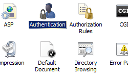

Digest Authentication <digestAuthentication>
====================

## Overview

The `<digestAuthentication>` element contains configuration settings for the Internet Information Services (IIS) 7 Digest authentication module. You configure this element to enable or disable Digest authentication, and optionally you can specify the Digest authentication realm.

Digest authentication is not as widely used as Basic authentication, but has some distinct advantages over Basic authentication or Windows authentication. The major disadvantage to using Basic authentication over non-encrypted means of communication is that the client's user name and password are sent as a base-64-encoded plaintext message, making it very easy for a malicious user to eavesdrop on the communication and retrieve the user name and password. Windows authentication resolves that issue through a variety of security options, but Windows authentication does not typically work in an Internet environment.

Digest authentication addresses both of the above limitations by the following means:

- Unlike the plaintext scheme used by Basic authentication, Digest authentication has the client send a hash of the client's information over the communication channel, therefore the client's user name and password are never sent over the network.
- Digest authentication works well over the Internet, making Digest authentication better-suited for that environment than Windows authentication.

> [!NOTE]
> Digest authentication only protects the client's user name and password - the body of the HTTP communication is still in plaintext. To secure the body of your communication, you should use Secure Sockets Layer (SSL).

## Compatibility

| Version | Notes |
| --- | --- |
| IIS 10.0 | The `<digestAuthentication>` element was not modified in IIS 10.0. |
| IIS 8.5 | The `<digestAuthentication>` element was not modified in IIS 8.5. |
| IIS 8.0 | The `<digestAuthentication>` element was not modified in IIS 8.0. |
| IIS 7.5 | The `<digestAuthentication>` element was not modified in IIS 7.5. |
| IIS 7.0 | The `<digestAuthentication>` element was introduced in IIS 7.0. |
| IIS 6.0 | The `<digestAuthentication>` element replaces portions of the IIS 6.0 **AuthType** and **AuthFlags** metabase properties. |

## Setup

The default installation of IIS 7 and later does not include the Digest authentication role service. To use Digest authentication on IIS 7 and later, you must install the role service, disable Anonymous authentication for your Web site or application, and then enable Digest authentication for the site or application.

To install the Digest authentication role service, use the following steps.

### Windows Server 2012 or Windows Server 2012 R2

1. On the taskbar, click **Server Manager**.
2. In **Server Manager**, click the **Manage** menu, and then click **Add Roles and Features**.
3. In the **Add Roles and Features** wizard, click **Next**. Select the installation type and click **Next**. Select the destination server and click **Next**.
4. On the **Server Roles** page, expand **Web Server (IIS)**, expand **Web Server**, expand **Security**, and then select **Digest Authentication**. Click **Next**.  
     .
5. On the **Select features** page, click **Next**.
6. On the **Confirm installation selections** page, click **Install**.
7. On the **Results** page, click **Close**.

### Windows 8 or Windows 8.1

1. On the **Start** screen, move the pointer all the way to the lower left corner, right-click the **Start** button, and then click **Control Panel**.
2. In **Control Panel**, click **Programs and Features**, and then click **Turn Windows features on or off**.
3. Expand **Internet Information Services**, expand **World Wide Web Services**, expand **Security**, and then select **Digest Authentication**.  
    
4. Click **OK**.
5. Click **Close**.

### Windows Server 2008 or Windows Server 2008 R2

1. On the taskbar, click **Start**, point to **Administrative Tools**, and then click **Server Manager**.
2. In the **Server Manager** hierarchy pane, expand **Roles**, and then click **Web Server (IIS)**.
3. In the **Web Server (IIS)** pane, scroll to the **Role Services** section, and then click **Add Role Services**.
4. On the **Select Role Services** page of the **Add Role Services Wizard**, select **Digest Authentication**, and then click **Next**. 
5. On the **Confirm Installation Selections** page, click **Install**.
6. On the **Results** page, click **Close**.

### Windows Vista or Windows 7

1. On the taskbar, click **Start**, and then click **Control Panel**.
2. In **Control Panel**, click **Programs and Features**, and then click **Turn Windows Features on or off**.
3. Expand **Internet Information Services**, expand **World Wide Web Services**, expand **Security**, select **Digest Authentication**, and then click **OK**.   
    

## How To

### How to enable Digest authentication and disable Anonymous authentication

1. Open **Internet Information Services (IIS) Manager**: 

    - If you are using Windows Server 2012 or Windows Server 2012 R2: 

        - On the taskbar, click **Server Manager**, click **Tools**, and then click **Internet Information Services (IIS) Manager**.
    - If you are using Windows 8 or Windows 8.1: 

        - Hold down the **Windows** key, press the letter **X**, and then click **Control Panel**.
        - Click **Administrative Tools**, and then double-click **Internet Information Services (IIS) Manager**.
    - If you are using Windows Server 2008 or Windows Server 2008 R2: 

        - On the taskbar, click **Start**, point to **Administrative Tools**, and then click **Internet Information Services (IIS) Manager**.
    - If you are using Windows Vista or Windows 7: 

        - On the taskbar, click **Start**, and then click **Control Panel**.
        - Double-click **Administrative Tools**, and then double-click **Internet Information Services (IIS) Manager**.
2. In the **Connections** pane, expand the server name, expand **Sites**, and then click the site, application or Web service for which you want to enable basic authentication.
3. Scroll to the **Security** section in the **Home** pane, and then double-click **Authentication**.  
    
4. In the **Authentication** pane, select **Digest Authentication**, and then, in the **Actions** pane, click **Enable**.
5. In the **Authentication** pane, select **Anonymous Authentication**, and then click **Disable** in the **Actions** pane.  
    

## Configuration

The `<digestAuthentication>` element is configurable at the site, application, virtual directory, and URL level. After you install the role service, IIS 7 commits the following configuration settings to the ApplicationHost.config file.

[!code-xml[Main](digestAuthentication/samples/sample1.xml)]

### Attributes

| Attribute | Description |
| --- | --- |
| `enabled` | Optional Boolean attribute. Specifies whether Digest authentication is enabled. The default value is `false`. |
| `realm` | Optional String attribute. Specifies the realm for Digest authentication. |

### Child Elements

None.

### Configuration Sample

The following configuration sample enables Digest authentication for a Web site, Web application, or Web service. By default these settings must be included in your ApplicationHost.config file, and you must include them in a `<location>` element and use the **path** attribute to define the Web site or application where you want to apply the authentication settings.

[!code-xml[Main](digestAuthentication/samples/sample2.xml)]

## Sample Code

The following examples enable Digest authentication for a site.

### AppCmd.exe

[!code-console[Main](digestAuthentication/samples/sample3.cmd)]

> [!NOTE]
> You must be sure to set the **commit** parameter to `apphost` when you use AppCmd.exe to configure these settings. This commits the configuration settings to the appropriate location section in the ApplicationHost.config file.

### C#

[!code-csharp[Main](digestAuthentication/samples/sample4.cs)]

### VB.NET

[!code-vb[Main](digestAuthentication/samples/sample5.vb)]

### JavaScript

[!code-javascript[Main](digestAuthentication/samples/sample6.js)]

### VBScript

[!code-vb[Main](digestAuthentication/samples/sample7.vb)]