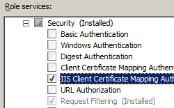

IIS Client Certificate Mapping Authentication &lt;iisClientCertificateMappingAuthentication&gt;
====================

## Overview

The `<iisClientCertificateMappingAuthentication>` element of the `<authentication>` element specifies the settings for Client Certificate Mapping authentication using IIS.

There are two different methods for mapping client certificates using IIS:

- **One-To-One Mappings** - these mappings match individual client certificates to individual user accounts on a one-to-one basis; each client certificate is mapped to a user account.
- **Many-To-One Mappings** - these mappings match multiple certificates to a user account based on subfields in client certificates.

> [!NOTE]
> Client Certificate Mapping authentication using IIS differs from [Client Certificate Mapping using Active Directory](../clientcertificatemappingauthentication.md) in the following ways:

- **Client Certificate Mapping authentication using Active Directory** - this method of authentication requires that the IIS 7 server and the client computer are members of an Active Directory domain, and user accounts are stored in Active Directory. This method of Client Certificate Mapping authentication has reduced performance because of the round-trip to the Active Directory server.
- **IIS Client Certificate Mapping authentication** - this method of authentication does not require Active Directory and therefore works with standalone servers. This method of Client Certificate Mapping authentication has increased performance, but requires more configuration and access to client certificates in order to create mappings.

For more information, see [Configuring Authentication in IIS 7.0](https://go.microsoft.com/fwlink/?LinkId=64325) on the Microsoft TechNet Web site.

## Compatibility

| Version | Notes |
| --- | --- |
| IIS 10.0 | The `<iisClientCertificateMappingAuthentication>` element was not modified in IIS 10.0. |
| IIS 8.5 | The `<iisClientCertificateMappingAuthentication>` element was not modified in IIS 8.5. |
| IIS 8.0 | The `<iisClientCertificateMappingAuthentication>` element was not modified in IIS 8.0. |
| IIS 7.5 | The `<iisClientCertificateMappingAuthentication>` element was not modified in IIS 7.5. |
| IIS 7.0 | The `<iisClientCertificateMappingAuthentication>` element of the `<authentication>` element was introduced in IIS 7.0. |
| IIS 6.0 | The `<iisClientCertificateMappingAuthentication>` element replaces the IIS 6.0 **IIsCertMapper** metabase object. |

## Setup

The `<iisClientCertificateMappingAuthentication>` element is not available on the default installation of IIS 7 and later. To install it, use the following steps.

### Windows Server 2012 or Windows Server 2012 R2

1. On the taskbar, click **Server Manager**.
2. In **Server Manager**, click the **Manage** menu, and then click **Add Roles and Features**.
3. In the **Add Roles and Features** wizard, click **Next**. Select the installation type and click **Next**. Select the destination server and click **Next**.
4. On the **Server Roles** page, expand **Web Server (IIS)**, expand **Web Server**, expand **Security**, and then select **IIS Client Certificate Mapping Authentication**. Click **Next**.  
     .
5. On the **Select features** page, click **Next**.
6. On the **Confirm installation selections** page, click **Install**.
7. On the **Results** page, click **Close**.

### Windows 8 or Windows 8.1

1. On the **Start** screen, move the pointer all the way to the lower left corner, right-click the **Start** button, and then click **Control Panel**.
2. In **Control Panel**, click **Programs and Features**, and then click **Turn Windows features on or off**.
3. Expand **Internet Information Services**, expand **World Wide Web Services**, expand **Security**, and then select **IIS Client Certificate Mapping Authentication**.  
    
4. Click **OK**.
5. Click **Close**.

### Windows Server 2008 or Windows Server 2008 R2

1. On the taskbar, click **Start**, point to **Administrative Tools**, and then click **Server Manager**.
2. In the **Server Manager** hierarchy pane, expand **Roles**, and then click **Web Server (IIS)**.
3. In the **Web Server (IIS)** pane, scroll to the **Role Services** section, and then click **Add Role Services**.
4. On the **Select Role Services** page of the **Add Role Services Wizard**, select **IIS Client Certificate Mapping Authentication**, and then click **Next**.  
    
5. On the **Confirm Installation Selections** page, click **Install**.
6. On the **Results** page, click **Close**.

### Windows Vista or Windows 7

1. On the taskbar, click **Start**, and then click **Control Panel**.
2. In **Control Panel**, click **Programs and Features**, and then click **Turn Windows Features on or off**.
3. Expand **Internet Information Services**, then select **IIS Client Certificate Mapping Authentication**, and then click **OK**.  
    
 

## How To

There is no user interface for configuring IIS Client Certificate Mapping authentication for IIS 7. For examples of how to configure IIS Client Certificate Mapping authentication programmatically, see the [Code Samples](#006) section of this document.

## Configuration

The `<iisClientCertificateMappingAuthentication>` element of the `<authentication>` element can be configured at the server and site level.

### Attributes

| Attribute | Description |
| --- | --- |
| `defaultLogonDomain` | Optional String attribute. Specifies the default domain that the server uses to authenticate users. |
| `enabled` | Optional Boolean attribute. Specifies whether Client Certificate Mapping authentication using IIS is enabled. The default is `false`. |
| `logonMethod` | Optional enum attribute. The **logonMethod** attribute can be one of the following possible values. (For more information on these values, see [LogonUser](https://msdn.microsoft.com/en-us/library/aa378184.aspx) on the MSDN site.) The default is `ClearText`. | Value | Description | | --- | --- | | `Batch` | This logon type is intended for batch servers, where processes may be executing on behalf of a user without their direct intervention. The numeric value is `1`. | | `ClearText` | This logon type preserves the name and password in the authentication package, which allows the server to make connections to other network servers while impersonating the client. The numeric value is `3`. | | `Interactive` | This logon type is intended for users who will be using the computer interactively. The numeric value is `0`. | | `Network` | This logon type is intended for high performance servers to authenticate plaintext passwords. Credentials are not cached for this logon type. The numeric value is `2`. | |
| `manyToOneCertificateMappingsEnabled` | Optional Boolean attribute. Specifies whether many-to-one mapping is enabled The default value is `true`. |
| `oneToOneCertificateMappingsEnabled` | Optional Boolean attribute. Specifies whether one-to-one mapping is enabled The default value is `true`. |

### Child Elements

| Element | Description |
| --- | --- |
| [`manyToOneMappings`](manytoonemappings/index.md) | Optional element. Maps client certificates to a set of wildcard criteria that authenticate the certificates and assign a user account. |
| [`oneToOneMappings`](onetoonemappings/index.md) | Optional element. Specifies one-to-one client certificate mappings. |

### Configuration Sample

The following configuration sample performs the following actions for the Default Web Site:

- Enables IIS Client Certificate Mapping authentication using many-to-one certificate mapping.
- Creates a many-to-one certificate mapping rule for a user account based on the organization field in the subject of the client certificate matching Contoso.
- Configures the site to require SSL and to negotiate client certificates.

[!code-xml[Main](index/samples/sample1.xml)]

The following configuration sample enables IIS Client Certificate Mapping authentication using one-to-one certificate mapping for the Default Web Site, creates a singe one-to-one certificate mapping for a user account, and configures the site to require SSL and to negotiate client certificates.

[!code-xml[Main](index/samples/sample2.xml)]

### How to retrieve Base-64 encoded string from a client certificate

> [!NOTE]
> To retrieve a Base-64 encoded certificate data for all of the samples in this topic, you can export a certificate using the following steps:

1. Click **Start**, then **Run**.
2. Enter MMC, and then click **OK**.
3. When the Microsoft Management Console opens, click **File**, then **Add/Remove Snap-ins**.
4. In the **Add or Remove Snap-ins** dialog box: 

    - Highlight **Certificates** in the list of available snap-ins, then click **Add**.
    - Choose to manage certificates for **My user account**, then click **Finish**.
    - Click **OK** to close the dialog box.
5. In the Microsoft Management Console: 

    - Expand **Certificates - Current User**, then **Personal**, then **Certificates**.
    - In the list of certificates, right-click the certificate that you want to export, then click **All Tasks**, and then click **Export**.
6. When the **Certificate Export Wizard** opens: 

    - Click **Next**.
    - Choose **No, do not export the private key**, then click **Next**.
    - Choose **Base-64 encoded X.509 9 (.CER)** for the export format, then click **Next**.
    - Choose to save the certificate to your desktop as **MyCertificate.cer**, then click **Next**.
    - Click **Finish**; you should see a dialog box that says the export was successful.
7. Close the Microsoft Management Console.
8. Open the **MyCertificate.cer** file that you exported using Windows Notepad: 

    - Remove "-----BEGIN CERTIFICATE-----" from the start of the text.
    - Remove "-----END CERTIFICATE-----" from the end of the text.
    - Concatenate all the lines into a single line of text - this is the Base-64 encoded certificate data that you will use for all of the samples in this topic.
 

## Sample Code

The following code samples perform the following actions for the Default Web Site:

- Enable IIS Client Certificate Mapping authentication using many-to-one certificate mapping.
- Create a many-to-one certificate mapping rule for a user account based on the organization field in the subject of the client certificate matching Contoso.
- Configure the site to require SSL and to negotiate client certificates.

### AppCmd.exe

[!code-console[Main](index/samples/sample3.cmd)]

> [!NOTE]
> You must be sure to set the **commit** parameter to `apphost` when you use AppCmd.exe to configure these settings. This commits the configuration settings to the appropriate location section in the ApplicationHost.config file.

### C#

[!code-csharp[Main](index/samples/sample4.cs)]

### VB.NET

[!code-vb[Main](index/samples/sample5.vb)]

### JavaScript

[!code-javascript[Main](index/samples/sample6.js)]

### VBScript

[!code-vb[Main](index/samples/sample7.vb)]

The following code samples enable IIS Client Certificate Mapping authentication using one-to-one certificate mapping for the Default Web Site, create a single one-to-one certificate mapping for a user account, and configure the site to require SSL and to negotiate client certificates.

> [!NOTE]
> To retrieve the Base-64 encoded certificate data for the code samples listed below, you can export a certificate using the steps listed in the [Configuration Details](#005) section of this document.

### AppCmd.exe

> [!NOTE]
> Because of characters in certificate strings that cannot be parsed by AppCmd.exe, you should not use AppCmd.exe to configure IIS one-to-one certificate mappings.

### C#

[!code-csharp[Main](index/samples/sample8.cs)]

### VB.NET

[!code-vb[Main](index/samples/sample9.vb)]

### JavaScript

[!code-javascript[Main](index/samples/sample10.js)]

### VBScript

[!code-vb[Main](index/samples/sample11.vb)]