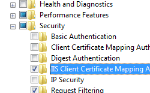

One-To-One Mappings &lt;oneToOneMappings&gt;
====================

## Overview

The `<oneToOneMappings>` element of the `<iisClientCertificateMappingAuthentication>` element maps individual client certificates to individual user accounts on a one-to-one basis. These one-to-one certificate mappings can be used in place of the more commonly used methods of authentication, such as [Windows authentication](../../windowsauthentication/index.md) or [Basic authentication](../../basicauthentication.md).

> [!NOTE]
> One-to-one certificate mappings differ from [many-to-one](../manytoonemappings/index.md) certificate mappings, which can map multiple certificates to a single user account.

## Compatibility

| Version | Notes |
| --- | --- |
| IIS 10.0 | The `<oneToOneMappings>` element was not modified in IIS 10.0. |
| IIS 8.5 | The `<oneToOneMappings>` element was not modified in IIS 8.5. |
| IIS 8.0 | The `<oneToOneMappings>` element was not modified in IIS 8.0. |
| IIS 7.5 | The `<oneToOneMappings>` element was not modified in IIS 7.5. |
| IIS 7.0 | The `<oneToOneMappings>` element of the `<iisClientCertificateMappingAuthentication>` element was introduced in IIS 7.0. |
| IIS 6.0 | The `<oneToOneMappings>` element replaces the IIS 6.0 **IIsCertMapper** metabase object. |

## Setup

The `<iisClientCertificateMappingAuthentication>` element is not available on the default installation of IIS 7 and later. To install it, use the following steps.

### Windows Server 2012 or Windows Server 2012 R2

1. On the taskbar, click **Server Manager**.
2. In **Server Manager**, click the **Manage** menu, and then click **Add Roles and Features**.
3. In the **Add Roles and Features** wizard, click **Next**. Select the installation type and click **Next**. Select the destination server and click **Next**.
4. On the **Server Roles** page, expand **Web Server (IIS)**, expand **Web Server**, expand **Security**, and then select **IIS Client Certificate Mapping Authentication**. Click **Next**.  
     .
5. On the **Select features** page, click **Next**.
6. On the **Confirm installation selections** page, click **Install**.
7. On the **Results** page, click **Close**.

### Windows 8 or Windows 8.1

1. On the **Start** screen, move the pointer all the way to the lower left corner, right-click the **Start** button, and then click **Control Panel**.
2. In **Control Panel**, click **Programs and Features**, and then click **Turn Windows features on or off**.
3. Expand **Internet Information Services**, expand **World Wide Web Services**, expand **Security**, and then select **IIS Client Certificate Mapping Authentication**.  
    
4. Click **OK**.
5. Click **Close**.

### Windows Server 2008 or Windows Server 2008 R2

1. On the taskbar, click **Start**, point to **Administrative Tools**, and then click **Server Manager**.
2. In the **Server Manager** hierarchy pane, expand **Roles**, and then click **Web Server (IIS)**.
3. In the **Web Server (IIS)** pane, scroll to the **Role Services** section, and then click **Add Role Services**.
4. On the **Select Role Services** page of the **Add Role Services Wizard**, select **IIS Client Certificate Mapping Authentication**, and then click **Next**.  
    
5. On the **Confirm Installation Selections** page, click **Install**.
6. On the **Results** page, click **Close**.

### Windows Vista or Windows 7

1. On the taskbar, click **Start**, and then click **Control Panel**.
2. In **Control Panel**, click **Programs and Features**, and then click **Turn Windows Features on or off**.
3. Expand **Internet Information Services**, then select **IIS Client Certificate Mapping Authentication**, and then click **OK**.  
    
 

## How To

There is no user interface for configuring IIS Client Certificate Mapping authentication for IIS 7. For examples of how to configure IIS Client Certificate Mapping authentication programmatically, see the [Code Samples](#006) section of this document.

## Configuration

### Attributes

None.

### Child Elements

| Element | Description |
| --- | --- |
| [`add`](add.md) | Optional element. Adds a one-to-one mapping to the collection of one-to-one mappings. |
| `clear` | Optional element. Removes all references to one-to-one mappings from the one-to-one mappings collection. |

### Configuration Sample

The following configuration sample enables IIS Client Certificate Mapping authentication using one-to-one certificate mapping for the Default Web Site, creates a singe one-to-one certificate mapping for a user account, and configures the site to require SSL and to negotiate client certificates.

[!code-xml[Main](index/samples/sample1.xml)]

### How to retrieve Base-64 encoded string from a client certificate

> [!NOTE]
> To retrieve a Base-64 encoded certificate data for all of the samples in this topic, you can export a certificate using the following steps:

1. Click **Start**, then **Run**.
2. Enter MMC, and then click **OK**.
3. When the Microsoft Management Console opens, click **File**, then **Add/Remove Snap-ins**.
4. In the **Add or Remove Snap-ins** dialog box: 

    - Highlight **Certificates** in the list of available snap-ins, then click **Add**.
    - Choose to manage certificates for **My user account**, then click **Finish**.
    - Click **OK** to close the dialog box.
5. In the Microsoft Management Console: 

    - Expand **Certificates - Current User**, then **Personal**, then **Certificates**.
    - In the list of certificates, right-click the certificate that you want to export, then click **All Tasks**, and then click **Export**.
6. When the **Certificate Export Wizard** opens: 

    - Click **Next**.
    - Choose **No, do not export the private key**, then click **Next**.
    - Choose **Base-64 encoded X.509 9 (.CER)** for the export format, then click **Next**.
    - Choose to save the certificate to your desktop as **MyCertificate.cer**, then click **Next**.
    - Click **Finish**; you should see a dialog box that says the export was successful.
7. Close the Microsoft Management Console.
8. Open the **MyCertificate.cer** file that you exported using Windows Notepad: 

    - Remove "-----BEGIN CERTIFICATE-----" from the start of the text.
    - Remove "-----END CERTIFICATE-----" from the end of the text.
    - Concatenate all the lines into a single line of text - this is the Base-64 encoded certificate data that you will use for all of the samples in this topic.
 

## Sample Code

The following code samples enable IIS Client Certificate Mapping authentication using one-to-one certificate mapping for the Default Web Site, create a single one-to-one certificate mapping for a user account, and configure the site to require SSL and to negotiate client certificates.

> [!NOTE]
> To retrieve the Base-64 encoded certificate data for the code samples listed below, you can export a certificate using the steps listed in the [Configuration Details](#005) section of this document.

### AppCmd.exe

> [!NOTE]
> Because of characters in certificate strings that cannot be parsed by AppCmd.exe, you should not use AppCmd.exe to configure IIS one-to-one certificate mappings.

### C#

[!code-csharp[Main](index/samples/sample2.cs)]

### VB.NET

[!code-vb[Main](index/samples/sample3.vb)]

### JavaScript

[!code-javascript[Main](index/samples/sample4.js)]

### VBScript

[!code-vb[Main](index/samples/sample5.vb)]