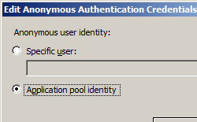

# Security Authentication &lt;authentication&gt;

## Overview

Authentication is the mechanism you use to verify the identity of visitors to your Web site or Web application. Typically, you do this by assigning a user name and password to a visitor or allowing a visitor to anonymously access public content on your site.

Although you use authentication to confirm the identity of a visitor, you use authorization to control the visitor's access to the different areas of your site or application.

IIS 7 supports Anonymous authentication, Basic authentication, Client Certificate Mapping authentication, Digest authentication, IIS Client Certificate Mapping authentication, and Windows authentication. Additional authentication modes can be provided by third-party authentication modules.

After you install one of the authentication modules, you must enable the selected authentication module for the Web site, Web application, or Web service on which you want to use it.

Also by default, IIS 7 enables kernel-mode authentication for the Windows (which use either Kerberos or NTLM), authentication scheme. Kernel-mode authentication provides the following advantages:

- Your Web applications can run using lower-privileged accounts.
- If you use Kerberos authentication, you can use a different account than the default account associated with the Service Principle Name (SPN) of the server.
- If you use kernel-mode authentication, you can use the Windows authentication Kerberos provider without performing explicit SPN configuration.

## Compatibility

| Version | Notes |
| --- | --- |
| IIS 10.0 | The `<authentication>` element was not modified in IIS 10.0. |
| IIS 8.5 | The `<authentication>` element was not modified in IIS 8.5. |
| IIS 8.0 | The `<authentication>` element was not modified in IIS 8.0. |
| IIS 7.5 | The `<authentication>` element was not modified in IIS 7.5. |
| IIS 7.0 | The `<authentication>` element was introduced in IIS 7.0. |
| IIS 6.0 | N/A |

## Setup

The `<authentication>` element is included in the default installation of IIS 7.

## How To

### How to disable anonymous authentication

1. Open **Internet Information Services (IIS) Manager**: 

    - If you are using Windows Server 2012 or Windows Server 2012 R2: 

        - On the taskbar, click **Server Manager**, click **Tools**, and then click **Internet Information Services (IIS) Manager**.
    - If you are using Windows 8 or Windows 8.1: 

        - Hold down the **Windows** key, press the letter **X**, and then click **Control Panel**.
        - Click **Administrative Tools**, and then double-click **Internet Information Services (IIS) Manager**.
    - If you are using Windows Server 2008 or Windows Server 2008 R2: 

        - On the taskbar, click **Start**, point to **Administrative Tools**, and then click **Internet Information Services (IIS) Manager**.
    - If you are using Windows Vista or Windows 7: 

        - On the taskbar, click **Start**, and then click **Control Panel**.
        - Double-click **Administrative Tools**, and then double-click **Internet Information Services (IIS) Manager**.
2. In the **Connections** pane, expand the server name, expand **Sites**, and go to the level in the hierarchy pane that you want to configure, and then click the Web site or Web application.
3. Scroll to the **Security** section in the **Home** pane, and then double-click **Authentication**.
4. In the **Authentication** pane, select **Anonymous Authentication**, and then click **Disable** in the **Actions** pane.  
    

### How to change anonymous authentication credentials from the IUSR account

1. Open **Internet Information Services (IIS) Manager**: 

    - If you are using Windows Server 2012 or Windows Server 2012 R2: 

        - On the taskbar, click **Server Manager**, click **Tools**, and then click **Internet Information Services (IIS) Manager**.
    - If you are using Windows 8 or Windows 8.1: 

        - Hold down the **Windows** key, press the letter **X**, and then click **Control Panel**.
        - Click **Administrative Tools**, and then double-click **Internet Information Services (IIS) Manager**.
    - If you are using Windows Server 2008 or Windows Server 2008 R2: 

        - On the taskbar, click **Start**, point to **Administrative Tools**, and then click **Internet Information Services (IIS) Manager**.
    - If you are using Windows Vista or Windows 7: 

        - On the taskbar, click **Start**, and then click **Control Panel**.
        - Double-click **Administrative Tools**, and then double-click **Internet Information Services (IIS) Manager**.
2. In the **Connections** pane, expand the server name, expand **Sites**, and navigate to the level in the hierarchy pane that you want to configure, and then click the Web site or Web application.
3. Scroll to the **Security** section in the **Home** pane, and then double-click **Authentication**.
4. In the **Authentication** pane, select **Anonymous Authentication**, and then click **Edit...** in the **Actions** pane.
5. In the **Edit Anonymous Authentication Credentials** dialog box, do one of the following:

   - Select **Application pool identity** to use the identity set for the application pool, and then click **OK**.   
       
   - Click **Set...**, and then in the **Set Credentials** dialog box, enter the user name for the account in the **User name** box, enter the password for the account in the **Password** and **Confirm password** boxes, click **OK**, and then click **OK** again.  
       

     > [!NOTE]
     > If you use this procedure, only grant the new account minimal privileges on the IIS server computer.

* * *

### How to enable Windows authentication for a Web site, Web application, or Web service

1. Open **Internet Information Services (IIS) Manager**: 

    - If you are using Windows Server 2012 or Windows Server 2012 R2: 

        - On the taskbar, click **Server Manager**, click **Tools**, and then click **Internet Information Services (IIS) Manager**.
    - If you are using Windows 8 or Windows 8.1: 

        - Hold down the **Windows** key, press the letter **X**, and then click **Control Panel**.
        - Click **Administrative Tools**, and then double-click **Internet Information Services (IIS) Manager**.
    - If you are using Windows Server 2008 or Windows Server 2008 R2: 

        - On the taskbar, click **Start**, point to **Administrative Tools**, and then click **Internet Information Services (IIS) Manager**.
    - If you are using Windows Vista or Windows 7: 

        - On the taskbar, click **Start**, and then click **Control Panel**.
        - Double-click **Administrative Tools**, and then double-click **Internet Information Services (IIS) Manager**.
2. In the **Connections** pane, expand the server name, expand **Sites**, and then the site, application, or Web service for which you want to enable Windows authentication.
3. Scroll to the **Security** section in the **Home** pane, and then double-click **Authentication**.
4. In the **Authentication** pane, select **Windows Authentication**, and then click **Enable** in the **Actions** pane.   
    
 

## Configuration

The `<authentication>` section group is defined in the `<system.webServer>` configuration section. This section group defines configuration sections for all user authentication types that you can install and enable on your server. You can configure it at the server level in the ApplicationHost.config file and at the application level in the Web.config file.

### Attributes

None.

### Child Elements

| Element | Description |
| --- | --- |
| [`anonymousAuthentication`](anonymousauthentication.md) | Optional element.  Specifies the settings for Anonymous authentication. |
| [`basicAuthentication`](basicauthentication.md) | Optional element.  Specifies the settings for Basic authentication. |
| [`clientCertificateMappingAuthentication`](clientcertificatemappingauthentication.md) | Optional element.   Specifies the settings Client Certificate Mapping authentication using Active Directory. |
| [`digestAuthentication`](digestauthentication.md) | Optional element.  Specifies the settings for Digest authentication. |
| [`iisClientCertificateMappingAuthentication`](iisclientcertificatemappingauthentication/index.md) | Optional element.  Specifies the settings Client Certificate Mapping authentication using IIS. |
| [`windowsAuthentication`](windowsauthentication/index.md) | Optional element.  Specifies the settings for Windows authentication. |

### Configuration Sample

The following configuration example disables Anonymous authentication for a site named Contoso, then enables both Basic authentication and Windows authentication for the site.

[!code-xml[Main](index/samples/sample1.xml)]

## Sample Code

The following examples disable Anonymous authentication for a site named Contoso, then enable both Basic authentication and Windows authentication for the site.

### AppCmd.exe

[!code-console[Main](index/samples/sample2.cmd)]

> [!NOTE]
> You must be sure to set the **commit** parameter to `apphost` when you use AppCmd.exe to configure these settings. This commits the configuration settings to the appropriate location section in the ApplicationHost.config file.

### C\#

[!code-csharp[Main](index/samples/sample3.cs)]

### VB.NET

[!code-vb[Main](index/samples/sample4.vb)]

### JavaScript

[!code-javascript[Main](index/samples/sample5.js)]

### VBScript

[!code-vb[Main](index/samples/sample6.vb)]
