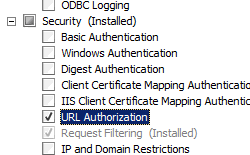
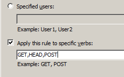

Security Authorization &lt;authorization&gt;
====================

## Overview

The `<authorization>` element allows you to configure the user accounts that can access your site or application. Use authorization in combination with authentication to secure access to content on your server. Authentication confirms the identity of a user, while authorization determines what resources users can or cannot access.

IIS defines two types of authorization rules, Allow rules and Deny rules:

- Allow rules let you define the user accounts or user groups that can access a site, an application, or all the sites on a server.
- Deny rules let you define the user accounts or user groups that cannot access a site, an application, or all the sites on a server.

## Compatibility

| Version | Notes |
| --- | --- |
| IIS 10.0 | The `<authorization>` element was not modified in IIS 10.0. |
| IIS 8.5 | The `<authorization>` element was not modified in IIS 8.5. |
| IIS 8.0 | The `<authorization>` element was not modified in IIS 8.0. |
| IIS 7.5 | The `<authorization>` element was not modified in IIS 7.5. |
| IIS 7.0 | The `<authorization>` element was introduced in IIS 7.0. |
| IIS 6.0 | The `<authorization>` collection replaces the IIS 6.0 **AzEnable**, **AzStoreName**, **AzScopeName**, and **AzImpersonationLevel** metabase properties. |

## Setup

To support and configure authorization for sites and applications on your Web server, you must install the URL authorization module. To do so, use the following steps.

### Windows Server 2012 or Windows Server 2012 R2

1. On the taskbar, click **Server Manager**. - In **Server Manager**, click the **Manage** menu, and then click **Add Roles and Features**. - In the **Add Roles and Features** wizard, click **Next**. Select the installation type and click **Next**. Select the destination server and click **Next**. - On the **Server Roles** page, expand **Web Server (IIS)**, expand **Web Server**, expand **Security**, and then select **URL Authorization**. Click **Next**.  
     . - On the **Select features** page, click **Next**. - On the **Confirm installation selections** page, click **Install**. - On the **Results** page, click **Close**.

### Windows 8 or Windows 8.1

1. On the **Start** screen, move the pointer all the way to the lower left corner, right-click the **Start** button, and then click **Control Panel**. - In **Control Panel**, click **Programs and Features**, and then click **Turn Windows features on or off**. - Expand **Internet Information Services**, expand **World Wide Web Services**, expand **Security**, and then select **URL Authorization**.  
    - Click **OK**.
- Click **Close**.

### Windows Server 2008 or Windows Server 2008 R2

1. On the taskbar, click **Start**, point to **Administrative Tools**, and then click **Server Manager**. - In the **Server Manager** hierarchy pane, expand **Roles**, and then click **Web Server (IIS)**. - In the **Web Server (IIS)** pane, scroll to the **Role Services** section, and then click **Add Role Services**. - On the **Select Role Services** page of the **Add Role Services Wizard**, select **URL Authorization**, and then click **Next**.  
    - On the **Confirm Installation Selections** page, click **Install**. - On the **Results** page, click **Close**.

### Windows Vista or Windows 7

1. On the taskbar, click **Start**, and then click **Control Panel**. - In **Control Panel**, click **Programs and Features**, and then click **Turn Windows Features on or off**. - Expand **Internet Information Services**, then select **URL Authorization**, and then click **OK**.  
    
 

## How To

### How to add an authorization rule

1. Open **Internet Information Services (IIS) Manager**: 

    - If you are using Windows Server 2012 or Windows Server 2012 R2: 

        - On the taskbar, click **Server Manager**, click **Tools**, and then click **Internet Information Services (IIS) Manager**.
    - If you are using Windows 8 or Windows 8.1: 

        - Hold down the **Windows** key, press the letter **X**, and then click **Control Panel**.
        - Click **Administrative Tools**, and then double-click **Internet Information Services (IIS) Manager**.
    - If you are using Windows Server 2008 or Windows Server 2008 R2: 

        - On the taskbar, click **Start**, point to **Administrative Tools**, and then click **Internet Information Services (IIS) Manager**.
    - If you are using Windows Vista or Windows 7: 

        - On the taskbar, click **Start**, and then click **Control Panel**.
        - Double-click **Administrative Tools**, and then double-click **Internet Information Services (IIS) Manager**.
2. In the **Connections** pane, expand the server name, expand **Sites**, and then navigate to the site or application on which you want to configure authorization.
3. In the **Home** pane, double-click **Authorization Rules**.  
    
4. To add a new authorization rule, in the **Actions** pane click **Add Allow Rule...** or **Add Deny Rule...**
5. Apply the authorization settings needed for your site or application, and then click **OK**. For example:

    - Example #1: Adding an Allow rule for all users for specific HTTP verbs:  
        
    - Example #2: Adding a Deny rule for a specific user for all HTTP verbs:  
        

    > [!NOTE]
    >  To edit or delete an existing rule, select the rule in the     **Authorization rules** pane, and then click     **Edit...** or     **Remove** in the     **Actions** pane. If you click     **Edit...** , a dialog box appears that allows you to edit the rule; this dialog box is similar to the     **Add Allow Authorization Rule** and     **Add Deny Authorization Rule** dialog boxes.

## Configuration

You can configure the `<authorization>` element at the server level in the ApplicationHost.config file, or at the site or application level in the appropriate Web.config file.

You can set default authorization rules for the entire server by configuring authorization rules at the server level. You can remove, clear, or override these rules by configuring more specific rules for your sites or applications.

### Attributes

| Attribute | Description |
| --- | --- |
| `bypassLoginPages` | Optional Boolean attribute.  Specifies whether to skip authorization check for the page specified as the login page for Forms authentication. This enables unauthenticated users to access the login page to log on.  The default value is `true`. |

### Child Elements

| Element | Description |
| --- | --- |
| [`add`](add.md) | Optional element.  Adds an authorization rule to the collection of authorization rules. |
| `remove` | Optional element.   Removes a reference to an authorization rule to the collection of authorization rules. |
| `clear` | Optional element.  Removes all references to authorization rules from the collection of authorization rules. |

### Configuration Sample

The following configuration example, when included in a Web.config file, removes the default IIS authorization settings, which allows all users access to Web site or application content. It then configures an authorization rule that allows only users with administrator privileges to access the content.

[!code-xml[Main](index/samples/sample1.xml)]

## Sample Code

The following examples add an allow authorization rule that allows users in the administrators group to access a Web site named Contoso.

### AppCmd.exe

[!code-console[Main](index/samples/sample2.cmd)]

> [!NOTE]
> You can optionally set the **commit** parameter to `apphost` when using AppCmd.exe to configure these settings. This commits the configuration settings to the appropriate location section in the ApplicationHost.config file instead of a Web.config file.

### C#

[!code-csharp[Main](index/samples/sample3.cs)]

### VB.NET

[!code-vb[Main](index/samples/sample4.vb)]

### JavaScript

[!code-javascript[Main](index/samples/sample5.js)]

### VBScript

[!code-vb[Main](index/samples/sample6.vb)]