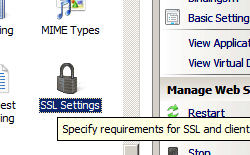

Security &lt;security&gt;
====================

## Overview

The `<security>` section group resides in the `<system.webServer>` section and contains all elements that configure security settings on an Internet Information Services (IIS) 7 server. These include Secure Sockets Layer (SSL) settings for a site, applications that are dependent on Common Gateway Interface (CGI) or Internet Server API (ISAPI) binaries, configuration settings for all authentication modules installed on your server, and authorization rule settings. It also includes IP security and request filtering configuration settings and a list of ISAPI and CGI restrictions on the server.

The settings in the `<security>` section group can be combined for extra security. For example:

- The `<authentication>` element defines configuration sections for all user authentication types that you can install and enable on your IIS 7 server, whereas the `<authorization>` element configures the user accounts that can access your site or application. You use `<authorization>` in combination with `<authentication>` to secure access to content on your server. The `<access>` element configures SSL settings for your Web server, site, or application.
- The `<isapiCgiRestriction>` element specifies a list of CGI and ISAPI applications that can run on IIS 7. This element allows you to ensure that malicious users cannot copy unauthorized CGI and ISAPI binaries to your Web server and then run them. The `<applicationDependencies>` element specifies an application that has dependencies to one or more CGI or ISAPI extension restrictions. You can combine the `<isapiCgiRestriction>` element with the `<applicationDependencies>` element in order to ensure your CGI or ISAPI extension restrictions are set properly.

> [!NOTE]
> For enhanced security, neither Windows Vista or Windows Server 2008 installs IIS 7 by default. When you do install IIS 7, IIS is automatically configured to serve only static content, including HTML and image files. You must manually install any other role services and features required by your Web sites and applications. This strategy greatly reduces the IIS 7 attack surface.

## Compatibility

| Version | Notes |
| --- | --- |
| IIS 10.0 | The `<security>` element was not modified in IIS 10.0. |
| IIS 8.5 | The `<security>` element was not modified in IIS 8.5. |
| IIS 8.0 | The `<defaultIpSecurity>` element was added as a child element. |
| IIS 7.5 | The `<security>` element was not modified in IIS 7.5. |
| IIS 7.0 | The `<security>` element was introduced in IIS 7. |
| IIS 6.0 | The `<security>` element replaces the IIS 6.0 security metabase properties that related to certificates, authentication, and authorization. |

## Setup

The `<security>` element is included in the default installation of IIS 7.

## How To

### How to disable anonymous authentication

1. Open **Internet Information Services (IIS) Manager**:

    - If you are using Windows Server 2012 or Windows Server 2012 R2:

        - On the taskbar, click **Server Manager**, click **Tools**, and then click **Internet Information Services (IIS) Manager**.
    - If you are using Windows 8 or Windows 8.1:

        - Hold down the **Windows** key, press the letter **X**, and then click **Control Panel**.
        - Click **Administrative Tools**, and then double-click **Internet Information Services (IIS) Manager**.
    - If you are using Windows Server 2008 or Windows Server 2008 R2:

        - On the taskbar, click **Start**, point to **Administrative Tools**, and then click **Internet Information Services (IIS) Manager**.
    - If you are using Windows Vista or Windows 7:

        - On the taskbar, click **Start**, and then click **Control Panel**.
        - Double-click **Administrative Tools**, and then double-click **Internet Information Services (IIS) Manager**.
2. In the **Connections** pane, expand the server name, expand **Sites**, and go to the level in the hierarchy pane that you want to configure, and then click the Web site or Web application.
3. Scroll to the **Security** section in the **Home** pane, and then double-click **Authentication**.
4. In the **Authentication** pane, select **Anonymous Authentication**, and then click **Disable** in the **Actions** pane.  
    

### How to change anonymous authentication credentials from the IUSR account

1. Open **Internet Information Services (IIS) Manager**:

    - If you are using Windows Server 2012 or Windows Server 2012 R2:

        - On the taskbar, click **Server Manager**, click **Tools**, and then click **Internet Information Services (IIS) Manager**.
    - If you are using Windows 8 or Windows 8.1:

        - Hold down the **Windows** key, press the letter **X**, and then click **Control Panel**.
        - Click **Administrative Tools**, and then double-click **Internet Information Services (IIS) Manager**.
    - If you are using Windows Server 2008 or Windows Server 2008 R2:

        - On the taskbar, click **Start**, point to **Administrative Tools**, and then click **Internet Information Services (IIS) Manager**.
    - If you are using Windows Vista or Windows 7:

        - On the taskbar, click **Start**, and then click **Control Panel**.
        - Double-click **Administrative Tools**, and then double-click **Internet Information Services (IIS) Manager**.
2. In the **Connections** pane, expand the server name, expand **Sites**, and navigate to the level in the hierarchy pane that you want to configure, and then click the Web site or Web application.
3. Scroll to the **Security** section in the **Home** pane, and then double-click **Authentication**.
4. In the **Authentication** pane, select **Anonymous Authentication**, and then click **Edit...** in the **Actions** pane.
5. In the **Edit Anonymous Authentication Credentials** dialog box, do one of the following:

   - Select **Application pool identity** to use the identity set for the application pool, and then click **OK**.
       
   - Click **Set...**, and then in the **Set Credentials** dialog box, enter the user name for the account in the **User name** box, enter the password for the account in the **Password** and **Confirm password** boxes, click **OK**, and then click **OK** again.  
       

     > [!NOTE]
     > If you use this procedure, only grant the new account minimal privileges on the IIS server computer.

* * *

### How to enable basic authentication and disable anonymous authentication

1. Open **Internet Information Services (IIS) Manager**:

    - If you are using Windows Server 2012 or Windows Server 2012 R2:

        - On the taskbar, click **Server Manager**, click **Tools**, and then click **Internet Information Services (IIS) Manager**.
    - If you are using Windows 8 or Windows 8.1:

        - Hold down the **Windows** key, press the letter **X**, and then click **Control Panel**.
        - Click **Administrative Tools**, and then double-click **Internet Information Services (IIS) Manager**.
    - If you are using Windows Server 2008 or Windows Server 2008 R2:

        - On the taskbar, click **Start**, point to **Administrative Tools**, and then click **Internet Information Services (IIS) Manager**.
    - If you are using Windows Vista or Windows 7:

        - On the taskbar, click **Start**, and then click **Control Panel**.
        - Double-click **Administrative Tools**, and then double-click **Internet Information Services (IIS) Manager**.
2. In the **Connections** pane, expand the server name, expand **Sites**, and then click the site, application or Web service for which you want to enable basic authentication.
3. Scroll to the **Security** section in the **Home** pane, and then double-click **Authentication**.
4. In the **Authentication** pane, select **Basic Authentication**, and then, in the **Actions** pane, click **Enable**.
5. In the **Authentication** pane, select **Anonymous Authentication**, and then click **Disable** in the **Actions** pane.  
    

* * *

### How to require Secure Sockets Layer

1. Open **Internet Information Services (IIS) Manager**:

    - If you are using Windows Server 2012 or Windows Server 2012 R2:

        - On the taskbar, click **Server Manager**, click **Tools**, and then click **Internet Information Services (IIS) Manager**.
    - If you are using Windows 8 or Windows 8.1:

        - Hold down the **Windows** key, press the letter **X**, and then click **Control Panel**.
        - Click **Administrative Tools**, and then double-click **Internet Information Services (IIS) Manager**.
    - If you are using Windows Server 2008 or Windows Server 2008 R2:

        - On the taskbar, click **Start**, point to **Administrative Tools**, and then click **Internet Information Services (IIS) Manager**.
    - If you are using Windows Vista or Windows 7:

        - On the taskbar, click **Start**, and then click **Control Panel**.
        - Double-click **Administrative Tools**, and then double-click **Internet Information Services (IIS) Manager**.
2. In the **Connections** pane, go to the site, application, or directory for which you want to configure SSL requirements. You cannot configure SSL at the server level.
3. In the **Home** pane, double-click **SSL Settings**.  
    
4. In the **SSL Settings** pane, click **Require SSL**.
5. In the **Actions** pane, click **Apply**.

* * *

### How to enable Windows authentication for a Web site, Web application, or Web service

1. Open **Internet Information Services (IIS) Manager**:

    - If you are using Windows Server 2012 or Windows Server 2012 R2:

        - On the taskbar, click **Server Manager**, click **Tools**, and then click **Internet Information Services (IIS) Manager**.
    - If you are using Windows 8 or Windows 8.1:

        - Hold down the **Windows** key, press the letter **X**, and then click **Control Panel**.
        - Click **Administrative Tools**, and then double-click **Internet Information Services (IIS) Manager**.
    - If you are using Windows Server 2008 or Windows Server 2008 R2:

        - On the taskbar, click **Start**, point to **Administrative Tools**, and then click **Internet Information Services (IIS) Manager**.
    - If you are using Windows Vista or Windows 7:

        - On the taskbar, click **Start**, and then click **Control Panel**.
        - Double-click **Administrative Tools**, and then double-click **Internet Information Services (IIS) Manager**.
2. In the **Connections** pane, expand the server name, expand **Sites**, and then the site, application, or Web service for which you want to enable Windows authentication.
3. Scroll to the **Security** section in the **Home** pane, and then double-click **Authentication**.
4. In the **Authentication** pane, select **Windows Authentication**, and then click **Enable** in the **Actions** pane.
    

## Configuration

When you configure security settings, the configuration XML must include the `<security>` section group. You can configure security settings at the server level in the ApplicationHost.config file, or at the site level, application level, or directory level in the appropriate Web.config file.

### Attributes

None.

### Child Elements

| Element | Description |
| --- | --- |
| [`access`](access.md) | Optional element.  Specifies configuration settings for Secure Sockets Layer (SSL) such as whether to use client certificates for authentication and crypto strength. |
| [`applicationDependencies`](applicationdependencies/index.md) | Optional element.  Specifies an application that has dependencies to one or more CGI or ISAPI extension restrictions. |
| [`authentication`](authentication/index.md) | Optional element.  Specifies authentication-related settings. |
| [`authorization`](authorization/index.md) | Optional element.  Specifies authorization-related settings. |
| [`dynamicIpSecurity`](dynamicipsecurity/index.md) | Optional element.  Specifies dynamic IP restrictions that block any IP address that meets a set of criteria. |
| [`ipSecurity`](ipsecurity/index.md) | Optional element.  Specifies access restrictions based on the IP version 4 address or DNS domain name. |
| [`isapiCgiRestriction`](isapicgirestriction/index.md) | Optional element.  Specifies settings that restrict which CGI and ISAPI programs are allowed to run on the server. |
| [`requestFiltering`](requestfiltering/index.md) | Optional element.  Specifies configuration settings for request filtering. |

### Configuration Sample

The following example configures the authentication, SSL, and request filtering settings for a Web site named Contoso.

[!code-xml[Main](index/samples/sample1.xml)]

## Sample Code

The following examples disable Anonymous authentication for a site named Contoso, then enable both Basic authentication and Windows authentication for the site.

### AppCmd.exe

[!code-console[Main](index/samples/sample2.cmd)]

> [!NOTE]
> You must be sure to set the **commit** parameter to `apphost` when you use AppCmd.exe to configure these settings. This commits the configuration settings to the appropriate location section in the ApplicationHost.config file.

### C\#

[!code-csharp[Main](index/samples/sample3.cs)]

### VB.NET

[!code-vb[Main](index/samples/sample4.vb)]

### JavaScript

[!code-javascript[Main](index/samples/sample5.js)]

### VBScript

[!code-vb[Main](index/samples/sample6.vb)]
