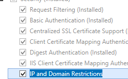

Adding IP Security &lt;add&gt;
====================

## Overview

The `<add>` element of the `<ipSecurity>` collection defines a unique IP security restriction. Each restriction can be based on the IP version 4 address, a range of IP version 4 addresses, or a DNS domain name.

## Compatibility

| Version | Notes |
| --- | --- |
| IIS 10.0 | The `<add>` element was not modified in IIS 10.0. |
| IIS 8.5 | The `<add>` element was not modified in IIS 8.5. |
| IIS 8.0 | The `<add>` element was not modified in IIS 8.0. |
| IIS 7.5 | The `<add>` element was not modified in IIS 7.5. |
| IIS 7.0 | The `<add>` element of the `<ipSecurity>` collection was introduced in IIS 7.0. |
| IIS 6.0 | The `<ipSecurity>` collection replaces the IIS 6.0 **IPSecurity** metabase property. |

## Setup

The default installation of IIS does not include the role service or Windows feature for IP security. To use IP security on IIS, you must install the role service or Windows feature using the following steps:

### Windows Server 2012 or Windows Server 2012 R2

1. On the taskbar, click **Server Manager**.
2. In **Server Manager**, click the **Manage** menu, and then click **Add Roles and Features**.
3. In the **Add Roles and Features** wizard, click **Next**. Select the installation type and click **Next**. Select the destination server and click **Next**.
4. On the **Server Roles** page, expand **Web Server (IIS)**, expand **Web Server**, expand **Security**, and then select **IP and Domain Restrictions**. Click **Next**.  
     .
5. On the **Select features** page, click **Next**.
6. On the **Confirm installation selections** page, click **Install**.
7. On the **Results** page, click **Close**.

### Windows 8 or Windows 8.1

1. On the **Start** screen, move the pointer all the way to the lower left corner, right-click the **Start** button, and then click **Control Panel**.
2. In **Control Panel**, click **Programs and Features**, and then click **Turn Windows features on or off**.
3. Expand **Internet Information Services**, expand **World Wide Web Services**, expand **Security**, and then select **IP Security**.  
    
4. Click **OK**.
5. Click **Close**.

### Windows Server 2008 or Windows Server 2008 R2

1. On the taskbar, click **Start**, point to **Administrative Tools**, and then click **Server Manager**.
2. In the **Server Manager** hierarchy pane, expand **Roles**, and then click **Web Server (IIS)**.
3. In the **Web Server (IIS)** pane, scroll to the **Role Services** section, and then click **Add Role Services**.
4. On the **Select Role Services** page of the **Add Role Services Wizard**, select **IP and Domain Restrictions**, and then click **Next**.  
  
    
5. On the **Confirm Installation Selections** page, click **Install**.
6. On the **Results** page, click **Close**.

### Windows Vista or Windows 7

1. On the taskbar, click **Start**, and then click **Control Panel**.
2. In **Control Panel**, click **Programs and Features**, and then click **Turn Windows Features on or off**.
3. Expand **Internet Information Services**, then **World Wide Web Services**, then **Security**.
4. Select **IP Security**, and then click **OK**.   
  
    
 

## How To

### How to add IP restrictions to deny access for a Web site

1. Open **Internet Information Services (IIS) Manager**: 

    - If you are using Windows Server 2012 or Windows Server 2012 R2: 

        - On the taskbar, click **Server Manager**, click **Tools**, and then click **Internet Information Services (IIS) Manager**.
    - If you are using Windows 8 or Windows 8.1: 

        - Hold down the **Windows** key, press the letter **X**, and then click **Control Panel**.
        - Click **Administrative Tools**, and then double-click **Internet Information Services (IIS) Manager**.
    - If you are using Windows Server 2008 or Windows Server 2008 R2: 

        - On the taskbar, click **Start**, point to **Administrative Tools**, and then click **Internet Information Services (IIS) Manager**.
    - If you are using Windows Vista or Windows 7: 

        - On the taskbar, click **Start**, and then click **Control Panel**.
        - Double-click **Administrative Tools**, and then double-click **Internet Information Services (IIS) Manager**.
2. In the **Connections** pane, expand the server name, expand **Sites**, and then site, application or Web service for which you want to add IP restrictions.
3. In the **Home** pane, double-click the **IP Address and Domain Restrictions** feature.  
    
4. In the **IP Address and Domain Restrictions** feature, click **Add Deny Entry...** in the **Actions** pane.  
    
5. Enter the IP address that you wish to deny, and then click **OK**.  
    

* * *

### How to edit the IP restrictions feature settings for a Web site

1. Open **Internet Information Services (IIS) Manager**: 

    - If you are using Windows Server 2012 or Windows Server 2012 R2: 

        - On the taskbar, click **Server Manager**, click **Tools**, and then click **Internet Information Services (IIS) Manager**.
    - If you are using Windows 8 or Windows 8.1: 

        - Hold down the **Windows** key, press the letter **X**, and then click **Control Panel**.
        - Click **Administrative Tools**, and then double-click **Internet Information Services (IIS) Manager**.
    - If you are using Windows Server 2008 or Windows Server 2008 R2: 

        - On the taskbar, click **Start**, point to **Administrative Tools**, and then click **Internet Information Services (IIS) Manager**.
    - If you are using Windows Vista or Windows 7: 

        - On the taskbar, click **Start**, and then click **Control Panel**.
        - Double-click **Administrative Tools**, and then double-click **Internet Information Services (IIS) Manager**.
2. In the **Connections** pane, expand the server name, expand **Sites**, and then site, application or Web service for which you want to add IP restrictions.
3. In the **Home** pane, double-click the **IP Address and Domain Restrictions** feature.  
    
4. In the **IP Address and Domain Restrictions** feature, click **Edit Feature Settings...** in the **Actions** pane.  
    
5. Choose the default access behavior for unspecified clients, specify whether to enable restrictions by domain name, specify whether to enable **Proxy Mode**, select the **Deny Action Type**, and then click **OK**.  
    
 

## Configuration

Rules are processed from top to bottom, in the order they appear in the list. The allowunlisted attribute is processed last. Best practice for Internet Protocol security (IPsec) restrictions is to list Deny rules first.

### Attributes

| Attribute | Description |
| --- | --- |
| `allowed` | Optional Boolean attribute.  Specifies whether to allow access to the address space.  The default value is `false`. |
| `domainName` | Optional string attribute.  Specifies domain name on which to impose a restriction rule. You can use an asterisk (\*) as a wildcard. |
| `ipAddress` | Optional string attribute.  Specifies the IP version 4 address on which to impose a restriction rule. |
| `subnetMask` | Optional string attribute.  Specifies the subnet mask with which to evaluate the IP address for this restriction rule. You can use a subnet mask to identify a range of IP addresses in an address space. The default value requires a direct match of the IP address being evaluated (effectively, a range of a single address).  The default value is `255.255.255.255`. |

### Child Elements

None.

### Configuration Sample

The following configuration sample adds two IP restrictions to the Default Web Site; the first restriction denies access to the IP address 192.168.100.1, and the second restriction denies access to the entire 169.254.0.0 network.

[!code-xml[Main](add/samples/sample1.xml)]

## Sample Code

The following code samples add two IP restrictions to the Default Web Site; the first restriction denies access to the IP address 192.168.100.1, and the second restriction denies access to the entire 169.254.0.0 network.

### AppCmd.exe

[!code-console[Main](add/samples/sample2.cmd)]

> [!NOTE]
> You must be sure to set the **commit** parameter to `apphost` when you use AppCmd.exe to configure these settings. This commits the configuration settings to the appropriate location section in the ApplicationHost.config file.

### C\#

[!code-csharp[Main](add/samples/sample3.cs)]

### VB.NET

[!code-vb[Main](add/samples/sample4.vb)]

### JavaScript

[!code-javascript[Main](add/samples/sample5.js)]

### VBScript

[!code-vb[Main](add/samples/sample6.vb)]