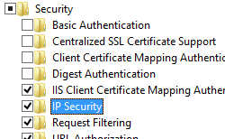

IP Security &lt;ipSecurity&gt;
====================

## Overview

The `<ipSecurity>` element defines a list of IP-based security restrictions in IIS 7 and later. These restrictions can be based on the IP version 4 address, a range of IP version 4 addresses, or a DNS domain name.

## Compatibility

| Version | Notes |
| --- | --- |
| IIS 10.0 | The `<ipSecurity>` element was not modified in IIS 10.0. |
| IIS 8.5 | The `<ipSecurity>` element was not modified in IIS 8.5. |
| IIS 8.0 | The `enableProxyMode` attribute was added to enable you to block requests from a client that connects through a proxy. The `denyAction` attribute was added to specify the default deny mode response that IIS sends back to clients. |
| IIS 7.5 | The `<ipSecurity>` element was not modified in IIS 7.5. |
| IIS 7.0 | The `<ipSecurity>` element was introduced in IIS 7.0. |
| IIS 6.0 | The `<ipSecurity>` element replaces the IIS 6.0 **IPSecurity** metabase property. |

## Setup

The default installation of IIS does not include the role service or Windows feature for IP security. To use IP security on IIS, you must install the role service or Windows feature using the following steps:

### Windows Server 2012 or Windows Server 2012 R2

1. On the taskbar, click **Server Manager**.
2. In **Server Manager**, click the **Manage** menu, and then click **Add Roles and Features**.
3. In the **Add Roles and Features** wizard, click **Next**. Select the installation type and click **Next**. Select the destination server and click **Next**.
4. On the **Server Roles** page, expand **Web Server (IIS)**, expand **Web Server**, expand **Security**, and then select **IP and Domain Restrictions**. Click **Next**.  
     .
5. On the **Select features** page, click **Next**.
6. On the **Confirm installation selections** page, click **Install**.
7. On the **Results** page, click **Close**.

### Windows 8 or Windows 8.1

1. On the **Start** screen, move the pointer all the way to the lower left corner, right-click the **Start** button, and then click **Control Panel**.
2. In **Control Panel**, click **Programs and Features**, and then click **Turn Windows features on or off**.
3. Expand **Internet Information Services**, expand **World Wide Web Services**, expand **Security**, and then select **IP Security**.  
    
4. Click **OK**.
5. Click **Close**.

### Windows Server 2008 or Windows Server 2008 R2

1. On the taskbar, click **Start**, point to **Administrative Tools**, and then click **Server Manager**.
2. In the **Server Manager** hierarchy pane, expand **Roles**, and then click **Web Server (IIS)**.
3. In the **Web Server (IIS)** pane, scroll to the **Role Services** section, and then click **Add Role Services**.
4. On the **Select Role Services** page of the **Add Role Services Wizard**, select **IP and Domain Restrictions**, and then click **Next**.  
  
    
5. On the **Confirm Installation Selections** page, click **Install**.
6. On the **Results** page, click **Close**.

### Windows Vista or Windows 7

1. On the taskbar, click **Start**, and then click **Control Panel**.
2. In **Control Panel**, click **Programs and Features**, and then click **Turn Windows Features on or off**.
3. Expand **Internet Information Services**, then **World Wide Web Services**, then **Security**.
4. Select **IP Security**, and then click **OK**.   
  
    
 

## How To

### How to add IP restrictions to deny access for a Web site

1. Open **Internet Information Services (IIS) Manager**: 

    - If you are using Windows Server 2012 or Windows Server 2012 R2: 

        - On the taskbar, click **Server Manager**, click **Tools**, and then click **Internet Information Services (IIS) Manager**.
    - If you are using Windows 8 or Windows 8.1: 

        - Hold down the **Windows** key, press the letter **X**, and then click **Control Panel**.
        - Click **Administrative Tools**, and then double-click **Internet Information Services (IIS) Manager**.
    - If you are using Windows Server 2008 or Windows Server 2008 R2: 

        - On the taskbar, click **Start**, point to **Administrative Tools**, and then click **Internet Information Services (IIS) Manager**.
    - If you are using Windows Vista or Windows 7: 

        - On the taskbar, click **Start**, and then click **Control Panel**.
        - Double-click **Administrative Tools**, and then double-click **Internet Information Services (IIS) Manager**.
2. In the **Connections** pane, expand the server name, expand **Sites**, and then site, application or Web service for which you want to add IP restrictions.
3. In the **Home** pane, double-click the **IP Address and Domain Restrictions** feature.  
    
4. In the **IP Address and Domain Restrictions** feature, click **Add Deny Entry...** in the **Actions** pane.  
    
5. Enter the IP address that you wish to deny, and then click **OK**.  
    

* * *

### How to edit the IP restrictions feature settings for a Web site

1. Open **Internet Information Services (IIS) Manager**: 

    - If you are using Windows Server 2012 or Windows Server 2012 R2: 

        - On the taskbar, click **Server Manager**, click **Tools**, and then click **Internet Information Services (IIS) Manager**.
    - If you are using Windows 8 or Windows 8.1: 

        - Hold down the **Windows** key, press the letter **X**, and then click **Control Panel**.
        - Click **Administrative Tools**, and then double-click **Internet Information Services (IIS) Manager**.
    - If you are using Windows Server 2008 or Windows Server 2008 R2: 

        - On the taskbar, click **Start**, point to **Administrative Tools**, and then click **Internet Information Services (IIS) Manager**.
    - If you are using Windows Vista or Windows 7: 

        - On the taskbar, click **Start**, and then click **Control Panel**.
        - Double-click **Administrative Tools**, and then double-click **Internet Information Services (IIS) Manager**.
2. In the **Connections** pane, expand the server name, expand **Sites**, and then site, application or Web service for which you want to add IP restrictions.
3. In the **Home** pane, double-click the **IP Address and Domain Restrictions** feature.  
    
4. In the **IP Address and Domain Restrictions** feature, click **Edit Feature Settings...** in the **Actions** pane.  
    
5. Choose the default access behavior for unspecified clients, specify whether to enable restrictions by domain name, specify whether to enable **Proxy Mode**, select the **Deny Action Type**, and then click **OK**.  
    
 

## Configuration

Rules are processed from top to bottom, in the order they appear in the list. The **allowUnlisted** attribute is processed last. Best practice for Internet Protocol security (IPsec) restrictions is to list Deny rules first. You cannot clear the **allowUnlisted** attribute if it is set to **false**.

The following default `<ipSecurity>` element is configured in the root ApplicationHost.config file in IIS 7 and later. This configuration section inherits the default configuration settings unless you use the `<clear>` element.

[!code-xml[Main](index/samples/sample1.xml)]

### Attributes

| Attribute | Description |
| --- | --- |
| `allowUnlisted` | Optional Boolean attribute.  Specifies whether to allow unlisted IP addresses. Setting the **allowUnlisted** attribute to **true** allows an unlisted IP address to access the server. Setting the **allowUnlisted** attribute to **false** locks down the server, preventing access to all IP address unless they are listed. If you were to set this attribute to false and do not list the local loopback address (127.0.0.1) as an allowed IP address, you would not be able to access your server by using a browser from a local console.  This attribute can also affect delegation. If you were to set this attribute to false in a parent configuration, you would not be able use the `<clear>` element to clear this configuration in child configuration files.  The default value is `true`. |
| `denyAction` | Optional enum attribute.  Specifies the default deny mode response that IIS should send back to clients.   The default value is `forbidden`. <table> <tbody> <tr> <th>Value</th> <th>Description</th></tr> <tr> <th><code>AbortRequest</code></th> <td>Specifies that by default IIS should send a deny mode response of <code>Abort</code> back to clients. 
The numeric value is <code>0</code>.
</td></tr> <tr> <th><code>Unauthorized</code></th> <td>Specifies that by default IIS should send a deny mode response of <code>Unauthorized</code> back to clients. If a browser-based client is being used at the remote end, returning Unauthorized may cause an authentication dialog to appear at the remote client, resulting in spurious authentication attempts to IIS. 
The numeric value is <code>401</code>.
</td></tr> <tr> <th><code>Forbidden</code></th> <td>Specifies that by default IIS should send a deny mode response of <code>Forbidden</code> back to clients. 
The numeric value is <code>403</code>.
</td></tr> <tr> <th><code>NotFound</code></th> <td>Specifies that by default IIS should send a deny mode response of <code>Not Found</code> back to clients. 
The numeric value is <code>404</code>.
</td></tr></tbody></table> |
| `enableProxyMode` | Optional Boolean attribute.  Enables IIS not only to block requests from a client IP that is seen by IIS, but also to block requests from IP addresses that are received in the x-forwarded-for HTTP header. This header enables you to identify the originating IP address of a client that connects through an HTTP proxy or load balancer. This is referred to as proxy mode.  The default value is `false`. |
| `enableReverseDns` | Optional Boolean attribute.  Specifies whether to enable or disable reverse Domain Name System (DNS) lookups for the Web server. Reverse lookups involve looking up the domain name when the IP address is known.  **Caution**: Reverse DNS lookups will use significant resources and time.  The default value is `false`. |

### Child Elements

| Element | Description |
| --- | --- |
| [`add`](add.md) | Optional element.  Adds an IP restriction to the collection of IP address restrictions. |
| `remove` | Optional element.  Removes a reference to a restriction from the `<ipSecurity>` collection. |
| `clear` | Optional element.  Removes all references to restrictions from the `<ipSecurity>` collection. |

### Configuration Sample

The following configuration sample adds two IP restrictions to the Default Web Site; the first restriction denies access to the IP address 192.168.100.1, and the second restriction denies access to the entire 169.254.0.0 network.

[!code-xml[Main](index/samples/sample2.xml)]

## Sample Code

The following code samples enble reverse DNS lookups for the default web site.

### AppCmd.exe

[!code-console[Main](index/samples/sample3.cmd)]

> [!NOTE]
> You must be sure to set the **commit** parameter to `apphost` when you use AppCmd.exe to configure these settings. This commits the configuration settings to the appropriate location section in the ApplicationHost.config file.

### C#

[!code-csharp[Main](index/samples/sample4.cs)]

### VB.NET

[!code-vb[Main](index/samples/sample5.vb)]

### JavaScript

[!code-javascript[Main](index/samples/sample6.js)]

### VBScript

[!code-vb[Main](index/samples/sample7.vb)]