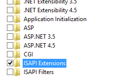
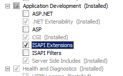
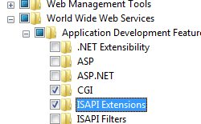

ISAPI/CGI Restrictions &lt;isapiCgiRestriction&gt;
====================

## Overview

The `<isapiCgiRestriction>` element of the [&lt;security&gt;](../index.md) element allows you to specify a list of Common Gateway Interface (CGI) and Internet Server Application Programming Interface (ISAPI) applications that can run on Internet Information Services (IIS) 7. This element allows you to ensure that malicious users cannot copy unauthorized CGI and ISAPI binaries to your Web server and then run them.

You need to use this element to configure your Web server only when a site or application uses an application pool that runs in Classic mode. The restrictions you configure in the `<isapiCgiRestriction>` element apply to only ISAPI and CGI code.

The `<isapiCgiRestriction>` element contains a collection of `<add>` elements. Each `<add>` element defines a distinct binary that cannot run on an IIS 7 server in Classic mode.

For example, if you created an ASP.NET 2.0 application and configured the application to use an application pool that runs in Classic mode, any requests for the ASP.NET application must go through the aspnet\_isapi.dll to be processed. To make sure that IIS processes the ASP.NET requests, IIS populates the `<isapiCgiRestriction>` element with an `<add>` element that contains an allowed attribute with its value set to **true**.

If you changed the allowed attribute to **false** and left the application pool in Classic mode, ASP.NET requests would fail. However, if you changed the application pool to Integrated mode, IIS processes the ASP.NET requests using the integrated request pipeline, which bypasses the ISAPI and CGI restriction you configured.

The `<isapiCgiRestriction>` element works in tandem with the [&lt;applicationDependencies&gt;](../applicationdependencies/index.md) element to define which applications have dependencies on one or more CGI or ISAPI extension restrictions.

## Compatibility

| Version | Notes |
| --- | --- |
| IIS 10.0 | The `<isapiCgiRestriction>` element was not modified in IIS 10.0. |
| IIS 8.5 | The `<isapiCgiRestriction>` element was not modified in IIS 8.5. |
| IIS 8.0 | The `<isapiCgiRestriction>` element was not modified in IIS 8.0. |
| IIS 7.5 | The `<isapiCgiRestriction>` element was not modified in IIS 7.5. |
| IIS 7.0 | The `<isapiCgiRestriction>` element was introduced in IIS 7.0. |
| IIS 6.0 | The `<isapiCgiRestriction>` collection replaces the **WebSvcExtRestrictionList** property of the IIS 6.0 **IIsWebService** metabase object. |

## Setup

The `<isapiCgiRestriction>` collection is available only after you install the CGI or ISAPI Extensions modules on your IIS 7 and later server. You cannot install it independent of those features.

### Windows Server 2012 or Windows Server 2012 R2

1. On the taskbar, click **Server Manager**.
2. In **Server Manager**, click the **Manage** menu, and then click **Add Roles and Features**.
3. In the **Add Roles and Features** wizard, click **Next**. Select the installation type and click **Next**. Select the destination server and click **Next**.
4. On the **Server Roles** page, expand **Web Server (IIS)**, expand **Web Server**, expand **Application Deelopment**, and then select **CGI** or **ISAPI Extensions**. Click **Next**.  
     .
5. On the **Select features** page, click **Next**.
6. On the **Confirm installation selections** page, click **Install**.
7. On the **Results** page, click **Close**.

### Windows 8 or Windows 8.1

1. On the **Start** screen, move the pointer all the way to the lower left corner, right-click the **Start** button, and then click **Control Panel**.
2. In **Control Panel**, click **Programs and Features**, and then click **Turn Windows features on or off**.
3. Expand **Internet Information Services**, expand **World Wide Web Services**, expand **Application Development Features**, and then select **CGI** or **ISAPI Extensions**.  
    
4. Click **OK**.
5. Click **Close**.

### Windows Server 2008 or Windows Server 2008 R2

1. On the taskbar, click **Start**, point to **Administrative Tools**, and then click **Server Manager**.
2. In the **Server Manager** hierarchy pane, expand **Roles**, and then click **Web Server (IIS)**.
3. In the **Web Server (IIS)** pane, scroll to the **Role Services** section, and then click **Add Role Services**.
4. On the **Select Role Services** page of the **Add Role Services Wizard**, select **CGI** or **ISAPI Extensions**.  
    
5. If the **Add role services** dialog appears, click **Add Required Role Services**. (This page appears only if you have not already installed any prerequisite role services on your server.)
6. On the **Select Role Services** page, click **Next**.
7. On the **Confirm Installation Selections** page, click **Install**.
8. On the **Results** page, click **Close**.

### Windows Vista or Windows 7

1. On the taskbar, click **Start**, and then click **Control Panel**.
2. In **Control Panel**, click **Programs and Features**, and then click **Turn Windows Features on or off**.
3. In the Windows Features dialog box, expand **Internet Information Services**, then **World Wide Web Services**, then **Application Development Features**.
4. Select **CGI** or **ISAPI Extensions**, and then click **OK**.  
    

## How To

### How to add an ISAPI or CGI restriction

1. Open **Internet Information Services (IIS) Manager**:

    - If you are using Windows Server 2012 or Windows Server 2012 R2:

        - On the taskbar, click **Server Manager**, click **Tools**, and then click **Internet Information Services (IIS) Manager**.
    - If you are using Windows 8 or Windows 8.1:

        - Hold down the **Windows** key, press the letter **X**, and then click **Control Panel**.
        - Click **Administrative Tools**, and then double-click **Internet Information Services (IIS) Manager**.
    - If you are using Windows Server 2008 or Windows Server 2008 R2:

        - On the taskbar, click **Start**, point to **Administrative Tools**, and then click **Internet Information Services (IIS) Manager**.
    - If you are using Windows Vista or Windows 7:

        - On the taskbar, click **Start**, and then click **Control Panel**.
        - Double-click **Administrative Tools**, and then double-click **Internet Information Services (IIS) Manager**.
2. In the **Connections** pane, click the server name.
3. In the **Home** pane, double-click **ISAPI and CGI Restrictions**.  
    
4. In the **Actions** pane, click **Add...**
5. In the **Add ISAPI or CGI Restriction** dialog box, type the path to the binary you want to add in the **ISAPI or CGI path** box, type the description of the binary in the **Description** box, select the **Allow extension path option to execute** check box to allow the binary to run on the server, and then click **OK**.  
    

## Configuration

The `<isapiCgiRestriction>` collection can only be configured at the server level in the ApplicationHost.config file.

### Attributes

| Attribute | Description |
| --- | --- |
| `notListedIsapisAllowed` | Optional Boolean attribute.  Specifies whether unlisted ISAPI modules are allowed to run on this server.   The default value is `false`. |
| `notListedCgisAllowed` | Optional Boolean attribute.  Specifies whether unlisted CGI programs are allowed to run on this server.   The default value is `false`. |

### Child Elements

| Element | Description |
| --- | --- |
| [`add`](add.md) | Optional element.  Adds a restriction to the collection of ISAPI and CGI restrictions. |
| `remove` | Optional element.   Removes a reference to a restriction from the isapiCgiRestriction collection. |
| `clear` | Optional element.  Removes all references to restrictions from the isapiCgiRestriction collection. |

### Configuration Sample

The following configuration example is the `<isapiCgiRestriction>` element configuration for IIS 7.0 after you install ASP and ASP.NET version 2.0.

[!code-xml[Main](index/samples/sample1.xml)]

## Sample Code

The following examples add an ISAPI/CGI restriction for a custom ISAPI extension that is located in the content folder for a Web site that is located in C:\Inetpub\www.contoso.com\wwwroot. The examples specify the name, path, and group of the ISAPI extension, and enable the extension.

### AppCmd.exe

[!code-console[Main](index/samples/sample2.cmd)]

> [!NOTE]
> You must be sure to set the **commit** parameter to `apphost` when you use AppCmd.exe to configure these settings. This commits the configuration settings to the appropriate location section in the ApplicationHost.config file.

### C\#

[!code-csharp[Main](index/samples/sample3.cs)]

### VB.NET

[!code-vb[Main](index/samples/sample4.vb)]

### JavaScript

[!code-javascript[Main](index/samples/sample5.js)]

### VBScript

[!code-vb[Main](index/samples/sample6.vb)]
