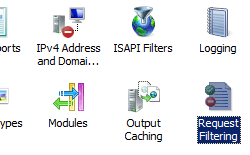

File Name Extensions &lt;fileExtensions&gt;
====================

## Overview

The `<fileExtensions>` element contains a collection of `<add>` elements that specify unique file name extensions that IIS will either allow or deny, depending on how each `<add>` element is defined. By using the `<fileExtensions>` element, you can fine-tune the types of content that your server will make available to Web clients.

For example, if you set the **allowUnlisted** attribute to **false**, all requests for files with extensions that are not contained in the list of allowed extensions will be denied. By using the `<clear>` element, you can clear the list of the file name extensions that have already been defined, then you can specify just the file name extensions that you want to allow.

> [!NOTE]
> When request filtering blocks an HTTP request because of a denied file name extension, IIS 7 will return an HTTP 404 error to the client and log the following HTTP status with a unique substatus that identifies the reason that the request was denied:

| HTTP Substatus | Description |
| --- | --- |
| `404.7` | File Extension Denied |

This substatus allows Web administrators to analyze their IIS logs and identify potential threats.

## Compatibility

| Version | Notes |
| --- | --- |
| IIS 10.0 | The `<fileExtensions>` element was not modified in IIS 10.0. |
| IIS 8.5 | The `<fileExtensions>` element was not modified in IIS 8.5. |
| IIS 8.0 | The `<fileExtensions>` element was not modified in IIS 8.0. |
| IIS 7.5 | The `<fileExtensions>` element was not modified in IIS 7.5. |
| IIS 7.0 | The `<fileExtensions>` element of the `<requestFiltering>` collection was introduced in IIS 7.0. |
| IIS 6.0 | The `<fileExtensions>` element replaces the IIS 6.0 UrlScan **[AllowExtensions]** and **[DenyExtensions]** features. |

## Setup

The default installation of IIS 7 and later includes the Request Filtering role service or feature. If the Request Filtering role service or feature is uninstalled, you can reinstall it using the following steps.

### Windows Server 2012 or Windows Server 2012 R2

1. On the taskbar, click **Server Manager**.
2. In **Server Manager**, click the **Manage** menu, and then click **Add Roles and Features**.
3. In the **Add Roles and Features** wizard, click **Next**. Select the installation type and click **Next**. Select the destination server and click **Next**.
4. On the **Server Roles** page, expand **Web Server (IIS)**, expand **Web Server**, expand **Security**, and then select **Request Filtering**. Click **Next**.  
     .
5. On the **Select features** page, click **Next**.
6. On the **Confirm installation selections** page, click **Install**.
7. On the **Results** page, click **Close**.

### Windows 8 or Windows 8.1

1. On the **Start** screen, move the pointer all the way to the lower left corner, right-click the **Start** button, and then click **Control Panel**.
2. In **Control Panel**, click **Programs and Features**, and then click **Turn Windows features on or off**.
3. Expand **Internet Information Services**, expand **World Wide Web Services**, expand **Security**, and then select **Request Filtering**.  
    
4. Click **OK**.
5. Click **Close**.

### Windows Server 2008 or Windows Server 2008 R2

1. On the taskbar, click **Start**, point to **Administrative Tools**, and then click **Server Manager**.
2. In the **Server Manager** hierarchy pane, expand **Roles**, and then click **Web Server (IIS)**.
3. In the **Web Server (IIS)** pane, scroll to the **Role Services** section, and then click **Add Role Services**.
4. On the **Select Role Services** page of the **Add Role Services Wizard**, select **Request Filtering**, and then click **Next**.   
    
5. On the **Confirm Installation Selections** page, click **Install**.
6. On the **Results** page, click **Close**.

### Windows Vista or Windows 7

1. On the taskbar, click **Start**, and then click **Control Panel**.
2. In **Control Panel**, click **Programs and Features**, and then click **Turn Windows Features on or off**.
3. Expand **Internet Information Services**, then **World Wide Web Services**, and then **Security**.
4. Select **Request Filtering**, and then click **OK**.   
    
 

## How To

**Note for IIS 7.0 users**: Some of the steps in this section may require that you install the Microsoft Administration Pack for IIS 7.0, which includes a user interface for request filtering. To install the Microsoft Administration Pack for IIS 7.0, please see the following URL:

- [https://www.iis.net/expand/AdministrationPack](https://www.iis.net/downloads/microsoft/administration-pack)

### How to deny access to a specific file name extension

1. Open **Internet Information Services (IIS) Manager**: 

    - If you are using Windows Server 2012 or Windows Server 2012 R2: 

        - On the taskbar, click **Server Manager**, click **Tools**, and then click **Internet Information Services (IIS) Manager**.
    - If you are using Windows 8 or Windows 8.1: 

        - Hold down the **Windows** key, press the letter **X**, and then click **Control Panel**.
        - Click **Administrative Tools**, and then double-click **Internet Information Services (IIS) Manager**.
    - If you are using Windows Server 2008 or Windows Server 2008 R2: 

        - On the taskbar, click **Start**, point to **Administrative Tools**, and then click **Internet Information Services (IIS) Manager**.
    - If you are using Windows Vista or Windows 7: 

        - On the taskbar, click **Start**, and then click **Control Panel**.
        - Double-click **Administrative Tools**, and then double-click **Internet Information Services (IIS) Manager**.
2. In the **Connections** pane, go to the connection, site, application, or directory for which you want to modify your request filtering settings.
3. In the **Home** pane, double-click **Request Filtering**.  
    
4. In the **Request Filtering** pane, click the **File Name Extensions** tab, and then click **Deny File Name Extension...** in the **Actions** pane.  
    
5. In the **Deny File Name Extension** dialog box, enter the file name extension that you wish to block, and then click **OK**.  
      For example, to prevent access to files with a file name extension of .inc, you would enter &quot;inc&quot; in the dialog box.

## Configuration

### Attributes

| Attribute | Description |
| --- | --- |
| `allowUnlisted` | Optional Boolean attribute. Specifies whether the Web server should process files that have unlisted file name extensions. If you set this attribute to **true**, you must list all file name extensions you want to deny. If you set this attribute to **false**, you must list all file name extensions you want to allow. The default value is `true`. |
| `applyToWebDAV` | Optional Boolean attribute. Specifies whether these settings should also apply to WebDAV requests. |

### Child Elements

| Element | Description |
| --- | --- |
| [`add`](add.md) | Optional element. Adds a file name extension to the collection of file name extensions. |
| `clear` | Optional element. Removes all references to file name extensions from the `<fileExtensions>` collection. |
| `remove` | Optional element. Removes a reference to a file name extension from the `<fileExtensions>` collection. |

### Configuration Sample

The following example Web.config file will configure two options. It will configure request filtering to allow WebDAV access to all file name extensions, and it will configure IIS to deny access to files with a file name extension of .inc, which are sometimes used as include files for applications.

[!code-xml[Main](index/samples/sample1.xml)]

## Sample Code

The following code samples will add an entry to the list of file name extensions for the Default Web Site that will deny access to all files with an extension of .inc, which are sometimes used as include files for applications, and they will configure request filtering to allow WebDAV access to hidden segments.

> [!NOTE]
> To use the same samples to allow access, you would set the value of the **allowed** attribute to **true** instead of **false** in each of these examples.

### AppCmd.exe

[!code-console[Main](index/samples/sample2.cmd)]

### C#

[!code-csharp[Main](index/samples/sample3.cs)]

### VB.NET

[!code-vb[Main](index/samples/sample4.vb)]

### JavaScript

[!code-javascript[Main](index/samples/sample5.js)]

### VBScript

[!code-vb[Main](index/samples/sample6.vb)]