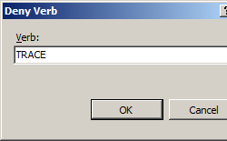

# Request Filtering &lt;requestFiltering&gt;

## Overview

Request Filtering is a built-in security feature that was introduced in Internet Information Services (IIS) 7.0, and replaces much of the functionality that was available through the UrlScan add-on for IIS 6.0. All of the settings for the request filtering feature are located within the `<requestFiltering>` element, which contains several child elements for each of the following feature areas:

- [`<denyUrlSequences>`](denyurlsequences/index.md) - This element can contain a collection of URL sequence patterns that IIS 7 will deny; for example: you can deny parts of URL sequences that an attacker might try to exploit.
- [`<fileExtensions>`](fileextensions/index.md) - This element can contain a collection of file name extensions that IIS 7 will either deny or allow; for example: you can block all requests for Web.config files.
- [`<hiddenSegments>`](hiddensegments/index.md) - This element can contain a collection of URLs that cannot be browsed; for example: you can deny requests for the ASP.NET App\_Code folder.
- [`<requestLimits>`](requestlimits/index.md) - This element contains the settings for URL, content, and query string lengths. It can also contain a collection of user-defined maximum lengths for HTTP headers.
- [`<verbs>`](verbs/index.md) - This element can contain a collection of HTTP verbs that IIS 7 will either deny or allow; for example: you can block all HTTP TRACE requests.

#### New in IIS 7.5

IIS 7.5 added several additional feature areas for request filtering:

- [`<alwaysAllowedUrls>`](alwaysallowedurls/index.md) - This element can contain a collection of URLs that request filtering will always allow.
- [`<alwaysAllowedQueryStrings>`](alwaysallowedquerystrings/index.md) -This element can contain a collection query strings of that request filtering will always allow.
- [`<denyQueryStringSequences>`](denyquerystringsequences/index.md) - This element can contain a collection of query string sequences that request filtering will always deny. This allows administrators to block potentially dangerous query string sequences that they detect.
- [`<filteringRules>`](filteringrules/index.md) - This element can contain a collection of custom request filtering rules. This collection allows administrators to create customized request filtering rules for specific criteria.

#### New in IIS 10.0

IIS 10.0 added the `removeServerHeader` attribute to suppress sending the HTTP server header to remote clients.

#### HTTP 404 Error Substatus Codes

When request filtering blocks an HTTP request, IIS 7 will return an HTTP 404 error to the client and log the HTTP status with a unique substatus that identifies the reason that the request was denied. For example:

| HTTP Substatus | Description |
| --- | --- |
| `404.5` | URL Sequence Denied |
| `404.6` | Verb Denied |
| `404.7` | File Extension Denied |
| `404.8` | Hidden Namespace |
| `404.11` | URL Double Escaped |
| `404.12` | URL Has High Bit Chars |
| `404.14` | URL Too Long |
| `404.15` | Query String Too Long |
| `404.18` | Query String Sequence Denied |
| `404.19` | Denied by Filtering Rule |
| `413.1` | Content Length Too Large |
| `431` | Request Header Too Long |

These substatuses allow Web administrators to analyze their IIS logs and identify potential threats.

## Compatibility

| Version | Notes |
| --- | --- |
| IIS 10.0 | The ability to suppress the server header was added in IIS 10.0. |
| IIS 8.5 | The `<requestFiltering>` element was not modified in IIS 8.5. |
| IIS 8.0 | The `<requestFiltering>` element was not modified in IIS 8.0. |
| IIS 7.5 | In IIS 7.5, request filtering ships with the `unescapeQueryString` attribute and the `alwaysAllowedUrls`, `alwaysAllowedQueryStrings`, `denyQueryStringSequences`, and `filteringRules` elements. These elements were first introduced as an update for IIS 7.0 that is available through [Microsoft Knowledge Base Article 957508](https://support.microsoft.com/kb/957508). |
| IIS 7.0 | The `<requestFiltering>` element was introduced in IIS 7.0. |
| IIS 6.0 | The `<requestFiltering>` element replaces the IIS 6.0 UrlScan features. |

## Setup

The default installation of IIS 7 and later includes the Request Filtering role service or feature. If the Request Filtering role service or feature is uninstalled, you can reinstall it using the following steps.

### Windows Server 2012 or Windows Server 2012 R2

1. On the taskbar, click **Server Manager**.
2. In **Server Manager**, click the **Manage** menu, and then click **Add Roles and Features**.
3. In the **Add Roles and Features** wizard, click **Next**. Select the installation type and click **Next**. Select the destination server and click **Next**.
4. On the **Server Roles** page, expand **Web Server (IIS)**, expand **Web Server**, expand **Security**, and then select **Request Filtering**. Click **Next**.  
     .
5. On the **Select features** page, click **Next**.
6. On the **Confirm installation selections** page, click **Install**.
7. On the **Results** page, click **Close**.

### Windows 8 or Windows 8.1

1. On the **Start** screen, move the pointer all the way to the lower left corner, right-click the **Start** button, and then click **Control Panel**.
2. In **Control Panel**, click **Programs and Features**, and then click **Turn Windows features on or off**.
3. Expand **Internet Information Services**, expand **World Wide Web Services**, expand **Security**, and then select **Request Filtering**.  
    
4. Click **OK**.
5. Click **Close**.

### Windows Server 2008 or Windows Server 2008 R2

1. On the taskbar, click **Start**, point to **Administrative Tools**, and then click **Server Manager**.
2. In the **Server Manager** hierarchy pane, expand **Roles**, and then click **Web Server (IIS)**.
3. In the **Web Server (IIS)** pane, scroll to the **Role Services** section, and then click **Add Role Services**.
4. On the **Select Role Services** page of the **Add Role Services Wizard**, select **Request Filtering**, and then click **Next**.   
    
5. On the **Confirm Installation Selections** page, click **Install**.
6. On the **Results** page, click **Close**.

### Windows Vista or Windows 7

1. On the taskbar, click **Start**, and then click **Control Panel**.
2. In **Control Panel**, click **Programs and Features**, and then click **Turn Windows Features on or off**.
3. Expand **Internet Information Services**, then **World Wide Web Services**, and then **Security**.
4. Select **Request Filtering**, and then click **OK**.   
    
 

## How To

**Note for IIS 7.0 users**: Some of the steps in this section may require that you install the Microsoft Administration Pack for IIS 7.0, which includes a user interface for request filtering. To install the Microsoft Administration Pack for IIS 7.0, please see the following URL:

- [https://www.iis.net/expand/AdministrationPack](https://www.iis.net/downloads/microsoft/administration-pack)

* * *

### How to edit the request filtering feature settings and request limits

1. Open **Internet Information Services (IIS) Manager**: 

    - If you are using Windows Server 2012 or Windows Server 2012 R2: 

        - On the taskbar, click **Server Manager**, click **Tools**, and then click **Internet Information Services (IIS) Manager**.
    - If you are using Windows 8 or Windows 8.1: 

        - Hold down the **Windows** key, press the letter **X**, and then click **Control Panel**.
        - Click **Administrative Tools**, and then double-click **Internet Information Services (IIS) Manager**.
    - If you are using Windows Server 2008 or Windows Server 2008 R2: 

        - On the taskbar, click **Start**, point to **Administrative Tools**, and then click **Internet Information Services (IIS) Manager**.
    - If you are using Windows Vista or Windows 7: 

        - On the taskbar, click **Start**, and then click **Control Panel**.
        - Double-click **Administrative Tools**, and then double-click **Internet Information Services (IIS) Manager**.
2. In the **Connections** pane, go to the connection, site, application, or directory for which you want to modify your request filtering settings.
3. In the **Home** pane, double-click **Request Filtering**.  
    
4. Click **Edit Feature Settings...** in the **Actions** pane.  
    
5. Specify your options, and then click **OK**.  
      For example, you could make the following changes:

    - Change the maximum URL length to 2KB by specifying 2048.
    - Change the maximum query string length to 1KB by specifying 1024.
    - Deny access to unlisted HTTP verbs by clearing the **Allow unlisted verbs** check box.

* * *

### How to deny a URL sequence

1. Open **Internet Information Services (IIS) Manager**: 

    - If you are using Windows Server 2012 or Windows Server 2012 R2: 

        - On the taskbar, click **Server Manager**, click **Tools**, and then click **Internet Information Services (IIS) Manager**.
    - If you are using Windows 8 or Windows 8.1: 

        - Hold down the **Windows** key, press the letter **X**, and then click **Control Panel**.
        - Click **Administrative Tools**, and then double-click **Internet Information Services (IIS) Manager**.
    - If you are using Windows Server 2008 or Windows Server 2008 R2: 

        - On the taskbar, click **Start**, point to **Administrative Tools**, and then click **Internet Information Services (IIS) Manager**.
    - If you are using Windows Vista or Windows 7: 

        - On the taskbar, click **Start**, and then click **Control Panel**.
        - Double-click **Administrative Tools**, and then double-click **Internet Information Services (IIS) Manager**.
2. In the **Connections** pane, go to the connection, site, application, or directory for which you want to modify your request filtering settings.
3. In the **Home** pane, double-click **Request Filtering**.   
    
4. In the **Request Filtering** pane, click the **Deny URL Sequences** tab, and then click **Add URL Sequence...** in the **Actions** pane.   
    
5. In the **Add Deny Sequence** dialog box, enter the URL sequence that you wish to block, and then click **OK**.   
      
 For example, to prevent directory transversal on your server, you would enter two periods ("..") in the dialog box.

* * *

### How to deny access to a specific file name extension

1. Open **Internet Information Services (IIS) Manager**: 

    - If you are using Windows Server 2012 or Windows Server 2012 R2: 

        - On the taskbar, click **Server Manager**, click **Tools**, and then click **Internet Information Services (IIS) Manager**.
    - If you are using Windows 8 or Windows 8.1: 

        - Hold down the **Windows** key, press the letter **X**, and then click **Control Panel**.
        - Click **Administrative Tools**, and then double-click **Internet Information Services (IIS) Manager**.
    - If you are using Windows Server 2008 or Windows Server 2008 R2: 

        - On the taskbar, click **Start**, point to **Administrative Tools**, and then click **Internet Information Services (IIS) Manager**.
    - If you are using Windows Vista or Windows 7: 

        - On the taskbar, click **Start**, and then click **Control Panel**.
        - Double-click **Administrative Tools**, and then double-click **Internet Information Services (IIS) Manager**.
2. In the **Connections** pane, go to the connection, site, application, or directory for which you want to modify your request filtering settings.
3. In the **Home** pane, double-click **Request Filtering**.  
    
4. In the **Request Filtering** pane, click the **File Name Extensions** tab, and then click **Deny File Name Extension...** in the **Actions** pane.  
    
5. In the **Deny File Name Extension** dialog box, enter the file name extension that you wish to block, and then click **OK**.  
      For example, to prevent access to files with a file name extension of .inc, you would enter &quot;inc&quot; in the dialog box.

* * *

### How to add a hidden segment

1. Open **Internet Information Services (IIS) Manager**: 

    - If you are using Windows Server 2012 or Windows Server 2012 R2: 

        - On the taskbar, click **Server Manager**, click **Tools**, and then click **Internet Information Services (IIS) Manager**.
    - If you are using Windows 8 or Windows 8.1: 

        - Hold down the **Windows** key, press the letter **X**, and then click **Control Panel**.
        - Click **Administrative Tools**, and then double-click **Internet Information Services (IIS) Manager**.
    - If you are using Windows Server 2008 or Windows Server 2008 R2: 

        - On the taskbar, click **Start**, point to **Administrative Tools**, and then click **Internet Information Services (IIS) Manager**.
    - If you are using Windows Vista or Windows 7: 

        - On the taskbar, click **Start**, and then click **Control Panel**.
        - Double-click **Administrative Tools**, and then double-click **Internet Information Services (IIS) Manager**.
2. In the **Connections** pane, go to the connection, site, application, or directory for which you want to modify your request filtering settings.
3. In the **Home** pane, double-click **Request Filtering**.   
    
4. In the **Request Filtering** pane, click the **Hidden Segments** tab, and then click **Add Hidden Segment...** in the **Actions** pane.   
    
5. In the **Add Hidden Segment** dialog box, enter the relative path that you want to hide, and then click **OK**.   
    

* * *

### How to add limits for HTTP headers

1. Open **Internet Information Services (IIS) Manager**: 

    - If you are using Windows Server 2012 or Windows Server 2012 R2: 

        - On the taskbar, click **Server Manager**, click **Tools**, and then click **Internet Information Services (IIS) Manager**.
    - If you are using Windows 8 or Windows 8.1: 

        - Hold down the **Windows** key, press the letter **X**, and then click **Control Panel**.
        - Click **Administrative Tools**, and then double-click **Internet Information Services (IIS) Manager**.
    - If you are using Windows Server 2008 or Windows Server 2008 R2: 

        - On the taskbar, click **Start**, point to **Administrative Tools**, and then click **Internet Information Services (IIS) Manager**.
    - If you are using Windows Vista or Windows 7: 

        - On the taskbar, click **Start**, and then click **Control Panel**.
        - Double-click **Administrative Tools**, and then double-click **Internet Information Services (IIS) Manager**.
2. In the **Connections** pane, go to the connection, site, application, or directory for which you want to modify your request filtering settings.
3. In the **Home** pane, double-click **Request Filtering**.   
    
4. In the **Request Filtering** pane, click the **Headers** tab, and then click **Add Header...** in the **Actions** pane.   
    
5. In the **Add Header** dialog box, enter the HTTP header and the maximum size that you want for the header limit, and then click **OK**.   
    

    For example, the "Content-type" header contains the MIME type for a request. Specifying a value of 100 would limit the length of the "Content-type" header to 100 bytes.

* * *

### How to deny an HTTP verb

1. Open **Internet Information Services (IIS) Manager**: 

    - If you are using Windows Server 2012 or Windows Server 2012 R2: 

        - On the taskbar, click **Server Manager**, click **Tools**, and then click **Internet Information Services (IIS) Manager**.
    - If you are using Windows 8 or Windows 8.1: 

        - Hold down the **Windows** key, press the letter **X**, and then click **Control Panel**.
        - Click **Administrative Tools**, and then double-click **Internet Information Services (IIS) Manager**.
    - If you are using Windows Server 2008 or Windows Server 2008 R2: 

        - On the taskbar, click **Start**, point to **Administrative Tools**, and then click **Internet Information Services (IIS) Manager**.
    - If you are using Windows Vista or Windows 7: 

        - On the taskbar, click **Start**, and then click **Control Panel**.
        - Double-click **Administrative Tools**, and then double-click **Internet Information Services (IIS) Manager**.
2. In the **Connections** pane, go to the connection, site, application, or directory for which you want to modify your request filtering settings.
3. In the **Home** pane, double-click **Request Filtering**.   
    
4. In the **Request Filtering** pane, click the **HTTP verbs** tab, and then click **Deny Verb...** in the **Actions** pane.   
    
5. In the **Deny Verb** dialog box, enter the HTTP verb that you wish to block, and then click **OK**.   
    

    For example, to prevent HTTP TRACE requests to your server, you would enter "TRACE" in the dialog box.

## Configuration

### Attributes

| Attribute | Description |
| --- | --- |
| `allowDoubleEscaping` | Optional Boolean attribute.  If set to **true**, request filtering will allow URLs with doubly-escaped characters. If set to **false**, request filtering will deny the request if characters that have been escaped twice are present in URLs.  The default value is `false`. |
| `allowHighBitCharacters` | Optional Boolean attribute.  If set to **true**, request filtering will allow non-ASCII characters in URLs. If set to **false**, request filtering will deny the request if high-bit characters are present in URLs.  The default value is `true`. |
| `removeServerHeader` | Optional Boolean attribute.  If set to **true**, request filtering will suppress the IIS server header. If set to **false**, IIS will return the default server header. (Note: This attribute was added in IIS 10.0 and does not work in versions of Windows prior to Windows Server, version 1709 or Windows 10, version 1709.)  The default value is `false`. |
| `unescapeQueryString` | Optional Boolean attribute.  If set to **true**, request filtering will perform two passes on each query string scan. The first pass will scan the raw query string, and the second pass will scan the query string after IIS has decoded any escape sequences. If set to **false**, request filtering will only look at the raw query string as sent by the client.  **Note:** This attribute was added in IIS 7.5.  The default value is `true`. |

### Child Elements

| Element | Description |
| --- | --- |
| [`alwaysAllowedQueryStrings`](alwaysallowedquerystrings/index.md) | Optional element.  Specifies a collection of query strings that request filtering will always allow.  **Note:** This element was added in IIS 7.5. |
| [`alwaysAllowedUrls`](alwaysallowedurls/index.md) | Optional element.  Specifies a collection of URLs that request filtering will always allow.  **Note:** This element was added in IIS 7.5. |
| [`denyQueryStringSequences`](denyquerystringsequences/index.md) | Optional element.  Specifies a collection of query string sequences that request filtering will always deny.  **Note:** This element was added in IIS 7.5. |
| [`denyUrlSequences`](denyurlsequences/index.md) | Optional element.  Specifies sequences that should be denied to help prevent URL-based attacks on the Web server. |
| [`fileExtensions`](fileextensions/index.md) | Optional element.  Specifies which file name extensions are allowed or denied to limit types of requests sent to the Web server. |
| [`filteringRules`](filteringrules/index.md) | Optional element.  Specifies a collection of custom request filtering rules.  **Note:** This element was added in IIS 7.5. |
| [`hiddenSegments`](hiddensegments/index.md) | Optional element.  Specifies that certain segments of URLs can be made inaccessible to clients. |
| [`requestLimits`](requestlimits/index.md) | Optional element.  Specifies limits on requests processed by the Web server. |
| [`verbs`](verbs/index.md) | Optional element.  Specifies which HTTP verbs are allowed or denied to limit types of requests sent to the Web server. |

### Configuration Sample

The following configuration sample from a Web.config file performs several security-related tasks:

- Denies access to two URL sequences. The first sequence prevents directory transversal and the second sequence prevents access to alternate data streams.
- Denies access to unlisted file name extensions and unlisted HTTP verbs.
- Sets the maximum length for a URL to 2KB and the maximum length for a query string to 1KB.

[!code-xml[Main](index/samples/sample1.xml)]

## Sample Code

The following code samples demonstrate how to deny access to three URL sequences for the Default Web Site: directory transversals (".."), alternate data streams (":"), and backslashes ("\").

### AppCmd.exe

[!code-console[Main](index/samples/sample2.cmd)]

### PowerShell

[!code-powershell[Main](index/samples/sample7.ps1)]

### C\#

[!code-csharp[Main](index/samples/sample3.cs)]

### VB.NET

[!code-vb[Main](index/samples/sample4.vb)]

### JavaScript

[!code-javascript[Main](index/samples/sample5.js)]

### VBScript

[!code-vb[Main](index/samples/sample6.vb)]
