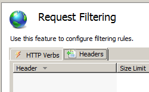

Header Limits &lt;headerLimits&gt;
====================

## Overview

The `<headerLimits>` element of the `<requestFiltering>` collection contains a collection of `<add>` elements that specify the maximum size in bytes for HTTP headers.

> [!NOTE]
> When request filtering blocks an HTTP request because an HTTP request exceeds the header limits, IIS 7 will return an HTTP 404 error to the client and log the following substatus that identifies the reason that the request was denied:

| HTTP Substatus | Description |
| --- | --- |
| `404.10` | Request Header Too Long |

This substatus allows Web administrators to analyze their IIS logs and identify potential threats.
 

## Compatibility

| Version | Notes |
| --- | --- |
| IIS 10.0 | The `<headerLimits>` element was not modified in IIS 10.0. |
| IIS 8.5 | The `<headerLimits>` element was not modified in IIS 8.5. |
| IIS 8.0 | The `<headerLimits>` element was not modified in IIS 8.0. |
| IIS 7.5 | The `<headerLimits>` element was not modified in IIS 7.5. |
| IIS 7.0 | The `<headerLimits>` element of the `<requestLimits>` collection was introduced in IIS 7.0. |
| IIS 6.0 | The `<requestLimits>` element replaces the IIS 6.0 UrlScan **[RequestLimits]** features. |

## Setup

The default installation of IIS 7 and later includes the Request Filtering role service or feature. If the Request Filtering role service or feature is uninstalled, you can reinstall it using the following steps.

### Windows Server 2012 or Windows Server 2012 R2

1. On the taskbar, click **Server Manager**.
2. In **Server Manager**, click the **Manage** menu, and then click **Add Roles and Features**.
3. In the **Add Roles and Features** wizard, click **Next**. Select the installation type and click **Next**. Select the destination server and click **Next**.
4. On the **Server Roles** page, expand **Web Server (IIS)**, expand **Web Server**, expand **Security**, and then select **Request Filtering**. Click **Next**.  
     .
5. On the **Select features** page, click **Next**.
6. On the **Confirm installation selections** page, click **Install**.
7. On the **Results** page, click **Close**.

### Windows 8 or Windows 8.1

1. On the **Start** screen, move the pointer all the way to the lower left corner, right-click the **Start** button, and then click **Control Panel**.
2. In **Control Panel**, click **Programs and Features**, and then click **Turn Windows features on or off**.
3. Expand **Internet Information Services**, expand **World Wide Web Services**, expand **Security**, and then select **Request Filtering**.  
    
4. Click **OK**.
5. Click **Close**.

### Windows Server 2008 or Windows Server 2008 R2

1. On the taskbar, click **Start**, point to **Administrative Tools**, and then click **Server Manager**.
2. In the **Server Manager** hierarchy pane, expand **Roles**, and then click **Web Server (IIS)**.
3. In the **Web Server (IIS)** pane, scroll to the **Role Services** section, and then click **Add Role Services**.
4. On the **Select Role Services** page of the **Add Role Services Wizard**, select **Request Filtering**, and then click **Next**.   
    
5. On the **Confirm Installation Selections** page, click **Install**.
6. On the **Results** page, click **Close**.

### Windows Vista or Windows 7

1. On the taskbar, click **Start**, and then click **Control Panel**.
2. In **Control Panel**, click **Programs and Features**, and then click **Turn Windows Features on or off**.
3. Expand **Internet Information Services**, then **World Wide Web Services**, and then **Security**.
4. Select **Request Filtering**, and then click **OK**.   
    
 

## How To

**Note for IIS 7.0 users**: Some of the steps in this section may require that you install the Microsoft Administration Pack for IIS 7.0, which includes a user interface for request filtering. To install the Microsoft Administration Pack for IIS 7.0, please see the following URL:

- [https://www.iis.net/expand/AdministrationPack](https://www.iis.net/downloads/microsoft/administration-pack)
 
### How to add limits for HTTP headers

1. Open **Internet Information Services (IIS) Manager**: 

    - If you are using Windows Server 2012 or Windows Server 2012 R2: 

        - On the taskbar, click **Server Manager**, click **Tools**, and then click **Internet Information Services (IIS) Manager**.
    - If you are using Windows 8 or Windows 8.1: 

        - Hold down the **Windows** key, press the letter **X**, and then click **Control Panel**.
        - Click **Administrative Tools**, and then double-click **Internet Information Services (IIS) Manager**.
    - If you are using Windows Server 2008 or Windows Server 2008 R2: 

        - On the taskbar, click **Start**, point to **Administrative Tools**, and then click **Internet Information Services (IIS) Manager**.
    - If you are using Windows Vista or Windows 7: 

        - On the taskbar, click **Start**, and then click **Control Panel**.
        - Double-click **Administrative Tools**, and then double-click **Internet Information Services (IIS) Manager**.
2. In the **Connections** pane, go to the connection, site, application, or directory for which you want to modify your request filtering settings.
3. In the **Home** pane, double-click **Request Filtering**.   
    
4. In the **Request Filtering** pane, click the **Headers** tab, and then click **Add Header...** in the **Actions** pane.   
    
5. In the **Add Header** dialog box, enter the HTTP header and the maximum size that you want for the header limit, and then click **OK**.   
    

    For example, the "Content-type" header contains the MIME type for a request. Specifying a value of 100 would limit the length of the "Content-type" header to 100 bytes.
 

## Configuration

### Attributes

None.

### Child Elements

| Element | Description |
| --- | --- |
| [`add`](https://www.iis.net/configreference/system.webserver/security/requestfiltering/requestlimits/headerlimits/add) | Optional element. Adds a size limit for an HTTP header to the `<headerLimits>` collection. |
| `clear` | Optional element. Removes all references to an HTTP header from the `<headerLimits>` collection. |
| `remove` | Optional element. Removes a reference to an HTTP header from the `<headerLimits>` collection. |

### Configuration Sample

The following example Web.config file will configure IIS to deny access for HTTP requests where the length of the &quot;Content-type&quot; header is greater than 100 bytes.

[!code-xml[Main](index/samples/sample1.xml)]

## Sample Code

The following code samples will configure IIS to deny access for HTTP requests where the length of the &quot;Content-type&quot; header is greater than 100 bytes.

### AppCmd.exe

[!code-console[Main](index/samples/sample2.cmd)]

### C#

[!code-csharp[Main](index/samples/sample3.cs)]

### VB.NET

[!code-vb[Main](index/samples/sample4.vb)]

### JavaScript

[!code-javascript[Main](index/samples/sample5.js)]

### VBScript

[!code-vb[Main](index/samples/sample6.vb)]