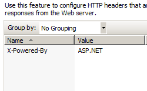
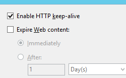
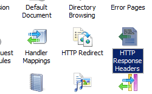

Client Cache &lt;clientCache&gt;
====================

## Overview

The `<clientCache>` element of the [`<staticContent>`](index.md) element specifies cache-related HTTP headers that IIS 7 and later sends to Web clients, which control how Web clients and proxy servers will cache the content that IIS 7 and later returns.

For example, the **httpExpires** attribute specifies a date and time that the content should expire, and IIS 7 and later will add an HTTP "Expires" header to the response. The value for the **httpExpires** attribute must be a fully-formatted date and time that follows the specification in RFC 1123. For example:

**Fri, 01 Jan 2010 12:00:00 GMT**

> [!NOTE]
> To use the **httpExpires** attribute, you need to set the value of the **cacheControlMode** attribute to **UseExpires**.

The HTTP 1.1 specification in Request For Comments (RFC) 2616 specifies several possible values for the HTTP "Cache-Control" header, such as "no-cache," "private," "public," etc. Each of these header values lets Web clients and proxy servers know whether they should cache the content:

- Content that contains a "no-cache" header should not be cached by any entity. - Content that contains a "private" header should not be cached a proxy server, but may be cached by a Web client. - Content that contains a "public" header may be cached by any entity. 

    > [!NOTE]
    > The above list is not comprehensive - there are many additional values that can be specified by the "Cache-Control" header.

Additional directives can be added to the HTTP "Cache-Control" header, such as "max-age," which specifies the explicit expiration time for content. In IIS 7, the "max-age" directive is configured through the **cacheControlMaxAge** attribute. While the "Expires" and "max-age" settings are somewhat analogous, the "max-age" directive takes priority over "Expires".

> [!NOTE]
> To use the **cacheControlMaxAge** attribute, you need to set the value of the **cacheControlMode** attribute to **UseMaxAge**.

For more information on HTTP caching headers and date/time formats, see the following Request For Comments (RFC) articles:

- [RFC 1123](http://www.ietf.org/rfc/rfc1123.txt) - "Requirements for Internet Hosts -- Application and Support"
- [RFC 2616](http://www.ietf.org/rfc/rfc2616.txt) - "Hypertext Transfer Protocol -- HTTP/1.1"

## Compatibility

| Version | Notes |
| --- | --- |
| IIS 10.0 | The `<clientCache>` element was not modified in IIS 10.0. |
| IIS 8.5 | The `<clientCache>` element was not modified in IIS 8.5. |
| IIS 8.0 | The `setEtag` attribute was added to specify whether the HTTP ETag header is calculated and set. |
| IIS 7.5 | The `<clientCache>` element was not modified in IIS 7.5. |
| IIS 7.0 | The `<clientCache>` element of the `<staticContent>` element was introduced in IIS 7.0. |
| IIS 6.0 | The `<clientCache>` element replaces the following IIS 6.0 metabase properties: - **CacheControlCustom** - **CacheControlMaxAge** - **CacheControlNoCache** - **HttpExpires** |

## Setup

The `<clientCache>` element of the `<staticContent>` element is included in the default installation of IIS 7 and later.

## How To

### How to configure a cache expiration date for a Web site or application

1. Open **Internet Information Services (IIS) Manager**: 

    - If you are using Windows Server 2012 or Windows Server 2012 R2: 

        - On the taskbar, click **Server Manager**, click **Tools**, and then click **Internet Information Services (IIS) Manager**.
    - If you are using Windows 8 or Windows 8.1: 

        - Hold down the **Windows** key, press the letter **X**, and then click **Control Panel**.
        - Click **Administrative Tools**, and then double-click **Internet Information Services (IIS) Manager**.
    - If you are using Windows Server 2008 or Windows Server 2008 R2: 

        - On the taskbar, click **Start**, point to **Administrative Tools**, and then click **Internet Information Services (IIS) Manager**.
    - If you are using Windows Vista or Windows 7: 

        - On the taskbar, click **Start**, and then click **Control Panel**.
        - Double-click **Administrative Tools**, and then double-click **Internet Information Services (IIS) Manager**.
2. In the **Connections** pane, go to the site, application, or directory for which you want to disable caching.
3. In the **Home** pane, double-click **HTTP Response Headers**.  
    
4. In the **HTTP Response Headers** pane, click **Set Common Headers...** in the **Actions** pane.  
    
5. In the **Set Common HTTP Response Headers** dialog box, check the box to expire Web content, select the option to expire after a specific interval or at a specific time, and then click **OK**.  
       
    

### How to disable caching for a Web site or application

1. Open **Internet Information Services (IIS) Manager**: 

    - If you are using Windows Server 2012 or Windows Server 2012 R2: 

        - On the taskbar, click **Server Manager**, click **Tools**, and then click **Internet Information Services (IIS) Manager**.
    - If you are using Windows 8 or Windows 8.1: 

        - Hold down the **Windows** key, press the letter **X**, and then click **Control Panel**.
        - Click **Administrative Tools**, and then double-click **Internet Information Services (IIS) Manager**.
    - If you are using Windows Server 2008 or Windows Server 2008 R2: 

        - On the taskbar, click **Start**, point to **Administrative Tools**, and then click **Internet Information Services (IIS) Manager**.
    - If you are using Windows Vista or Windows 7: 

        - On the taskbar, click **Start**, and then click **Control Panel**.
        - Double-click **Administrative Tools**, and then double-click **Internet Information Services (IIS) Manager**.
2. In the **Connections** pane, go to the site, application, or directory for which you want to disable caching.
3. In the **Home** pane, double-click **HTTP Response Headers**.  
    
4. In the **HTTP Response Headers** pane, click **Set Common Headers...** in the **Actions** pane.  
    
5. In the **Set Common HTTP Response Headers** dialog box, check the box to expire Web content, select **Immediately**, and then click **OK**.  
    

## Configuration

### Attributes

| Attribute | Description |
| --- | --- |
| `cacheControlCustom` | Optional string attribute. Specifies custom HTTP 1.1 cache control directives. |
| `cacheControlMaxAge` | Optional timeSpan attribute. Specifies the maximum age (in seconds) of the cache control value. The default value is `1.00:00:00` (1 day). |
| `cacheControlMode` | Optional enum attribute. Specifies the mode to use for client caching. The **cacheControlMode** attribute can be one of the following possible values. The default is `NoControl`. | Value | Description | | --- | --- | | `NoControl` | Does not add a Cache-Control or Expires header to the response. The numeric value is `0`. | | `DisableCache` | Adds a Cache-Control: no-cache header to the response. The numeric value is `1`. | | `UseMaxAge` | Adds a Cache-Control: max-age=&lt;nnn&gt; header to the response based on the value specified in the **CacheControlMaxAge** attribute. The numeric value is `2`. | | `UseExpires` | Adds an Expires: &lt;date&gt; header to the response based on the date specified in the **httpExpires** attribute. The numeric value is `3`. | |
| `httpExpires` | Optional string attribute. Specifies the date and time after which a page that is cached on the client is considered stale. (The date and time is formatted according to the specification in [Request for Comments 1123](http://www.ietf.org/rfc/rfc1123.txt).) The value is returned to the browser in the HTML file header. The user agent compares the given value with the current date to determine whether to display a cached page or to request an updated page from the server. |
| `setEtag` | Optional Boolean attribute. Specifies whether the HTTP ETag header is calculated and set. The ETag header is used for web cache validation, and enables a Web server to not have to send a full response if no changes have been made to the content. `setEtag` can be set in the Configuration Editor in the path `system.webServer/staticContent`. The default value is `true`. |

### Child Elements

None.

### Configuration Sample

The following configuration sample adds an HTTP "Cache-Control: no-cache" header to the response, thereby disabling caching of requests.

[!code-xml[Main](clientCache/samples/sample1.xml)]

The following configuration sample adds an HTTP "Expires: Tue, 19 Jan 2038 03:14:07 GMT" header to the response, which configures requests to expire several years from now.

[!code-xml[Main](clientCache/samples/sample2.xml)]

## Sample Code

The following code samples add an HTTP "Cache-Control: no-cache" header to the response, thereby disabling caching of requests.

### AppCmd.exe

[!code-csharp[Main](clientCache/samples/sample3.cs)]

### C#

[!code-csharp[Main](clientCache/samples/sample4.cs)]

### VB.NET

[!code-vb[Main](clientCache/samples/sample5.vb)]

### JavaScript

[!code-javascript[Main](clientCache/samples/sample6.js)]

### VBScript

[!code-vb[Main](clientCache/samples/sample7.vb)]

The following code samples add an HTTP "Expires: Tue, 19 Jan 2038 03:14:07 GMT" header to the response, which configures requests to expire several years from now.

### AppCmd.exe

[!code-csharp[Main](clientCache/samples/sample8.cs)]

### C#

[!code-csharp[Main](clientCache/samples/sample9.cs)]

### VB.NET

[!code-vb[Main](clientCache/samples/sample10.vb)]

### JavaScript

[!code-javascript[Main](clientCache/samples/sample11.js)]

### VBScript

[!code-vb[Main](clientCache/samples/sample12.vb)]