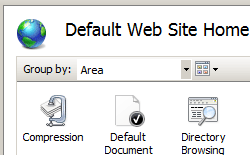
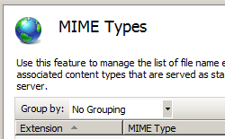

Adding Static Content MIME Mappings &lt;mimeMap&gt;
====================

## Overview

The `<mimeMap>` element of the [&lt;staticContent&gt;](https://www.iis.net/configreference/system.webserver/staticcontent) element adds a unique MIME type to the collection of static content types. Each `<mimeMap>` entry must consist of two parts:

- A unique file name extension that is specified by the **fileExtension** attribute, for example, ".txt", ".png", etc.
- A MIME type for the file name extension that is specified by the **mimeType** attribute, for example, "text/plain", "image/jpg", etc.

> [!NOTE]
> IIS 7 will not return file types that are not added to the `<staticContent>` element or that have mappings in the `<handlers>` element by default. This behavior prevents unauthorized access to files that do not have mappings in the IIS 7 configuration settings.

## Compatibility

| Version | Notes |
| --- | --- |
| IIS 10.0 | The `<mimeMap>` element was not modified in IIS 10.0. |
| IIS 8.5 | The `<mimeMap>` element was not modified in IIS 8.5. |
| IIS 8.0 | The `<mimeMap>` element was not modified in IIS 8.0. |
| IIS 7.5 | The `<mimeMap>` element was not modified in IIS 7.5. |
| IIS 7.0 | The `<mimeMap>` element of the `<staticContent>` element was introduced in IIS 7.0. |
| IIS 6.0 | The `<mimeMap>` element replaces the IIS 6.0 **MimeMap** metabase property. |

## Setup

The `<mimeMap>` element of the `<staticContent>` element is included in the default installation of IIS 7.

## How To

### How to add a MIME type to a Web site or application

1. Open **Internet Information Services (IIS) Manager**: 

    - If you are using Windows Server 2012 or Windows Server 2012 R2: 

        - On the taskbar, click **Server Manager**, click **Tools**, and then click **Internet Information Services (IIS) Manager**.
    - If you are using Windows 8 or Windows 8.1: 

        - Hold down the **Windows** key, press the letter **X**, and then click **Control Panel**.
        - Click **Administrative Tools**, and then double-click **Internet Information Services (IIS) Manager**.
    - If you are using Windows Server 2008 or Windows Server 2008 R2: 

        - On the taskbar, click **Start**, point to **Administrative Tools**, and then click **Internet Information Services (IIS) Manager**.
    - If you are using Windows Vista or Windows 7: 

        - On the taskbar, click **Start**, and then click **Control Panel**.
        - Double-click **Administrative Tools**, and then double-click **Internet Information Services (IIS) Manager**.
2. In the **Connections** pane, go to the site, application, or directory for which you want to add a MIME type.
3. In the **Home** pane, double-click **MIME Types**.  
    
4. In the **MIME Types** pane, click **Add...** in the **Actions** pane.  
    
5. In the **Add MIME Type** dialog box, add the file name extension and MIME type, and then click **OK**.  
    

## Configuration

### Attributes

| Attribute | Description |
| --- | --- |
| `fileExtension` | Required string attribute. Specifies a unique file name extension for a MIME type. See the Default Configuration section later in this topic for the complete list of default values |
| `mimeType` | Required string attribute. Specifies the type of file and the application that uses this kind of file name extension. See the Default Configuration section later in this topic for the complete list of default values. |

### Child Elements

None.

### Configuration Sample

The following configuration sample adds the file types for MIDI System Exclusive (Sysex) Messages and Guitar Tablature (TAB) files to IIS, thereby enabling clients to download these file types.

[!code-xml[Main](mimeMap/samples/sample1.xml)]

## Sample Code

The following code samples add the file types for MIDI System Exclusive (Sysex) Messages and Guitar Tablature (TAB) files to IIS, thereby enabling clients to download these file types.

### AppCmd.exe

[!code-console[Main](mimeMap/samples/sample2.cmd)]

### C#

[!code-csharp[Main](mimeMap/samples/sample3.cs)]

### VB.NET

[!code-vb[Main](mimeMap/samples/sample4.vb)]

### JavaScript

[!code-javascript[Main](mimeMap/samples/sample5.js)]

### VBScript

[!code-vb[Main](mimeMap/samples/sample6.vb)]