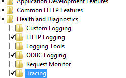
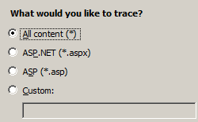

Tracing &lt;tracing&gt;
====================

## Overview

The `<tracing>` section group contains failed request tracing settings that you have configured and contains trace provider definitions provided during installation or by you on the Internet Information Services (IIS) 7 Web server.

Request-based tracing provides a great way to figure out what exactly is happening with your requests and why it's happening, provided you can reproduce the problem the server is experiencing. Problems like poor performance on some requests, authentication-related failures on other requests, or HTTP 500 status code errors from Active Server Pages (ASP) or ASP.NET can often be incredibly difficult to troubleshoot unless you have captured the trace of the problem when it occurs. Failed-request tracing is designed to buffer the trace events for a request and only flush them to disk when a request fails based on a failure definition that you provide.

IIS 7 only displays these messages after you install and enable the Tracing module. It stores these messages and other tracing information in a special file named the failed event tracing log file. You can open these files in a Web browser and review the trace events generated by IIS, the custom trace events generated by third-party modules, or both. By default, IIS 7 stores these files in the %systemroot%\inetpub\logs\FailedReqLogFiles folder.

The `<tracing>` section contains a `<traceFailedRequests>` element and a `<traceProviderDefinition>` element. The first element configures failed request tracing for your Web site or application, and the second element defines the tracing providers available on the server. By default, IIS 7 includes tracing providers for ASP, ASP.NET, Internet Server API (ISAPI) extensions and the Web server itself. You can also include custom tracing providers.

## Compatibility

| Version | Notes |
| --- | --- |
| IIS 10.0 | The `<tracing>` element was not modified in IIS 10.0. |
| IIS 8.5 | The `<tracing>` element was not modified in IIS 8.5. |
| IIS 8.0 | The `<tracing>` element was not modified in IIS 8.0. |
| IIS 7.5 | The `<tracing>` element was not modified in IIS 7.5. |
| IIS 7.0 | The `<tracing>` element was introduced in IIS 7.0. |
| IIS 6.0 | N/A |

## Setup

After you finish the default installation of IIS 7 and later, you must install the tracing role service to use failed request tracing. After you install the role service, you still must enable failed request tracing at the site level, application level, or directory level.

### Windows Server 2012 or Windows Server 2012 R2

1. On the taskbar, click **Server Manager**.
2. In **Server Manager**, click the **Manage** menu, and then click **Add Roles and Features**.
3. In the **Add Roles and Features** wizard, click **Next**. Select the installation type and click **Next**. Select the destination server and click **Next**.
4. On the **Server Roles** page, expand **Web Server (IIS)**, expand **Web Server**, expand **Health and Diagnostics**, and then select **Tracing**. Click **Next**.  
     .
5. On the **Select features** page, click **Next**.
6. On the **Confirm installation selections** page, click **Install**.
7. On the **Results** page, click **Close**.

### Windows 8 or Windows 8.1

1. On the **Start** screen, move the pointer all the way to the lower left corner, right-click the **Start** button, and then click **Control Panel**.
2. In **Control Panel**, click **Programs and Features**, and then click **Turn Windows features on or off**.
3. Expand **Internet Information Services**, expand **World Wide Web Services**, expand **Health and Diagnostics**, and then select **Tracing**.  
    - Click **OK**.
- Click **Close**.

### Windows Server 2008 or Windows Server 2008 R2

1. On the taskbar, click **Start**, point to **Administrative Tools**, and then click **Server Manager**.
2. In the **Server Manager** hierarchy pane, expand **Roles**, and then click **Web Server (IIS)**.
3. In the **Web Server (IIS)** pane, scroll to the **Role Services** section, and then click **Add Role Services**.
4. On the **Select Role Services** page of the **Add Role Services Wizard**, select **Tracing**, and then click **Next**.  
    
5. On the **Confirm Installation Selections** page, click **Install**.
6. On the **Results** page, click **Close**.

### Windows Vista or Windows 7

1. On the taskbar, click **Start**, and then click **Control Panel**.
2. In **Control Panel**, click **Programs and Features**, and then click **Turn Windows Features on or off**.
3. Expand **Internet Information Services**, then **World Wide Web Services**, then **Health and Diagnostics**.
4. Select **Tracing**, and then click **OK**.  
    
 

## How To

### How to enable tracing

1. Open **Internet Information Services (IIS) Manager**: 

    - If you are using Windows Server 2012 or Windows Server 2012 R2: 

        - On the taskbar, click **Server Manager**, click **Tools**, and then click **Internet Information Services (IIS) Manager**.
    - If you are using Windows 8 or Windows 8.1: 

        - Hold down the **Windows** key, press the letter **X**, and then click **Control Panel**.
        - Click **Administrative Tools**, and then double-click **Internet Information Services (IIS) Manager**.
    - If you are using Windows Server 2008 or Windows Server 2008 R2: 

        - On the taskbar, click **Start**, point to **Administrative Tools**, and then click **Internet Information Services (IIS) Manager**.
    - If you are using Windows Vista or Windows 7: 

        - On the taskbar, click **Start**, and then click **Control Panel**.
        - Double-click **Administrative Tools**, and then double-click **Internet Information Services (IIS) Manager**.
2. In the **Connections** pane, select the server connection, site, application, or directory for which you want to configure failed request tracing.
3. In the **Actions** pane, click **Failed Request Tracing...**  
    
4. In the **Edit Web Site Failed Request Tracing Settings** dialog box, select the **Enable** check box to enable tracing, leave the default value or type a new directory where you want to store failed request log files in the **Directory** box, type the number of failed request trace files you want to store in the **Maximum number of trace files** box, and then click **OK**.  
    

### How to configure failure definitions

1. Open **Internet Information Services (IIS) Manager**: 

    - If you are using Windows Server 2012 or Windows Server 2012 R2: 

        - On the taskbar, click **Server Manager**, click **Tools**, and then click **Internet Information Services (IIS) Manager**.
    - If you are using Windows 8 or Windows 8.1: 

        - Hold down the **Windows** key, press the letter **X**, and then click **Control Panel**.
        - Click **Administrative Tools**, and then double-click **Internet Information Services (IIS) Manager**.
    - If you are using Windows Server 2008 or Windows Server 2008 R2: 

        - On the taskbar, click **Start**, point to **Administrative Tools**, and then click **Internet Information Services (IIS) Manager**.
    - If you are using Windows Vista or Windows 7: 

        - On the taskbar, click **Start**, and then click **Control Panel**.
        - Double-click **Administrative Tools**, and then double-click **Internet Information Services (IIS) Manager**.
2. In the **Connections** pane, go to the connection, site, application, or directory for which you want to configure failed request tracing.
3. In the **Home** pane, double-click **Failed Request Tracing Rules**.  
    
4. In the **Actions** pane, click **Add...**
5. On the **Specify Content to Trace** page of the **Add Failed Request Tracing Rule** Wizard, select the content type you want to trace, and then click **Next**.  
    
6. On the **Define Trace Conditions** page, select the conditions you want to trace, and then click **Next**. Trace conditions can include any combination of status codes, a time limit that a request should take, or the event severity. If you specify all conditions, the first condition that is met generates the failed request trace log file.  
    
7. On the **Select Trace Providers** page, select one or more of the trace providers under **Providers**.  
    
8. On the **Select Trace Providers** page, select one or more of the verbosity levels under **Verbosity**.  
    
9. If you selected the **ASPNET** or **WWW Server** trace provider in step 8, select one or more functional areas for the provider to trace under **Areas** of the **Select Trace Providers** page.
10. Click **Finish**.

## Configuration

You can configure the `<tracing>` section group at the server level in the ApplicationHost.config file or at the site level, application level, or directory level in a Web.config file.

### Attributes

None.

### Child Elements

| Element | Description |
| --- | --- |
| [`traceFailedRequests`](tracefailedrequests/index.md) | Optional element. Contains settings for tracing failed requests on the Web server. |
| [`traceProviderDefinitions`](traceproviderdefinitions/index.md) | Optional element. Defines the trace providers that are used on the Web server. |

### Configuration Sample

The following configuration example configures tracing at the server level in the ApplicationHost.config file. It sets tracing for all .aspx files, uses the `<traceAreas>` element to set the **ASPNET** provider and trace against all ASP.NET areas, which are **Infrastructure**, **Module**, **Page** and **AppServices**. The sample also uses the **verbosity** attribute to set the amount of information returned to the tracing file to **warning**. Lastly, the sample uses the `<failureDefinitions>` element to trace only requests that generate a HTTP 404 status code.

[!code-xml[Main](index/samples/sample1.xml)]

## Sample Code

The following examples enable verbose failed request tracing for HTTP 500 errors in ASP.NET content on all requests to \*.aspx pages.

### AppCmd.exe

[!code-console[Main](index/samples/sample2.cmd)]

### C#

[!code-csharp[Main](index/samples/sample3.cs)]

### VB.NET

[!code-vb[Main](index/samples/sample4.vb)]

### JavaScript

[!code-javascript[Main](index/samples/sample5.js)]

### VBScript

[!code-vb[Main](index/samples/sample6.vb)]