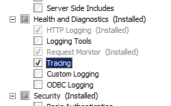
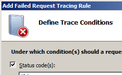

# Failure Definitions &lt;failureDefinitions&gt;

## Overview

The `<failureDefinitions>` element defines the conditions in which to trace requests. A failure condition consists of status codes, a time interval, or a combination of both. In addition, you can specify the verbosity level for tracing.

> [!NOTE]
> Adding additional verbosity options will configure IIS to return more information in your trace logs, but verbose logs may become quite large. If your log files exceed the maximum file size defined by the **maxLogFileSizeKB** attribute of the `<traceFailedRequestsLogging>` element, your log files will be truncated at the maximum size and you will need to increase the file size that is specified in that attribute.

## Compatibility

| Version | Notes |
| --- | --- |
| IIS 10.0 | The `traceAllAfterTimeout` attribute was added to the `<failureDefinitions>` element in IIS 10.0. |
| IIS 8.5 | The `<failureDefinitions>` element was not modified in IIS 8.5. |
| IIS 8.0 | The `<failureDefinitions>` element was not modified in IIS 8.0. |
| IIS 7.5 | The `<failureDefinitions>` element was not modified in IIS 7.5. |
| IIS 7.0 | The `<failureDefinitions>` element was introduced in IIS 7.0. |
| IIS 6.0 | N/A |

## Setup

After you finish the default installation of IIS 7 and later, you must install the tracing role service to use failed request tracing. After you install the role service, you still must enable failed request tracing at the site level, application level, or directory level.

### Windows Server 2012 or Windows Server 2012 R2

1. On the taskbar, click **Server Manager**.
2. In **Server Manager**, click the **Manage** menu, and then click **Add Roles and Features**.
3. In the **Add Roles and Features** wizard, click **Next**. Select the installation type and click **Next**. Select the destination server and click **Next**.
4. On the **Server Roles** page, expand **Web Server (IIS)**, expand **Web Server**, expand **Health and Diagnostics**, and then select **Tracing**. Click **Next**.  
     .
5. On the **Select features** page, click **Next**.
6. On the **Confirm installation selections** page, click **Install**.
7. On the **Results** page, click **Close**.

### Windows 8 or Windows 8.1

1. On the **Start** screen, move the pointer all the way to the lower left corner, right-click the **Start** button, and then click **Control Panel**.
2. In **Control Panel**, click **Programs and Features**, and then click **Turn Windows features on or off**.
3. Expand **Internet Information Services**, expand **World Wide Web Services**, expand **Health and Diagnostics**, and then select **Tracing**.  
    - Click **OK**.
4. Click **Close**.

### Windows Server 2008 or Windows Server 2008 R2

1. On the taskbar, click **Start**, point to **Administrative Tools**, and then click **Server Manager**.
2. In the **Server Manager** hierarchy pane, expand **Roles**, and then click **Web Server (IIS)**.
3. In the **Web Server (IIS)** pane, scroll to the **Role Services** section, and then click **Add Role Services**.
4. On the **Select Role Services** page of the **Add Role Services Wizard**, select **Tracing**, and then click **Next**.  
    
5. On the **Confirm Installation Selections** page, click **Install**.
6. On the **Results** page, click **Close**.

### Windows Vista or Windows 7

1. On the taskbar, click **Start**, and then click **Control Panel**.
2. In **Control Panel**, click **Programs and Features**, and then click **Turn Windows Features on or off**.
3. Expand **Internet Information Services**, then **World Wide Web Services**, then **Health and Diagnostics**.
4. Select **Tracing**, and then click **OK**.  
    
 

## How To

### How to enable tracing

1. Open **Internet Information Services (IIS) Manager**: 

    - If you are using Windows Server 2012 or Windows Server 2012 R2: 

        - On the taskbar, click **Server Manager**, click **Tools**, and then click **Internet Information Services (IIS) Manager**.
    - If you are using Windows 8 or Windows 8.1: 

        - Hold down the **Windows** key, press the letter **X**, and then click **Control Panel**.
        - Click **Administrative Tools**, and then double-click **Internet Information Services (IIS) Manager**.
    - If you are using Windows Server 2008 or Windows Server 2008 R2: 

        - On the taskbar, click **Start**, point to **Administrative Tools**, and then click **Internet Information Services (IIS) Manager**.
    - If you are using Windows Vista or Windows 7: 

        - On the taskbar, click **Start**, and then click **Control Panel**.
        - Double-click **Administrative Tools**, and then double-click **Internet Information Services (IIS) Manager**.
2. In the **Connections** pane, select the server connection, site, application, or directory for which you want to configure failed request tracing.
3. In the **Actions** pane, click **Failed Request Tracing...**  
    
4. In the **Edit Web Site Failed Request Tracing Settings** dialog box, select the **Enable** check box to enable tracing, leave the default value or type a new directory where you want to store failed request log files in the **Directory** box, type the number of failed request trace files you want to store in the **Maximum number of trace files** box, and then click **OK**.  
    

### How to configure failure definitions

1. Open **Internet Information Services (IIS) Manager**: 

    - If you are using Windows Server 2012 or Windows Server 2012 R2: 

        - On the taskbar, click **Server Manager**, click **Tools**, and then click **Internet Information Services (IIS) Manager**.
    - If you are using Windows 8 or Windows 8.1: 

        - Hold down the **Windows** key, press the letter **X**, and then click **Control Panel**.
        - Click **Administrative Tools**, and then double-click **Internet Information Services (IIS) Manager**.
    - If you are using Windows Server 2008 or Windows Server 2008 R2: 

        - On the taskbar, click **Start**, point to **Administrative Tools**, and then click **Internet Information Services (IIS) Manager**.
    - If you are using Windows Vista or Windows 7: 

        - On the taskbar, click **Start**, and then click **Control Panel**.
        - Double-click **Administrative Tools**, and then double-click **Internet Information Services (IIS) Manager**.
2. In the **Connections** pane, go to the connection, site, application, or directory for which you want to configure failed request tracing.
3. In the **Home** pane, double-click **Failed Request Tracing Rules**.  
    
4. In the **Actions** pane, click **Add...**
5. On the **Specify Content to Trace** page of the **Add Failed Request Tracing Rule** Wizard, select the content type you want to trace, and then click **Next**.  
    
6. On the **Define Trace Conditions** page, select the conditions you want to trace, and then click **Next**. Trace conditions can include any combination of status codes, a time limit that a request should take, or the event severity. If you specify all conditions, the first condition that is met generates the failed request trace log file.  
    
7. On the **Select Trace Providers** page, select one or more of the trace providers under **Providers**.  
    
8. On the **Select Trace Providers** page, select one or more of the verbosity levels under **Verbosity**.  
    
9. If you selected the **ASPNET** or **WWW Server** trace provider in step 8, select one or more functional areas for the provider to trace under **Areas** of the **Select Trace Providers** page.
10. Click **Finish**.

## Configuration

### Attributes

| Attribute | Description |
| --- | --- |
| `statusCodes` | Optional string attribute.  Specifies the status code(s) you want to trace. You can enter multiple status codes in this list by using commas to separate each code. You can also refine your status codes using sub status codes, such as "404.2, 500" or a range of sub status codes such as "400-599". If you do not specify substatus codes, all substatus codes for the given status code will be traced. Status codes must be from 100 to 999, and substatus codes must be from 1 to 999. |
| `timeTaken` | Optional timeSpan attribute.  Specifies the maximum time that a request may spend in processing before it is marked as failed and then traced.  The default value is `00:00:00`. |
| `traceAllAfterTimeout` | Optional bool attribute.  `true` if IIS should continue trace the entire request when a timeout is reached; otherwise, `false` if IIS should truncate the trace when the timeout occurred.  The default value is `false`. |
| `verbosity` | Optional enum attribute.  Specifies the minimum amount of information and the type of information that is saved to the trace log. If the verbosity is set to Error, a failed request trace log file for the request will be created when the first trace event whose verbosity is either Error or **CriticalError** is received.  The verbosity attribute can be one of the following possible values.  The default value is `Ignore`. <table> <tbody> <tr> <th>Value</th> <th>Description</th></tr> <tr> <th><code>Ignore</code></th> <td>Provides no information about the request activity.  The numeric value is <code>0</code>.</td></tr> <tr> <th><code>CriticalError</code></th> <td>Provides information about actions that can cause a process to exit or that are about to cause a process to exit.  The numeric value is <code>1</code>.</td></tr> <tr> <th><code>Error</code></th> <td>Provides information about components that experience an error and cannot continue to process requests. These errors usually indicate a server-side problem.  The numeric value is <code>2</code>.</td></tr> <tr> <th><code>Warning</code></th> <td>Provides information about components that experience an error but that can continue to process the request.  The numeric value is <code>3</code>.</td></tr></tbody></table> |

### Child Elements

None.

### Configuration Sample

The following configuration example configures tracing at the server level in the ApplicationHost.config file. It sets tracing for all .aspx files, uses the `<traceAreas>` element to set the **ASPNET** provider and trace against all ASP.NET areas, which are **Infrastructure**, **Module**, **Page** and **AppServices**. The sample also uses the **verbosity** attribute to set the amount of information returned to the tracing file to **warning**. Lastly, the sample uses the `<failureDefinitions>` element to trace only requests that generate a HTTP 404 status code.

[!code-xml[Main](failureDefinitions/samples/sample1.xml)]

## Sample Code

The following examples enable verbose failed request tracing for HTTP 500 errors in ASP.NET content on all requests to \*.aspx pages.

### AppCmd.exe

[!code-console[Main](failureDefinitions/samples/sample2.cmd)]

### C\#

[!code-csharp[Main](failureDefinitions/samples/sample3.cs)]

### VB.NET

[!code-vb[Main](failureDefinitions/samples/sample4.vb)]

### JavaScript

[!code-javascript[Main](failureDefinitions/samples/sample5.js)]

### VBScript

[!code-vb[Main](failureDefinitions/samples/sample6.vb)]
