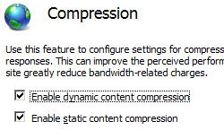

URL Compression <urlCompression>
====================

## Overview

The `<urlCompression>` element specifies the following settings for static and dynamic content compression in IIS 7 and later:

- The **doDynamicCompression** attribute of the `<urlCompression>` element enables or disables dynamic content compression at the site, application, or folder level.
- The **doStaticCompression** attribute of the `<urlCompression>` element enables or disables static content compression at the site, application, or folder level.
- The **dynamicCompressionBeforeCache** attribute specifies whether IIS will dynamically compress content that has not been cached. When the **dynamicCompressionBeforeCache** attribute is **true**, IIS dynamically compresses the response the first time a request is made and queues the content for compression. Subsequent requests are served dynamically until the compressed response has been added to the cache directory. Once the compressed response is added to the cache directory, the cached response is sent to clients for subsequent requests. When **dynamicCompressionBeforeCache** is **false**, IIS returns the uncompressed response until the compressed response has been added to the cache directory.

> [!NOTE]
> If the **dynamicCompressionBeforeCache** attribute is **true** when the output cache response has been flushed, dynamic compression will not be performed before the response is put into the output cache. However, if the **doDynamicCompression** attribute is **true**, dynamic compression will still occur after the output cache has been filled with the response.

## Compatibility

| Version | Notes |
| --- | --- |
| IIS 10.0 | The `<urlCompression>` element was not modified in IIS 10.0. |
| IIS 8.5 | The `<urlCompression>` element was not modified in IIS 8.5. |
| IIS 8.0 | The `<urlCompression>` element was not modified in IIS 8.0. |
| IIS 7.5 | In IIS 7.5, the default value of the `doDynamicCompression` attribute changed from **false** to **true**. |
| IIS 7.0 | The `<urlCompression>` element was introduced in IIS 7.0. |
| IIS 6.0 | The `<urlCompression>` element replaces the following IIS 6.0 metabase properties: - **DoStaticCompression** - **DoDynamicCompression** - **HcDoOnDemandCompression** |

## Setup

HTTP compression is usually available on the default installation of IIS 7 and later. However, only static compression is installed by default. To install static or dynamic compression, use the following steps.

### Windows Server 2012 or Windows Server 2012 R2

1. On the taskbar, click **Server Manager**.
2. In **Server Manager**, click the **Manage** menu, and then click **Add Roles and Features**.
3. In the **Add Roles and Features** wizard, click **Next**. Select the installation type and click **Next**. Select the destination server and click **Next**.
4. On the **Server Roles** page, expand **Web Server (IIS)**, expand **Web Server**, expand **Performance**, and then select **Static Content Compression** and/or **Dynamic Content Compression**. Click **Next**.  
     .
5. On the **Select features** page, click **Next**.
6. On the **Confirm installation selections** page, click **Install**.
7. On the **Results** page, click **Close**.

### Windows 8 or Windows 8.1

1. On the **Start** screen, move the pointer all the way to the lower left corner, right-click the **Start** button, and then click **Control Panel**.
2. In **Control Panel**, click **Programs and Features**, and then click **Turn Windows features on or off**.
3. Expand **Internet Information Services**, expand **World Wide Web Services**, expand **Performance Features**, and then select **Dynamic Content Compression** and/or **Static Content Compression**.  
    
4. Click **OK**.
5. Click **Close**.

### Windows Server 2008 or Windows Server 2008 R2

1. On the taskbar, click **Start**, point to **Administrative Tools**, and then click **Server Manager**.
2. In the **Server Manager** hierarchy pane, expand **Roles**, and then click **Web Server (IIS)**.
3. In the **Web Server (IIS)** pane, scroll to the **Role Services** section, and then click **Add Role Services**.
4. On the **Select Role Services** page of the **Add Role Services Wizard**, select **Dynamic** **Content Compression** if you want to install dynamic compression and **Static Content Compression** if you want to install static compression, and then click **Next**.  
    
5. On the **Confirm Installation Selections** page, click **Install**.
6. On the **Results** page, click **Close**.

### Windows Vista or Windows 7

1. On the taskbar, click **Start**, and then click **Control Panel**.
2. In **Control Panel**, click **Programs and Features**, and then click **Turn Windows Features on or off**.
3. Expand **Internet Information Services**, then **World Wide Web Services**, then **Performance Features**.
4. Select **Http Compression Dynamic** if you want to install dynamic compression and **Static Content Compression** if you want to install static compression.   
    
5. Click **OK**.
 

## How To

### How to enable or disable static and dynamic compression for a site or application

1. Open **Internet Information Services (IIS) Manager**: 

    - If you are using Windows Server 2012 or Windows Server 2012 R2: 

        - On the taskbar, click **Server Manager**, click **Tools**, and then click **Internet Information Services (IIS) Manager**.
    - If you are using Windows 8 or Windows 8.1: 

        - Hold down the **Windows** key, press the letter **X**, and then click **Control Panel**.
        - Click **Administrative Tools**, and then double-click **Internet Information Services (IIS) Manager**.
    - If you are using Windows Server 2008 or Windows Server 2008 R2: 

        - On the taskbar, click **Start**, point to **Administrative Tools**, and then click **Internet Information Services (IIS) Manager**.
    - If you are using Windows Vista or Windows 7: 

        - On the taskbar, click **Start**, and then click **Control Panel**.
        - Double-click **Administrative Tools**, and then double-click **Internet Information Services (IIS) Manager**.
2. In the **Connections** pane, go to the connection, site, application, or directory for which you want to enable compression.
3. In the **Home** pane, double-click **Compression**.  
    
4. In the **Compression** pane, check the boxes to enable static or dynamic compression, or remove the check marks to disable static or dynamic compression.  
    
5. Once you have completed the above steps, click **Apply** in the **Actions** pane.

### How to enable or disable static and dynamic compression for a server

1. Open **Internet Information Services (IIS) Manager**: 

    - If you are using Windows Server 2012 or Windows Server 2012 R2: 

        - On the taskbar, click **Server Manager**, click **Tools**, and then click **Internet Information Services (IIS) Manager**.
    - If you are using Windows 8 or Windows 8.1: 

        - Hold down the **Windows** key, press the letter **X**, and then click **Control Panel**.
        - Click **Administrative Tools**, and then double-click **Internet Information Services (IIS) Manager**.
    - If you are using Windows Server 2008 or Windows Server 2008 R2: 

        - On the taskbar, click **Start**, point to **Administrative Tools**, and then click **Internet Information Services (IIS) Manager**.
    - If you are using Windows Vista or Windows 7: 

        - On the taskbar, click **Start**, and then click **Control Panel**.
        - Double-click **Administrative Tools**, and then double-click **Internet Information Services (IIS) Manager**.
2. In the **Connections** pane, highlight the name of your server.
3. In the server's **Home** pane, double-click **Compression**.  
    
4. In the **Compression** pane, check the boxes to enable static or dynamic compression, or remove the check marks to disable static or dynamic compression.  
    
5. Once you have completed the above steps, click **Apply** in the **Actions** pane.

### How to configure staticCompressionIgnoreHitFrequency

1. Open **Internet Information Services (IIS) Manager**: 

    - If you are using Windows Server 2012 R2: 

        - On the taskbar, click **Server Manager**, click **Tools**, and then click **Internet Information Services (IIS) Manager**.
    - If you are using Windows 8.1: 

        - Hold down the **Windows** key, press the letter **X**, and then click **Control Panel**.
        - Click **Administrative Tools**, and then double-click **Internet Information Services (IIS) Manager**.
2. In the **Connections** pane, select the server, and then double-click **Configuration Editor**.
3. In the **Configuration Editor**, for the section, select **system.webServer**, and then select **httpCompression**.
4. For **staticCompressionIgnoreHitFrequency**, enter `True` to disable the behavior that a static file is compressed only if it is hit a certain number of times within a time period, or enter `False` to enable the behavior.  
    
5. In the **Actions** pane, click **Apply**.
 

## Configuration

### Attributes

| Attribute | Description |
| --- | --- |
| `doDynamicCompression` | Optional Boolean attribute. Specifies whether dynamic compression is enabled for URLs. > [!NOTE]
 > In IIS 7.0, the use of dynamic compression was disabled by default because of increased processor utilization that may have reduced the overall performance of the Web server. In IIS 7.5, changes were made to dynamic compression that resulted in better performance, so dynamic compression is enabled by default in IIS 7.5 and later. The default value is `true`. |
| `doStaticCompression` | Optional Boolean attribute. Specifies whether static compression is enabled for URLs. The default value is `true`. |
| `dynamicCompressionBeforeCache` | Optional Boolean attribute. Specifies whether the currently available response is dynamically compressed before it is put into the output cache. The default value is `false`. |

### Child Elements

None.

### Configuration Sample

The following configuration sample enables static compression and disable dynamic compression for the Default Web Site.

[!code-xml[Main](urlCompression/samples/sample1.xml)]

## Sample Code

The following code samples enable static compression and disable dynamic compression for the Default Web Site.

### AppCmd.exe

[!code-console[Main](urlCompression/samples/sample2.cmd)]

### C#

[!code-csharp[Main](urlCompression/samples/sample3.cs)]

### VB.NET

[!code-vb[Main](urlCompression/samples/sample4.vb)]

### JavaScript

[!code-javascript[Main](urlCompression/samples/sample5.js)]

### VBScript

[!code-vb[Main](urlCompression/samples/sample6.vb)]