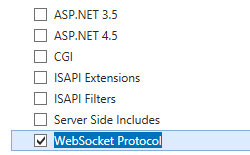
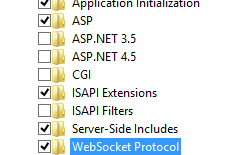

WebSocket <webSocket> &lt;webSocket&gt;
====================

## Overview

The `<webSocket>` element specifies the use of the WebSocketModule module with ASP.NET 4.5 to support writing server applications that communicate over the WebSocket Protocol. WebSocket enables you to provide full-duplex communications over a single TCP connection by using a stream of messages rather than a stream of bytes. This makes it easier to connect to data sources asynchronously in cloud deployments.

## Compatibility

| Version | Notes |
| --- | --- |
| IIS 10.0 | The `<webSocket>` element was not modified in IIS 10.0. |
| IIS 8.5 | The `<webSocket>` element was not modified in IIS 8.5. |
| IIS 8.0 | The `<webSocket>` element was introduced in IIS 8.0. |
| IIS 7.5 | N/A |
| IIS 7.0 | N/A |
| IIS 6.0 | N/A |

## Setup

### Windows Server 2012 or Windows Server 2012 R2

1. On the taskbar, click **Server Manager**.
2. In **Server Manager**, click the **Manage** menu, and then click **Add Roles and Features**.
3. In the **Add Roles and Features** wizard, click **Next**. Select the installation type and click **Next**. Select the destination server and click **Next**.
4. On the **Server Roles** page, expand **Web Server (IIS)**, expand **Web Server**, expand **Application Development**, and then select **WebSocket Protocol**. Click **Next**.  
     .
5. On the **Select Features** page, click **Next**.
6. On the **Confirm installation selections** page, click **Install**.
7. On the **Results** page, click **Close**.

### Windows 8 or Windows 8.1

1. On the **Start** screen, move the pointer all the way to the lower left corner, right-click the **Start** button, and then click **Control Panel**. - In **Control Panel**, click **Programs and Features**, and then click **Turn Windows features on or off**.
- Expand **Internet Information Services**, expand **World Wide Web Services**, expand **Application Development Features**, and then select **WebSocket Protocol**.  
    
- Click **OK**.
- Click **Close**.

## How To

### How to Use the IWebSocketContext API

Developers can use the IWebSocketContext API to create applications that implement bidirectional and fully duplex communications between client and server, sending streams of messages instead of bytes. The IWebSocketContext API exposes the necessary API's to read/write WebSocket data.

If an incoming request is to be accepted as a WebSocket request and subsequently upgraded, the handler must set the response status as 101. It should initiate an IHttpResponse-&gt;Flush, which will trigger the IIS WebSocket module to do the necessary work to send out the 101 response to the client.

Once the response is sent, the handler can get a pointer to the IWebSocketContext through the IHttpContext3's GetNamedContext API.

For more information, see [IWebSocketContext interface](https://msdn.microsoft.com/en-us/library/hh852804(v=vs.90).aspx).
  

### How to configure webSocket

1. Open **Internet Information Services (IIS) Manager**: 

    - If you are using Windows Server 2012 or later: 

        - On the taskbar, click **Server Manager**, click **Tools**, and then click **Internet Information Services (IIS) Manager**.
    - If you are using Windows 8 or later: 

        - Hold down the **Windows** key, press the letter **X**, and then click **Control Panel**.
        - Click **Administrative Tools**, and then double-click **Internet Information Services (IIS) Manager**.
2. In the **Connections** pane, select the server name to configure WebSocket for the server, or expand **Sites** and then select a site to configure WebSocket for the site, or expand a site and then select an application to configure WebSocket for the application.
3. In the **Home** pane, double-click the **Configuration Editor** feature.
4. For either a site or an application, select either **web.config** or **applicationHost.config** in the **From** text box.
5. Select **system.webServer/webSocket** in the **Section** text box.
6. Set `enabled` to **True** to enable webSocket or **False** to disable webSocket. Set **pingInterval** and **receiveBufferLimit** to the desired values.  
  
    
7. Click **Apply** in the **Actions** pane.

## Configuration

The `<webSocket>` element is configured at the server, site, or application level.

### Attributes

| Attribute | Description |
| --- | --- |
| `enabled` | Optional Boolean attribute.  Enables server applications to communicate over the WebSocket protocol.  The default value is `true`. |
| `pingInterval` | Optional timeSpan attribute.  The interval at which a ping is sent over a WebSocket connection.  The default value is `00:00:00`. |
| `receiveBufferLimit` | Optional uint attribute.  The maximum size of the receive buffer for a WebSocket connection.  The default value is `4194304`. |

### Child Elements

None.

### Configuration Sample

The following sample displays a &lt;webSocket&gt; element.

[!code-xml[Main](webSocket/samples/sample1.xml)]

## Sample Code

The following sample code configures **&lt;webSocket&gt;** for a site.

### AppCmd.exe

[!code-console[Main](webSocket/samples/sample2.cmd)]

> [!NOTE]
> You must be sure to set the **commit** parameter to `apphost` when using AppCmd.exe to configure these settings. This commits the configuration settings to the appropriate location section in the ApplicationHost.config file.

### C#

[!code-csharp[Main](webSocket/samples/sample3.cs)]

### VB.NET

[!code-vb[Main](webSocket/samples/sample4.vb)]

### JavaScript

[!code-javascript[Main](webSocket/samples/sample5.js)]

### VBScript

[!code-vb[Main](webSocket/samples/sample6.vb)]

### PowerShell

[!code-powershell[Main](webSocket/samples/sample7.ps1)]