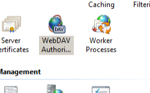

Adding XML Namespace to Property Provider Mappings &lt;add&gt;
====================

## Overview

The `<add>` element of the `<properties>` element defines a mapping for an XML namespace to a property store provider.

> [!NOTE]
> WebDAV defines two types of properties:

- "Live" properties: These properties exist in the underlying file system. For example, the file name and file size. These properties are always supported.
- "Dead" properties: These properties are user-defined and are stored in a property store. For example, the author of a document or the template that was used.

In order to use "dead" properties, you must set the `allowCustomProperties` of the `<properties>` element to **true**, and define a mapping for an XML namespace to property provider from the list of property providers that are defined in the [&lt;propertyStores&gt;](https://www.iis.net/configreference/system.webserver/webdav/globalsettings/propertystores) collection.

## Compatibility

| Version | Notes |
| --- | --- |
| IIS 10.0 | The `<add>` element was not modified in IIS 10.0. |
| IIS 8.5 | The `<add>` element was not modified in IIS 8.5. |
| IIS 8.0 | The `<add>` element was not modified in IIS 8.0. |
| IIS 7.5 | The `<add>` element of the `<properties>` element ships as a feature of IIS 7.5. |
| IIS 7.0 | The `<add>` element of the `<properties>` element was introduced in WebDAV 7.0, which was a separate download for IIS 7.0. |
| IIS 6.0 | N/A |

## Setup

To support WebDAV publishing for your Web server, you must install the WebDAV module. To do so, use the following steps.

### Windows Server 2012 or Windows Server 2012 R2

1. On the taskbar, click **Server Manager**. - In **Server Manager**, click the **Manage** menu, and then click **Add Roles and Features**. - In the **Add Roles and Features** wizard, click **Next**. Select the installation type and click **Next**. Select the destination server and click **Next**. - On the **Server Roles** page, expand **Web Server (IIS)**, expand **Web Server**, expand **Common HTTP Features**, and then select **WebDAV Publishing**. Click **Next**.  
     . - On the **Select features** page, click **Next**. - On the **Confirm installation selections** page, click **Install**. - On the **Results** page, click **Close**.

### Windows 8 or Windows 8.1

1. On the **Start** screen, move the pointer all the way to the lower left corner, right-click the **Start** button, and then click **Control Panel**. - In **Control Panel**, click **Programs and Features**, and then click **Turn Windows features on or off**. - Expand **Internet Information Services**, expand **World Wide Web Services**, expand **Common HTTP Features**, and then select **WebDAV Publishing**.  
    - Click **OK**.
- Click **Close**.

### Windows Server 2008 R2

1. On the taskbar, click **Start**, point to **Administrative Tools**, and then click **Server Manager**. - In the **Server Manager** hierarchy pane, expand **Roles**, and then click **Web Server (IIS)**. - In the **Web Server (IIS)** pane, scroll to the **Role Services** section, and then click **Add Role Services**. - On the **Select Role Services** page of the **Add Role Services Wizard**, expand **Common HTTP Features**, select **WebDAV Publishing**, and then click **Next**.   
    - On the **Confirm Installation Selections** page, click **Install**. - On the **Results** page, click **Close**.

### Windows 7

1. On the taskbar, click **Start**, and then click **Control Panel**. - In **Control Panel**, click **Programs and Features**, and then click **Turn Windows Features on or off**. - Expand **Internet Information Services**, then **World Wide Web Services**, and then **Common HTTP Features**. - Select **WebDAV Publishing**, and then click **OK**.   
    

### Windows Server 2008 or Windows Vista

- Download the installation package from the following URL: 

    - [https://www.iis.net/expand/WebDAV](https://www.iis.net/downloads/microsoft/webdav)
- Follow the instructions in the following walkthrough to install the WebDAV module: 

    - [Installing and Configuring WebDAV on IIS 7.0](https://go.microsoft.com/fwlink/?LinkId=105146)

## How To

### How to configure WebDAV properties for a Web site

1. Open **Internet Information Services (IIS) Manager**: 

    - If you are using Windows Server 2012 or Windows Server 2012 R2: 

        - On the taskbar, click **Server Manager**, click **Tools**, and then click **Internet Information Services (IIS) Manager**.
    - If you are using Windows 8 or Windows 8.1: 

        - Hold down the **Windows** key, press the letter **X**, and then click **Control Panel**.
        - Click **Administrative Tools**, and then double-click **Internet Information Services (IIS) Manager**.
    - If you are using Windows Server 2008 or Windows Server 2008 R2: 

        - On the taskbar, click **Start**, point to **Administrative Tools**, and then click **Internet Information Services (IIS) Manager**.
    - If you are using Windows Vista or Windows 7: 

        - On the taskbar, click **Start**, and then click **Control Panel**.
        - Double-click **Administrative Tools**, and then double-click **Internet Information Services (IIS) Manager**.
2. In the **Connections** pane, expand the server name, expand the **Sites** node, and then click the name of the site.
3. In the site's **Home** pane, double-click **WebDAV Authoring Rules**.  
    
4. When the **WebDAV Authoring Rules** page is displayed, click **WebDAV Settings** in the **Actions** pane.  
    
5. When the **WebDAV Settings** page is displayed, specify the following options in the **Property Behavior** section: 

    - Set **Allow anonymous property queries** to **False**.
    - Set **Allow custom properties** to **True**.
    - Set **Allow property queries with infinite depth** to **False**.
  
    
6. Click the ellipsis (**...**) button to launch the Namespace Collection Editor.   
    
7. Click **Add** and then choose **webdav\_simple\_prop** from the drop-down list
8. Specify "\*" for the XmlNameSpace and then click **OK**.
9. Once you have completed the previous steps, click **Apply** in the **Actions** pane.

## Configuration

The `<properties>` element is configurable only at the site level in the ApplicationHost.config file. Any `<properties>` elements at other levels or in Web.config files are ignored.

### Attributes

| Attribute | Description |
| --- | --- |
| `xmlNamespace` | Required string attribute. Specifies the XML namespace for the mapping. > [!NOTE]
 > The wildcard "\*" character is used to define the default namespace mapping, and any namespace that does not have a unique mapping will use the wildcard mapping. If a WebDAV client uses an XML namespace for which there is no specific namespace mapping and a wildcard mapping does not exist, the properties cannot be stored. The default value is `false`. |
| `propertyStore` | Required string attribute. Specifies the property store for the mapping. > [!NOTE]
 > The name of the property store must be defined in the [&lt;propertyStores&gt;](https://www.iis.net/configreference/system.webserver/webdav/globalsettings/propertystores) collection. The default value is `false`. |

### Child Elements

None.

### Configuration Sample

The following example lists a sample `<webdav>` element for the Default Web Site. This example clears any existing authoring rules, adds a single rule for the administrators group, enables WebDAV authoring, specifies that hidden files are allowed, enables WebDAV locks and specifies the lock provider, and enables WebDAV properties and specifies the default XML namespace for property mapping.

[!code-xml[Main](add/samples/sample1.xml)]

## Sample Code

The following examples configure the WebDAV property settings so that both anonymous and infinite depth property queries are disabled, and enable custom properties with the default XML namespace mapped to the built-in *webdav\_simple\_prop* provider.

### AppCmd.exe

[!code-console[Main](add/samples/sample2.cmd)]

> [!NOTE]
> You must be sure to set the **commit** parameter to `apphost` when you use AppCmd.exe to configure these settings. This commits the configuration settings to the appropriate location section in the ApplicationHost.config file.

### C#

[!code-csharp[Main](add/samples/sample3.cs)]

### VB.NET

[!code-vb[Main](add/samples/sample4.vb)]

### JavaScript

[!code-javascript[Main](add/samples/sample5.js)]

### VBScript

[!code-vb[Main](add/samples/sample6.vb)]