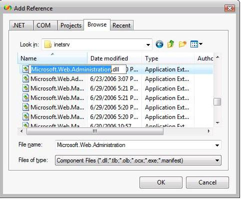

Extending IIS 7.0 Schema and Accessing the Custom Sections Using MWA
====================
by IIS Team

## Abstract

The IIS 7.0 and above XML configuration files allow third parties to include their own custom configuration sections. This document shows how to extend the IIS schema in order to set up and access customized configuration sections in the IIS configuration files (applicationHost.config and web.config). Users can programmatically get and set properties in their custom sections using the Microsoft.Web.Administration APIs in both a generic manner and by developing strongly typed classes to represent the section.

## Introduction

This document walks through the following: extending the IIS schema to set up a custom configuration section; and, creating a console application in order to access the properties of that section using the Microsoft.Web.Administration APIs.

Microsoft.Web.Administration provides several generic base classes which represents different components in the configuration system.

- **Configuration:** Represents a single configuration file (applicationHost.config or the web.config files for sites and applications)
- **ConfigurationElement:** A generic entity used to represent an element in a configuration file. This is the base class for configuration sections, collection entries, nested elements in a section, etc.
- **ConfigurationAttribute:** Represents a property within a ConfigurationElement
- **ConfigurationSection:** Derives from ConfigurationElement and represents a section defined in the IIS schema files. Used to access the various properties of a section.
- **ConfigurationElementCollection:** A collection class comprised of ConfigurationElements. Also derives from ConfigurationElement.

Strongly typed classes representing specific sections can be written by deriving from these base classes.

## Extending the Schema

Extending the schema involves adding a simple .xml file in the `%SystemRoot%\system32\inetsrv\config\schema` directory on the machine. The IIS\_schema.xml file is already present in this directory and can be used as an example in order to set up your own schema. Create a file named CUSTOM\_schema.xml and set it up as shown in the example below. In this case, the custom section (called "myCustomSection") has four properties of type boolean, string, integer and enum. The default values for these properties are specified in the schema as shown below:

[!code-xml[Main](extending-iis-schema-and-accessing-the-custom-sections-using-mwa/samples/sample1.xml)]

Register the section in the applicationHost.config. This involves adding just one line in the applicationHost.config as shown in the example below:

[!code-xml[Main](extending-iis-schema-and-accessing-the-custom-sections-using-mwa/samples/sample2.xml)]

## Creating a Console Application

Create a new console application using Visual Studio.

Add a reference to the Microsoft.Web.Administration.dll located at `%SystemRoot%\system32\inetsrv`.

Now write C# code in order to access the configuration section just created.

## Access the Configuration Section Using Generic Classes

Use the generic classes present in the Microsoft.Web.Administration namespace to access the configuration section created above. The code snippet below shows how to get and set the property "booleanProperty" in the section. These snippets set the properties in the applicationHost.config file and are inherited (and can be overridden) by all sites and applications on the machine.

[!code-csharp[Main](extending-iis-schema-and-accessing-the-custom-sections-using-mwa/samples/sample3.cs)]

The applicationHost.config file is now updated with the changes.

[!code-xml[Main](extending-iis-schema-and-accessing-the-custom-sections-using-mwa/samples/sample4.xml)]

The code snippet to read and update all the properties in the section is:

[!code-csharp[Main](extending-iis-schema-and-accessing-the-custom-sections-using-mwa/samples/sample5.cs)]

## Access the Configuration Section Using Strongly Typed Classes

The Microsoft.Web.Administration API provides base classes to derive strongly typed classes for the custom configuration section. The main advantage of using strongly typed classes is that getting and setting properties is easy, especially when the section has nested elements. Using these classes in Visual Studio also provides IntelliSense and compile time checking of property types.

Calling base[...] wraps the GetAttributeValue and SetAttributeValue classes which sets the values for those attributes.

[!code-csharp[Main](extending-iis-schema-and-accessing-the-custom-sections-using-mwa/samples/sample6.cs)]

Here is the code to get and set values for this configuration section using the strongly typed classes.

[!code-csharp[Main](extending-iis-schema-and-accessing-the-custom-sections-using-mwa/samples/sample7.cs)]