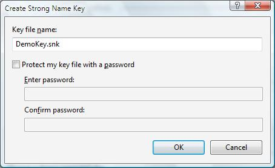
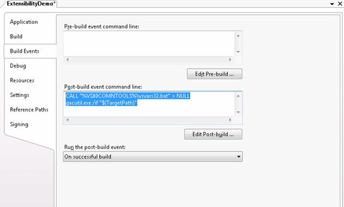

How to Create a Simple IIS Manager Module
====================
by [Carlos Aguilar Mares](https://twitter.com/CarlosAguilarM)

## Introduction

The new IIS 7.0 and above Web Management tool is an extensible developer platform. Third parties can develop and install their own management features that appear as first-class features in the tool. The tasks illustrated in this article include:

- Creating the project in Microsoft Visual Studio or Microsoft Visual C# Express so that the library can be used inside InetMgr
- Creating a simple module provider
- Creating a simple module that displays a message box.

## Task 1: Creating the Project

To create an extensibility module for InetMgr, you must create a DLL project also known as a Class Library project. This DLL needs to be strongly named so that it can be registered in the GAC (Global Assembly Cache), which is a requirement for Modules used by InetMgr.

1. Click **Start**, click **Programs** and run **Microsoft Visual Studio 2005 or Microsoft Visual C# 2005 Express Edition**

2. In the **File Menu** select the option **New Project**.

3. In the **New Project** dialog select **Class Library** as the project type and type **ExtensibilityDemo** as the name of the project. Click **OK**.

4. Remove the file Class1.cs added by default (since we will not be using that file) using the context menu Delete option in the Solution Explorer.

5. Using the **Add Reference...** option from the Project Menu, add a reference to **Microsoft.Web.Management.dll** using the **Browse tab** and search for it in the \**Windows\system32\inetsrv** directory. This is the DLL that contains all the extensibility classes needed for creating modules for InetMgr.

Since we use code to create UI based on WinForms, we must add a reference to System.Windows.Forms.dll; for that, use the **Add Reference...** option from the Project Menu and select **System.Windows.Forms.dll** in the.NET list of assemblies.

One of the requirements for libraries used inside InetMgr is that they must be registered inside the GAC. Make sure the DLL is strongly named (sometimes referred as Signed). Visual Studio offers an easy way to create and new names. Use the **Project menu** select the option **ExtensibilityDemo Properties**.

6. In the **Signing** tab, check the **Sign the assembly** check box.

7. In the combo box, select the option &lt;**New…&gt;** to create a new key. In the **Create Strong Name Key** dialog, type **DemoKey.snk** as the name for the key and uncheck the **Protect my key file with a password** check box. Click **OK**.

The signing tab should appears as follows:

Since we want the assembly to be in the GAC, we add some Post-build events so that the assembly automatically gets added to the GAC every time we compile. This makes debugging easy, as well as making changes as we add new functionality.

8. Select the **Build Events** tab and add the following **Post-build event** command line:

[!code-console[Main](how-to-create-a-simple-iis-manager-module/samples/sample1.cmd)]

**(Optional)** If you are using Microsoft Visual Studio 2005, setup debugging correctly so that you can use F5 to run the code. In the project properties, select **Debug** tab and set it to start an external program choosing **\windows\system32\inetsrv\inetmgr.exe**.

9. Close the project properties and select the option **Save All** in the File Menu, and set the location to d:\Demos. Click **Save**.

You can now **compile the project** using **Build Solution** under the Build menu. This automatically builds the DLL and adds it to the GAC.

> [!NOTE]
> If the command for setting vsvars32.bat does not work with an error code 9009, replace the command added in the Post Build events in step 8, by adding the full path to gacutil.exe, for example:

[!code-unknown[Main](how-to-create-a-simple-iis-manager-module/samples/sample-127065-2.unknown)]

## Task 2: Creating a Module Provider

In this task, you create a module provider; this is the main entry point for registration of modules in InetMgr. These module providers are listed in Administration.config.

1. Select the option **Add New Item** from the Project Menu. In the Add New Item dialog box, select the Class template and type **DemoModuleProvider.cs** as the name for the file.

2. Change the code so that it looks as follows:

[!code-csharp[Main](how-to-create-a-simple-iis-manager-module/samples/sample3.cs)]

This code creates a ModuleProvider that supports all types of connections (Server, Site and Application) and registers a client-side Module called **DemoModule**.

## Task 3: Creating a Module

In this task, you learn how to create a Module. A Module is the main entry point in the client for all extensibility objects. It has one main method called Initialize. That is the method where all the action occurs.

1. Select the option Add New Item in the Project Menu. Select the Class template and type DemoModule.cs as the file name.

2. Change the code so that it looks as follows:

[!code-csharp[Main](how-to-create-a-simple-iis-manager-module/samples/sample4.cs)]

## Task 4: Testing the Module

In this task, you add the new module that you built. For that, we must add it to the file administration.config in the moduleProviders list.

First, we must figure out the full name for the assembly we just created. It is in the form of "ExtensibilityDemo, Version=1.0.0.0, Culture=neutral, PublicKeyToken=*{YourKey}*". Use Windows Explorer to find it.

1. Open **Windows Explorer** and navigate to \**Windows\Assembly** folder.

2. Look for ExtensibilityDemo in the list of assemblies and right-click it and select **properties**. In the dialog, you will see a field called Public Key Token; we need this value to register it to InetMgr, so copy it to the clipboard.

3. Back in Microsoft Visual C# 2005 Express, select the option Open File… under File Menu. Browse for the file \Windows\System32\InetSrv\Administration.config

4. Search for the &lt;moduleProviders&gt; section and add the following, but make sure you replace the Public Key Token with the one we copied in step 2:

[!code-xml[Main](how-to-create-a-simple-iis-manager-module/samples/sample5.xml)]

> [!NOTE]
> By adding it only to the list of moduleProviders you are registering the module only for Server connections. If you want this module to be enabled for Site connections as well as application connections, add it to the following list:

[!code-xml[Main](how-to-create-a-simple-iis-manager-module/samples/sample6.xml)]

5. Save the File and run InetMgr, connect to localhost and you see the following message:

## Summary

This article explained how to create a Visual Studio project to develop extensibility modules for the new IIS Management Tool. We created a simple ModuleProvider and its Module counterpart to display a message.

Now that you understand the basics of creating IIS Management Tool Modules, you can explore more interesting features that are available for extensibility.
  
  
[Discuss in IIS Forums](https://forums.iis.net/1042.aspx)