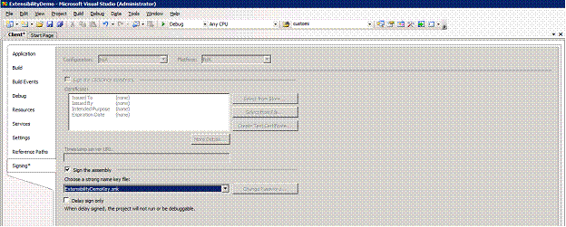
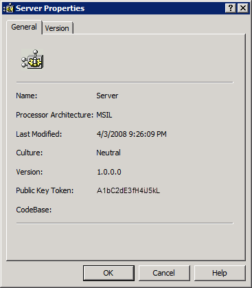
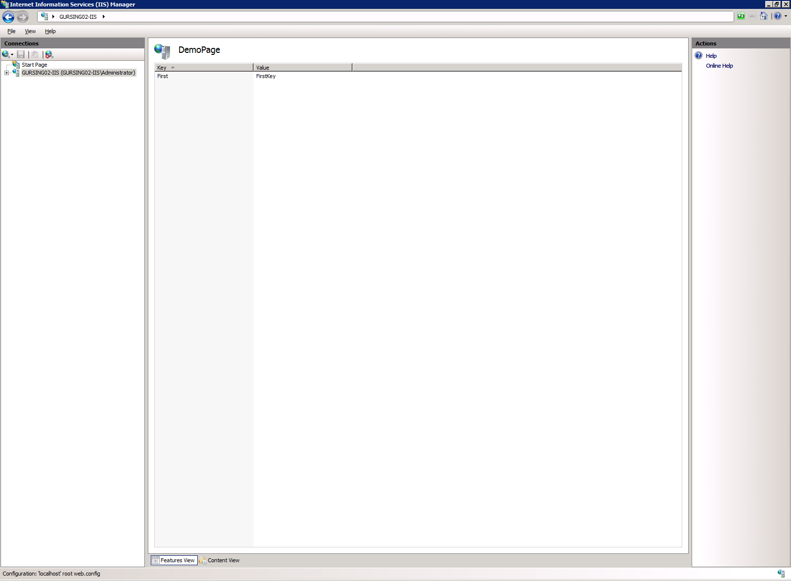

Understanding UI Extension Authoring
====================
by Gurpreet Singh

## Introduction

The administration tool for IIS 7.0 and above is an extensible platform for plugging in modules. Developers can write their own UI features and will be treated as first class citizen by intemgr.

This walkthrough shows how to create a UI module from scratch. It shows the best practices for creating a module followed by IIS team.

The task consists of creating two assemblies. The process can be summarized as two steps.

- Creating the Client assembly
- Creating the server assembly

The new inetmgr is designed to use a web service like architecture that enforces a clean separation between user interface logic and code manipulating server settings. This is done mainly through two classes ModuleService and ModuleServiceProxy. The ModuleService derived class is assosciated with its ModuleProvider through the ModuleProvider **ServiceType** property.

## Creating an Empty Solution

Click **Start**, Click Programs and run **Microsoft Visual Studio 2005** or **Microsoft Visual C# 2005 Express Edition.** In the **File Menu,** select the option **New Project,** go to **Other Project Types** and **Visual Studio Solutions**. Select Blank Solution from the right hand side and name the Solution as ExtensibilityDemo.

## Creating the Client Assembly

Tasks illustrated to create a client assembly consist of

- Setting up the project for Client Assembly
- Creating a ModuleServiceProxy
- Creating a ModuleListPage and using the ModuleServiceProxy.
- Creating a Module Class.

### Setting up the project for Client Assembly

In the solution Explorer, right click the solution select Add and New Project to launch this window. Select Visual C# and class Library from the right pane and name the project as Client.

Remove the file Class1.cs that was added by default since we will not be using that file by using the context menu Delete option in the solution explorer.

Using the Add Reference… from the Project menu, add reference to **Microsoft.Web.Management.dll** using the **Browse tab** and search for \Windows\system32\inetsrv directory. This is the directory that contains the extensibility classes for creating modules in inetmgr. Since we are going to reference some of the classes from System.Windows.Forms, so include reference to System.Windows.Forms also.

**Best Practice: Never reference Microsoft.Web.Administration.dll from the Client Project.**

One of the requirements for libraries to be used inside the InetMgr is that they need to be registered inside GAC. For that, we need to make sure our DLL is strongly named. Visual studio offers an easy way to create new names. To sign an assembly, go to **Project Properties** and to **Signing** Tab, Click **Sign the assembly**. In the dialog box, name the key as **ExtensibilityDemoKey** and uncheck **Protect my key file with a password.**

Hit OK to sign the assembly. Also, since we want the assembly to be in the GAC, we will add some Post-build events so that it automatically gets added to the GAC every time we compile. This will make it really straight forward to debug and make changes as we add new functionality. For this, select the **Build Events** tab and add the following **Post-build event** command line:

[!code-console[Main](understanding-ui-extension-authoring/samples/sample1.cmd)]

Finally, close the project Properties and select the option **Save All** in the **File Menu.** You can now compile the project using Build Solution under the Build Menu. This will automatically build the dll and add it to the GAC.

Note: If the command for setting vsvars32.bat does not work with an error code 9009, you can also replace the command added in the Post Build Events, by adding the full path to gacutil.exe, for example:

[!code-unknown[Main](understanding-ui-extension-authoring/samples/sample-127066-2.unknown)]

## Creating the ModuleServiceProxy

A ModuleServiceProxy is the class that simplifies the process of calling methods in ModuleService class. This class is important because it abstracts the logic when administering a local server or administering a remote machine using the Web Management Service(wmsvc).

In this sample, we are going to write read contents of **"appSettings"**. Select the option Add New Item in the project Menu. Select the Code and type DemoModuleServiceProxy as the file name.

Change the code so that it looks like this.

[!code-csharp[Main](understanding-ui-extension-authoring/samples/sample3.cs)]

As we can see writing a proxy is simple matter of writing a class that derives from ModuleServiceProxy and invoking methods in the ModuleService on the server side.

## Creating a ModuleListPage

Select the option Add New Item in the project menu. Select the Code and type DemoModuleListPage.cs as the file name.

Change the code so that it looks like this.

[!code-csharp[Main](understanding-ui-extension-authoring/samples/sample4.cs)]

In this demo, we are extending ModuleListPage class. It overrides the InitializeListPage method to initialize the columns and adding them to listview. It also overrides the OnActivated method. This method is invoked when this page is accessed

## Creating the Module Class

This is the entry point for the client side for all existing objects. It has three main methods called Initialize,GetService and Dispose. This is the method where all the actions such as registration of page, assigning category to page etc. is done.

Select the option Add New Item in the project menu. Select the Code and type DemoModule.cs as the file name.

Change the code so that it looks like this.

[!code-csharp[Main](understanding-ui-extension-authoring/samples/sample5.cs)]

DemoModule overrides the Initialize method. It first calls the Initialize on the base class. It then accesses Control Panel service through GetService. It then registers itself through RegisterPage of ControlPanel. 

## Creating the Server Assembly

Server assembly consist of writing two main classes

- Module Provider
- Module Service

The server should also reference two main assemblies from \Windows\System32\inetsrv directory called Microsoft.Web.Management.dll and Microsoft.Web.Management.Administration.dll. The first assembly consists of all the framework classes of creating the UI for intemgr and second assembly consist of classes for reading configuration and writing configuration.

In the solution Explorer, right click the solution select Add and New Project to launch the window. Select Visual C# and class library from the right pane and name the project as Server.

Remove the file Class1.cs that was added by default since we will not be using that file by using the context menu Delete option in the solution explorer.

Using the Add Reference… from the Project menu, add reference to **Microsoft.Web.Management.dll and Microsoft.Web.Management.Administration.dll** using the **Browse tab** and search for \Windows\system32\inetsrv directory. This is the directory that contains the extensibility classes for creating modules in inetmgr.

One of the requirements for libraries to be used inside the InetMgr is that they need to be registered inside GAC. For that, we need to make sure our DLL is strongly names. Visual studio offers an easy way to create new names. To sign an assembly, go to **Project Properties** and to **Signing** Tab, Click **Sign the assembly**.In the drop down click on Browse. In the dialog box, go to the **Client** folder, and select the **ExtensibilityDemoKey** and hit open. Save the project properties.

Hit OK to sign the assembly. Also, since we want the assembly to be in the GAC, we will add some Post-build events so that it automatically gets added to the GAC every time we compile. This will make it really straight forward to debug and make changes as we add new functionality. For this, select the **Build Events** tab and add the following **Post-build event** command line:

gacutil.exe /if "$(TargetPath)"

Finally, close the project Properties and select the option **Save All** in the **File Menu.** You can now compile the project using Build Solution under the Build Menu. This will automatically build the dll and add it to the GAC.

Note: If the command for setting vsvars32.bat does not work with an error code 9009, you can also replace the command added in the Post Build Events, by adding the full path to gacutil.exe, for example:

[!code-unknown[Main](understanding-ui-extension-authoring/samples/sample-127066-6.unknown)]

## Creating a Module Service

In this task, we will be creating a new ModuleService. This is the class which makes use of Microsoft.Web.Administration.dll to read or write to the underlying configuration files.

Select the option **Add New Item** from the project menu. In the Add New Item dialog select Code template and type **DemoModuleService.cs** as the name of the file.

Change the code so that it looks as follows:

[!code-csharp[Main](understanding-ui-extension-authoring/samples/sample7.cs)]

## Creating an AssemblyRef class

In this you will create an AssemblyRef class. This class will be referenced by moduleprovider to instantiate the module class.

Select the option **Add New Item** from the project menu. In the Add New Item dialog select Code template and type **DemoModuleProvider.cs** as the name of the file.

[!code-csharp[Main](understanding-ui-extension-authoring/samples/sample8.cs)]

## Creating a Module Provider

In this you will create a module provider; this is the main entry point for registration of modules in Inetmgr. These module providers are listed in Administration.config.

Select the option **Add New Item** from the project menu. In the Add New Item dialog select Code template and type **DemoModuleProvider.cs** as the name of the file.

Change the code so that it looks as follows:

[!code-csharp[Main](understanding-ui-extension-authoring/samples/sample9.cs)]

## Adding Entry in Administration.Config

In this section, we will add the entry in administration.config in the moduleProviders list. Full name of the assembly can be found from \Windows\Assembly folder. Search for the assembly Client and right click and Properties.

The full name of the assembly can be determined from this window. So for example, the full name of the assembly in my case is **Server, Version=1.0.0.0, Culture=neutral, PublicKeyToken=e788138af6131538.** The entry that should be added to administration.config , in moduleProviders would be

[!code-xml[Main](understanding-ui-extension-authoring/samples/sample10.xml)]
  
**Note: By adding this entry, this module is only registered for server connections.**

Build the solution and run inetmgr and you will see following screenshots

## Summary

You have learned how to use extensibility model of inetmgr and create your own custom page. In future articles, I will also talk about how to add taskItems and write to the configuration files.
  
  
[Discuss in IIS Forums](https://forums.iis.net/1042.aspx)