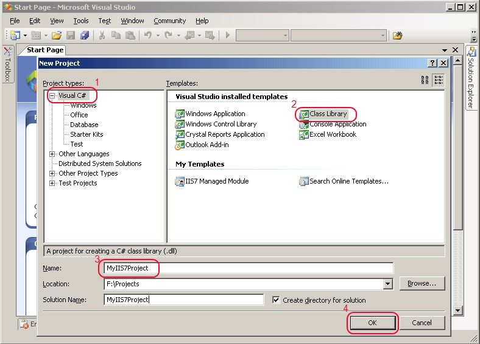

Developing IIS 7.0 Modules and Handlers with the .NET Framework
====================
by [Mike Volodarsky](https://github.com/leanserver)

## Overview

This article focuses on getting started with developing IIS 7.0 and above Web server features based on the .NET Framework. This article demonstrates:

1. How to decide whether to develop an IIS module or an IIS handler
2. How to set up your development environment, with Visual Studio, Visual C# Express, or command-line tools provided with the .NET Framework
3. How to create your first project
4. How to develop a simple module and handler
5. How to deploy a simple module and handler to an IIS server

To see some real-world managed IIS modules and handlers, and download them for your application, visit [Redirect requests to your application with the HttpRedirection module](http://mvolo.com/redirect-requests-to-your-application-with-the-httpredirection-module/), [Get nice looking directory listings for your IIS website with DirectoryListingModule](http://mvolo.com/get-nice-looking-directory-listings-for-your-iis-website-with-directorylistingmodule/), and [Display pretty file icons in your ASP.NET applications with IconHandler](http://mvolo.com/display-pretty-file-icons-in-your-aspnet-applications-with-iconhandler/).

## Introduction: Developing IIS features with ASP.NET

IIS releases prior to IIS 7.0 featured a C API, called ISAPI, as a primary extensibility API for building web server features. IIS 7.0 and above have been re-engineered from the ground up to provide a brand new C++ API, on which all of the in-the-box features are based, to allow complete runtime extensibility of the web server.

In addition to this, IIS for the first time also provides a full-fidelity .NET API for extending the web server, by leveraging tight integration with ASP.NET 2.0. To you, this means that you are now able to extend IIS with new web server features built with the familiar ASP.NET 2.0 APIs. Likewise, you can use existing ASP.NET 2.0 modules and handlers on IIS, leveraging ASP.NET integration to enhance the power of your application without writing any new code. To learn more about ASP.NET integration in IIS, click [here](../../application-frameworks/building-and-running-aspnet-applications/aspnet-integration-with-iis.md).

## Tools of the Trade: Deciding on Your Development Environment

To build IIS modules and handlers, use any environment that allows you to develop and compile .NET assemblies. Some of the common options are:

1. **Visual Studio 2005**. Alternatively, you can also download the latest beta release of [Visual Studio 2008](https://go.microsoft.com/?linkid=9268697 "Visual Studio 2008").
2. [**Visual C# 2005 Express Edition**](https://msdn.microsoft.com/vstudio/express/visualcsharp/default.aspx), a free download (or other Express tools, including Visual Basic 2005 Express).
3. **The C# command line compiler** (csc.exe) included in the .NET framework runtime (for other languages, you will need to download the [SDK](https://msdn.microsoft.com/en-us/netframework/aa569263.aspx)), plus your favorite source editor.

The samples in this article use C#, although you can develop IIS components in any other supported .NET language (except managed C++). The article illustrates how to develop IIS extensibility components with all three of the above environments.

> [!NOTE]
> Because IIS leverages the existing ASP.NET APIs for its .NET extensibility, you can develop IIS .NET modules and handlers with .NET Framework 2.0 on Windows XP® and Windows Server® 2003. However, if you plan to use one of the several new ASP.NET APIs that have been added to support new IIS features, you must either develop on Windows Vista®, or obtain the version of System.Web.dll from in Windows Vista or the latest release of [.Net Framework 3.5](https://msdn.microsoft.com/en-us/netframework/default.aspx) in order to compile your code.

## Two Ways to Extend IIS: Module vs. Handler

All IIS web server features fit into two categories: modules, and handlers.

A **module**, similar to the ISAPI filter in previous IIS versions, participates in the request processing of every request in order to change or add to it in some way. Examples of some in-the-box modules in IIS include authentication modules, which manipulate the authentication status of the request, compression modules that compress the outgoing response, and logging modules that log information about the request to the request logs.

The module is a .NET class that implements the ASP.NET **System.Web.IHttpModule** interface, and uses the APIs in the **System.Web** namespace to participate in one or more of ASP.NET's request processing stages.

A **handler,** similar to the ISAPI extension in previous IIS versions, is responsible for handling the request and producing the response for specific content types. The main difference between the module and the handler is that the handler is typically mapped to a particular request path or extension, and supports the processing of a specific server resource to which that path or extension corresponds. Examples of handlers provided with IIS include ASP, which processes ASP scripts, the static file handler, which serves static files, and ASP.NET's PageHandler which processes ASPX pages.

The handler is a .NET class that implements the ASP.NET **System.Web.IHttpHandler** or **System.Web.IHttpAsyncHandler** interface, and uses the APIs in the **System.Web** namespace to produce an http response for specific content it supports.

When planning to develop an IIS feature, the first question you should ask is whether this feature is responsible for serving requests to a specific url/extension, or applies to all/some requests based on arbitrary rules. In the former case, your should be a handler, and in the latter, a module.

This article demonstrates building both a simple module, and a simple handler, the common steps in creating the project, and compiling it, and the specific steps to deploying them to the server.

> [!NOTE]
> You are not required to develop a handler if you are developing a module, and visa-versa.

## Getting Started: Creating the Visual Studio Project

To build either a module or a handler, you must produce a .NET assembly (DLL) containing the module/handler classes. If you are using Visual Studio or Visual Studio Express tools, the first step is creating a Class Library project:

1. From the "**File**" menu, select "**New**", "**Project ...**". In the New Project dialog (below), select the "**Visual C#**" project type and select the "**Class Library**" in the right hand list of Visual Studio installed templates.  
  
    
2. We must add a reference to the "System.Web.dll" assembly which contains the APIs used to develop ASP.NET and IIS modules and handlers. Right click the "**References**" node under the Project node in the right hand solution explorer tree view, choose "**Add Reference ...**", and in the .NET tab select the System.Web assembly, version 2.0 (below).  
  
    

> [!NOTE]
> You can use the System.Web assembly version 2.0 on Windows XP and Windows Server 2003 if you do not plan to take advantage of IIS specific ASP.NET APIs. Modules and handlers compiled referencing this assembly can be deployed and operated on IIS on Windows Vista and Windows Server 2008 without a problem. If you do want to use the few IIS specific ASP.NET APIs in your module, you must either develop on Windows Vista, Windows Server 2008, or obtain the System.Web.dll assembly from .NET Framework 3.5. The IIS specific APIs include HttpServerUtility.TransferRequest, the HttpResponse.Headers collection, the HttpApplication.LogRequest event, and several others.

## Writing Code: Building a Simple Module

The first task is to build a simple module. Later in the article, we also build a sample handler.

To create a **module**, define a class that implements the [**System.Web.IHttpModule**](https://msdn.microsoft.com/en-us/library/system.web.ihttpmodule.aspx) interface.

1. Delete the "class1.cs" file generated by the project system, and add a new C# class called MyModule by right-clicking on the MyIIS7Project project in the right-hand tree view, selecting "**Add**", **New item ...**", choosing "**Class**", and typing in "**MyModule.cs**" in the Name field.
2. Import the **System.Web** namespace so we can easily access the types therein.
3. Make our MyModule class implement the **IHttpModule** interface, and define the interface members [**Dispose**](https://msdn.microsoft.com/en-us/library/system.web.ihttpmodule.dispose.aspx)() and [**Init**](https://msdn.microsoft.com/en-us/library/system.web.ihttpmodule.init.aspx)(). Do this quickly by right clicking IHttpModule interface and choosing "Implement interface" option:  
  
       

    The **Dispose**() method is intended to clean up any unmanaged resources deterministically when the module is being unloaded, so the resources can be released before the module instance is finalized by the garbage collector. You may leave this method blank most of the time.   
  
The **Init**(**HttpApplication context**) method is the main method of interest. Its role is to perform the initialization of your module, and wire up your module to one or more of request processing events available on the [**HttpApplication**](https://msdn.microsoft.com/en-us/library/system.web.httpapplication(vs.71).aspx) class. During the request processing, your module will be invoked for each of the events that it subscribed for, allowing it to execute and perform its service. To do that:
4. Subscribe to one or more of the request processing events by wiring up a method on your module class to one of the events on the HttpApplication instance provided. The method has to follow the [**System.EventHandler**](https://msdn.microsoft.com/en-us/library/system.eventhandler.aspx) delegate signature. We define a new method, called **OnPreExecuteRequestHandler**, and wire it up to the **HttpApplication**.[**PreRequestRequestHandlerExecute**](https://msdn.microsoft.com/en-us/library/system.web.httpapplication.prerequesthandlerexecute.aspx) event, which occurs right before the server is about to invoke the request handler for the request: 

	[!code-csharp[Main](developing-iis-modules-and-handlers-with-the-net-framework/samples/sample1.cs)]

    [ in Visual Studio")](developing-iis-modules-and-handlers-with-the-net-framework/_static/image13.jpg)

    At this point, our module is set up to receive the PreRequestHandlerExecute event on each request. You can repeat this for all other events you would like to receive.
5. Now we make our modules do something useful, something that illustrates using some of the ASP.NET APIs that a module could use. Check if the request specifies a referer header, and if it does, reject it, as a silly way to prevent people from linking to your website from other websites. We will do this in our OnPreRequestHandlerExecute method which is invoked right before the handler runs on every request: 

	[!code-csharp[Main](developing-iis-modules-and-handlers-with-the-net-framework/samples/sample2.cs)]

    

    > [!NOTE]
    > The HttpApplication instance is provided to your module via the **source** argument, and requires casting. You can access the rest of the request object model from the HttpApplication instance, such as the HttpContext object, and the contained HttpRequest object that represents the request.  
  
The code above checks if the Referer header has been specified, and if so, it rejects the request with a 403 Unauthorized error code.

## Writing Code: Building a Simple Handler

The next task is to build a simple handler. Earlier in the article, we built a sample module - go back if you want to read about building a module instead.

To create a **handler**, we must define a class that implements the [**System.Web.IHttpHandler**](https://msdn.microsoft.com/en-us/library/system.web.ihttphandler.aspx) interface (we can also implement the[**System.Web.IHttpAsyncHandler**](https://msdn.microsoft.com/en-us/library/system.web.ihttpasynchandler.aspx)if we want the page to execute asynchronously). To do that:

1. If you have not already, delete the "class1.cs" file generated by the project system, and add a new C# class called MyHandler by right-clicking on the MyIIS7Project project in the right-hand tree view, selecting "**Add**", **New item ...**", choosing "**Class**", and typing in "**MyHandler.cs**" in the Name field.
2. Import the **System.Web** namespace so we can easily access the types therein.
3. Make our MyHandler class implement the **IHttpHandler** interface, and define the interface members [**IsReusable**](https://msdn.microsoft.com/en-us/library/system.web.ihttphandler.isreusable(VS.71).aspx) and [**ProcessRequest**](https://msdn.microsoft.com/en-us/library/system.web.ihttphandler.processrequest(VS.71).aspx)(). You can do this quickly by right clicking IHttpHandler interface and choosing "Implement interface" option: 

    

 The **IsReusable** () indicates whether or not your handler instance can be re-used for subsequent requests. In some cases, after processing the request your handler may be in an incorrect state to process another request, especially if you have stored data about the previous request in member variables. Note that the runtime will never use the same instance of your handler to process two requests at the same time, even if its marked as reusable. If your handler does not store any per-request state in member variables and can have its ProcessRequest function called as many times as needed, make this property return true to allow reuse.   
  
 The **ProcessRequest** () method is the main entry point of the handler. Its role is to process the request specified by the **HttpRequest** instance available off the provided **HttpContext** instance, and generate the appropriate response using the **HttpResponse** instance also available off the HttpContext. The ProcessRequest() method will be invoked by the runtime during the ExecuteRequestHandler request processing stage, and ONLY IF the request mapped to your handler based on the configured handler mappings. This is different from a module which receives notifications for all requests to the application.
4. Implement the **IsReusable** property first. Since our handler will not store any member state for the request and will be able to support multiple calls to ProcessRequest() with different requests, we will mark it as reusable by returning true. 

	[!code-csharp[Main](developing-iis-modules-and-handlers-with-the-net-framework/samples/sample3.cs)]
5. Finally, let's implement the **ProcessRequest**() method to make our handler actually do something useful. To keep things nice and simple, our handler will return the current time on the server, optionally allowing the timezone to be specified in the query string. Our goal is to be able to request a URL, like [http://myserver/time.tm](http://myserver/time.tm), and get the current time on the server. Also, we will be able to the universal coordinated time by requesting [http://myserver/time.tm?utc=true](http://myserver/time.tm?utc=true). Here is our implementation: 

	[!code-csharp[Main](developing-iis-modules-and-handlers-with-the-net-framework/samples/sample4.cs)]

    We use the **HttpRequest.QueryString** collection to retrieve a QueryString variable, and write the current time to response using the **HttpResponse.Write** method. This is just a sample of the kinds of things you may choose to do in your handler - the HttpRequest class provides a lot more information about the request, and the HttpResponse class provides a number of different ways to shape the response returned to the client.  
  
	

The handler is finished.

## Code Complete: Compiling the Module/Handler

Now that we have the module and handler implemented, we can compile them into an assembly that ASP.NET can load at runtime. If you are using Visual Studio or Visual Studio Express, compile the project directly from the tool by pressing "**Ctrl-Shift-B**" or right-clicking on the project and choosing "**Build**".

The .DLL assembly will be generated in the &lt;ProjectDirectory&gt;\bin\debug folder, along with the .PDB symbols file that you can use for debugging the assembly on the server / including source code lines in exceptions during the debugging stage of your project.

If you are uploading your assembly to a production server, be sure to change the Solution configuration to be "Release" by right clicking the solution node, choosing Configuration Manager, and changing the type to Debug. Upload the Release version of the assembly (leave the PDB file behind) - this will strip the debugging information from the assembly, and optimize it resulting in faster code.

If you are not using Visual Studio, compile the project with the C# command line compiler included in the Framework runtime. To compile your project, open a command line prompt (be sure to run the command line prompt with the "Run as Administrator" option if you are on Windows Vista or Windows Server 2008):

`> %windir%\Microsoft.NET\Framework\v2.0.50727\csc.exe /t:library /out:MyIIS7Project.dll /debug \*.cs /r:System.Web.dll`

This produces the MyIIS7Project.DLL and MyIIS7Project.PDB files. If you want to build a release version of the assembly, omit the **/debug** switch, and include the **/o** switch to optimize the assembly.

## Deploying the Assembly to the Server

Now that we have implemented the custom module and handler, we deploy them to our web application. There are a number of ways to deploy a module or handler to the application, and a number of configuration options you can use to tailor their deployment to your needs. We illustrate the most basic deployment steps below. For an advanced discussion of deployment and configuration options, including how to deploy a module/handler for the entire server, please see the next article in the series: **Deploying IIS Modules and Handlers (coming soon)**.

The steps below assume that you are deploying the module and handler to an existing application on your IIS server. If you do not have an application created, use the root application of the "Default Web Site" typically located at `%systemdrive%\inetpub\wwwroot`. In the example below, we deploy the module and handler to an application called "myiis7project" located in the Default Web Site.

To deploy the module and handler, first make the assembly containing their implementation available to your ASP.NET application:

1. Copy the **MyIIS7Project.dll** assembly compiled earlier to the /BIN directory located in the root of your application. If this directory does not exist, create it.
2. Configure the module and handler to be loaded in the application. Open the **IIS7 Administration tool** via the Start menu, typing in **inetmgr.exe** in the start/search box and pressing Enter. In the tool, double-click on your server node in the left-hand tree view, then expand the "**Sites**" node, and double-click on the site or application to which you would like to add your module and handler.
3. Select the "**Modules**" feature icon, then click the "**Add Managed Module ...**" action, and in the resulting dialog box type in the module name (arbitrary) and the fully-qualified module type "**MyIIS7Modules.MyModule**". Note that you can also select the type in the drop-down box, as the tool will automatically load your assembly in bin and discover types that implement the IHttpModule interface. Press OK to add the module.  

    
4. Add the handler by double-clicking the site/application node again, and selecting the "**Handler Mappings**" feature icon. Then, click the "Add Managed Handler ..." action, and in the resulting dialog box specify "**time.tm**" for path, "**MyIIS7Modules.MyHandler**" for the type, and "**MyHandler**" for the name (arbitrary). Again, note that the type is present in the dropdown box because the Admin tool automatically detected this type in your assembly. Press OK to add the handler.  

    

The application configuration generated by the actions above configures the **MyModule** module to be loaded in your application (which enables it to run for all requests), and maps the **MyHandler** handler to process requests to the **time.tm** URL inside your application.

Note that this configuration enables your module and application to run only in IIS Integrated mode applications. If you want the module and handler to also run in Classic mode applications on IIS, and also on earlier versions of IIS, you must also add the Classic ASP.NET configuration for the module and handler. In addition, when running in Classic mode on IIS or on earlier versions of IIS, your handler requires you to create a script map mapping the **.tm** extension to ASP.NET in IIS scriptmaps, and your module runs only for requests to extensions mapped to ASP.NET. For more details on this, see **Deploying IIS Modules and Handlers (coming soon)**.

You can also add the module and the handler using the IIS command line tool, **AppCmd.exe**, or by manipulating the IIS configuration from script or managed code, or by placing the configuration directly into the **web.config** file. These additional options are discussed in-depth in **Deploying IIS modules and handlers (coming soon).**

## Testing the Module and Handler

We have deployed and configured the module / handler. Now to test them:

1. Test our handler by making a request to "time.tm" in our application. If successful, we see the current time on the server. Make a request to your application, for example [http://localhost/myiis7project/time.tm](http://localhost/myiis7project/time.tm) as we deployed the handler to the myiis7project application in the Default Web Site:  
  
 If the handler is properly deployed to this application, you see the current time on the server:   
  
      
  
 Also try requesting [http://localhost/myiis7project/time.tm?utc=true](http://localhost/myiis7project/time.tm?utc=true) to display the time in UTC.
2. Test the module. Create a simple html page called **page.html** in your application that links to the **/time.tm** URL:  
  
    **page.html**

    [!code-html[Main](developing-iis-modules-and-handlers-with-the-net-framework/samples/sample5.html)]
  
 Then, make a request to [http://localhost/myiis7project/page.html](http://localhost/myiis7project/page.html) to display the link. When you click the link, you observe an error:   
  
      
  
 You may ask if we did not just request this same URL above and successfully see the time. This is because our module is configured to reject requests to your application that specify a Referer header, which gets added by the browser whenever a user clicks a link to go to your website instead of just typing in the URL in the browser directly. So, when you requested the URL directly, you were able to access it - however, when you followed a link from another page, your request was rejected by our module.

## Summary

In this article, we illustrated the basic steps for developing an IIS module and handler with the familiar ASP.NET APIs, and deploying them to your application. We also discussed the choices you have for your development environment, and how to decide when to build a module vs. a handler. The information in this article should enable you to build your first modules and handlers to empower your IIS applications.

You can also review an example module that enables basic authentication against ASP.NET's Membership providers in [Developing a Module using .NET](developing-a-module-using-net.md).

Be sure to check out more examples of how managed IIS modules and handlers can add value to your applications, and download them for your application by visiting [Redirect requests to your application with the HttpRedirection module](http://mvolo.com/redirect-requests-to-your-application-with-the-httpredirection-module/), [Get nice looking directory listings for your IIS website with DirectoryListingModule](http://mvolo.com/get-nice-looking-directory-listings-for-your-iis-website-with-directorylistingmodule/), and [Display pretty file icons in your ASP.NET applications with IconHandler](http://mvolo.com/display-pretty-file-icons-in-your-aspnet-applications-with-iconhandler/).
