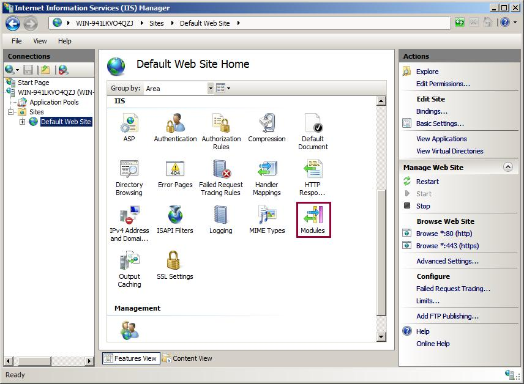
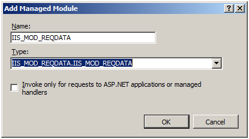
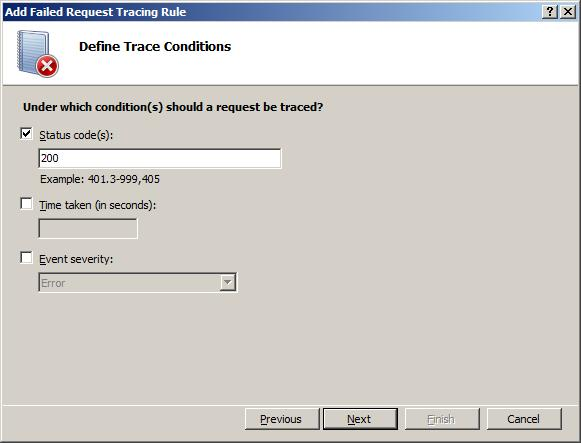

How to Add Tracing to IIS 7.0 Managed Modules
====================
by [Saad Ladki](https://twitter.com/saadladki)

## Introduction

IIS 7.0 and above features the ability to plug-in and use custom developed managed modules to accomplish many different tasks and use those modules for all sorts of content. However, the question arises: what happens if the module has problems or difficulties? Previously, you used System.Diagnostics to trace the event when problems occurred. Unfortunately, those traces are completely separate from IIS traces.

Not so with IIS 7.0 and above. Now you can add traces to the module code using System.Diagnostics.TraceSource (new to .Net 2.0). You have the ability to route those traces into the IIS tracing infrastructure so that they are available to modules that consume traces--for example, Failed Request Tracing.

The IIS Team encourages instrumenting code using basic patterns such as:

- START &amp; STOP events around key activities within your code
- WARNING &amp; ERROR events for unexpected occurrences that might cause the request to fail (such as failed authentication)
- INFORMATIONAL &amp; VERBOSE events for help with diagnostics, such as module configuration being used

Tasks illustrated in this walkthrough include:

- Adding tracing to the module using System.Diagnostics.TraceSource
- Configuring failed request tracing to capture these traces
- Generating the failure condition and viewing the resulting trace

## Prerequisites

Follow the steps below before performing the tasks in this article.

### Step 1: Installing IIS

First, IIS must be installed. Check to see if IIS is installed by browsing to [http://localhost/](http://localhost/ "blocked::http://localhost/"). If IIS is installed, you see the "under construction" page. If IIS is not installed, refer to [Installing IIS](../../install/installing-iis-7/installing-iis-7-and-above-on-windows-server-2008-or-windows-server-2008-r2.md) for instructions. Make sure to install the following IIS components:

- ASP (under World Wide Web Services =&gt; Application Development Features =&gt; ASP)
- ASP.Net (under World Wide Web Services =&gt; Application Development Features =&gt; ASP.Net)
- Tracing (under World Wide Web Services =&gt; Health &amp; Diagnostics =&gt; Tracing)

### Step 2: Log in as Administrator

Login as is the administrator account or in the Administrators group.

> [!NOTE]
> Being in the Administrators group does not grant you complete administrator privileges by default. You must run many applications as Administrator. Right-click the application icon and choose "Run as Administrator".

### Step 3: Make a Backup

Make a backup of the configuration before executing the tasks in this article. Run the following:

1. Click the Start button -&gt; All Programs -&gt; Accessories -&gt; (r-click)Command Prompt -&gt; Run as Administrator  
    
2. Execute the following command in that command prompt:  

    [!code-console[Main](how-to-add-tracing-to-iis-managed-modules/samples/sample1.cmd)]

### Step 4 : Creating Sample Content

1. Delete everything in the c:\inetpub\wwwroot folder.
2. From the Administrator command prompt started above, paste the attached code into a file in inetpub\wwwroot called *test.htm*:

[!code-html[Main](how-to-add-tracing-to-iis-managed-modules/samples/sample2.html)]

[!code-unknown[Main](how-to-add-tracing-to-iis-managed-modules/samples/sample-127059-3.unknown)]

## Creating &amp; Tracing a Simple Module

In this section, you create a sample module to instrument.

### Step 1: Create a Simple Module

Using the Administrator command prompt, copy and paste the following code into a file called IIS\_MOD\_REQDATA.cs:

[!code-csharp[Main](how-to-add-tracing-to-iis-managed-modules/samples/sample4.cs)]

### Step 2: Adding Tracing to the Managed Module

In order to add tracing to your module and route its trace events into IIS, use System.Diagnostics.Trace source. Add the following line under the using statements:

[!code-csharp[Main](how-to-add-tracing-to-iis-managed-modules/samples/sample5.cs)]

You must create a TraceSource within the code – notice the definition of the traceSource within the declaration of the IIS\_MOD\_REQDATA module:

[!code-csharp[Main](how-to-add-tracing-to-iis-managed-modules/samples/sample6.cs)]

The **tsStatus** member is initialized during the IHttpModule's Init() method:

[!code-csharp[Main](how-to-add-tracing-to-iis-managed-modules/samples/sample7.cs)]

The name of the TraceSource ("**tsStatus**") is important, as this name is later referenced in the web.config file later. The module is now setup to emit events if needed.

To add a new trace event, use **tsStatus.TraceEvent(&lt;type&gt;, 0, &lt;somestring&gt;)** to write out events. Add the recommended Start &amp; End events to the *Application\_EndRequest()* method:

[!code-csharp[Main](how-to-add-tracing-to-iis-managed-modules/samples/sample8.cs)]

Notice the different &lt;type&gt;'s – the types supported, among others, include:

- TraceEventType.Start
- TraceEventType.Stop
- TraceEventType.Error
- TraceEventType.Warning
- TraceEventType.Information
- TraceEventType.Verbose

For completeness, the entire source for the module (including the trace events), can be copied from here:

[!code-csharp[Main](how-to-add-tracing-to-iis-managed-modules/samples/sample9.cs)]

### Step 3: Compiling Our Traced Module

Now to compile the module &amp; deploy it. In the Administrator command prompt, run the following command:

[!code-console[Main](how-to-add-tracing-to-iis-managed-modules/samples/sample10.cmd)]

> [!NOTE]
> If you are running this on a 64bit system, compile using the 64bit c# compiler in %windir%\microsoft.net\framework64\v2.0.50727\csc.exe

Note the use of the **/debug** &amp; **/d:TRACE** switches. You *must* use these switches to compile the trace events into the binary. Failing to compile with these switches means that the module will not have any trace events in it.

Having compiled the module, deploy the module and run an initial test to see if the module works before capturing its traces.

## Adding Modules to the Site's Configuration

This section includes adding and testing the module.

### Step 1 : Adding the Module to the Site's Configuration

1. Using the same Administrator command prompt, make a directory called **\inetpub\wwwroot\bin**, then copy IIS\_MOD\_REQDATA.dll over to that directory.
2. Enable the module. From the administrator command prompt, type **start inetmgr** to bring up the IIS administration UI.
3. Under the **Connections** pane, expand the local machine name, then **Sites**, and click on **Default Web Site**.
4. Under **IIS** in the center pane, double-click on **Modules**:  
    
5. You see a large list of modules configured for use by this site. On the right side of the UI under **Actions**, click **Add Managed Module**:  
    
6. In the window that displays, name the managed module **IIS\_MOD\_REQDATA** and the type of the module is **IIS\_MOD\_REQDATA.IIS\_MOD\_REQDATA**(select this from the dropdown list box):  
    
7. Click **OK**. The newly traced module is now configured for the web site's use.  
    

### Step 2 : Testing Our Module

Test the module by opening Internet Explorer and browsing to [http://localhost/test.htm](http://localhost/test.htm). You see the following window:

The "REQUEST HEADERS" &amp; "RESPONSE HEADERS" content came from our module, indicating that is works.

## Routing Events to IIS

This task hooks the Module's TraceSource up to IIS tracing so that its events are emitted through IIS and then configure Failure Request Tracing to capture these trace events.

### Step 1 : Enabling the Module TraceSource &amp; Routing Its Events into IIS

The module is updated to include trace events. Configure System.Diagnostics and IIS to capture these trace events and route them into IIS's Failed Request Tracing module. Do this by configuring the &lt;system.diagnostics&gt; section in the web.config file to setup the TraceSource &amp; route its events accordingly.

1. Using your Administrator command prompt, navigate to c:\inetpub\wwwroot, and use notepad to edit your web.config file.
2. There are 3 parts of the configuration that must be completed to get the events emitted by the module to be routed to IIS's tracing infrastructure: 

    - Defining the IIS event traceListener as a shared Listener
    - Defining a switch to enable all the events
    - Defining the trace source, attaching the switch we defined as well as defining the trace listener for our source.
3. IIS ships a new System.Diagnostics.TraceListener used to route TraceSource events into IIS's Trace infrastructure. This provider must also be defined in your web.config file.
4. Define the **traceSource** by its name (***tsStatus***) and wire it up to the *DefaultSwitch* &amp; *IisTraceListener*.
5. Copy and paste this &lt;system.Diagnostics&gt; section into your web.config file (after your &lt;system.webServer&gt; section).  

    [!code-html[Main](how-to-add-tracing-to-iis-managed-modules/samples/sample11.html)]

The ***tsStatus*** traceSource is wired up to the IIS7TraceListener, which will emit events into IIS's tracing infrastructure. Continue to the next step to wire those events up to the Failed Request Tracing provider.

### Step 2 : Enabling Failed Request Tracing to Capture Module Trace Events

When these diagnostics events are emitted into IIS's tracing infrastructure, they are mapped to the ASP.net Provider &amp; the Module flag on that provider. Their verbosity depends on the TraceEventType used. To configure Failed Request Tracing to pick these up:

1. From your Administrator command prompt, type **start inetmgr**. In the **Connections** panel, expand the machine name, then Sites folder, then click on the **Default Web Site**. To the right under the **Actions** pane, click on **Failed Request Tracing…** link under **Configure**:  
    
2. In the next dialog box, configure the following:  
    
3. Check the **Enable** check box. Keep the defaults for the other settings. Click **OK** to continue.
4. Now that we have verified that Failed Request Tracing Logging is enabled, we must configure the failure definitions. Back in the IIS Manager, under **IIS**, double-click on **Failed Request Tracing Rules**  
    
5. In the **Actions** pane, click Add…. This launches the **Add Failed Request Tracing Rule** wizard.
6. On the **Specify Content to Trace** page, select the **All Content (\*)** option for what to trace. Click **Next**.  
    
7. In the **Define Trace Conditions** screen, check the **Status Codes** check box &amp; enter "200" as the status code to trace.  
    
8. Click **Next**. The **Select Trace Providers** page appears. Select the **ASPNET** check box and the **Module &amp; Page** check boxes under "Areas". Under Verbosity, select **Verbose**.  
      
  
    > [!NOTE]
    > Due to a bug in Server Beta 3 builds, module traces can only be captured if both Module and Page areas are selected. Post Server Beta 3, only Module is required to collect these events.
9. Click **Finish**. You see the following definition for the Default Web Site:  
    

### Testing and Viewing the Results

In this task, we generate the failed request and view the resulting trace log. Remember, we configured IIS to capture trace logs for http://localhost/\* requests that fail with a 200. To verify that it worked:

1. Open a new Internet Explorer window. Type in the address [http://localhost/test.htm](http://localhost/test.htm). Again, you see the following:  
    
2. To verify our module has generated traces that have been captured, use an Administrator-elevated Internet Explorer window and hit **CTRL-O**, then navigate to **c:\inetpub\logs\FailedReqLogFiles\W3SVC1**. In the dropdown list box that reads **HTML Files**, select **All Files**.
3. Select the most recent fr######.xml file (today's date) and click **Open**. You see the events:  
    

## Summary

You finished adding a new trace event to a managed module, compiled and deployed that module, configured System.Diagnostics to route its events to IIS's tracing infrastructure, and finally, configured IIS's Failed Request Tracing feature to capture its events. You can now easily add new events to the module, then recompile the module &amp; deploy it to the \bin directory. Using Failed Request Tracing, you see the results of the events.

Remember that using System.Diagnostics.TraceSource allows you to still use your module and its trace events down level, provided you hook it up to a different trace Listener.
  
  
[Discuss in IIS Forums](https://forums.iis.net/1042.aspx)