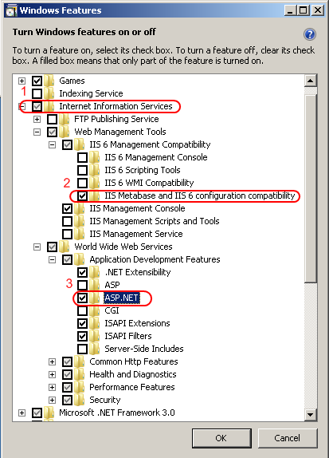
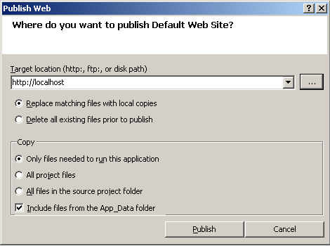
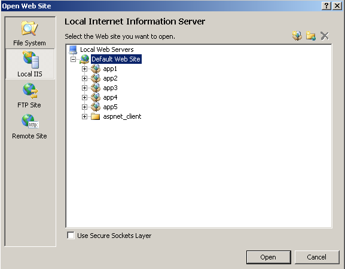
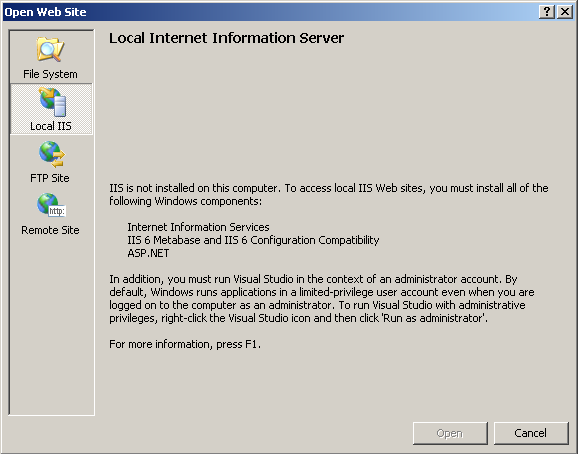
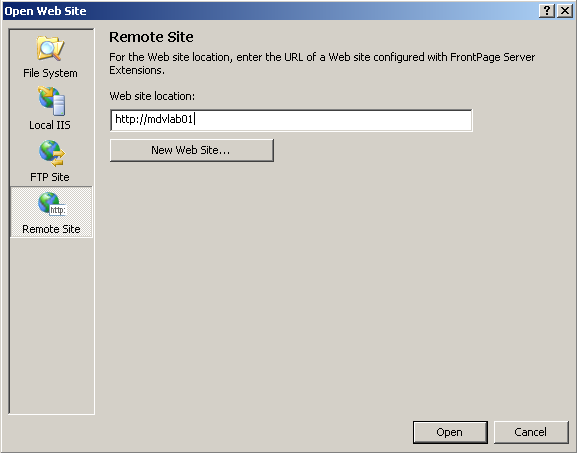

# Using Visual Studio 2005 with IIS 7.0

by [Mike Volodarsky](https://github.com/leanserver)

Visual Studio® provides several options for working with IIS when developing web sites and applications. This article covers using Visual Studio 2005 to work with, publish, and debug IIS 7.0 and above applications on Windows Vista® SP1 and Windows Server® 2008, using both the Web application and Web site project models.

If you are using Visual Studio 2008, review [Using Visual Studio 2008 with IIS](using-visual-studio-2008-with-iis.md) instead as Visual Studio 2008 contains a number of changes and improvements that affect working with IIS.

This article provides an overview of using Visual Studio 2005 Web development features with IIS, including information on the steps necessary to enable these features to work correctly.

## Prerequisites

To use Visual Studio 2005 to work with Web sites and applications on your local machine, do the following:

1. Install Visual Studio 2005 SP1
2. Install IIS 7.0 or above
3. Install ASP.NET
4. Install IIS 6.0 Metabase Compatibility

On Windows Vista, open the Control Panel, click Programs and Features, click the Turn Windows features on and off link, check the "Internet Information Services" check box, as well as the "Web Management Tools \ IIS 6 Management Compatibility \ IIS Metabase and IIS 6 configuration compatibility" and "World Wide Web Services \ Application Development Features \ ASP.NET" check boxes under it.

On Windows Server 2008, use the Server Manager tool to install the Web Server (IIS) role, and add the "Management Tools \ IIS 6 Management Compatibility \ IIS 6 Metabase Compatibility" and "Application Development \ ASP.NET" role services. For more information, see [Installing IIS on Windows Server 2008](../../install/installing-iis-7/installing-iis-7-and-above-on-windows-server-2008-or-windows-server-2008-r2.md).

To use Visual Studio 2005 to work with Web sites and applications on a remote machine, see the "Using Visual Studio 2005 with a Remote IIS Server" section later in this article.

### Starting Visual Studio 2005 as Administrator

Certain tasks, including debugging and creating local IIS applications, require starting Visual Studio as a user with Administrative privileges. On Windows Vista, and Windows Server 2008 when not running as the built-in Administrator account, this requires right-clicking the Visual Studio 2005 icon in the Start Menu and choosing "Run As Administrator".

To make this process easier, you can create a shortcut and check the "Run this program as an administrator" check box in the Compatibility tab of the shortcut properties.

## Create a New IIS Web Site or Application Project

Visual Studio provides two conceptual models for working with Web applications: the Web site project model, and the Web application project model.

While both options allow you to create Web applications and publish them to an IIS server, they do have significant differences in how the corresponding ASP.NET application is built and deployed. Some of the differences between the two models are:

- The Web application project option requires the source application files to be located on the local file system, or, on a network share. However, you can subsequently publish the Web application to a remote IIS Web site by using a network share, FTP, or Front Page Server Extensions.
- The Web site project option allows you to connect directly to a local IIS Web site, or to a remote IIS Web site by using a network share, FTP, or Front Page Server Extensions. With the Web site project, you work directly with the content of your IIS Web site and there is no project file.

You can find the detailed explanation of the two models and their differences in [Introduction to Web Application Projects](/previous-versions/aa730880(v=vs.80)).

> [!NOTE]
> Visual Studio 2005 provides the options to create a New project and Open an existing project. This does not necessarily mean that you must create a new IIS web application or open an existing application – you can use either of the options with an existing IIS web application.

### To create a new project using the Web application project option

- In Visual Studio, use the "File menu \ New \ Project ..." option and select the "ASP.NET Web Application" template.

> [!NOTE]
> Unlike the Web site project option, you must place the application files on the local file system or a network share, and later use the Publish option to publish the contents of your application to an IIS Web site.

### To publish the project to an IIS Web site

1. Create the IIS Web site using IIS Manager, AppCmd, or another configuration tool.  
Alternatively, use an existing IIS Web site.
2. In Visual Studio, use the "Build \ Publish" option to publish the contents of your Web application to an IIS Web site.  

   

   > [!NOTE]
   > The Publish Web dialog by default publishes only the parts of your project that comprise your web application - it does not publish the project file, obj directory, and other files. This is important because exposing these components to your web users may be a security risk.

   By clicking the "…" button, you can chose one of the four options for publishing your Web site:

   - **File System**. When using this option, Visual Studio opens / creates the web application as a folder, and uses the built-in ASP.NET Development Server to host the Web site. This option may be sufficient for basic testing of ASP.NET applications – however, this mode does not support running ASP.NET applications in Integrated mode, and it does not support application technologies other than ASP.NET (such as PHP, ASP, CGI, etc).
   - **Local IIS**. When using this option, Visual Studio allows you to publish your application files to a local IIS Web site or application. You can also use the dialog to create new IIS applications or virtual directories to publish your files to.
   - **FTP Site**. When using this option, Visual Studio supports editing your application files if they are shared through FTP. You can still use Visual Studio to debug your applications by configuring the URL of your application in project start settings. For more information, see Using Visual Studio 2005 with a Remote IIS Server section later in this article.
   - **Remote Site**. Using this option, Visual Studio can connect to a remote IIS server. To use this option, you need to have Front Page Server Extensions installed on the remote server and configure your Web site to use FPSE. For more information on this, see the "Using Visual Studio 2005 with a Remote IIS Server" section later in this article.

   You can also map the Web application project directory as a virtual directory on the local IIS installation by opening the project Properties, clicking the "Web" tab, and using the "Create Virtual Directory" button. You can use the "Create Virtual Directory" option as a quick way to host your Web application locally on IIS without going through the "Publish Web" option.

   However, this option is not generally recommended because it places all of the project files, source files, object files, and other temporary files in the servable namespace of the IIS virtual directory, which may result in a security risk. Using the Publish options which by default only publish the web servable portions of the project is a better practice.
3. Configure debugging.  

   By default, projects created using the Web application project model use the built-in ASP.NET Development Server when testing or debugging your project.

   This provides a convenient way to test your ASP.NET application without IIS – however, we recommend that you instead configure Visual Studio to test your application in the IIS environment. The reasons for this are:

   - The ASP.NET Development Server does not support hosting ASP.NET applications in Integrated mode, which is the default mode of operation used by IIS. This may introduce differences in application behavior.
   - The ASP.NET Development Server does not support many of the IIS configuration features, so if your application relies or uses them, it's behavior may be different or incorrect when hosted under the ASP.NET Development Server.
   - The ASP.NET Development Server does not support hosting portions of your application that utilize application technologies other than ASP.NET, such as PHP, CGI, and other third party frameworks.

   If you are developing on Windows Vista, you can easily take advantage of IIS to test your application locally using the same environment it will be on when it is deployed - use the "Create Virtual Directory" option or the Publish Web dialog as discussed earlier in this article.

   Alternatively, you can configure Visual Studio to connect to the a remote IIS server to which you publish your application.

   In those cases, you can configure Visual Studio to debug your application in the IIS environment. To do this, right-click on the project node, chose "Properties …", and click the "Web" tab. In the "Web" tab, select the "Use IIS Web server" radio button and type in the base URL of your Web application on the remote server.

   

   For more information on configuring remote debugging, see "Debugging IIS Web Applications" later in this article.

### To create a new project using the Web site project option

1. Create the IIS Web site using IIS Manager, AppCmd, or another configuration tool. Alternatively, use an existing IIS Web site.
2. In Visual Studio, use the "File menu \ New \ Web Site …" option to create a new Web site project using the IIS Web site you created.  

   In the "New Web Site" dialog, select one of the Visual Studio Web site templates, such as the ASP.NET Web Site.

   Next, indicate where this web site should be located. To do this, click the "Browse …" button, which displays a dialog similar to what you get when publishing a Web application project. Here, click the "Local IIS" button again to select an existing Web site or application on the local machine, or create a new Web application or virtual directory to host your project files.

   Alternatively, you will have the option to place your new Web site project on the local File System for use with the ASP.NET Development Server, upload it to a remote server using FTP, or upload it to a remote IIS server using Front Page Extensions. For more information on connecting to a remote server, see the "Using Visual Studio 2005 with a Remote IIS Server" section later in this article.

## To Open an Existing IIS Web Site or Application

### To create a project based on an existing IIS Web site

1. Open the existing IIS Web site using the "File menu \ Open \ Web Site …" option.  

   Click "Local IIS" to connect to the local IIS server.

   In the resulting dialog, you can select the Web site or a child application to open. Alternatively, you can use the "Create New Web Application", "Create New Virtual Directory", and "Delete" buttons in the top right hand corner to manage the web site hierarchy.

   > [!NOTE]
   > Be sure to back up your configuration first before making changes.

   

   If you do not have IIS or any of the prerequisites installed, Visual Studio 2005 displays a message when you attempt to connect to the Local IIS server telling you to install the required components. To do this, see the "Prerequisites" section earlier in this article.

   

   > [!NOTE]
   > Visual Studio provides several different options for working with existing Web sites, in addition to connecting to an existing IIS Web site. These options include:
   >
   > - **File System**. When using this option, Visual Studio opens / creates the web application as a folder, and uses the built-in ASP.NET Development Server to host the Web site. You can use this option to connect to an existing IIS web site by opening its virtual directory's root folder on the local file system or through a network share.
   > - **FTP Site**. When using this option, Visual Studio supports editing your application files if they are shared through FTP. For more information, see the "Using Visual Studio 2005 with a Remote IIS Server" section later in this article.
   > - **Remote Site**. Using this option, Visual Studio can connect to a remote IIS server. To use this option, you need to have Front Page Server Extensions installed on the remote server and configure your Web site to use FPSE. For more information on this, see the "Using Visual Studio 2005 with a Remote IIS Server" section later in this article.

2. Configure debugging.  

   If you have opened an existing IIS Web site using the Local IIS or Remote Site options, your project is automatically configured to use the IIS Web site when debugging so no further action is necessary (the Remote Site option requires additional configuration to enable remote debugging, as explained later in the article).

   If you have opened your Web site project using the File System or FTP site options, it is by default configured to use the ASP.NET Development Server for testing and debugging. It is recommended that you configure Visual Studio to use the IIS server on which the Web site is located for debugging.

   To do this, right-click on the Web site project node, chose "Start Options ...". In the dialog, select "Use custom server" radio button and type in the base URL of your Web application on the remote server.

   

## Using Visual Studio 2005 with a Remote IIS Server

In order to open an existing Web site or create a new Web site on a remote IIS server, you can use many of the options mentioned earlier:

   - **File System**. You can create a file share pointing to the root virtual directory of your Web application, and use the "File System" option to connect to it. To use this option, select the "File System" button in the "Open Web Site" dialog. You then have to configure the URL of your application in project start settings to be able to debug the application using Visual Studio. You cannot create new IIS Web sites, applications, or virtual directories on the remote machine using this option.
   - **FTP Site**. If your Web site or application files are shared using FTP, you can access these files using this option. You then have to configure the URL of your application in project start settings to be able to debug the application using Visual Studio. To use this option, select the "FTP Site" button in the "Open Web Site" dialog. You cannot create new IIS Web sites, applications, or virtual directories on the remote machine using this option.
   - **Remote Site**. This option uses Front Page Server Extensions to connect to a remote IIS server. To use this option to connect to a remote IIS server on Windows Server 2008 or Windows Vista computers, you first need to install Front Page Server Extensions on the remote computer.

### Connect to an IIS Web site using FTP

You can use the FTP Site option if you have used FTP to share the IIS virtual directory you want to publish to.

> [!NOTE]
> When using FTP, you cannot create or edit IIS Web sites, applications, or virtual directories, but you can publish and edit files.

To use this option, provide the address of the FTP server, the port, the directory to which you are connecting, and logon credentials if not using anonymous access.

For more information on using the FTP server included in Windows Vista and Windows Server 2008, see [FTP Site Setup (IIS 6.0)](https://www.microsoft.com/technet/prodtechnol/WindowsServer2003/Library/IIS/31c2427c-c0a5-49fa-9e03-823f34fba3e8.mspx?mfr=true). To use the new FTP 7.0, which is available as a download from IIS.NET, see [Adding FTP to a Web Site](../../publish/using-the-ftp-service/adding-ftp-publishing-to-a-web-site-in-iis-7.md).

### Connect to an IIS Web Site Using Front Page Server Extensions

You can use the Remote Site option if you have shared the IIS Web site you want to publish to using Front Page Server Extensions. Unlike the FTP Site option, you can create and edit IIS applications and virtual directories when using this option.

[Front Page Server Extensions for IIS 7.0](https://go.microsoft.com/fwlink/?LinkId=86544) are available as a free download for Windows Vista and Windows Server 2008. For more information on installing and enabling Front Page Server Extensions for IIS Web sites, see [Installing Front Page Server Extensions for IIS](https://go.microsoft.com/fwlink/?LinkId=88546).

To quickly enable a remote Web site to be used with the "Remote Site" option in Visual Studio, do the following:

1. Download and install FPSE on the remote IIS server. The provided installer automatically installs all required IIS components.
2. Create an IIS web site to connect to (optional, if the site does not already exist).
3. Enable either Basic Authentication or Windows Authentication methods for the Web site. This is required for FPSE to be able to manage the site.  

   > [!NOTE]
   > If you use Basic authentication, the username and password are transmitted in clear text so you should not use it for connecting to web sites over public networks unless you also use SSL to protect the communication.

4. Enable the web site to be managed with FPSE. You can do this by executing the following from the command line:  

   [!code-console[Main](using-visual-studio-2005-with-iis/samples/sample1.cmd)]

   Where &lt;SITEID&gt; is the site id of the Web site you want to enable for FPSE, and the &lt;USERNAME&gt; is the Windows account that can act as FPSE administrator.

5. Connect to the site Using the "Remote Site" option in the Open Web Site dialog or the New Site dialog. This allows you to connect to an existing Front Page Server Extensions – enabled web site, or create new Web applications and virtual directories.  

   

   If you receive the following error dialog during connection, double-check that you have installed FPSE on the remote server, and have enabled FPSE management for the Web site you are attempting to connect to.

   

   If you are using Windows authentication for your FPSE-enabled Web site, Visual Studio attempts to authenticate using the account under which it was started. If this authentication fails, it prompts you to provide credentials for authentication with the remote server.

   If you are using Basic authentication, Visual Studio immediately prompts you for credentials.

   > [!NOTE]
   > Basic authentication sends credentials in clear text, so it can lead to unintended disclosure of your username and password if the site is not protected with SSL. For this reason, we recommend using Windows authentication for intranet environments, and using Basic authentication over SSL for internet environments *.*

   If you have not enabled a suitable authentication method (Windows Authentication, Basic Authentication, or Digest Authentication), you receive the following error dialog when connecting. Turn on one of the above authentication methods to fix this problem.

   

   > [!NOTE]
   > The "New Web Site …" button in the "Remote Site" dialog cannot be used to create a new IIS Web site. Instead, it is used to create a new Web application with the specified path for an existing Front Page Server Extensions – enabled IIS Web site.

## Debugging IIS Web Applications

After you have opened a Web site or application in Visual Studio, you can take advantage of Visual Studio debugging features to test it. In doing so, you have the following options:

- **Use F5 debugging to debug from Visual Studio**. If you have opened an IIS Web site project using one of the options discussed earlier, this gives you the most convenient way to debug your web application. You can debug it simply by pressing F5, and then interacting with your application using a browser window. In the rest of this article, we will focus on this option.
- **Attach to the IIS worker process directly**. If you know which IIS worker process is hosting your application, you can use this option to attach directly to that process.

### Use F5 to Debug a Local IIS Web Application from Visual Studio

F5 debugging provides the most convenient way to debug your Web application with Visual Studio. To use it, do the following:

1. Open an IIS Web site using one of the options discussed earlier.
2. Select the project file to which you want to make the initial request (optional).
3. Set the desired breakpoints in your application source code (optional, you can also set them during debugging).
4. Press F5 to begin debugging. Visual Studio will make an initial request to the IIS web application, attach to the hosting IIS worker process, and open a new browser window where you can interact with your application.

> [!NOTE]
> If you using Visual Studio 2005 to debug a local IIS application on Windows Vista Home Basic or Home Premium editions, you may encounter an authentication error when attempting to debug. This issue and the hotfix are provided in [KB 937523](https://support.microsoft.com/kb/937523). This issue does not occur when debugging IIS applications on Windows Server 2008 or other Windows Vista editions.

In order to successfully debug a local IIS Web application, you must meet the following requirements:

1. Be logged on as a user that has Administrative privileges on the local computer (Either the built-in Administrator account, or an account that is a member of the built-in Administrators group).
2. Start Visual Studio in Administrator mode by right-clicking the Visual Studio 2005 icon in the Start menu, and selecting "Run As Administrator".  

   If you do not do this, Visual Studio receives a filtered UAC token and cannot debug.
3. Install and enable IIS Windows Authentication for the IIS application. Alternatively, you can install the hotfix in [**KB 937523**](https://support.microsoft.com/kb/937523) to not require Windows Authentication for debugging.  

   > [!NOTE]
   > If you have opened an ASP.NET application using the "File System" option, Visual Studio by default starts the ASP.NET Development Server to host your application. In this option, IIS is not involved, and you are not required to be an Administrator to debug your application. However, when using the ASP.NET Development Server, you do not have the full range of features and services that IIS environment provides, which may make your application behave differently from when it is deployed on IIS. This includes the following:
   >
   > - No support for ASP.NET Integrated Mode.
   > - No support for IIS features such as compression, native URL authentication, request filtering, and others.
   > - No support for application technologies other than ASP.NET, such as PHP, ASP, CGI, and others.

### Use F5 to Debug a Remote IIS Web Application from Visual Studio

You can use F5 to debug an IIS Web application running on a remote server. The process is similar to what was described earlier for debugging local IIS applications, but requires additional configuration to enable remote debugging to take place.

In addition, you must open the remote IIS Web site or application project using the File System, FTP Site or Remote Site options as discussed in the "Using Visual Studio 2005 with a Remote IIS Server" section earlier in this article.

In order to successfully debug a remote application, you must also meet the following requirements:

1. Install the Remote Debugging components on the server machine. For more information, see [Remote Debugging](/visualstudio/debugger/remote-debugging).
2. Run the Remote Debugging monitor (msvsmon.exe) on the server machine. See notes further about how to do this properly.
3. Open the required firewall ports for remote debugging.  
   When you run msvsmon.exe for the first time on the remote machine, it warns you if the ports are not open, and offers to open them automatically. If you want to configure the firewall manually or to see which ports are opened, see [How to: Manually Configure the Windows Vista Firewall for Remote Debugging](/previous-versions/visualstudio/visual-studio-2010/bb385831(v=vs.100)).
  
   > [!NOTE]
   > msvsmon.exe may fail to open the firewall on Windows Vista and Windows Server 2008. In that case, you will receive the error dialog below after selecting one of the "Unblock remote debugging ..." options in the "Configure Firewall for Remote Debugging" dialog. If you receive this error, create the firewall rules manually using [How to: Manually Configure the Windows Vista Firewall for Remote Debugging](/previous-versions/visualstudio/visual-studio-2010/bb385831(v=vs.100)).

   

4. If you are using a Web application project and publishing to a remote IIS server, or if you have opened the remote Web site project using the "File System" or "FTP Site" options, you must configure Visual Studio project start options to enable debugging.  
   To do this for a Web site project, right-click on the Web site project node, chose "Start Options …". In the dialog, select "Use custom server" radio button and type in the base URL of your Web application on the remote server.  
  
   For a Web application project, right-click on the project node, chose "Properties …", and click the "Web" tab. In the "Web" tab, select the "Use IIS Web server" radio button and type in the base URL of your Web application on the remote server.  
  
   This process is described in detail earlier in the article.
5. Configure permissions to allow debugging to take place. See notes further about how to do this properly.

How you run the Remote Debugging monitor (msvsmon.exe) and configure your permissions depends on whether your are operating in a domain or workgroup environment.  
  
**To set up remote debugging in a workgroup environment**

1. Create an account with the same username and password on both the Visual Studio 2005 client computer and the remote server computer. This account must have Administrative rights on the remote server computer.

   > [!NOTE]
   > If you are using Windows Authentication in your application, this account must be the built-in Administrator account. This means that the built-in Administrator account must have the same password on both computers.

2. Log on to the remote server computer using the account created in Step 1, and run the Visual Studio 2005 Remote Debugger from the Start menu by right-clicking it, and choosing "Run As Administrator". This is important – otherwise the Remote Debugging monitor receives a UAC-filtered token and cannot debug IIS worker processes.  
  
    > [!NOTE]
    > Do not use the RunAs.exe command to run the msvsmon.exe process, as this always results in a UAC-filtered token and prevents debugging from working.

You also have an option to run the Remote Debugging monitor as a service by opening the Visual Studio 2005 Remote Debugger Configuration Wizard from the Start menu. If using this option, you must configure the Remote Debugging monitor to log on using the account created in Step 1. You then also must grant the corresponding account the "Log On As A Service" right in the computer's Local Security Policy console.

1. Log on to the Visual Studio 2005 client computer with the account created in step #1. Run Visual Studio 2005 by right-clicking its icon in the Start menu, and choosing "Run As Administrator".  

   > [!NOTE]
   > It is very important to both log in using the account created in Step 1, and use the "Run As Administrator" option when running Visual Studio. As mentioned in Step 1, the account you are using MUST be an Administrative user on the remote server machine.

2. Open the remote IIS Web site (using the File System, FTP Site or the Remote Site option).

   If you are using Windows Authentication in your IIS Web site, you must be running Visual Studio 2005 using the built-in Administrator account and therefore also running the Remote Debugging monitor on the remote computer using the built-in Administrator account. The password for the Administrator account must be the same on the client and remote server computers.  
  
   In addition, you can do the following:  

      - Use the FTP Site option to connect to the remote IIS Web site, and use Anonymous authentication. Then, you do not need to use the built-in Administrator account, as long as the account you are using is an Administrative user on the remote server computer.
      - Use the Remote Site option to connect to the remote IIS Web site, and use Basic or Digest authentication. Then, you do not need to use the built-in Administrator account, as long as the account you are using is an Administrative user on the remote server computer.

   If you need to use Windows Authentication in your IIS Web site, and you cannot use synchronized Administrator accounts, you must turn off UAC on the remote server computer and reboot prior to attempting to debug. This is not recommended for production servers as it may negatively affect the security of your server.

**To set up remote debugging in a domain environment**

Debugging in a domain environment is simpler to configure. To debug in a domain environment, you must:

1. Make the domain account you will be using to run Visual Studio 2005 a member of the Administrators group on the remote server computer.
2. Log on to the remote server computer using the domain account, and run the Remote Debugging monitor (msvsmon.exe) using the "Run As Administrator" option.  
   You also have an option to run the Remote Debugging monitor as a service by right clicking the Visual Studio 2005 Remote Debugger Configuration Wizard from the Start menu, and choosing "Run As Administrator". You can let the Remote Debugging monitor service run as LocalSystem.
3. Log on to the Visual Studio 2005 client computer with the domain account. Run Visual Studio 2005 by right-clicking its icon in the Start menu, and choosing "Run As Administrator".
4. Open the remote IIS Web site using the FTP Site or the Remote Site option.

## Summary

This article provided information about using Visual Studio 2005 to work with IIS Web sites located on the local and remote computers, and how to debug web applications hosted in IIS.
