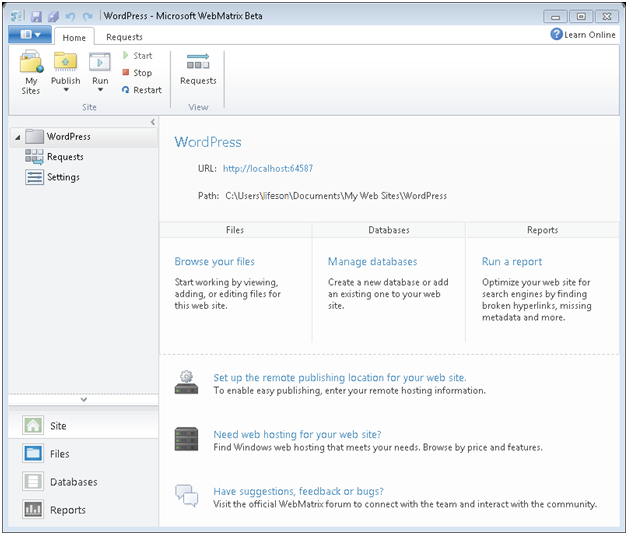
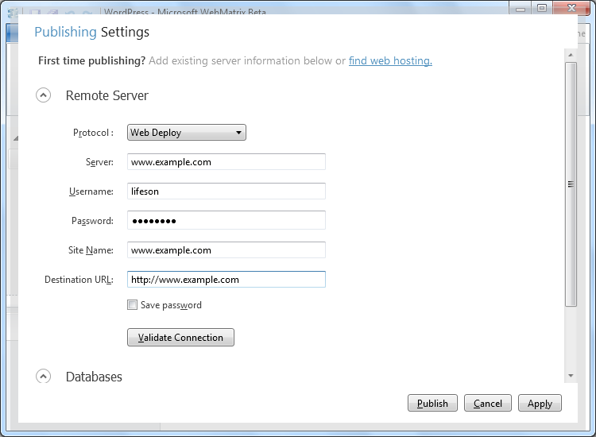
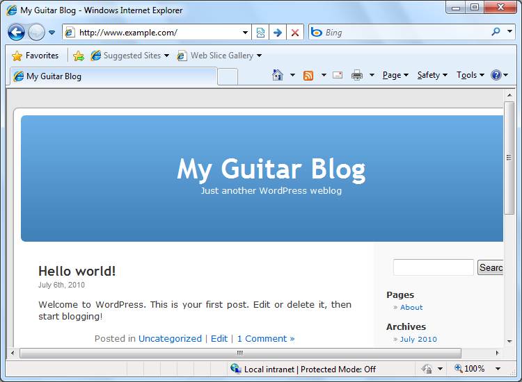

Create a Website from a Gallery Application
====================
by [Robert McMurray](https://github.com/rmcmurray)

[!include[asdf](../../iis/outdatedContentWarning)]

Microsoft has created a new authoring tool for the web named "WebMatrix," which is focused on creating websites the way that you want to create them. You can create websites from scratch or a template, or you can use one of several popular open source applications. WebMatrix Beta lets you download an application from an application gallery, customize it for your needs, analyze it for broken links, optimize it for the web, and deploy it to your hosting provider. (And if you don't have a hosting provider, WebMatrix Beta can help you find one!)

From your first look at WebMatrix Beta you will see how different it really is. With WebMatrix Beta you can manage all your website's content, databases, and Search Engine Optimization (SEO) reports from a single, user-friendly interface. It doesn't matter if you're using ASP.NET, PHP, or HTML - WebMatrix Beta has your developer needs covered.

## Installing WebMatrix Beta

To install WebMatrix Beta, you can use Microsoft's Web Platform Installer (WebPI 3.0 Beta), which is a free application that makes it easy to install and configure web-related technologies. You can install the Web Platform Installer from the [WebMatrix Beta download page](https://go.microsoft.com/fwlink/?LinkId=195938).

Run the Web Platform Installer, select **Getting Started**, click **Install WebMatrix**, and you're ready to go!

## Creating a New Website Using an Open Source Application from the Gallery

WebMatrix Beta is fully integrated with Microsoft's [Web Application Gallery](https://www.microsoft.com/web/gallery/), and since WebMatrix Beta takes care of all the setup work and application dependencies, all you need to do is to pick your application, customize it for your needs, and publish it to your web server. WebMatrix Beta even helps you select an Internet hosting company to fit your needs. For example, if you want to create a new website all you need to do is open WebMatrix Beta and launch the **Site from Web Gallery** wizard.

You can select from a large number of popular, free, and open source applications. For example, just click **WordPress**, and then click **OK**. It's that easy.

WebMatrix Beta may ask you for some additional configuration information during the installation process for an open source application, but once you have entered any required information, WebMatrix Beta will take care of everything and open your website when the installation is complete.

That's all it takes to install an application; no pain, no mess, no worries - WebMatrix Beta takes care of everything for you.

Now you can easily run your website. Simply click on Run in the WebMatrix Beta toolbar and choose one of the browsers you may have installed on your machine. You can also use F12! You can move on to customize your application, test it, optimize it for SEO, and publish it to an Internet hosting provider.

## Getting to Know WebMatrix Beta

Now that you've installed a web application and created a website, let's take a quick tour of the WebMatrix Beta interface. In the lower-left part of the page you see that you can select one of four workspaces. When you open WebMatrix Beta and select a site, you start off in the Site workspace, which lets you perform tasks like specifying site settings (for example, designating a default web page) and monitoring HTTP requests.

To review, create, delete, and update files such as web pages, select the **Files** workspace. The site's folder structure appears in the left pane, and when you select a file, you can edit it in the content pane on the right. To add a database to your site and then add tables and data to it, or simply to open a database, such as SQL Server Compact, SQL Express, or MySQL that you might have created when you selected a web application from the gallery, select the **Databases** workspace. You get a list of databases in the left pane, and the content pane changes depending on what you want to do with a selected database.

Finally, to get information about how to help your site rank high in search engine results, select the **Reports** workspace. Once you've run some reports, you'll see them listed on the left, and when you select one, you'll see the report's contents on the right.

You might have noticed that across the top of the page is a **Quick Access Toolbar** and a ribbon, like in Microsoft Office 2010. Some of the buttons on the ribbon's **Home** tab are different in each workspace, but the **Site** group remains the same.

You use **My Sites** to choose a site to work on, **Publish** to make the site publicly available, **Run** to test the site in a browser, and **Start/Stop/Restart** to work with the web server that you'll use in WebMatrix Beta to test your website (IIS Express). You'll learn more about IIS Express in a minute.

## Customizing an Application Using WebMatrix Beta

Once you've installed an application and created a website, you may be wondering, "How do I customize it?" This is a logical question, and there's nothing to worry about when you're using WebMatrix Beta, because WebMatrix Beta makes it easy to modify your web content.

By now you should have downloaded and installed a WordPress application. However, if you restart WebMatrix Beta, you can easily click **My Sites** in the **Home** tab to select a website from the list of sites that you have created. For example, if you used WebMatrix Beta to create a website that was based on WordPress, you would see that site listed in the WebMatrix Beta **Choose a Site** dialog box.

Once your website opens in WebMatrix Beta, you can view the files in your site and open pages for editing. For example, you could modify the *Header.php* file in a WordPress theme to change how your page headers will appear when your website is published. Another common file that you might edit is the 404.php file that users will get if they navigate to a link that does not exist - you can edit it to give them a friendly message or a redirect to a page that does work.

## Previewing Your Website from WebMatrix Beta

One of the great features of WebMatrix Beta is IIS Express, which is a full-featured web server that lets you test your website on your local computer before you post it to an Internet hosting company. When you are editing a web page, you can preview your changes in any web browser that is installed on your computer by clicking **Run** on the WebMatrix Beta toolbar. Notice how all the browsers you have installed on your computer are displayed, you can even launch them, all at once. This will start the Web server (IIS Express) and will browse directly to the page that you are modifying so you can view how your changes will appear on the Internet.

## Managing Your Data

WebMatrix Beta comes with a handy database manager, so you can control your website's data using the same user interface that you are using to manage your site's web content. You can create a new database, add and edit tables (using Microsoft SQL Server Compact that comes with WebMatrix Beta), and you can additionally create tables, views, and stored procedures in SQL Server or MySQL (as easily as if you were using an application like Microsoft Access). To access your website's data, all you need to do is select the **Databases** workspace in WebMatrix Beta and connect to your data; all your tables, views, and stored procedures will be available for editing.

## Testing Your Website

WebMatrix Beta includes IIS Express, which works much like IIS, the commercial web server from Microsoft. However, IIS Express is integrated with WebMatrix Beta and runs on your local computer, which makes it easy to test your site without having to copy your files to a public server and test them there.

Sometimes you need to do more than just see how pages look in a browser in order to test a site. You might want to know what's going on behind the scenes when a request comes in to your site. For example, are there broken links in your pages? The **Requests** tool in the **Site** workspace lets you know where there might be problems in your site, and it can take you directly to the file to make a fix.

This example shows that a 404 error code was issued because your site does not have a Favorites icon. This is the icon that shows up in the browser's URL address bar, or in the Favorites list. It's not necessary to have one, but this gives you a good example of what you might see. To see details about the error, you can click the line with the 404. WebMatrix Beta then shows you details about the error, the name of the page that contains the broken link, and links to resources for more information.

## Optimizing Your Website

Once you've created your website, you may be wondering how your site will appear to search engines like Google, Bing, and Yahoo. WebMatrix Beta has your answer - a built-in Search Engine Optimization (SEO) feature. To analyze your website, all you need to do is click the **Reports** workspace in WebMatrix Beta, click **New**, and then click **OK**.

Once WebMatrix Beta has analyzed your website, WebMatrix Beta will display a list of any SEO violations that it finds, along with individual details and recommendations about how to fix each violation. You can easily navigate to each issue and fix it - all from within WebMatrix Beta.

## Publishing Your Website

After you've finished creating and modifying your website, it's time to publish your site to an Internet hosting company. If you don't have an Internet hosting company, WebMatrix Beta conveniently provides a list for you to choose from. Simply click on the **Publish** button in the WebMatrix Beta toolbar, select **Find Web Hosting**, and you'll be able to select from a list of offers.

And after you've selected a hosting company, WebMatrix Beta takes care of all the publishing details for you.

To actually publish your site, WebMatrix Beta has built-in support for FTP, FTPS, and Microsoft Web Deploy, which is a one-click publishing solution. Once you've established an account with an Internet hosting company, enter your account settings into the WebMatrix Beta tool. Then all you have to do to publish your site directly from WebMatrix Beta is click **Publish**. It's as easy as that!

Simply select **Publish** from the WebMatrix Beta toolbar, choose **Configure**, enter your account details and your method of publishing (**FTP**, **FTPS** or **Web Deploy**). With Web Deploy you can deploy your site's content, the database and any configuration changes you require, all in one click!

Once you have entered all your publishing information, WebMatrix will show you a preview of all the actions that will occur when the site is published.

After WebMatrix has finished publishing, you can browse to your website to verify that publishing was successful.

## More Information

To learn more about WebMatrix Beta and the Microsoft Web Platform, see the following website:  
[https://www.microsoft.com/web/webmatrix/learn.aspx](https://www.microsoft.com/web/webmatrix/learn.aspx)

Once you go to this **Learn** page, you'll find more resources about all aspects of WebMatrix Beta. You'll be able to find help in forums, or file bugs and suggestions directly to the WebMatrix Beta product team!
