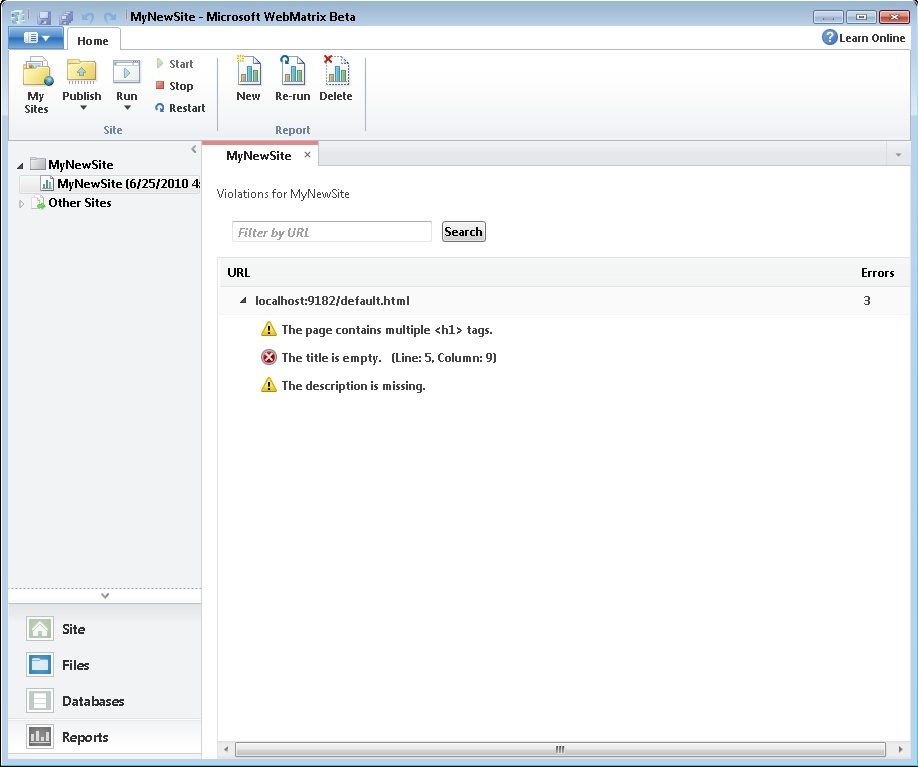
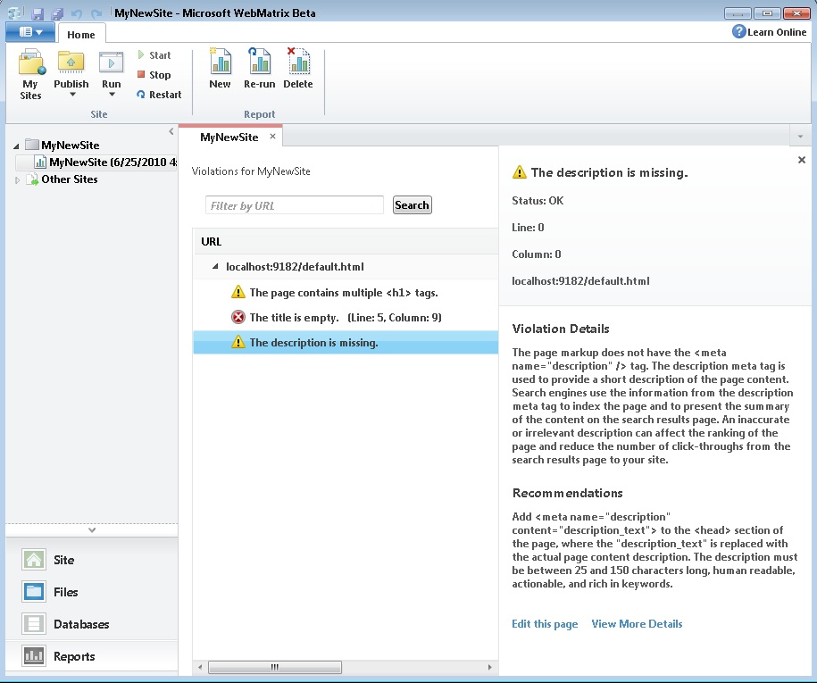

# Make your Website SEO Friendly

by Tim Ammann

[This is preliminary documentation and is subject to change.]

After you've created a website, you can use WebMatrix Beta to run an analysis to see how visible its pages will be to search engines like Bing, Google, and Yahoo. You can do this with the WebMatrix **Reports** feature, which can perform a Search Engine Optimization (SEO) analysis on your website and suggest how to fix the violations that it finds. WebMatrix Beta does this by crawling your locally hosted website just like a search engine would, and then reporting any issues it comes across.

To get started, open an existing website in WebMatrix. Then click **Run a report** or **Reports**.

Next, click **Run an SEO Report for your site**, or click **New** on the **Home** tab.

This displays the **New Report** dialog box.

Type a name that you want for the report, and the full URL of the website page that the analysis should start from. Alternatively, you can accept the default, which is the start page (default document) for your website as it is hosted locally by WebMatrix.

Clicking **Advanced Settings** will show you more options you can set for the analysis, including the maximum number of URLs to crawl (the default is 20,000) and the maximum page size to download (100 KB). These options are important if you have a website with a large number of pages, or if your website has very large pages. Since the sample website in this how-to is small, you can just accept the defaults for now.

Click **OK**, and WebMatrix Beta will begin the analysis, crawling your website just like a search engine would and recording the violations it finds.

When the analysis is finished, SEO violations appear grouped by URL in the report. This sample website has only one page, so only one URL appears in the list.

Here you can see that the home page has three SEO violations, or errors. Click to expand the URL entry to find out what the violations are.

Click a particular violation to see more information about it. In this example, all three will be checked to show both the details for each, and recommendations for how to fix each one.

This first violation says that the page has too many &lt;h1&gt; elements. The **Violation Details** section tells you that search engines prefer that there be only one &lt;h1&gt; tag per page. The **Recommendations** section tells you that you can correct this by changing the other headings to &lt;h2&gt; or &lt;h3&gt;. If you like, you can get more detailed information about each violation by clicking **View More Details**, which will bring up a **Details** dialog box for the URL.

You can also click **Edit this page**, which will take you directly into the editor so that you can fix the violation. Because the website in this example has only one page and only a small number of violations, the editing step will be saved for last so that all of the violations can be fixed at once.

On to the next violation.

The page has no information inside the &lt;title&gt; element. Search engines depend on the title to get information about web pages, so it should be filled in. Remember that search engines place more importance on the first words in a title, so you want to be sure to put the most important words in the title first.

This page lacks a description, which search engines use when they index a page and create a content summary for it. The **Recommendations** section lets you know that you need to add a &lt;meta&gt; tag to the page in the form of &lt;meta name="description" content="description\_text"&gt;.

To fix these violations, click **Edit this page** on the bottom right. This takes you directly to the right page in the editor so that you can fix the violation in your page's HTML:

After typing in a title, changing the headings, and adding a description, save your changes by clicking the **Save** icon in the quick access toolbar. Your violations should be resolved.

Click **Reports** again, select the latest report under the site, and click **Re-run** to confirm that the violations have been corrected.

The report now shows no violations, so the fixes were successful!

### Deleting Reports

After you've fixed violations, you may no longer need or want the reports you used to find the violations. To delete a report, select the report in the navigation pane, and then click **Delete** on the **Home** tab.

### Analyzing Other Web Pages

If you want to run an analysis on a website other than the one that you currently have open, select **Other Sites** in the navigation pane, and then click **New** on the **Home** tab. This will reveal the **New Report** dialog box.

Just like you did before, type a title for the report and the URL of the website page that the analysis should start from. If you choose to analyze a large commercial website, the analysis might take a few minutes to complete.

### Using the Bing Webmaster Tools

To improve your site's SEO, you can use the Bing webmaster tools. The Bing webmaster tools help you to submit your sites to Bing, find out which pages of your site have been indexed, and perform many other SEO-related tasks.

For more information, see [http://www.bing.com/toolbox/webmasters/](http://www.bing.com/toolbox/webmasters/).
