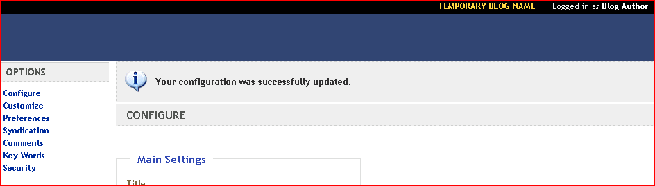

# Windows Web Application Gallery: Known Issues

by IIS Team

> [!NOTE]  
> The Windows Web Application Gallery (WWAG) is being retired on July 1, 2021. We are no longer taking submissions via the Submission Portal. Please contact webpi@microsoft.com to make updates to your existing submission.

## Introduction

With just a few mouse clicks the Windows Web Application Gallery lets you select, download and install popular web applications like blogs, content management systems, wikis or media galleries. This dramatically simplified installation process comes with a few gotchas that are called out in the following article.

## Web Platform Installer Issues

The following paragraphs describe problems you might run into when using the Web Platform Installer.

### Empty Password Fields

Web Platform Installer 2.0 doesn't allow empty passwords even if you don't want to use a password for your database or application. The following message is shown.

The easiest way to work around this issue is to use a password for your database.

### Creating New Web Sites

If you want to create a new web site for your web application you need to create a physical directory for your new site. The Web Platform Installer doesn't create web site directories automatically. You have to specify an existing path if you select "New Web Site..." in the following dialog:

### Other Web Platform Installer Issues

For other Web Platform Installer issues, for example if Web Platform Installer can't connect to the list of applications due to connectivity issues, read the following article for more details:

[https://www.iis.net/learn/troubleshoot/web-platform-installer-issues/troubleshooting-problems-with-microsoft-web-platform-installer](../../troubleshoot/web-platform-installer-issues/troubleshooting-problems-with-microsoft-web-platform-installer.md)

## Issues with Databases

### SQL Server Issues

#### Strong Password

Web Platform Installer prompts for a SQL Server sa password if SQL Server 2008 Express is installed by the Web Platform Installer as part of a web application. The SQL Server password needs to be a strong password and the SQL Server Express 2008 install can fail in certain cases if a weak password is used. Here is an article how to generate a strong password:

[https://support.microsoft.com/kb/965823](https://support.microsoft.com/kb/965823)

#### Authentication Mode

All Web Applications installed by the Web Platform Installer which have a SQL Server dependency require SQL Server to run in Mixed Mode Authentication also known as "SQL Server and Windows Authentication mode". Here is a link to an article how to change the SQL Server authentication mode:

*[https://msdn.microsoft.com/library/ms188670.aspx](https://msdn.microsoft.com/library/ms188670.aspx)*

#### SA login disabled

Administrators often want to use the built-in SA account to administer SQL Server. This account is still disabled even if Mixed Mode authentication is enabled. The same article explains how to enable the SA account:

[https://msdn.microsoft.com/library/ms188670.aspx](https://msdn.microsoft.com/library/ms188670.aspx)

#### SA account doesn't work when "Existing Database" is selected.

The SA account cannot be used when you choose "Existing Database" in a Web Platform Installer installation that has a SQL Server dependeny. The script that is run will try to add sa to the database and because the SA account already exists the script will fail. SA is a special account and the script will fail.

## Web Application Issues

The following paragraphs describe known issues with web applications in the Windows Web Application Gallery.

### Umbraco

Umbraco can't be hosted in an application directory. It has to be hosted in the root of a web site.

When Web Platform Installer shows the following dialog during the Umbraco installatioin the 'Umbraco' application name has to stay empty or Umbraco will not work correctly.

### SubText

If you install SubText The SubText admin menu is not shown in Internet Explorer 6.0 (see below). This issue is likely to occur on Windows 2003 or other operating systems where the Internet Explorer wasn't upgraded to a higher version. Please upgrade to a later version of Internet Explorer to see the admin menu.

### Gallery

#### Database Server Name

Gallery is a web application that works with Microsoft SQL Server as well as MySQL. For this reason the database field doesn't suggest the name of the database server. If you have SQL Server Express installed locally (which is the default if SQL Express is installed via Web Platform Installer) the database name has to look like this: **.\SQLExpress**

If MySQL is used locally the database server name can be **'localhost'**.

#### Hiding the Data Directory

When you open Gallery the first time it will ask you to secure the g2data folder. There are multiple ways to do this. In IIS you can add g2data to the hidden segements list. You can also turn off all authentication schemes (including anonymous authentication) for the g2data folder. Another way to do this is to remove all Access flags, i.e. AccessRead, AccessWrite and AccessExecute.

### DasBlog

DasBlog asks you to enter an application URL in the WebPI parameters UI. DasBlog content will not display correctly if the URL you enter doesn't match the URL that is used for the actual site.

