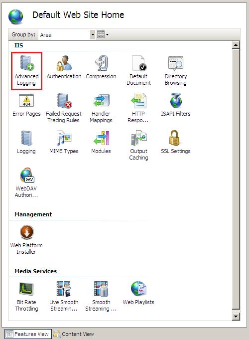
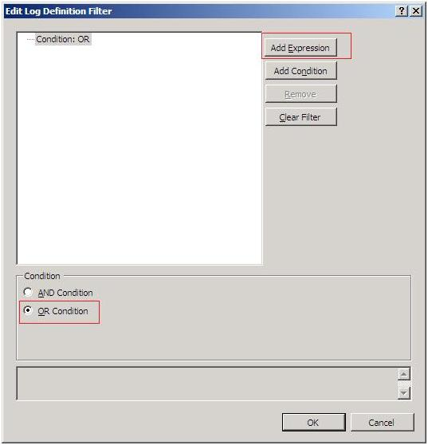
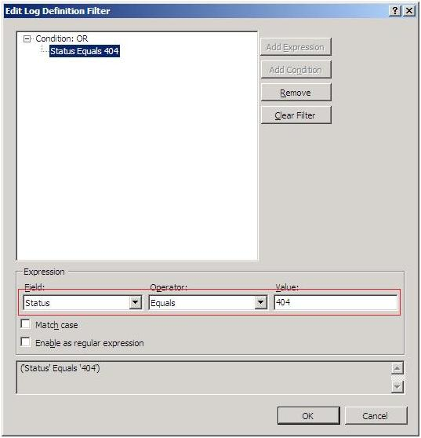
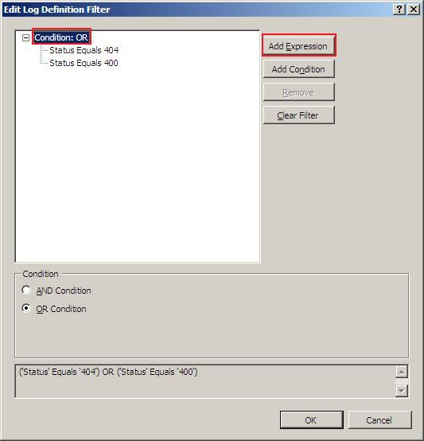
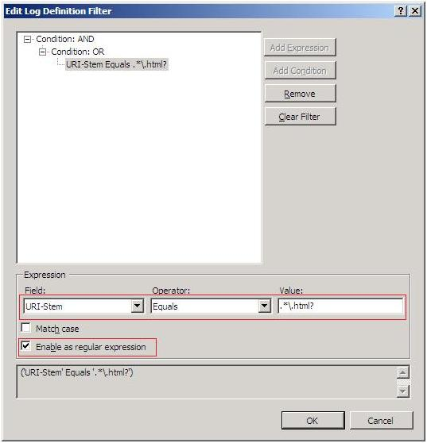
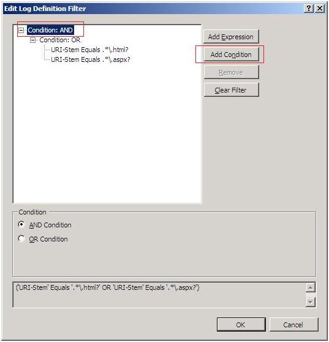
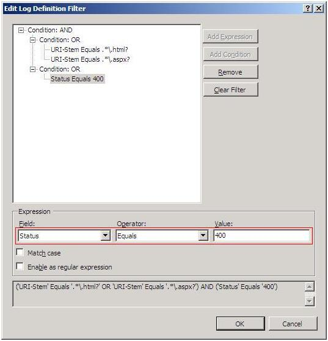

Advanced Logging for IIS - Log Filtering
====================
by Bobby Videna

Log Filtering in IIS Advanced Logging allows administrators to collect only the Web site traffic information that they are interested in instead of having to capture all Web site traffic and then sift through all of the data to find what they need. For example, a Web site administrator may want to know if there are any requests to their site that point to content that is no longer available. Knowing that these requests return a status code of '404', the administrator can create a filter for a log definition that captures only the requests where 'Status' = '404'. The administrator will now have a log file that contains only the desired data.

By employing filtering methods, administrators can manage their log data by creating different log definitions to collect different data. Going back to the previous example, an administrator can create a log definition to capture only '404 responses, another log definition to capture only '400' responses, and yet another log definition to capture only '500' responses, if these are the responses that they are interested in. The important thing to note is that they are not capturing data that they are not interested in, reducing the sheer volume of log data and making the log files easier to work with.

## Requirements

This walkthrough assumes basic knowledge of custom logging using the Advanced Logging feature. For a quick ramp-up, see [Advanced Logging for IIS - Custom Logging](advanced-logging-for-iis-custom-logging.md).

## Cloning a log definition

This walkthrough assumes basic knowledge of creating a log definition using the Advanced Logging feature and focuses solely on creating a filter in the IIS Manager user interface (UI). For the purposes of this walkthrough, we will not create new log definitions. Instead, we will clone the default log definition and create a filter for the cloned log definition(s). Cloning a log definition yields basic log definitions that we can work with in this walkthrough, without having to re-select each set of fields for each new log definition.

To clone a log definition, do the following:

1. Open IIS Manager (click **Start** &gt; **Administrative Tools** &gt; **Internet Information Services (IIS) Manager**).
2. In IIS Manager, in the **Connections** pane, open the Advanced Logging feature at the **Default Web Site** level.  
    
3. In the **Advanced Logging** feature page, select the default log definition (**%COMPUTERNAME%-Server**), and then in the **Actions** pane, click **Clone Log Definition.**  
    
4. In the **Clone Log Definition** dialog box, in **New log definition name**, enter **%COMPUTERNAME%-FilterExample**, and then click **OK**.  
    

The new log definition **%COMPUTERNAME%-FilterExample** is displayed in the **Advanced Logging** feature page as shown in the following figure:  

This log definition will be used in the following sections that describe how to create log filters.

## Creating a simple filter

This section describes how to create a simple filter for the **%COMPUTERNAME%-FilterExample** log definition that we created in the [previous section](advanced-logging-for-iis-log-filtering.md#clone), which will log requests for any static HTML files. This can be complicated because HTML files can have either the .htm or .html file name extension and the only logging field that contains this information (URI-Stem) also contains the virtual path and file name. To solve this problem, we will show how to use regular expressions in the Advanced Logging feature to perform a pattern match on the URI-Stem logging field.

The exact regular expression to be used is **.\*\.html?**. The first character (**.**) matches any character except **\r** and **\n**. The second character (**\\***) repeats the previous character zero or more times. In effect, these first two characters match any string of any length and solves the problem of matching the virtual path and file name.

Next, we consider the file name extensions of interest (.htm and .html). The (**.**) character is a reserved **Regex** character, but we want its literal value. Therefore, we use the backslash character (**\\**) to escape the (**.**) that follows it so that (**.**) will be matched literally. The letters **html** are matched literally as well. Finally, the question mark character (**?**) makes the character preceding it (**l**) optional, making the literal match either **.html** or **.htm**.

For more information about building regular expressions that match your needs, I recommend that you do an Internet search on "Regular Expressions" to dive deeper into this subject.

To create a filter that captures only requests that have a .html or .htm file name extension, do the following:

1. In the **Advanced Logging** feature page, select the **%COMPUTERNAME%-FilterExample** log definition, and then in the **Actions** pane, click **Edit Log Definition**.  
    
2. At the bottom of the **Log Definition** feature page, in the **Filter** area, click **Edit Filter**.  
    
3. In the **Edit Log Definition Filter** dialog box, select the root node (**Condition: AND**) in the hierarchical list, and then click **Add Expression**.  
    
4. In the **Expression** area of the dialog box, specify the following values for the expression:  
    

    - **Field**. Select **URI-Stem**.
    - **Operator**. Select **Equals**.
    - **Value**. Enter **.\*\.html?**.
    - **Enable as regular expression**. Select this check box to ensure that Advanced Logging knows to treat the value as a Regex expression.
5. Click **OK** in the dialog box, and then in the **Actions** pane, click **Apply** to save the changes to the log definition.

## Creating a filter with multiple expressions

Another useful example of a log filter is to capture only the requests that were not served successfully. Hopefully, the majority of your requests will be successful and return a status code of '200', but they can cause a lot of noise in log files when trying to spot the requests that return error conditions such as '400' (Bad Request), '404' (File not found), and/or '500' (Internal Server Error). This section describes how to create a filter for a log definition that uses multiple expressions to capture only requests with status codes of '400', '404', and '500'.

To create this filter, do the following:

1. Use the steps in [Cloning a log definition](advanced-logging-for-iis-log-filtering.md#clone) to create a new log definition named **%COMPUTERNAME%-FilterExample\_MultipleRequests**.
2. In the **Advanced Logging** feature page, select the **%COMPUTERNAME%-FilterExample\_MultipleRequests** log definition, and then in the **Actions** pane, click **Edit Log Definition**.
3. At the bottom of the **Log Definition** feature page, in the **Filter** area, click **Edit Filter**.
4. In the **Edit Log Definition Filter** dialog box, select the root node (**Condition: AND**) in the hierarchical list, select **OR Condition** in the **Condition** area, and then click **Add Expression**.  
      
  
   Note that the original root node (**Condition: AND**) in the list changes to **Condition: OR** when you select **OR Condition** in the **Condition** area.
5. In the **Expression** area of the dialog box, specify the following values for the expression:  
    

    - **Field**. Select **Status**.
    - **Operator**. Select **Equals**.
    - **Value**. Enter **404**.
    - **Enable as regular expression**. Clear this check box to ensure that Advanced Logging knows to treat the value as a literal expression.
6. Select the root node (**Condition: OR**) in the list, and then click **Add Expression**.  
    
7. Another expression node is added to the list. In the **Expression** area of the dialog box, specify the following values for the expression:  
    

    - **Field**. Select **Status**.
    - **Operator**. Select **Equals**.
    - **Value**. Enter **400**.
    - **Enable as regular expression**. Clear this check box to ensure that Advanced Logging knows to treat the value as a literal expression.
8. Select the root node (**Condition: OR**) in the list, and then click **Add Expression**.  
    
9. A third "Expression" node is added to the list. In the **Expression** area of the dialog box, specify the following values for the expression:  
    

    - **Field**. Select **Status**.
    - **Operator**. Select **Equals**.
    - **Value**. Enter **500**.
    - **Enable as regular expression**. Clear this check box to ensure that Advanced Logging knows to treat the value as a literal expression.
10. Click **OK** in the dialog box, and then in the **Actions** pane, click **Apply** to save the changes to the log definition.

## Creating a filter with multiple conditions

Conditions are verbs that connect different expressions. By default, all expressions are displayed under a single root node condition. If you only have a single expression as in our first example, the root node condition is ignored. However, if you have more than one expression, the root node condition determines if the filter is more exclusive (**Condition: AND**) or more inclusive (**Condition: OR**). By default, the root node condition is AND (**Condition: AND**), but you saw in our second example how it can be changed to be OR (**Condition: OR**).

This section describes how to create a filter for a log definition that captures requests based on multiple criteria. The example in this section shows a filter that captures all bad requests, but only for static HTML and ASP/ASP.NET file name extensions. The example in the [previous section](advanced-logging-for-iis-log-filtering.md#expressions) will be used to help build the part of the filter that captures bad requests and the [first example](advanced-logging-for-iis-log-filtering.md#simple) will be used to help build the part of the filter that captures the desired file name extensions. (Note that the ASP file name extension is .asp and the ASP.NET file name extension is .aspx. Therefore, we must modify the regular expression value used in the first example to **.\*\.aspx?**).

The appropriate conditions must be used. From a high-level perspective, the filter should be 'STATUS=X' AND 'EXTENSION=Y'. From a detailed perspective, we can expand 'STATUS=X' to be ('Status'='400' OR 'Status'='404' OR 'Status'='500')' and also expand ‘EXTENSION=Y' to be ('URI-Stem'='.\*\.html?' OR 'URI-Stem'='.\*\.aspx?'). The full filter should look like ('Status'='400' OR 'Status'='404' OR 'Status'='500') AND ('URI-Stem'='.\*\.html?' OR 'URI-Stem'='.\*\.aspx?')

To create a complex filter for a log definition that uses multiple conditions as well as multiple expressions, do the following:

1. Use the steps in [Cloning a log definition](advanced-logging-for-iis-log-filtering.md#clone) to create a new log definition named **%COMPUTERNAME%-FilterExample\_Conditions**.
2. In the **Advanced Logging** feature page, select the **%COMPUTERNAME%-FilterExample\_Conditions** log definition, and then in the **Actions** pane, click **Edit Log Definition**.
3. At the bottom of the **Log Definition** feature page, in the **Filter** area, click **Edit Filter**.
4. In the **Edit Log Definition Filter** dialog box, select the root node (**Condition: AND**) in the hierarchical list, and then click **Add Condition**.  
    
5. A sub-node condition is added below the root node condition (**Condition: AND**) in the list. In the **Condition** area of the dialog box, select **OR Condition**, and then click **Add Expression**.  
    
6. In the **Expression** area of the dialog box, specify the following values for the expression:  
    

    - **Field**. Select **URI-Stem**.
    - **Operator**. Select **Equals**.
    - **Value**. Enter **.\*\.html?**.
    - **Enable as regular expression**. Select this check box to ensure that Advanced Logging knows to treat the value as a Regex expression.
7. Select the sub-node condition (**Condition: OR**) in the list, and then click **Add Expression**.  
    
8. In the **Expression** area of the dialog box, specify the following values for the expression:  
    

    - **Field**. Select **URI-Stem**.
    - **Operator**. Select **Equals**.
    - **Value**. Enter **.\*\.aspx?**.
    - **Enable as regular expression**. Select this check box to ensure that Advanced Logging knows to treat the value as a Regex expression.
9. Now select the root node condition (**Condition: AND**) in the hierarchical list, and then click **Add Condition**.  
    
10. A second sub-node condition is added below the root node condition (**Condition: AND**) in the list. In the **Condition** area of the dialog box, select **OR Condition**, and then click **Add Expression**.  
    
11. In the **Expression** area of the dialog box, specify the following values for the expression:  
    

    - **Field**. Select **Status**.
    - **Operator**. Select **Equals**.
    - **Value**. Enter **400**.
    - **Enable as regular expression**. Clear this check box to ensure that Advanced Logging knows to treat the value as a literal expression.
12. Select the sub-node condition (**Condition: OR**) ' at the bottom of the list, and then click **Add Expression**.  
    
13. In the **Expression** area of the dialog box, specify the following values for the expression:  
    

    - **Field**. Select **Status**.
    - **Operator**. Select **Equals**.
    - **Value**. Enter **404**.
    - **Enable as regular expression**. Clear this check box to ensure that Advanced Logging knows to treat the value as a literal expression.
14. Select the sub-node condition (**Condition: OR**) at the bottom of the list, and then click **Add Expression**.  
    
15. In the **Expression** area of the dialog box, specify the following values for the expression:  
    

    - **Field**. Select **Status**.
    - **Operator**. Select **Equals**.
    - **Value**. Enter **500**.
    - **Enable as regular expression**. Clear this check box to ensure that Advanced Logging knows to treat the value as a literal expression.
16. Click **OK** in the dialog box, and then in the **Actions** pane, click **Apply** to save the changes to the log definition.

## Summary

In this walk-through, we learned how to create a simple filter with a single expression as well as more complex filters consisting of multiple expressions and multiple conditions. In the process, we also learned how to use regular expressions to perform a pattern match on string values and how to create a new log definition by cloning an existing one.

Hopefully, this will help to make extracting the right information from your logs much more manageable.