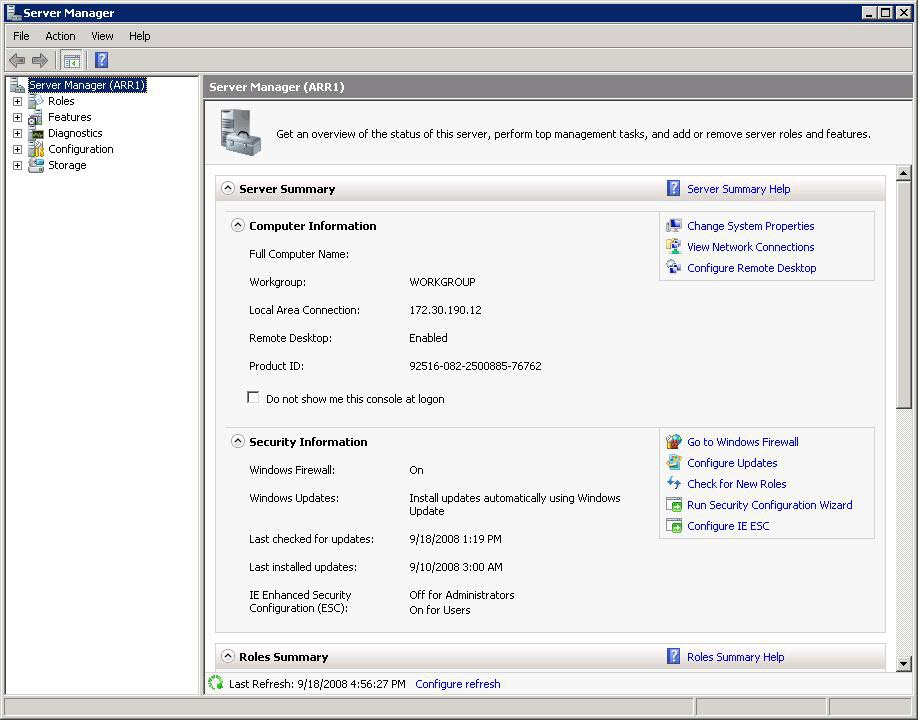

# Achieving High Availability and Scalability - ARR and NLB

by Won Yoo

**Achieving High Availability and Scalability:**  
**Microsoft Application Request Routing (ARR) for IIS 7.0 and above and Network Load Balancing (NLB).**

| Microsoft Corporation |
| --- |
| Author: Ahmed Bisht, Won Yoo |
| Published: November 13, 2008 |

## Abstract

This document provides prescriptive guidance about how Application Request Routing (ARR) can be used with Network Load Balancing (NLB) to achieve high availability and scalability.

## Overview

Microsoft Application Request Routing (ARR) for IIS 7.0 and above is a proxy-based routing module that forwards HTTP requests to content servers based on HTTP headers, server variables, and load balance algorithms. A typical ARR deployment is illustrated in the diagram below:

While ARR provides high availability and scalability for the content servers, the overall deployment is not highly available or scalable because:

- ARR is the single point of failure.
- The scalability of the content servers is limited by the maximum capacity of one ARR server.

In order to overcome these challenges, administrators may consider using multiple ARR servers with Network Load Balancing (NLB). ARR can be deployed in active/passive mode to only achieve high availability or in active/active mode to achieve both high availability and scalability. This whitepaper describes how ARR and NLB can be deployed together to enable the core ARR scenarios while achieving overall high availability and scalability. NLB is available on all SKUs of Windows Server 2008.

## Use of Application Request Routing and Network Load Balancing

ARR is built as a module on top of IIS and is designed to make the routing decisions at layer 7 (application). More accurately, ARR relies on another IIS module, [URL Rewrite](../url-rewrite-module/using-the-url-rewrite-module.md), to inspect the incoming HTTP request headers and server variables to make the routing decisions. Given this design, administrators could write intelligent routing rules based on the application level information, such as:

- Host name (HTTP\_HOST): Route traffic to different content servers based on host name.
- Requested resource (URL): Based on file extensions, determine whether the requested resources are for static content or dynamic content and route the requests accordingly.
- Client information (HTTP\_USER\_AGENT): Based on the browser type and version, route the requests to appropriate content servers.
- Custom headers (Set as a cookie by applications): Route traffic based on cookie information set by applications, such as user preference or user ID.

Above are just some of the examples. For a complete list of HTTP headers and server variables, refer to [Appendix A](achieving-high-availability-and-scalability-arr-and-nlb.md#appendix_a).

Because NLB makes the routing decisions at layer 3, application specific information, such as HTTP headers and server variables, can not be used to provide application level based routing. At the same time, ARR does not provide fault tolerant deployment features for itself and must rely on other complementary technologies and solutions to achieve high availability for the ARR tier. NLB operates at a different level on the network stack and is enabled on the same servers as where ARR is deployed:

## Scenario 1: HTTP-based routing and load balancing

The HTTP-based routing and load balancing scenario enables a 3-tier deployment architecture that involves: 

- Tier 1 (Web): Provides dual purposes of processing static content and routing and load balancing the remaining dynamic requests to tier 2 servers.
- Tier 2 (Application): Processes dynamic content that relies on business logic.
- Tier 3 (Data): Stores data.

The following diagram illustrates the 3-tier deployment:

Although the above example shows a routing rule that differentiates the static content from the dynamic content, another common scenario is to differentiate presentation requests from Web service requests. 

### Option1: Active/Passive

In Active/Passive mode, typically there are two ARR servers in which one server processes the requests while the other server stands by as a failover server. As noted above, while this configuration achieves high availability by removing the single point of failure, it is not a scale out solution since the aggregate capacity of the content servers is limited by the maximum capacity of one ARR server.

In this setup, since two ARR servers are configured the same way, a shared configuration is used. First, install ARR on both servers, then create the NLB cluster. The NLB cluster is configured to accept traffic on only one of the cluster nodes. This is achieved by configuring the cluster port rules with single host filtering mode. The node accepting the traffic is determined by the host priority setting of the NLB cluster nodes. Refer to [NLB configuration](achieving-high-availability-and-scalability-arr-and-nlb.md#nlb-config) for more details.

With the exception of the host name affinity feature in ARR, there is no runtime state information that must be shared between the two ARR servers. Therefore, for this scenario, no special configuration is needed on either ARR or NLB. Even if you use the server affinity feature in ARR, the affinitized state information will be made available to the passive server through a cookie in the request header.

This scenario is fully supported in the ARR Version 1 release.

#### ARR configuration

**Step 1: Enable shared configuration on two ARR servers.**

- Follow the steps in [this](../../web-hosting/configuring-servers-in-the-windows-web-platform/shared-configuration_211.md) document to set up shared configuration in IIS.

**Step 2: Configure 3-tier deployment architecture using ARR.**

- Follow the steps in [this](configure-3-tier-deployment-architecture-using-application-request-routing.md) document to configure ARR in 3-tier deployment architecture.
- At a high level, the above document describes: 

    - How to make static content available on the ARR server.
    - How to write URL rewrite rules for static content so that they are served directly from the ARR server.
    - How to write URL rewrite rules for dynamic content so that they are forwarded to the application servers.

#### NLB configuration

The NLB configuration is divided into the following steps:

1. Install the NLB feature on all ARR servers.
2. Create NLB cluster for ARR.
3. Configure NLB for active/passive deployment.

**Install the NLB feature on all ARR servers**

1. Open **Server Manager**.  
    
2. Expand **Features**.
3. Click **Add Features**.
4. In the Add Features Wizard, select **Network Load Balancing**.  
    
5. Click **Install** to confirm installation of the NLB feature.  
    
6. Verify that the NLB feature installed successfully.  
    
7. Repeat the above steps on all ARR servers.

**Create NLB cluster for ARR**

1. Verify that NLB is installed on all instances of ARR servers.
2. Go to Start &gt; All Programs &gt; Administrative Tools, and open the **Network Load Balancing Manager**.  
    
3. Right-click on **Network Load Balancing Clusters**, and then select **New Cluster**.  
    
4. In the New Cluster dialog box, in the Host text box, type the server address of one of the ARR servers. If there are multiple interfaces, type the server address that you want to create the NLB cluster on.  
    
5. In active/passive mode (single host mode in NLB), the priority determines the order in which failover takes place. By default, the server with priority 1 is the active node.  
    
6. The cluster IP, a virtual IP address, is needed. Click **Add.** This is the IP address that clients will communicate with.  
    
7. Type the virtual IP address, and then click **OK**.  
    
8. Click **Next**.  
    
9. Accept the default values. For more detailed information, refer to the [Appendix](achieving-high-availability-and-scalability-arr-and-nlb.md#appendix_b).  
    
10. Click **Finish** to complete the creation of the NLB cluster.  
    
11. Now that the NLB cluster is created, you can add additional members to the cluster. Follow the remaining steps on all additional member servers. In the Network Load Balancing Manager, right-click on the newly selected cluster, and then select **Add Host To Cluster**.  
    
12. Type the server address of the member to be added. If there are multiple interfaces, select the one that should be used by the NLB cluster.  
    
13. Note that the priority assignment is mutually exclusive and unique among the member servers in the cluster. In active/passive mode (single host mode in NLB), the priority determines the order of fail-over.  
    
14. Click **Finish** to add the member server to the cluster.  
    
15. The **Network Load Balancer Manager** should look similar to the following:  
    

**Configure NLB for active/passive deployment**

1. To configure NLB for active/passive deployment, in the **Network Load Balancing Manager**, right-click the cluster, and then select **Cluster Properties**. Click on the **Port Rules** tab. Click **Edit**.  
    
2. Select **Single host**, and then click **OK**.  
    

NLB is configured successfully to work in active/passive mode with ARR.

### Option2: Active/Active

In Active/Active mode, you can have two or more ARR servers. This configuration achieves both high availability and scalability, unlike the Active/Pass mode, which achieves only high availability. 

As noted previously, since multiple ARR servers are configured the same way, a shared configuration is used. The major difference is how NLB is configured. In order to utilize all ARR servers at the same time, the NLB cluster port rule is configured in multiple host mode.

Regardless of whether the affinity feature is enabled on NLB or not, no special configuration is needed on the ARR servers. For one, the ARR servers use one shared configuration so that they are configured the same way. Secondly, since ARR uses a client cookie to store the server affinity information for its own use, this information is available per request and therefore available across the ARR servers. The recommendation for NLB is to set affinity to none since it results in a more even load distribution.

This scenario is fully supported in the ARR Version 1 release.

#### ARR configuration

The ARR configuration for Active/Active is identical to that of Active/Passive. The main difference is how NLB is configured.

**Step 1: Enable shared configuration on two ARR servers.**

- Follow the steps in [this](../../web-hosting/configuring-servers-in-the-windows-web-platform/shared-configuration_211.md) document to set up shared configuration in IIS.

**Step 2: Configure 3-tier deployment architecture using ARR.**

- Follow the steps in [this](configure-3-tier-deployment-architecture-using-application-request-routing.md) document to configure ARR in 3-tier deployment architecture.
- At a high level, the above document describes: 

    - How to make static content available on the ARR server.
    - How to write URL rewrite rules for static content so that they are served directly from the ARR server.
    - How to write URL rewrite rules for dynamic content so that they are forwarded to the application servers.

#### NLB configuration

The NLB configuration is divided into the following steps:

1. Install the NLB feature on all ARR servers.
2. Create NLB cluster for ARR.
3. Configure NLB for active/active deployment.

**Install the NLB feature on all ARR servers**: Documented [here](achieving-high-availability-and-scalability-arr-and-nlb.md#install NLB).

**Create NLB cluster for ARR**: Documented [here](achieving-high-availability-and-scalability-arr-and-nlb.md#create nlb).

**Configure NLB for active/active deployment.**

1. To configure NLB for active/active deployment, in the **Network Load Balancing Manager**, right-click on the cluster, and then select **Cluster Properties**. Click on the **Port Rules** tab. Click **Edit**.  
    
2. Select **Multiple host**. For the Affinity setting, select **None**. As mentioned above, the recommendation is to not use affinity in NLB since it will result in a better load distribution.  
    

NLB is configured successfully to work in active/active mode with ARR.

## Scenario 2: Shared hosting using host name affinity

This scenario utilizes the host name affinity feature in ARR to enable a shared hosting deployment to:

- Reduce the manual management and maintenance involved with traditional shared hosting deployment.
- Maximize the existing server resources while ensuring that all server resources are evenly utilized.
- Easily scale out the environment.
- Create business opportunities to sell additional capacity.

For more information about shared hosting and ARR, refer to [this](../planning-for-arr/overview-of-shared-hosting-deployment-using-application-request-routing-20.md) document.

The following diagram illustrates the shared hosting environment using ARR: 

### Option1: Active/Passive

As noted previously, in Active/Passive mode, typically there are two ARR servers in which one server processes the requests while the other server stands by as a failover server. While this configuration achieves high availability by removing the single point of failure, it is not a scale out solution since the aggregate capacity of the content servers is limited by the maximum capacity of one ARR server.

In this setup, since two ARR servers are configured the same way, a shared configuration is used. The NLB cluster is configured to accept traffic only on one of the cluster nodes. This is achieved by configuring the cluster rules with single host filtering mode. The node accepting the traffic is determined by the host priority setting of the NLB cluster nodes. Refer to [NLB configuration](achieving-high-availability-and-scalability-arr-and-nlb.md#nlb-config) for more details.

The host name affinity feature in ARR affinitizes the requests to a particular server (or a group of servers in RC) based on the host name. The runtime state information of affinitized mapping between the host names and the content servers is stored in memory within an instance of an ARR server. In the ARR Version 1 release, ARR leverages Microsoft External Cache Version 1 for IIS to share and maintain this runtime state between multiple ARR servers. More information about this scenario is available in [this](using-multiple-instances-of-application-request-routing-arr-servers.md) document.

This scenario is fully supported in the ARR Version 1 release.

#### ARR configuration

**Step 1: Configure ARR for shared hosting with host name affinity.**

- Follow the steps in [this](shared-hosting-using-application-request-routing-arr.md) document to configure the host name affinity feature in ARR for shared hosting.

**Step 2: Enable and configure External Cache.**

- Follow the steps in [this](using-multiple-instances-of-application-request-routing-arr-servers.md) document to enable and configure External Cache.

#### NLB configuration

The NLB configuration is divided into the following steps:

1. Install the NLB feature.
2. Create NLB cluster for ARR.
3. Configure NLB for active/passive deployment.

**Install the NLB feature**: Documented [here](achieving-high-availability-and-scalability-arr-and-nlb.md#Install NLB features).

**Create NLB cluster for ARR**: Documented [here](achieving-high-availability-and-scalability-arr-and-nlb.md#Create NLB cluster for ARR).

**Configure NLB for active/passive deployment**: Documented [here](achieving-high-availability-and-scalability-arr-and-nlb.md#Configure NLB for active/passive).

### Option2: Active/Active in ARR

In Active/Active mode, you can have two or more ARR servers. This configuration achieves both high availability and scalability, unlike the Active/Passive mode, which achieves only high availability. Since multiple ARR servers are configured the same way, a shared configuration is used. In order to utilize all ARR servers at the same time, NLB is configured in multiple host mode. As noted previously, the runtime state information of affinitized mapping between the host names and the content servers is stored in memory within an instance of an ARR server. In order to share this information among multiple ARR servers, Microsoft External Cache for IIS is used. For more information about External Cache, refer to this document. 

#### ARR configuration

The ARR configuration for Active/Active is identical to that of Active/Passive. The main difference is how NLB is configured. 

**Step 1: Configure ARR for shared hosting with host name affinity.**

- Follow the steps in [this](shared-hosting-using-application-request-routing-arr.md) document to configure the host name affinity feature in ARR for shared hosting.

**Step 2: Enable and configure External Cache.**

- Follow the steps in [this](using-multiple-instances-of-application-request-routing-arr-servers.md) document to enable and configure External Cache.

#### NLB configuration

The NLB configuration is divided into the following steps:

1. Install the NLB feature.
2. Create NLB cluster for ARR.
3. Configure NLB for active/active deployment.

**Install the NLB feature**: Documented [here](achieving-high-availability-and-scalability-arr-and-nlb.md#Install NLB features).

**Create NLB cluster for ARR**: Documented [here](achieving-high-availability-and-scalability-arr-and-nlb.md#Create NLB cluster for ARR).

**Configure NLB for active/active deployment**: Documented [here](achieving-high-availability-and-scalability-arr-and-nlb.md#Configure NLB for active/active). The recommendation is to not use affinity in NLB for this ARR scenario.

## Summary

In this whitepaper, two main ARR scenarios were reviewed to achieve high availability and scalability by deploying multiple ARR servers and using NLB.

## Appendix

### Appendix A: All available HTTP headers and server variables for writing routing decision rules

| ALL\_HTTP | ALL\_RAW | APPL\_MD\_PATH |
| --- | --- | --- |
| APPL\_PHYSICAL\_PATH | CERT\_COOKIE | CERT\_FLAGS |
| CERT\_ISSUER | CERT\_KEYSIZE | CERT\_SECRETKEYSIZE |
| CERT\_SERIALNUMBER | CERT\_SERVER\_ISSUER | CERT\_SERVER\_SUBJECT |
| CERT\_SUBJECT | CONTENT\_LENGTH | CONTENT\_TYPE |
| DOCUMENT\_ROOT | GATEWAY\_INTERFACE | HTTP\_ACCEPT |
| HTTP\_ACCEPT\_ENCODING | HTTP\_ACCEPT\_LANGUAGE | HTTP\_CONNECTION |
| HTTP\_CONTENT\_LENGTH | HTTP\_HOST | HTTP\_IF\_MODIFIED\_SINCE |
| HTTP\_IF\_NONE\_MATCH | HTTP\_REFERER | HTTP\_UA\_CPU |
| HTTP\_USER\_AGENT | HTTPS | HTTPS\_KEYSIZE |
| HTTPS\_SECRETKEYSIZE | HTTPS\_SERVER\_ISSUER | HTTPS\_SERVER\_SUBJECT |
| INSTANCE\_ID | INSTANCE\_META\_PATH | LOCAL\_ADDR |
| PATH\_INFO | PATH\_TRANSLATED | QUERY\_STRING |
| REMOTE\_ADDR | REMOTE\_HOST | REMOTE\_PORT |
| REMOTE\_USER | REQUEST\_FILENAME | REQUEST\_METHOD |
| REQUEST\_URI | SCRIPT\_FILENAME | SCRIPT\_NAME |
| SERVER\_ADDR | SERVER\_NAME | SERVER\_PORT |
| SERVER\_PORT\_SECURE | SERVER\_PROTOCOL | SERVER\_SOFTWARE |
| URL |  |  |

**Appendix B: Additional NLB documentation**

- NLB Server Core instructions: 

    - Install NLB feature: [https://download.microsoft.com/download/6/3/5/6350896f-1e08-440b-9f24-d50f5e9b2390/ServerCoredeepdive.ppt](https://download.microsoft.com/download/6/3/5/6350896f-1e08-440b-9f24-d50f5e9b2390/ServerCoredeepdive.ppt)
- NLB and SSL: 

    - 
    - [https://support.microsoft.com/?id=313299](https://support.microsoft.com/?id=313299)
- Other NLB links: 

    - [https://technet.microsoft.com/library/cc782694.aspx](https://technet.microsoft.com/library/cc782694.aspx)
    - [https://technet.microsoft.com/library/cc778263.aspx](https://technet.microsoft.com/library/cc778263.aspx)
    - [https://support.microsoft.com/kb/323437](https://support.microsoft.com/kb/323437)
    - [https://support.microsoft.com/kb/890159/en-us](https://support.microsoft.com/kb/890159/en-us)
    - [https://blogs.msdn.com/clustering](https://blogs.msdn.com/clustering)
